# 将您在 Microsoft Azure AD 中的用户帐户联合到 Google Cloud Identity

> 原文：<https://medium.com/google-cloud/federate-your-user-accounts-in-microsoft-azure-ad-to-google-cloud-identity-fe29ef639553?source=collection_archive---------1----------------------->

[Google Cloud Identity](https://cloud.google.com/identity) 是 IDaaS(身份即服务)，为 Google Cloud 和 Google Workspace 管理用户和组。用户和组的生命周期可以在云身份中管理。可以创建用户帐户和组，在身份中对其进行控制，以实现访问管理和合规性。有多种方法可以在 Cloud Identity 中创建用户—手动创建或通过 CSV 批量上传。

对于大型组织，用户帐户可能已经在另一个身份提供商(例如微软 Azure 广告。

Microsoft Azure AD 是基于云的身份和访问管理服务，有助于控制用户对外部和内部资源的访问。它有助于集中管理用户生命周期，并允许集成云应用程序以获得统一的用户体验。

因此，在 Microsoft Azure AD 中维护用户帐户和组的情况下，它们可以在 Google Cloud identity 中联合，支持 Azure AD 中的单一真实和维护来源，同时扩展它们在 Google Cloud Identity 中的使用。下面是 Google Cloud Identity 和 Microsoft Azure AD 之间的联合架构设置示例。

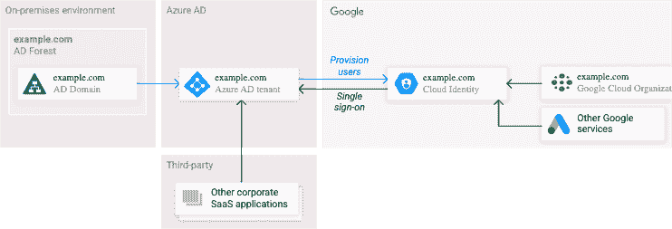

要在 Google Cloud identity 中使用用户帐户和组，我们**首先需要从 Microsoft Azure AD 提供用户，然后在他们之间设置单点登录**，以便对 Google Cloud 的请求可以重定向到 Microsoft Azure AD 进行身份验证。

对于本文档中的联合设置，我们将:

*   使用域名 **demodata.info**
*   使用提供用户配置和单点登录配置的连接器— [微软的 Google Cloud / G Suite 连接器](https://azuremarketplace.microsoft.com/en-us/marketplace/apps/aad.googleapps)

在 Google Cloud Identity 和 Microsoft Azure AD 之间建立联盟所需的先决条件是:

1.  [Google Cloud Identity 设置](https://workspace.google.com/signup/gcpidentity/welcome#0)完成-创建第一个云身份帐户，指定超级管理员用户名，并使用 Google Cloud Identity 验证您的组织域。

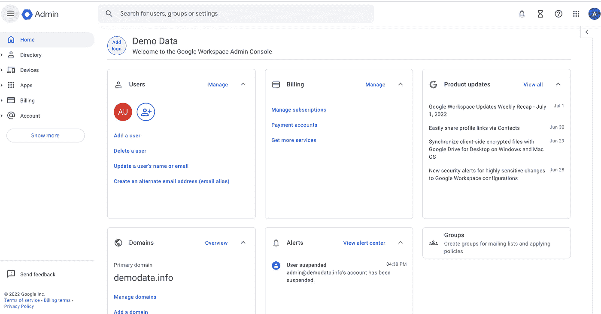

2. [Microsoft AzureAD](https://portal.azure.com/#home) 帐户和管理权限，用于设置配置和单点登录

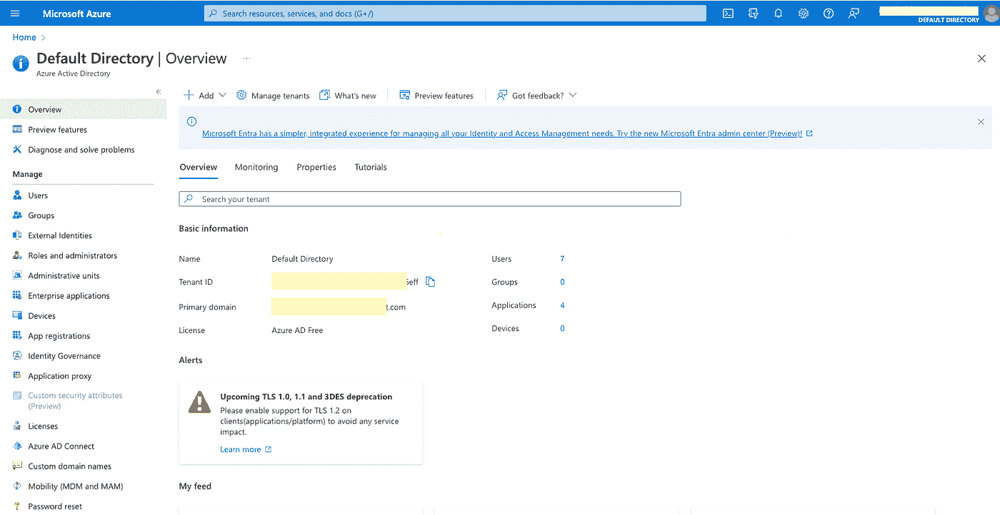

3.从 Microsoft Azure AD 联盟的用户的域在 Google Cloud Identity 中注册为主要或辅助域。所有域都必须注册，否则用户将不会被提供，并将在设置过程中抛出错误。

4.将用于 Google cloud Identity 和 Microsoft Azure AD 之间的连接的用户— [为 Microsoft Azure AD](https://cloud.google.com/architecture/identity/federating-gcp-with-azure-ad-configuring-provisioning-and-single-sign-on#creating_a_cloud_identity_user_account_for_synchronization) 创建用户。我们可以使用超级管理员用户，但为了简化维护和所有权，我们始终建议使用专用用户。[授予该用户所需的权限](https://cloud.google.com/architecture/identity/federating-gcp-with-azure-ad-configuring-provisioning-and-single-sign-on#delegated-admin)，以便可以通过 Azure AD 创建、删除和列出新用户。在我们的例子中，用户是 azuread-provisioning

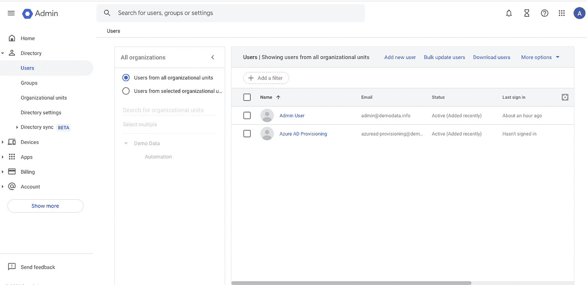

5.要联合的用户存在于 Microsoft Azure AD 中

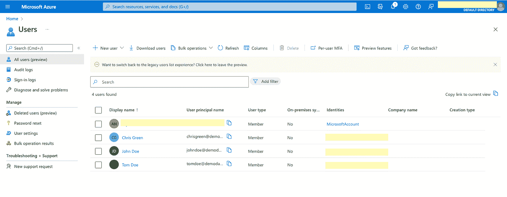

现在让我们开始联合谷歌云身份和微软 Azure AD 之间的用户帐户

1.  将 Azure AD 连接到 Google Cloud Platform Cloud Identity 并供应用户。使用**谷歌云/微软 G 套件连接器**创建新的企业应用

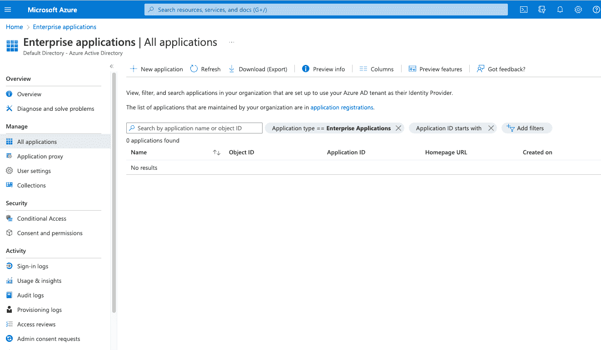

2.选择新应用程序，搜索微软 Google Cloud/G Suite Connector**。选择连接器，然后选择“创建”**

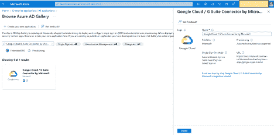

3.在新应用程序中，选择“管理”下的“属性”,按如下方式更改并保存:

*   为登录为否的用户启用
*   将其重命名为连接器应用程序的名称，以描述为连接和供应
*   要求分配为否
*   对用户可见为否

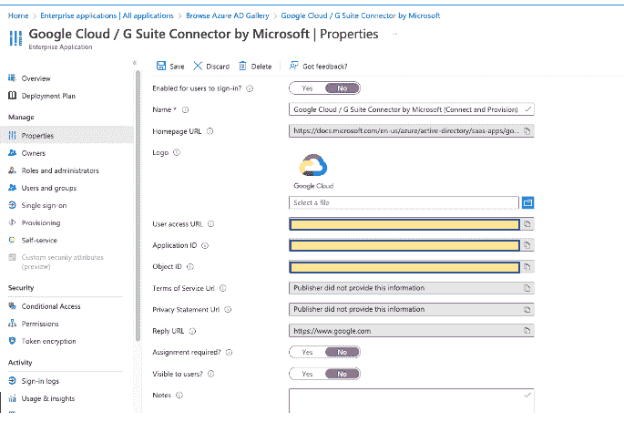

4.在“管理和入门”下选择“资源调配”

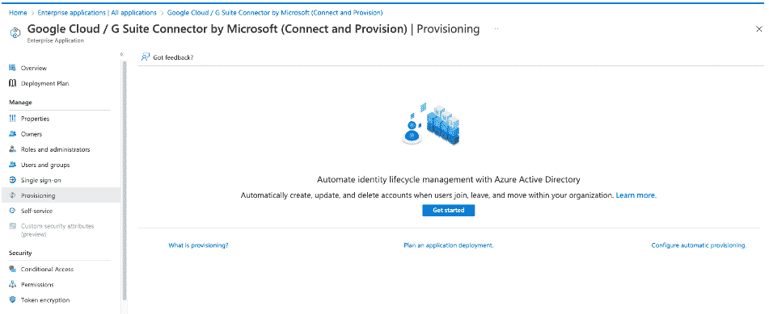

*   选择配置模式->自动，并在管理员凭据中提供具有所需管理员权限的用户。在我们的例子中，用户是 azuread-provisioning

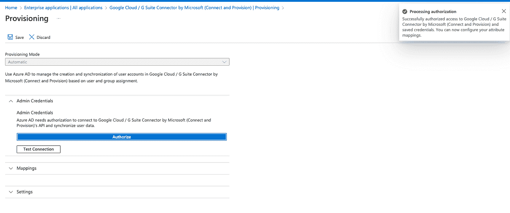

*   在“映射”部分，选择“设置 Azure Active Directory 用户”。在属性映射中，选择“姓氏”行来编辑属性。
*   在“编辑属性”部分，将 null 参数的默认值编辑为“_”，如下所示。选择确定。
*   为“givenName”属性报告相同的步骤。

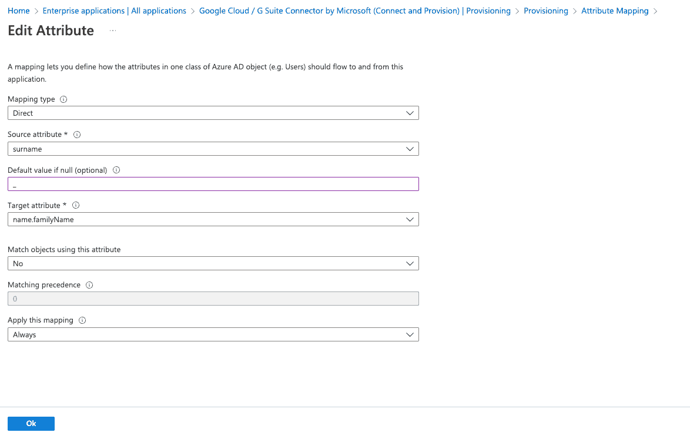

*   由于我们仅调配用户，因此我们不会启用组调配。如果需要，它可以在同一个连接器中与用户配置一起完成。可以使用在[按名称或电子邮件地址配置组](https://cloud.google.com/architecture/identity/federating-gcp-with-azure-ad-configuring-provisioning-and-single-sign-on#name)中提到的步骤。
*   在设置部分的范围中，选择仅同步分配的用户和组。这将使用户和组的配置成为可能，从而提供更多的控制。另一个选项是同步所有用户和组，可以根据业务需求选择。

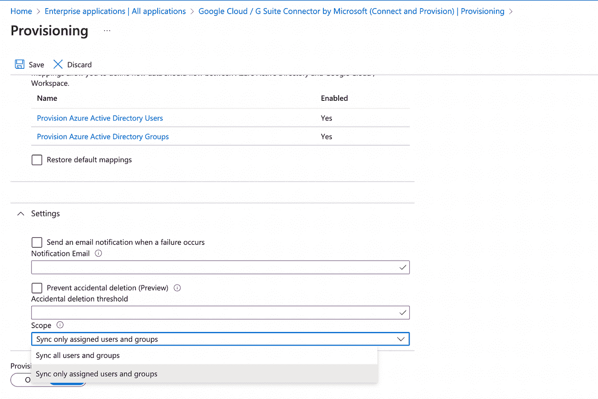

*   保存更改并关闭设置窗口。
*   在管理中选择用户和组，并添加用户/组。应提供在此选择和分配的用户和组。

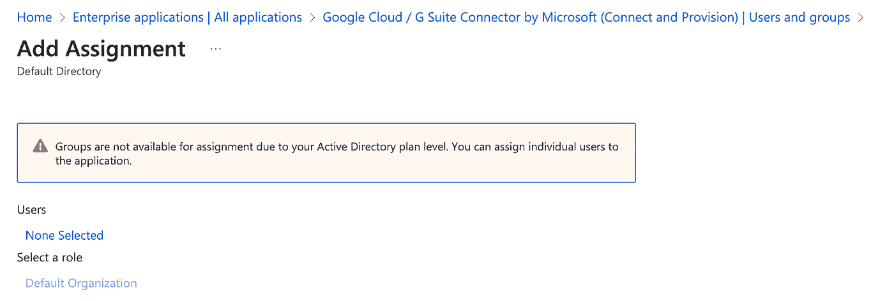

*   在“用户”部分中，选择“未选择”超链接，然后选择要设置的用户。对于我们的示例，我们选择两个用户 Chris 和 John，而不选择 Tom Doe，如下所示:

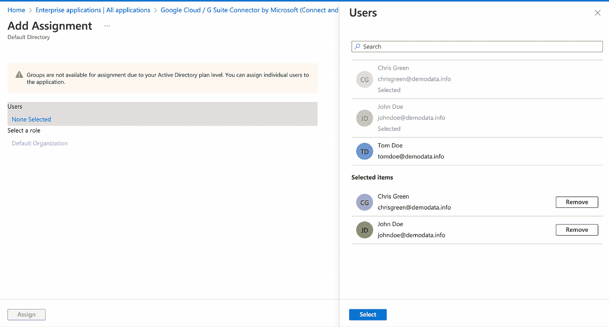

*   选择并分配用户

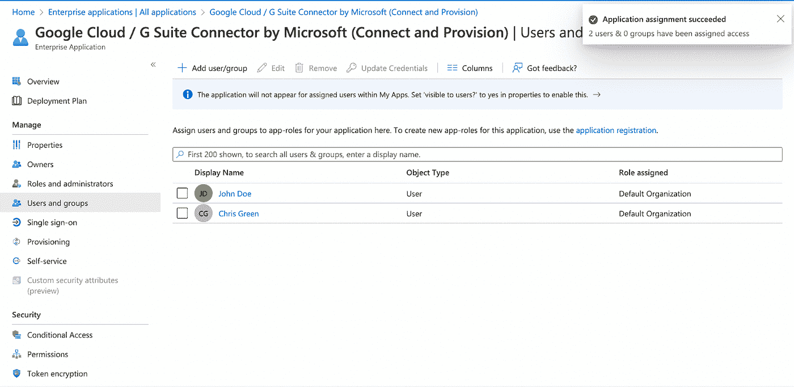

5.调配用户—在“管理”中选择“调配”，选择“编辑调配”，并按调配状态启用调配，然后保存更改。

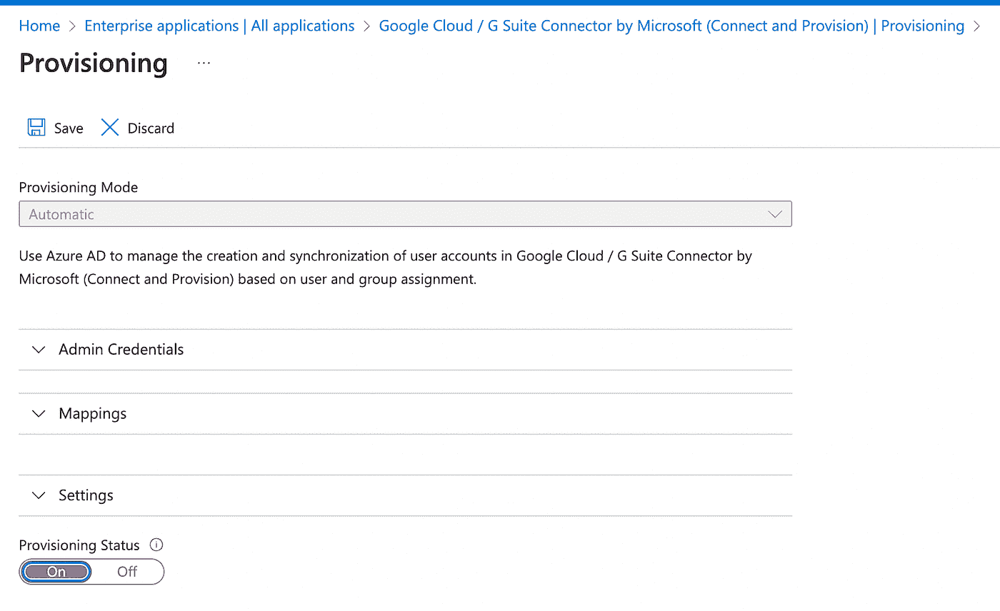

*   关闭设置窗口
*   供应按如下方式开始

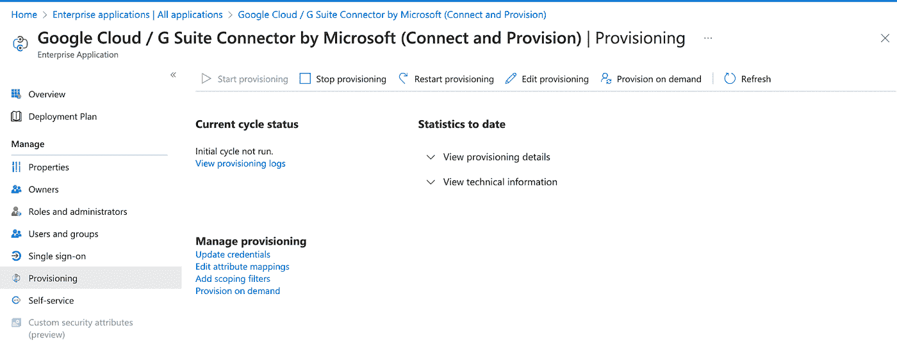

*   置备时间基于所选用户的数量，周期状态在置备窗口中更新

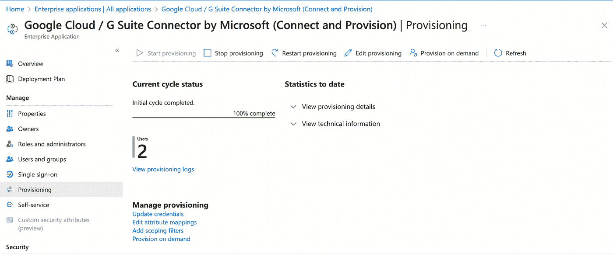

6.在“活动”部分中选择“预配日志”以查看详细的日志

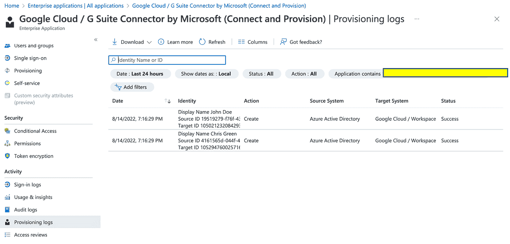

7.在 Google Cloud 管理控制台中验证提供的用户。

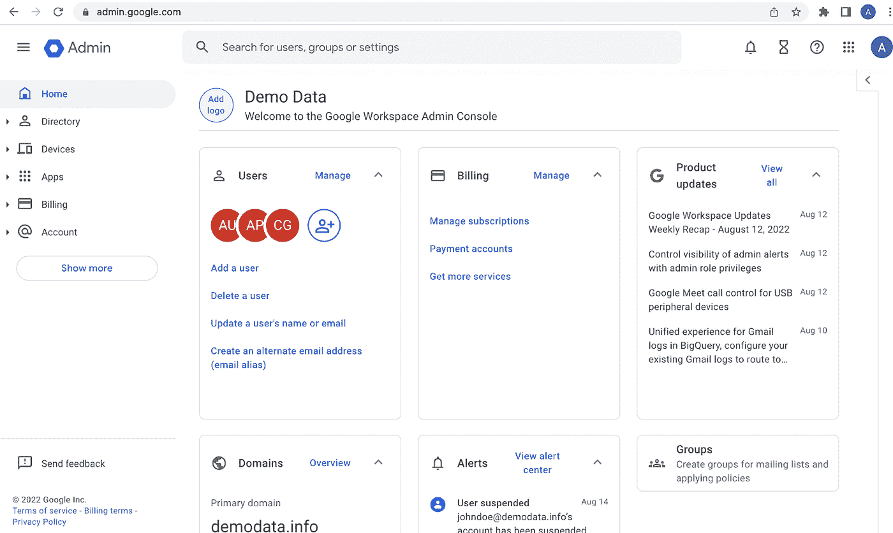

*   在 [Google Cloud 管理控制台](https://admin.google.com/)的目录中，转到 Users 并验证创建的用户。在我们的示例中，必须创建两个用户，Chris 和 John 是在 Azure AD 中选择的用于供应的用户。

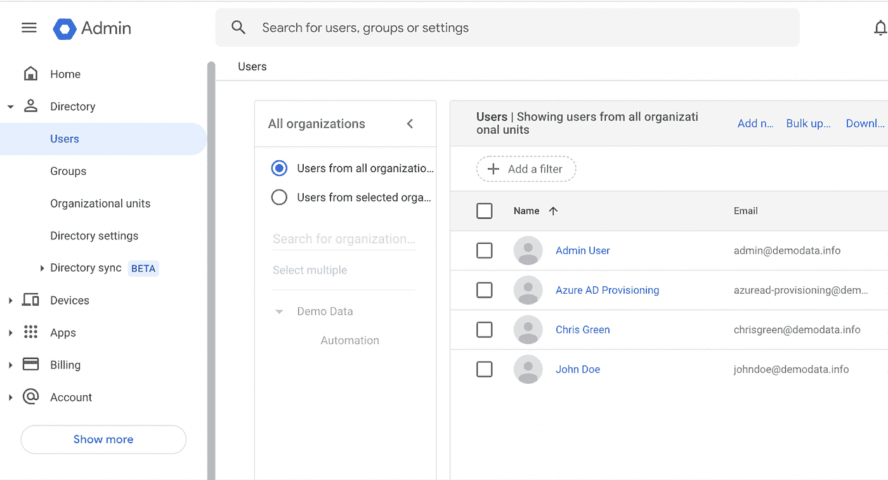

你可以从[谷歌云平台管理控制台](https://admin.google.com/)和[微软 Azure](https://portal.azure.com/#home) AD 开始设置云身份。

现在就执行，现在为用户设置的单点登录将在文档的第 2 部分中执行。