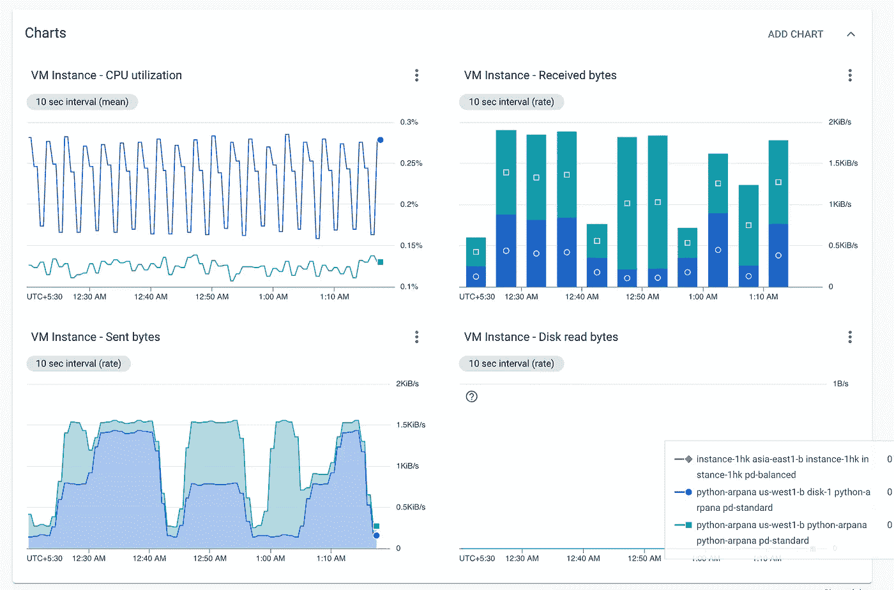
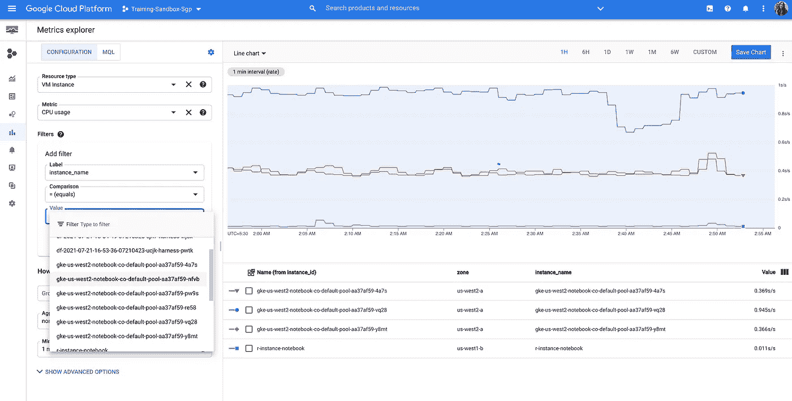
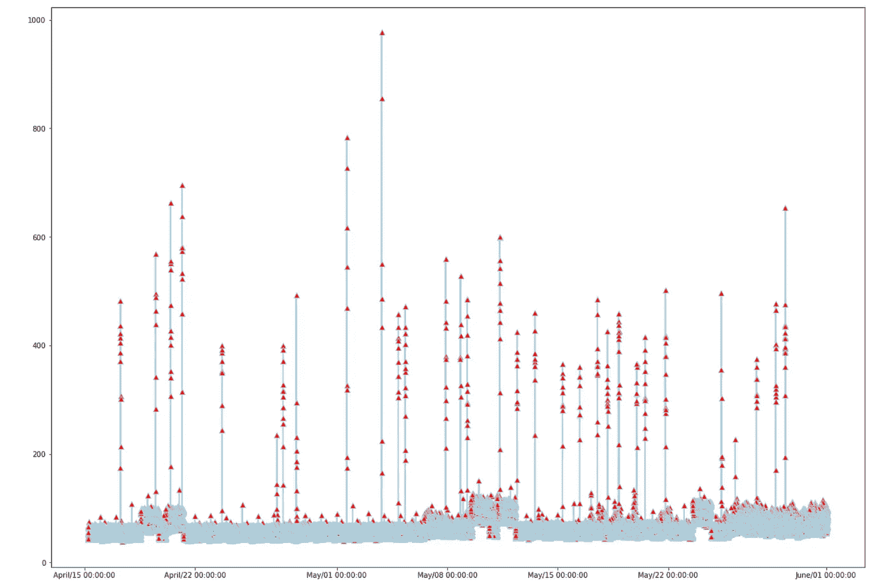

# Google 云监控 API 入门—第 2 部分

> 原文：<https://medium.com/google-cloud/fetching-monitoring-metrics-data-from-gcp-into-your-application-using-python-214358b0047e?source=collection_archive---------0----------------------->



GCP 上的典型监控仪表板(针对计算实例)

你有一个关于 GCP 的项目。您已经在控制台中设置了监控控制面板，所有的图表都很有意义，而且只需通过一个用户界面，您就可以检查整个 GCP 环境。嗨，你这个监控专家！谢谢你把一切管理得这么好。

现在，如果您想在应用程序的某个部分使用这些度量图，该怎么办呢？也许你想用你的品牌颜色来格式化图表，提取实时数据并呈现在你的网站上。

> 我们的 API 具有令人印象深刻的 24x7 响应时间！“来，看看我们网站上的这张图表。”


给我那些图表！[图片由[米利安·耶西耶](https://unsplash.com/@mjessier?utm_source=unsplash&utm_medium=referral&utm_content=creditCopyText)在 [Unsplash](https://unsplash.com/s/photos/computer?utm_source=unsplash&utm_medium=referral&utm_content=creditCopyText) 上拍摄]

在本系列的上一篇[博客](/google-cloud/confused-with-custom-monitoring-metrics-on-gcp-c514cd4a776b)中，我写了如何使用 Python 客户端库为 Google 云监控 API 创建定制的监控指标，从而自动化这个过程。在这篇博客中，我将解释如何使用`list_time_series`方法来读取度量数据并获取它供我们使用。快速提醒，指标数据被称为“时间序列数据”。

# 设置场景

我强烈建议浏览之前的[博客](/google-cloud/confused-with-custom-monitoring-metrics-on-gcp-c514cd4a776b)以了解度量标准，它们是如何存储的，以及您应该如何认证您的服务帐户以直接或通过客户端库使用这些 API。

我已经在 GCP 的 Jupyter 笔记本上试过了，但是你可以在本地笔记本上或者在你的应用程序代码中使用这里解释的方法。在您的环境中安装`google-cloud-monitoring`—

```
pip install google-cloud-monitoring
```

您可以获取 GCP 上任何受监控资源的度量数据。您可以在 GCP 文档中找到一个度量名称列表，以供您的应用程序参考，或者在 GCP 控制台上的 monitoring 部分下使用 metric explorer 进行实验。metrics explorer 允许您根据资源类型、资源 id 等过滤出指标，还可以帮助您为这些过滤器构建查询，这些过滤器可以在您的应用程序中使用。如果过滤器在这里没有意义，不要担心，我们将在下一节讨论它们。



通过 GUI 在 metric explorer 中使用过滤器。或者，单击“MQL”选项卡获得等效的查询。

# 关于“列表时间序列”方法

`list_time_series`是客户端库中的方法，我们将使用它来获取时间序列数据。

```
results = client.list_time_series(
    request={
        "**name**": project_name,
        "**filter**": 'metric.type = "compute.googleapis.com/instance/cpu/usage_time"',
        "**interval**": interval,
        "**view**": monitoring_v3.ListTimeSeriesRequest.TimeSeriesView.FULL,
    }
)
```

使用此方法发送的**请求**是调用`list`方法的 API 的抽象，从名称就可以理解，并且可以与类似 API 调用中的请求体进行比较。在这个例子中我们有四个参数(顺序不重要)—

1.  `name`:您要从中提取监视度量数据的项目的名称。
2.  `filter`:这是您指定想要的数据的度量的地方。在这个例子中，我们只有一个类型，但是它也可以有其他的[过滤器](https://cloud.google.com/monitoring/custom-metrics/reading-metrics#time_series_filters)，正如我前面提到的。我主要使用 metric explorer 来构建我的过滤查询。本质上，我们希望来自监控 UI 的输出是我们在应用程序中看到的输出，因此使用 metric explorer 验证您的查询是一个好主意。
3.  `view`:该方法可能有两种响应——
    **I .完整视图:**响应包含您的指标的元数据和时序数据，如`points`
    **ii。标题视图**:响应仅包含您的指标的元数据
4.  `interval`:需要数据的时间窗口。你必须指定**参数** `start_time` 和`end_time` 其中时间输入在 [unix 纪元](https://www.epoch101.com/)中。从 UTC 时间 1970 年 1 月 1 日午夜开始，以秒数的形式贡献你的时间值是一个想法。
    注意**默认情况下，数据仅存储 6 周**。如果您希望将监控数据保存更长时间，可以考虑将其转移到云存储或 BigQuery 之类的数据库中。

```
interval = monitoring_v3.TimeInterval(
    {
        "**end_time**": {"seconds": start_time, "nanos": nanos},
        "**start_time**": {"seconds": (start_time - seconds_in_a_month ), "nanos": nanos},
    }
)
```

# **获取并绘制度量数据**

我在下面的代码片段中使用了`list_time_series`，并使用了`matplotlib`(Python 中的绘图库)来绘制 API 作为响应返回的`points`。

> 注意:在上面的代码片段中，`results`存储 API 响应。`results`是一个对象，您可以迭代它来获得度量数据。根据您指定的过滤器，每个对象都是一个资源/度量种类的`points`的集合。时间序列数据即度量数据存储在`points`中，可通过迭代`result.points`来访问，其中`result`是`results`中的一个对象。

不像我，请多了解一下 [Matplotlib](https://matplotlib.org/) ，更好的利用公制数据。这可能是一个很好的起点，但要走的路！这是上面代码片段的输出图:



一个相当不像样的图表，但请利用你的审美和技术大脑。

如果您的回答中有超过 10，000 个数据点，您可能无法看到回答中的所有数据点。这是因为，对于大型响应，响应由 API 自动分页，返回的是整个输出的**第一页**，包含 **10，000 个**点。我已经在下面的[这篇博客](https://towardsdatascience.com/missing-data-points-in-your-monitoring-api-response-use-page-iterators-81d27e954c70)中详细讨论了这一点。:)

[](/google-cloud/missing-data-points-in-your-monitoring-api-response-use-page-iterators-81d27e954c70) [## 您的监控 API 响应中缺少数据点？使用页面迭代器！

### 迭代器简化了通过 API 响应分页的过程。具有遵循列表的方法的 API 客户端…

medium.com](/google-cloud/missing-data-points-in-your-monitoring-api-response-use-page-iterators-81d27e954c70) 

**注意:**撰写这篇博文时，考虑到了产品和客户端库的最新版本。更多关于 GCP 监控的信息，请参见 https://cloud.google.com/monitoring/docs。