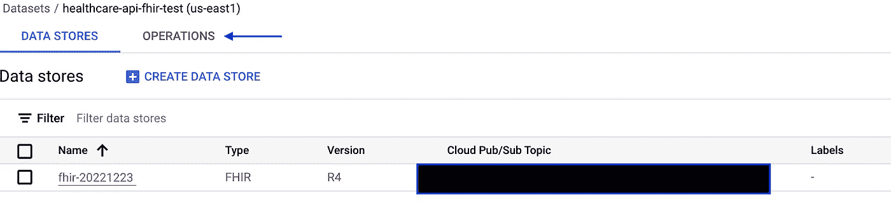
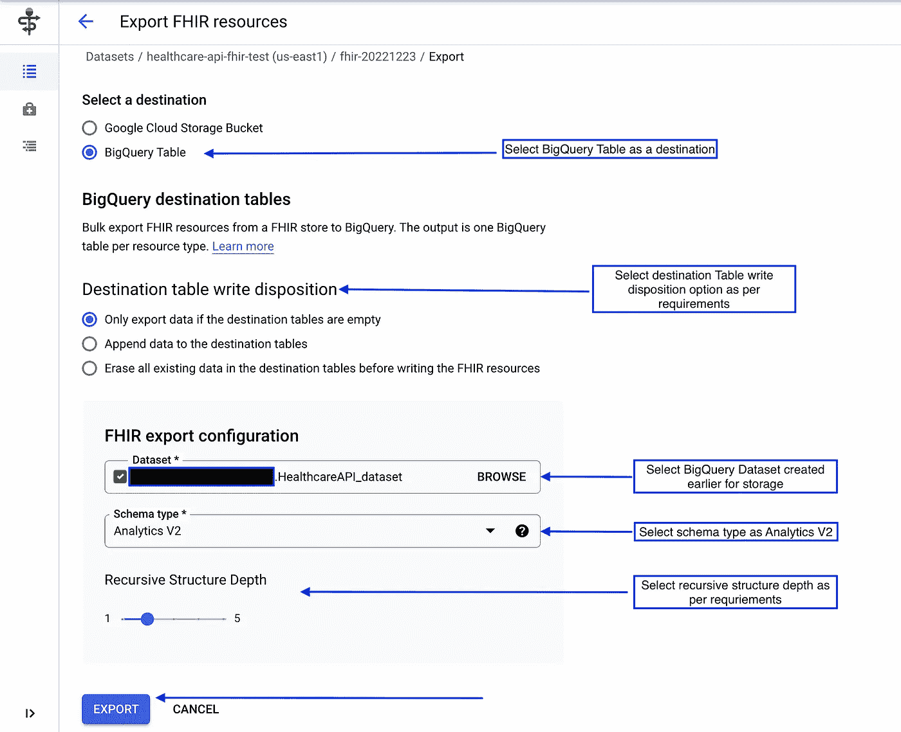

# 使用 GCP 云医疗 API 的 FHIR 数据摄取(第 1 部分)

> 原文：<https://medium.com/google-cloud/fhir-data-ingestion-using-gcps-cloud-healthcare-api-part-1-8f961714ff9e?source=collection_archive---------0----------------------->

在这篇文章中，我们将探讨如何使用**医疗保健 API 和 BigQuery 在 GCP 上执行 FHIR 数据摄取和分析。**

[**第 1 部分**](/google-cloud/fhir-data-ingestion-using-gcps-cloud-healthcare-api-part-1-8f961714ff9e) 将介绍如何将 FHIR 数据导入 GCP 的 FHIR 商店，并使用 BigQuery 的分析功能进行分析。

[**第二部分**](/@sudharmamokashi18/fhir-data-de-identification-using-cloud-healthcare-api-part-2-6af3fa34cc01) 将介绍如何在 FHIR 上执行数据去识别操作。

[**第 3 部分**](/google-cloud/dicom-data-ingestion-into-gcp-using-cloud-healthcare-api-part-3-c425b2e61cad) 将介绍如何将 DICOM 数据集输入 GCP 并在以后取消识别。

对于那些不熟悉 T21(Fast health care inter operability Resources)的人来说，这是一个医疗行业遵循的数据标准，旨在简化医疗数据的互操作性。了解更多关于 FHIR 的信息。

**【寻找更多关于 FHIR 的信息？阅读 FHIR 上的** [**护理差距，以提高患者护理质量**](http://bit.ly/FHIRCareGaps) **。】**


本文涉及的主题如下:

*   云医疗 API
*   将 FHIR 数据摄取到 GCPs FHIR 存储中
*   将 FHIR 数据导出到 BigQuery

# 什么是云医疗 API？

ealthcare API 是建立在谷歌云平台上的医疗保健系统和应用程序之间的中介。使用医疗保健 API，人们可以将他们的数据连接到先进的谷歌云功能，包括使用云数据流进行流数据处理，使用 BigQuery 进行可扩展分析，以及使用云机器学习引擎进行机器学习。


使用医疗保健 API 将 FHIR 数据摄取到 GCP

> 谷歌云提供了关于如何支持遵守美国的 HIPAA、加拿大的 PIPEDA 和 cloud.google.com/security/compliance 的其他全球隐私标准的详细指导。
> 
> 云医疗 API 将数据位置视为 API 的核心组件。您可以从当前可用位置列表中选择每个数据集的存储位置，这些位置对应于与 Google Cloud 的区域结构一致的不同地理区域。

L et 深入了解一个快速演示，该演示将涵盖使用**云医疗 API** 将 FHIR 数据摄取到谷歌云平台。在这个演示中，我们使用存储在 GCS 存储桶中的 FHIR 数据。ndjson(换行符分隔)格式。

# 将 FHIR 数据导入 GCP 的步骤

1.  启用医疗保健 API —要启用医疗保健 API，请点击[链接](https://console.cloud.google.com/apis/library/healthcare.googleapis.com?project=<project_nm>)并点击启用。


2.创建一个 BigQuery 数据集来存储导出的数据以供分析。转到 BigQuery 控制台并创建数据集。


BigQuery 数据集创建

3.在云外壳上执行下面提到的命令，以将正确的 IAM 角色附加到医疗保健 api 的服务帐户。

```
export PROJECT_ID=$(gcloud config list --format 'value(core.project)')
export PROJECT_NUMBER=$(gcloud projects list --filter=projectId:$PROJECT_ID \
  --format="value(projectNumber)")
gcloud projects add-iam-policy-binding $PROJECT_ID \
--member=serviceAccount:service-$PROJECT_NUMBER@gcp-sa-healthcare.iam.gserviceaccount.com \
--role=roles/bigquery.dataEditor
gcloud projects add-iam-policy-binding $PROJECT_ID \
--member=serviceAccount:service-$PROJECT_NUMBER@gcp-sa-healthcare.iam.gserviceaccount.com \
--role=roles/bigquery.jobUser
```

4.通过在导航菜单中搜索医疗保健创建医疗保健数据集，然后单击创建数据集。


导航至医疗保健部分

为医疗数据集设置下述属性


设置医疗数据集属性

5.创建数据集需要一些时间，一旦创建完毕，您将能够在医疗保健浏览器中看到数据集，如下所示


医疗保健浏览器

6.单击最近创建的数据集以创建 FHIR 存储。


创建数据存储

为数据存储设置下面提到的属性


数据存储类型和 ID

选择 FHIR 存储版本，然后单击下一步


选择商店版本

在 BigQuery stream 部分不做任何更改,前进到接收云发布/订阅通知部分，选择创建主题选项。


创建用于接收通知的发布/订阅主题

提供主题 id、加密机制，然后单击创建主题


创建所需的主题

单击“创建”以创建 FHIR 数据存储。


创建 FHIR 数据存储

7.将 FHIR 数据从 Google 云存储桶导入到最近创建的 FHIR 数据存储中。


输入数据

8.在导入数据集之前，通过在云外壳中运行以下命令，为医疗保健服务帐户提供对象查看器权限

```
gcloud projects add-iam-policy-binding $PROJECT_ID --member=serviceAccount:service-$PROJECT_NUMBER@gcp-sa-healthcare.iam.gserviceaccount.com --role=roles/storage.objectViewer
```

9.现在选择适当的项目、GCS 位置和内容结构，并创建导入。


导入 FHIR 数据

10.转到操作以检查日志和流程。



检查操作日志

在这里，您可以看到所有资源都已成功导入


导入日志

11.从数据存储窗口中选择在 FHIR 查看器中打开，以检查最近导入的数据


在 FHIR 浏览器中打开

12.作为本演示的一部分，我们已经插入了样本患者资源数据，因此需要搜索患者资源。


搜索患者资源

13.患者 FHIR 数据可在 FHIR 商店浏览器上获得。


商店浏览器

14.除此之外，您还可以选择单个记录，并在右侧以元素和原始 json 的形式查看其数据(在 FHIR 查看器中，如上述步骤所示)。

*   元素


资源要素

*   Json


原始 Json

15.使用数据存储页面上的导出选项将数据导出到 BigQuery 进行分析


选择导出选项

提供导出选项，然后单击导出。



将 FHIR 资源数据导出到 BigQuery

16.与导入操作类似，如果我们想要检查此操作的日志，我们可以检查操作窗口并选择所需的操作(在本例中为导出操作)。


数据集导出操作成功完成

由于我们已经导出了患者资源数据，它将在指定的 BigQuery 数据集中创建一个名为 Patient 的表。


数据导出到 BigQuery

就是这样！您已经准备好在 BigQuery 中执行分析。感谢阅读博客，下次见！

**参考文献**

*   [云医疗 API](https://cloud.google.com/healthcare-api)
*   [云医疗 API 文档](https://cloud.google.com/healthcare-api/docs)
*   [医疗保健 API](https://www.youtube.com/watch?v=_aZZpAYzoHU)