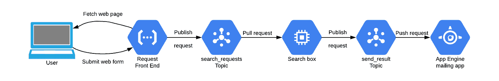

# 在π中寻找模式

> 原文：<https://medium.com/google-cloud/finding-patterns-in-%CF%80-151dc4a9ee4d?source=collection_archive---------3----------------------->

π是一个有趣的数字。不仅仅是[非理性](https://en.wikipedia.org/wiki/Irrationality)，还有[先验](https://en.wikipedia.org/wiki/Transcendental_number)。它的十进制表示“看起来是随机的”(它不是随机的，它有精确的定义，但是[似乎通过了随机性测试](https://en.wikipedia.org/wiki/Pi#Irrationality_and_normality))。您想要的任何数字串似乎都可以在该表示中找到。找到它们可能需要一段时间，但是给定足够多的π数字，你可以期望找到任何给定的数字。例如， [Jenny 的号码 8675309](https://www.youtube.com/watch?v=6WTdTwcmxyo) 位于第 9202591 个位置(将数字中的首字母 3 计为位置 0)。

我使用我创建的云应用程序来搜索π中的任何十进制数字串，发现了这一点。我采用的构建方法展示了一些有用的云应用程序开发和架构方法。这就是这篇文章的内容:不是一个云架构框架，只是一个如何思考云架构的例子。这不是该应用程序的详细描述，但是在[https://github.com/engelke/where-in-pi-is/](https://github.com/engelke/where-in-pi-is/)有可用的示例代码。只要做一点工作，你就可以用它来部署你自己的π数字搜索器。

# 数据

如果我要在π的数字中找到字符串，我必须以某种方式让这些数字可用。理论上，程序在搜索字符串时可以计算越来越多的数字，当找到字符串时就停止。但那将是荒谬的；计算这些数字是一个密集而缓慢的过程。

幸运的是，有人已经计算了π的很多位数。2019 年 3 月 14 日，谷歌宣布[艾玛·相户爱 Iwao 使用谷歌云平台工具计算了超过 31.4 万亿位数的π](https://cloud.google.com/blog/products/compute/calculating-31-4-trillion-digits-of-archimedes-constant-on-google-cloud) 。这是一项新的世界纪录。Google 设置了一个 web API，用于在 [pi.delivery](https://pi.delivery/) 返回选定的小数位。要获得从第 9，202，591 位小数开始的 7 位数字，请向[https://api.pi.delivery/v1/pi?start=9202591&number of digits = 7](https://api.pi.delivery/v1/pi?start=9202591&numberOfDigits=7)发出 web 请求。您应该看到:

```
{"content":"8675309"}
```

因此，在π中搜索七位数的一种方法是只请求从位置 0 开始的七位数，然后从位置 1 开始，依此类推，直到返回所查找的数字。

不要尝试那个。真的，**不要**。

这项服务非常快，当我尝试的时候，每个这样大小的请求需要 75 毫秒。以这样的速度，你会在大约四年内找到这个数字，除非谷歌首先因为你滥用 API 而屏蔽你。我想要更快的答案。

因此，让我们通过构建一个云应用程序来寻找π中的数字字符串，从而找出一种更快的方法。当我们为云进行设计时，我们不认为计算机是应用程序平台。不，所有可用的网络服务都是我们的平台。我们通常会使用这些服务中的几个，以各种方式相互通信，来构建应用程序。对于π搜索器，我们首先查看需要完成的每个不同的动作，然后将每个动作作为独立的部分来执行。然后我们将使用云技术让这些部分协同工作。

# 第一部分:搜索

必须存储π的数字并在其中搜索。在 [pi.delivery 网站](https://pi.delivery/)上有链接，可以将数字下载到你自己的存储器中进行处理。最简单快速的数据流方式是将数据放在一个连接到虚拟机的文件中，所以我这样做了:启动一个虚拟机 Google [计算引擎](https://cloud.google.com/compute)并将数字放入一个名为 pi.txt 的文本文件中。我编写了一个 Python 程序，将该文件内存映射到一个 Python 字节字符串，并使用内置的 find 方法进行搜索。

搜索七位数的字符串 8675309 只用了 20 毫秒。这比四年反复调用 API 站点要好得多。其实大概已经足够好了。对于长度上的每一个额外的数字，我们可以预期要花大约十倍的时间来搜索。因此，寻找一个 8 位数的数字(如日期)大约需要五分之一秒，十位数(如带区号的电话号码)大约需要 20 秒，等等。虽然这相当快，但许多搜索需要很长时间让请求者等待响应，就像处理网页一样。他们将不得不请求搜索，然后以某种方式得到结果。

这是应用程序的第一部分:一个可以相当快地找到所请求的数字串的盒子。请参见[https://github . com/engelke/where-in-pi-is/blob/master/compute engine/find-in-pi . py](https://github.com/engelke/where-in-pi-is/blob/master/computeengine/find-in-pi.py)中的`where_is`函数，以获得真正的最小解决方案。现在让我们看看还需要什么。

# 第二部分:请求搜查

下一个要解决的问题是，人们如何请求搜索。我完全控制搜索框虚拟机，所以我可以 SSH 到它并运行 Python 代码。这对任何人都没用。需要有一些方法让人们可以要求运行搜索。我能想到几个办法:

1.  在网页上填写表单
2.  向特殊地址发送电子邮件
3.  发布一条推文，提及一个特定的 Twitter 账户
4.  通过短信发送文本
5.  拨打语音电话并说出一个号码(或使用键盘)

我们将不得不构建一个或多个这样的方法，但是在开始之前，让我们弄清楚用户与之交互的前端将如何获得对搜索框的请求。我们希望所用的方法是异步的(这样请求程序就不必等待，也不会过载)并且经过认证(这样恶意攻击者就不能用虚假请求淹没搜索者)。云平台提供的服务正是为这种需求量身定制的:[消息传递](https://en.wikipedia.org/wiki/Message_passing)。

有不同风格的消息传递可用；谷歌提供 [PubSub](https://cloud.google.com/pubsub) 。一个应用程序可以创建一个或多个**主题**(例如，一个名为`search_requests`)，组件可以**向主题发布**消息，其他组件可以**向主题订阅**，因此得名。Google PubSub 保证消息至少会被发送一次，并且很少会将一条消息发送给一个订阅者多次。这对我们的使用来说没问题，因为最坏的情况是我们(很少)不止一次地搜索相同的请求字符串。

收到用户搜索请求的前端将**向`search_requests`主题发布**一条消息，搜索框将**订阅同一主题的**。可以将发布订阅配置为**推送**消息传递或**拉取**消息传递。推送消息功能会在每条消息可用时立即强制订阅方接收这些消息，并一直推送这些消息，直到订阅方确认这些消息，或者超过重试或超时限制。拉消息传递在传递消息之前等待订户请求可用的消息。

拉消息传递非常适合这种用途，因为搜索框可以有一个循环来请求消息，一次执行一个请求的搜索，然后请求更多的消息。搜索框不能以这种方式超载，因为它一次只运行一个搜索。如果机器有能力一次执行多个搜索，我们可以有多个进程，每个进程自己获取和处理消息。如果我们需要扩大规模，我们可以部署多个搜索框。

# 第三部分:用户请求前端

我之前列出了用户请求搜索的五种可能方式。我们至少需要实现其中的一个，否则搜索框就没有意义了。在这个例子中，我们只做其中的一个，最简单的似乎是第一个:给用户一个 web 页面，让用户填写一个表单，请求搜索。如果需要的话，我们可以在以后实现更多的前端，只要让它们发布到`search_requests` PubSub 主题。

有很多方法可以为 web 页面提供一个表单，然后接受填写好的表单作为回报。如果您习惯于管理自己的计算资源，您可能会考虑为此设置一个带有 web 服务器软件的虚拟机。这将工作得很好，但需要做我们自己的系统管理和维护。[无服务器计算](https://en.wikipedia.org/wiki/Serverless_computing)产品让你编写自己的应用程序代码，把其他一切事情，包括扩展、监控和日志记录，都留给平台。

我们需要一个响应 web 请求的组件，一个包含 GET 请求的表单的页面，并通过提交 POST 请求的搜索请求。我所知道的最简单的方法就是使用[云功能](https://cloud.google.com/functions)。提供这个 web 用户界面只需要编写一个 Python 函数，平台会将 web 请求路由到这个函数。代码需要查看请求是否是 GET，在这种情况下，它返回一个带有表单的网页，或者是 POST，在这种情况下，它读取与表单一起提交的值，并通过向`search_requests` PubSub 主题发布消息来请求搜索。你可以在[https://github . com/engelke/where-in-pi-is/blob/master/Function/main . py](https://github.com/engelke/where-in-pi-is/blob/master/function/main.py)看到把这个实现为云函数有多简单。

整个应用程序现在看起来像这样:


# 第四块:推一个结果

前端没有做的一件事是将搜索结果返回给用户。由于搜索可能需要一段时间，或者需要等待其他更早的搜索完成才能开始，因此该函数只负责触发搜索。用户将不得不从其他地方得到答案。可能的“其他地方”选择将包括网页(要求用户登录或为每个请求向用户给出唯一的请求)或电子邮件消息(发送到向用户提供的地址)。

目前，我们将推迟解决如何向用户交付结果的问题。相反，我们将设置另一个 PubSub 主题:`send_result`。当搜索框得到一个答案时，它会向该主题发布一条消息，并相信该主题会有一个订阅者来完成传递工作。该消息将包含如何交付结果的信息，这将根据请求的方式而变化。对于许多请求，发送结果的自然方式是通过电子邮件。对于这些情况，前端将不得不收集一个电子邮件地址，包括在给`search_requests`主题的消息中，然后搜索框将不得不包括在给`send_result`主题的消息中。其他形式的请求可能需要通过其他方法得到响应，需要 Twitter 用户名或电话号码来发送文本。消息可以简单地包括响应的类型和适当的地址。在我们进入下一步之前，没有什么需要太在意那些是什么。

# 最后一部分:发送电子邮件结果

应用程序的最后一部分是订阅`send_result`主题并进行交付的组件。如果我们有多种交付方法，我们可以用一个单独的交付组件来处理所有这些方法，或者用单独的组件订阅主题并跳过它们不能处理的任何消息。我们将保持简单，通过发送电子邮件来处理每条消息。

你如何使用谷歌云平台发送电子邮件？没有简单的方法。没有像一些云提供商那样的电子邮件发送 API。如果你用电子邮件软件设置了一个虚拟机，它可能会被阻止，以防止可能的垃圾邮件。有办法解决这个问题，你可以使用第三方服务，但我记得谷歌应用引擎*曾经*有一个电子邮件发送 API。最新版本的 App Engine 不再提供该 API，但之前的 App Engine 版本仍然可用，因此我们将使用该版本。

没错:我们将建立一个 App Engine 实例，只根据发送给它的 PubSub 消息发送邮件。

Python 2.7 应用程序的 App Engine 代码位于[https://github . com/engelke/where-in-pi-is/tree/master/App Engine](https://github.com/engelke/where-in-pi-is/tree/master/appengine)。每当有消息发布到`send_result`主题时，它使用 PubSub push 订阅向它发送 HTTP 请求。这些传入消息包括向其发送结果的电子邮件地址和结果本身，还包括在推送订阅中配置的共享密钥令牌，以便 App Engine 可以确保这些传入请求不是伪造的。

# 把一切都包起来

我们完整的应用程序如下所示:



用户与一个由云函数提供的 web 表单进行交互，该表单向`search_requests`主题发布一条消息。搜索由一个计算引擎虚拟机完成，它提取搜索请求，找到答案，并将答案发布到`send_result`主题。最后，一个应用引擎实例通过该主题的推送订阅获得发送结果的请求，并向用户最初提供的地址发送电子邮件。

不同作品的代码可在[https://github.com/engelke/where-in-pi-is](https://github.com/engelke/where-in-pi-is)获得。目前，在 https://us-central 1-engelke-pi-blog . cloud functions . net/where-in-py 上有这个应用程序的一个活动版本。它将只搜索π的前几十亿位，因为存储 Emma 计算的全部 31.4 万亿位对于这样的演示来说是相当昂贵的。不过，这将找到大多数 7 或 8 位数的数字你问。

试试看，或者构建自己的无服务器云应用程序！

*原载于 2020 年 3 月 30 日*[*http://engelke . dev*](https://engelke.dev/2020/03/30/finding-patterns-in-%cf%80/)*。*