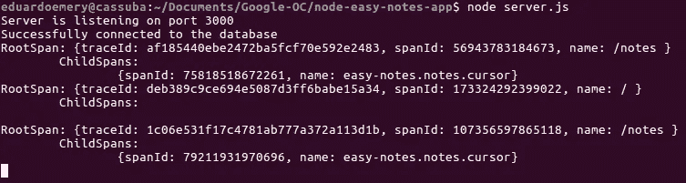
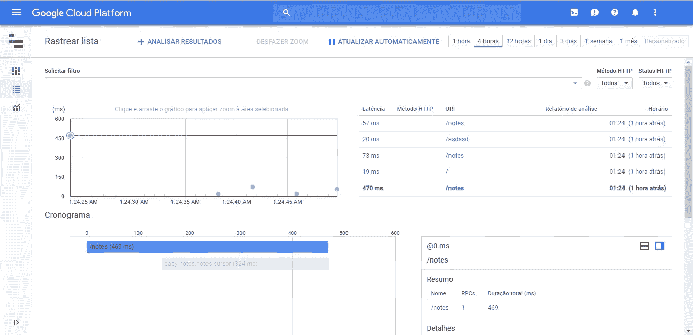
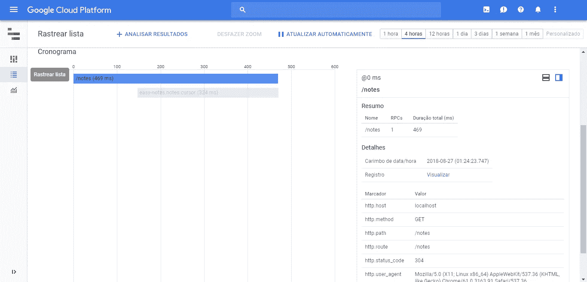

# 如何毫不费力地找到应用程序的性能瓶颈

> 原文：<https://medium.com/google-cloud/finding-performance-bottlenecks-on-your-application-effortlessly-b254b932d47e?source=collection_archive---------1----------------------->


马文·迈耶在 [Unsplash](https://unsplash.com?utm_source=medium&utm_medium=referral) 上的照片

如今，有了这么多的工具和框架来简化 web 和移动开发，我们开发人员可以有更多的时间来关注跟踪和增强应用程序的性能。

通常，我们试图关注页面加载时间、延迟、不同设备上的动画帧率等等；开始时，到达这个发展阶段可能会不舒服:

*我如何衡量事物？*

有什么我可以用的东西吗？

其中最严酷的是:

*我如何确保这些用于跟踪的代码不会干扰应用程序？*

这篇文章将帮助你找到那些答案，而不需要在编码上花费太多的精力。

在这里，我们会明白:

1.  OpenCensus 如何帮助你
2.  仪表化服务器的示例
3.  如何将收集的数据发送到各种其他服务

# OpenCensus 和 Node.js

[OpenCensus](https://opencensus.io/) 是一个从你的应用程序中收集统计和追踪信息的工具，并将其发送给许多不同的服务，如 [Stackdriver](https://cloud.google.com/stackdriver/) 、 [Jaeger](https://github.com/jaegertracing/jaeger) 、 [Zipkin](https://zipkin.io/) 等。

OpenCensus 的伟大之处在于，它不仅是一个独立于供应商的库，并且支持许多不同语言的实现，如 Java、Go、Python 和 Node.js，它还具有**自动跟踪功能！**

OpenCensus for Node.js(我曾有机会用它[为](https://github.com/eduardoemery)做贡献)支持 HTTP、HTTPS、HTTP2 和 MongoDB 的自动跟踪。这意味着一旦设置好，它就开始收集跟踪，而无需您明确指出应用程序中的操作是什么以及应该如何命名。

实际上，它不止于此，它保证您将拥有一个可伸缩的低开销代码来收集关于您的应用程序的数据。而且，如果你需要的话，不依赖于供应商，你将来一定能够很容易地改变你的后端服务。

现在，让我们用一个应用程序来看看使用 OpenCensus for Node.js 的自动跟踪特性有多简单。

在这里，我们将使用 [Node Easy Notes 应用程序](https://github.com/callicoder/node-easy-notes-app)进行演示。

# 示例应用程序

为了不重新发明轮子，让我们使用一个已经存在的名为 *Node Easy Notes App* 的应用程序。这是一个简单的用于 notes 的 CRUD 应用程序(创建、读取、更新和删除)。它使用 *Express* 和 *MongoDB* 来构建和存储 notes 信息。

我们的目标是跟踪其端点的延迟，并获得更多有关内部操作的信息，以便为我们提供响应。

这有助于了解在增强应用程序性能时，开发团队应该将注意力集中在哪里。例如，人们可能会发现，某个端点需要很长时间才能做出响应，这是由于在特定情况下在数据库中进行了低效的查询。

所以，让我们深入研究一下。

首先，确保您已经安装了 [Node.js](https://nodejs.org/) (版本 6 或更高版本)和 *npm* 。

一旦[下载了 Node Easy Notes 应用程序](https://github.com/callicoder/node-easy-notes-app)，通过运行以下命令导航到其根目录并安装其依赖项:

```
npm install
```

完成后，您可以通过运行以下命令来测试它:

```
node server.js
```

现在，去 [localhost://3000](http://localhost:3000/) 看看它是如何工作的。也可以尝试类似 [localhost://3000/notes](http://localhost://3000/notes) 的不同路线。

从这一点开始，我们已经为插装步骤启动并运行了服务器。

# 检测应用程序

也许你对仪器应用不熟悉，但正如贾纳·多安所说:

> 允许平台级别的可见性有助于我们的用户快速调试和确定意外事件。

这对您的基础设施以及您的团队如何管理资源有着直接的影响。但是仅仅因为它是一件重要的事情，并不意味着它一定是困难的。

开头提到的魔法将从这一刻开始发生，准备好！

首先，使用以下命令安装 OpenCensus for Node.js:

```
npm install @opencensus/nodejs
```

然后，简单地打开`server.js`文件，在它的请求中添加以下几行:

```
var tracing = require('@opencensus/nodejs');tracing.start();
```

*瞧！*

通过添加，我们导入并启动了一个**跟踪实例，**负责添加插件的家伙，这些插件将自动收集 HTTP、HTTPS、HTTP2 和 MongoDB 的跟踪。

就这样，我们今天到此为止。

现在，您可以使用`node server.js`再次运行应用程序，并访问它的一个端点，比如 [localhost:3000/](http://localhost:3000/) 。

如果您看一下终端，您会看到一些跟踪信息在它执行操作时被打印出来。



好吧，这看起来不太友好。

嗯，还有比这更优雅的。您可以将导出器添加到您的*跟踪*实例中，以便能够将数据发送到其他服务，如 Stackdriver。

# 将收集的数据发送给外部服务

为此，我们只需要导入导出器并用正确的参数实例化它。在 [OpenCensus for Node GitHub 页面](https://github.com/census-instrumentation/opencensus-node/tree/master/packages/opencensus-nodejs)中，可以分别找到每个出口商的更多信息。

对于 Stackdriver，您需要有一个启用了 Stackdriver 跟踪的 Google 云项目。确保还启用应用程序默认凭据进行身份验证(有关更多信息，请访问[https://developers . Google . com/identity/protocols/Application-Default-Credentials](https://developers.google.com/identity/protocols/application-default-credentials)):

```
export GOOGLE_APPLICATION_CREDENTIALS=/path/to/your/credentials.json
```

一旦完成了项目和环境的设置。我们只需安装 Stackdriver 导出器，其中包括:

```
npm install @opencensus/exporter-stackdriver
```

之后，导入并将其传递给跟踪，就像这样:

```
var tracing = require('@opencensus/nodejs');var stackdriver = require('@opencensus/exporter-stackdriver');exporter = new stackdriver.StackdriverTraceExporter({projectId: "your-project-id"});tracing.start({exporter});
```

使用`node server.js`再次运行您的应用程序，并再次使用端点。

# 查看痕迹

现在，只要去[谷歌云控制台](https://console.cloud.google.com)看看你的踪迹！在那里，您可以找到查看数据的不同方式。您还可以选择特定的跟踪以了解更多信息，查看其子范围和元数据。



跟踪概述



获取有关单个跟踪的更多信息

现在轮到你玩了。

就像我们在这里做的那样，在您的应用程序中添加 OpenCensus for Node.js，并在下面评论它给了您什么启示！

# 结论

将应用程序推向市场时，不管是大的还是小的，插装都是决定性的一步。

它对团队活动计划和资源使用有直接影响。

这就是为什么你必须尽快尝试整合像 OpenCensus 这样的工具。

考虑到集成是如此容易，没有理由不这样做。

*现在，获取这个例子，尝试它，改变它，改进它，告诉我你的印象以及它有多容易或多难。*

请在下面留下评论。我很乐意收到你的来信。