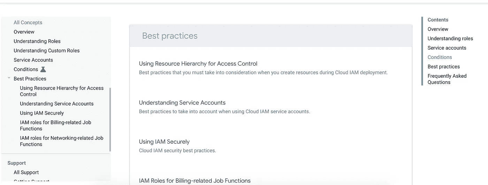

# 寻找关于 GCP 的东西

> 原文：<https://medium.com/google-cloud/finding-stuff-about-gcp-db5e0896f5ac?source=collection_archive---------1----------------------->

我经常听到人们说他们不知道从哪里开始寻找关于 GCP 的信息，所以我想我应该整理一份关于 GCP 的信息

显然有这个搜索引擎，你可能听说过，可以在这里找到 google.com T2 T3😀然而，如果你想直接找到解决方案，我最喜欢的网址是:

**忽略它说教程的事实，它也将定位在[https://cloud.google.com/solutions/](https://cloud.google.com/solutions/?authuser=0)下发布的解决方案和概念文档**

**如您所料，每个**产品都有自己的一套文档**。因此，如果您需要深入了解某个产品，请查看 https://cloud.google.com/products 的 **下的概念和最佳实践，我建议您从这里开始，然后尝试其中一个快速入门项目。
例如，如果您正在寻找关于[云 IAM](https://cloud.google.com/iam/) 的概念文档&最佳实践，您可以在 https://cloud.google.com/iam/docs/concepts 的[下查找，并且可以通过 IAM 文档页面的侧边菜单找到最佳实践](https://cloud.google.com/iam/docs/concepts)****

********

****显示“文档”侧菜单的屏幕截图****

****和所有快速入门一样，IAM 快速入门鼓励你动手实践。****

****GCP 的博客有很多有用的帖子，你应该订阅以了解最新的新闻和使用 GCP 的技巧。****

****[**这个**](https://github.com/gregsramblings/google-cloud-4-words) 有一个神奇的**每款 GCP 产品**的备忘单，还包括每个产品登陆页面的链接。书签吧！去吧你不会后悔的谢谢@gregsramblings 这么做！****

******发行说明** —定期阅读！每个产品都有自己的
，所以第一个例子:
https://cloud.google.com/kubernetes-engine/release-notes
GKE—[云构建—](https://cloud.google.com/kubernetes-engine/release-notes?authuser=0)[https://cloud.google.com/cloud-build/release-notes](https://cloud.google.com/cloud-build/release-notes?authuser=0)
云存储—[https://cloud.google.com/storage/docs/release-notes](https://cloud.google.com/storage/docs/release-notes?authuser=0)
在[cloud.google.com/](http://cloud.google.com/)<产品> /docs/release-notes 下查找，应该可以找到您感兴趣的产品的发行说明页面。****

****GCP YouTube 频道有许多各种长度的精彩视频，从 5 分钟的短片到更长更深入的视频。****

****有**时事通讯**
还有 https://cloud.google.com/newsletter/官方的 **我个人很喜欢这本**[**https://www.gcpweekly.com/**](https://www.gcpweekly.com/)**除了每周汇总官方新闻&文章之外，它还整理其他地方的新闻和文章。是的，我可能偶尔会对一些文章感到不快，但我喜欢谷歌不依赖任何人。我只想说谢谢你的这份简讯！

**——在这里可以找到大量很酷的文章，总是值得一看，而 [**谷歌云平台媒体出版物**](https://link.medium.com/7sqIzXbaGS) 可以很容易地找到关于 GCP 的优质媒体帖子。************

****是的，还有推特(Twitter)——有很多谷歌人和用户在推特上谈论 GCP，还有官方推特账户(@谷歌云，@gcpcloud ),从官方账户开始，寻找其他在推特上谈论 GCP 的人来关注。****

****我在 twitter 和 medium 上关注我的最爱，我相信你也会找到你的。****

****GCP 有着梦幻般的不拘一格 [**播客**](https://www.gcppodcast.com/) 。订阅吧，别忘了收听本周问题的答案！****

****我将推出我的 [**流程图**](/@grapesfrog/more-gcp-flowcharts-for-your-delectation-36b63ebb72ce) 系列，因为它们是一种很好的视觉方式，可以帮助你解决问题，人们似乎真的很喜欢它们。(我开始为这个系列的第三篇文章准备更多的流程图)****

****想要**画出你的 GCP 架构**你可以在这里找到各种工具的图标和示例图****

****最后，谈到实际操作和获得官方支持渠道 [之外的**支持，这里的**](https://cloud.google.com/support/docs/stackexchange)是一个很好的起点。****

****添加内容:****

****这些代码实验室:https://codelabs.developers.google.com/?猫=云****

****我不知道为什么我忘记在 gcp.solutions 添加架构图，因为我实际上贡献了其中的一些。****

****感谢 Prafull 的这些建议****