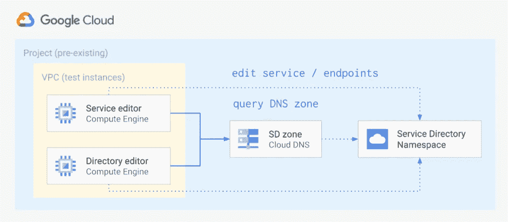

# 通过服务目录的细粒度云 DNS IAM

> 原文：<https://medium.com/google-cloud/fine-grained-cloud-dns-iam-via-service-directory-446058b4362e?source=collection_archive---------0----------------------->


服务目录是对目前处于测试阶段的 GCP 产品的一个相对较新的补充，它为发现、发布和连接服务及其端点提供了一个托管解决方案。这篇短文和示例展示了如何利用其云 DNS 集成来解决支持 DNS 区域和记录的细粒度 IAM 控制的常见问题。

在我们深入这个例子之前，让我们快速看一下服务目录[原语](https://cloud.google.com/service-directory/docs/overview#key_concepts):

*   **名称空间**是共享公共属性(环境、团队等)的服务集合。)，它们在项目中被定义为区域资源，可以从任何地方进行查询。
*   **服务**是在名称空间中定义的实际服务表示，由一个名称(在名称空间中是唯一的)和一组端点来标识。
*   **端点**代表处理给定服务请求的单个端点，由名称(例如 *vm1* )和相关的唯一 IP/端口对标识。

服务和端点都可以附加可选的元数据，这些元数据在客户端查询中返回。IAM 绑定在名称空间和服务级别都受支持，服务和端点的查找是通过 HTTP、gRPC 或 DNS 经由专用的私有区域类型完成的。

云 DNS [*服务目录*私有区域类型](https://cloud.google.com/service-directory/docs/configuring-service-directory-zone)使用服务目录命名空间作为其权威信息源，允许用户通过 DNS 请求查找服务目录记录，管理员通过利用服务目录 IAM 支持对 DNS 区域和记录实施细粒度控制。

让我们看看这在实践中是如何工作的，使用一个简单的示例来创建一个服务目录命名空间，将其绑定到一个私有区域，并将`roles/servicedirectory.editor`角色授予两个独立的服务帐户，以允许编辑命名空间或服务记录，如下图所示。



要运行这个示例，首先克隆[存储库](https://github.com/terraform-google-modules/cloud-foundation-fabric)并切换到示例文件夹。如果您喜欢使用云 Shell，[这个链接](https://ssh.cloud.google.com/cloudshell/editor?cloudshell_git_repo=https%3A%2F%2Fgithub.com%2Fterraform-google-modules%2Fcloud-foundation-fabric&cloudshell_print=cloud-shell-readme.txt&cloudshell_working_dir=cloud-operations%2Fdns-fine-grained-iam&cloudshell_open_in_editor=cloudshell_open%2Fcloud-foundation-fabric%2Fexamples%2Fcloud-operations%2Fdns-fine-grained-iam%2Fvariables.tf)将为您运行 Git 克隆，并切换到正确的文件夹，以便您可以跳过下面的初始步骤。

```
git clone [https://github.com/terraform-google-modules/cloud-foundation-fabric.git](https://github.com/terraform-google-modules/cloud-foundation-fabric.git)
cd examples/cloud-operations/dns-fine-grained-iam
```

在正确的文件夹中，运行 Terraform，只需提供将创建所需资源的项目 id，在云外壳中,`$GOOGLE_PROJECT_ID`变量被设置为云控制台中的当前项目，如果您不在云外壳中或想要使用不同的项目，请用实际的项目 id 替换它。

```
terraform init
# answer 'yes' when prompted after running apply
terraform apply -var project_id=$GOOGLE_PROJECT_ID
```

我们现在准备测试这个例子:我们将依次登录到两个虚拟机，使用`dig`命令通过 DNS 查询服务目录名称空间，然后使用与每个虚拟机相关联的服务帐户的凭证操作它的服务和端点。

Terraform 输出生成预设的`gcloud compute ssh`命令，您可以复制这些命令并在控制台中运行，以连接到每个虚拟机。如果您更改了`name`、`region`或`zone_domain`地形变量的默认值，请记住调整以下测试命令。

通过 SSH 连接到`ns` VM，让我们从通过 DNS 查询服务目录名称空间开始，验证一切正常。

```
gcloud compute ssh dns-sd-test-ns-1 \
  --zone europe-west1-b --tunnel-through-iap

dig **app1.svc.example.org** +short
*# 127.0.0.2
# 127.0.0.3
# 127.0.0.7*
dig **app2.svc.example.org** +short
*# 127.0.0.4
# 127.0.0.5*
dig **_app1._tcp.app1.svc.example.org** srv +short
*# 10 10 80 vm1.app1.svc.example.org.
# 10 10 80 vm2.app1.svc.example.org.
# 10 10 80 vm3.app1.svc.example.org.*
```

DNS 答案应该与上面代码片段中每个命令后的注释相匹配。注意最后一个命令中用于查询`SRV`记录的特殊格式。

如果一切正常，那么让我们通过创建一个新服务，然后通过 DNS 查询其端点，来验证`ns` VM 服务帐户是否拥有对名称空间的编辑权限。

```
gcloud beta service-directory services create app3 \
  --location europe-west1 --namespace dns-sd-test
*# Created service [app3].*

gcloud beta service-directory endpoints create vm1 \
  --service app3 \
  --location europe-west1 --namespace dns-sd-test \
  --address 127.0.0.6 --port 80
*# Created endpoint [vm1].*

dig **app3.svc.example.org** +short
*# 127.0.0.6*
```

我们刚刚演示的是，在名称空间上具有`roles/servicedirectory.editor`角色的身份能够创建(和编辑/删除)绑定到它的服务和端点。

现在让我们看看如何将权限范围限制到单个服务及其端点。从`ns`虚拟机注销并登录到`svc`虚拟机，然后尝试删除我们刚刚创建的服务记录。

```
gcloud compute ssh dns-sd-test-svc-1 \
  --zone europe-west1-b --tunnel-through-iapgcloud beta service-directory services delete app3 \
  --location europe-west1 --namespace dns-sd-test
*# Deleted service [app3].
# ERROR: (gcloud.beta.service-directory.services.delete) PERMISSION_DENIED: Permission 'servicedirectory.services.delete' denied on resource 'projects/my-project/locations/europe-west1/namespaces/dns-sd-test/services/app3'.*
```

忽略明显是 bug 的`deleted`消息(该服务毕竟还是 beta 版)，关注最后一条错误消息:该身份无权操作`app1`以外的服务。它能做的是操作我们给它访问权的单一服务。

```
gcloud beta service-directory endpoints create vm3 \
  --service app1 \
  --location europe-west1 --namespace dns-sd-test \
  --address 127.0.0.7 --port 80
*# Created endpoint [vm3].*dig **app1.svc.example.org** +short
*# 127.0.0.2
# 127.0.0.3
# 127.0.0.7*
```

当您完成测试后，从 VM 注销并运行下面的命令来删除为这个例子创建的资源。

```
terraform destroy -var project_id=$GOOGLE_PROJECT_ID
```

此处显示的设置当然是最小的，真正的设置将涉及服务目录和对等区域的组合，以跨多个项目和网络分布 DNS 记录的管理和使用。

它的主要目的是演示这两种服务的集成，并展示如何将两者结合起来以实现对私有 DNS 区域和记录的细粒度控制。