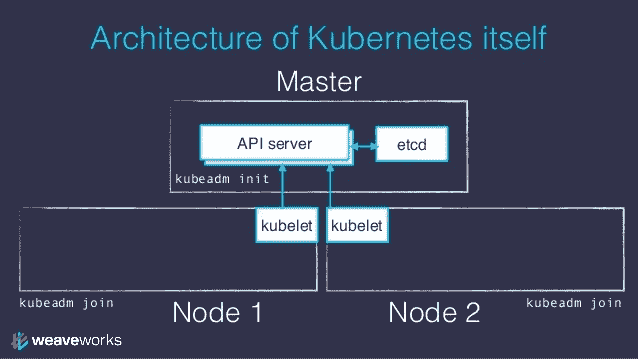
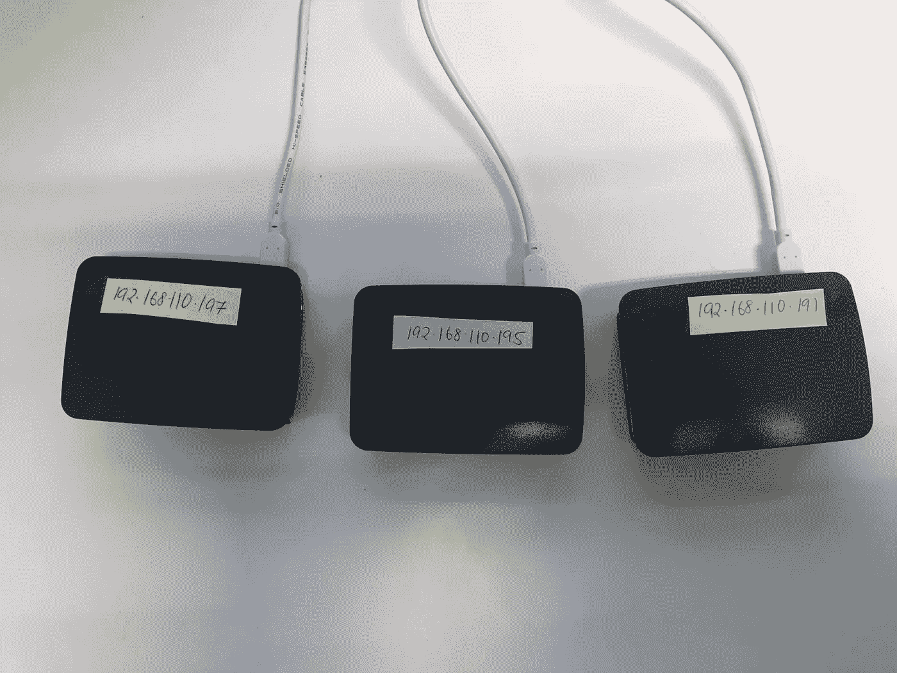

# 微调 Kubernetes 集群

> 原文：<https://medium.com/google-cloud/fine-tuning-a-kubernetes-cluster-187d79370fd9?source=collection_archive---------0----------------------->

众所周知，API 服务器、调度器、控制器管理器和 Kubernetes 组件构成了 Kubernetes 集群的主干，在这里我们将通过示例来了解如何根据我们的需求调整这些组件。

1925 年，一名男子在 TRF 调试真空管(来源:[https://commons . wikimedia . org/wiki/File:Tuning _ a _ TRF _ 无线电 _1925.jpg](https://commons.wikimedia.org/wiki/File:Tuning_a_TRF_radio_1925.jpg) )

## 使用 Kubeadm 创建的集群

来源:[https://image . slidesharecdn . com/2-kubernetes-training-171016154824/95/orchestrating-micro services-with-kubernetes-37-638 . jpg？cb=1508173523](https://image.slidesharecdn.com/2-kubernetes-training-171016154824/95/orchestrating-microservices-with-kubernetes-37-638.jpg?cb=1508173523)

使用 kubeadm 配置的集群将 kubelet 实现为 systemd 服务，将 kube-scheduler、kube-apiserver、kube-controller-manager 实现为 docker 容器，从主机系统的/etc/kubernetes/manifests/加载它们的配置。对这些配置所做的任何更新都会对群集产生直接影响，无需重新启动。

# 调整 Kubenetes 集群的必要性

kubernetes 集群及其默认的配置值集合几乎可以满足所有普通用户的需求。在正常情况下，您不必调整 Kubernetes 配置参数。然而，有些情况下你需要它们，它们将在下面讨论。

# 情况 1:更快地检测/响应节点故障

这里有一个用例，默认配置集不够用，需要调整集群。这是在使用 Raspberry Pi 集群运行/测试 Kubernetes 节点故障时。

正如@v1ktoor 在[这篇](https://fatalfailure.wordpress.com/2016/06/10/improving-kubernetes-reliability-quicker-detection-of-a-node-down/)帖子中提到的，kubelet 在第 40 秒(*node-update-status-frequency*x(N–1))后检测到节点不可用，在此之后，kube-controller-manager 在开始驱逐 pod 之前会等待 5 分钟( *node-eviction-timeout* )。这意味着，在节点出现故障后，需要 340 秒(40 秒+5 分钟)才能采取任何措施。这可以通过降低默认值来加快反应速度。例如，在 Raspi kubernetes 集群中将以下值设置为:

*   **kubelet** : *节点-状态-更新-频率* =4s(从 10s 开始)
*   **kube-控制器-管理器** : *节点-监控-周期* =2s(从 5s 开始)
*   **kube-controller-manager**:*node-monitor-grace-period*= 16s(从 40s 开始)
*   **kube-controller-manager**:*pod-eviction-time out*= 30s(从 5m 开始)

确保满足公式: *pod-eviction-timeout >(节点-状态-更新-频率 x (N-1) ==节点-监视器-宽限期)*。修改上述值后，控制器管理器在故障发生后半分钟内开始驱逐 pod(从电源上拔下随机的 RaspberryPi)。

# 情况 2:每个节点的最大 pod 超过 110

如果您有一个大型集群，或者如果您正在尝试使用更多的 pod 进行测试，您将很快意识到，每个节点有 110 个 pod 的硬性限制。您会得到这样错误:

以上是用 *kubeadm* 创建的双节点+主集群。该值在*/var/lib/kube let/CONFIG . YAML*中配置为 *maxPods* ，并作为 *- config* 传递给 *kubelet* 作为 KUBELET_CONFIG_ARGS。这可以调整到所需的值，并重新启动 *kubelet* 以使其生效。

# 更多配置参数

除此之外，这里记录了所有 kubernetes 组件的完整参考:

*   **Kubernetes api 服务器**—[https://Kubernetes . io/docs/reference/command-line-tools-reference/kube-API server/](https://kubernetes.io/docs/reference/command-line-tools-reference/kube-apiserver/)
*   **Kubernetes 控制器管理器**—[https://Kubernetes . io/docs/reference/command-line-tools-reference/kube-controller-manager/](https://kubernetes.io/docs/reference/command-line-tools-reference/kube-controller-manager/)
*   **Kubernetes 调度程序**—[https://Kubernetes . io/docs/reference/command-line-tools-reference/kube-scheduler/](https://kubernetes.io/docs/reference/command-line-tools-reference/kube-scheduler/)
*   **kube let**—[https://kubernetes . io/docs/reference/command-line-tools-reference/kube let/](https://kubernetes.io/docs/reference/command-line-tools-reference/kubelet/)

确保这些服务在修改后重新启动。

# 云托管解决方案—局限性

几乎所有主要的云供应商都提供托管/托管的 kubernetes 解决方案。在这种情况下，用户不必关心集群的维护，缺点是无法访问/调整配置参数。然而，托管解决方案的整体思想是不必关心 kubernetes 的复杂性。

# 结论

由于 kubernetes 的社区和它的用途被带到不同的领域，很难找到一个适合所有人的默认配置。有时，您需要根据需要修改配置参数。然而，非常好的是，社区已经设法维护了大量的配置参数，这些参数可以在源代码之外进行修改。

# 参考

1.  关于检测更快节点故障的帖子—[https://fatal failure . WordPress . com/2016/06/10/improving-kubernetes-reliability-faster-detection-of-a-node-down/](https://fatalfailure.wordpress.com/2016/06/10/improving-kubernetes-reliability-quicker-detection-of-a-node-down/)