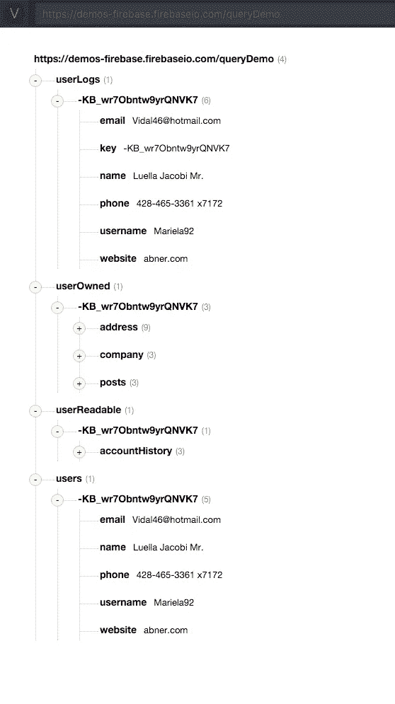

# Firebase 数据结构:复杂数据

> 原文：<https://medium.com/google-cloud/firebase-data-structures-complex-data-eb76b5a31124?source=collection_archive---------0----------------------->

如果您错过了我关于分页的第一期 Firebase 数据结构文章，您可能想在继续之前先看看。

都赶上了？太好了！先说复杂数据。

**2016 年 6 月 30 日更新:**我发布了我的免费课， [Firebase 3.0 for Web](https://t.co/3eNdfsMtfu) 。看看这个。

## 示例数据

我只创建了一个用户。注意所有的按键都是一样的(-KB_wr7Obntw9yrQNVK7)？

## 复杂数据需要服务器

当一个新用户登录到我的系统时——当然是使用 [Firebase 认证](https://www.firebase.com/docs/web/guide/user-auth.html)——我在/users 节点中创建一个新条目来存放他们的数据。

*   当用户创建帐户历史时，我将该历史记录在/user readable/-KB _ wr 7 obn tw 9 yrqnvk 7/account history 下。
*   当用户创建地址、公司数据和帖子时，我将它们保存在/user owned/-KB _ wr 7 obn tw 9 yrqnvk 7/*{ address，company，posts}* 下。
*   为了好玩，我将用户的日志保存在/userLogs/-KB_wr7Obntw9yrQNVK7 下

这些操作需要服务器或[谷歌云功能](https://cloud.google.com/functions/docs)来复制数据。例如，/userReadable 节点将有一个防止写入的安全规则。我必须将用户数据写入/userReadable 服务器。

/userOwned 节点将拥有用户的读/写权限，但是我仍然需要一个服务器将/userOwned 的更改分散到我的数据结构的其他部分，以便其他用户和/或公众可以读取。

## 为什么我的查询很慢？

想象一下，如果我将所有这些数据嵌套在/users/-KB_wr7Obntw9yrQNVK7 节点下，会怎么样？我可以将地址、公司、文章和帐户历史节点直接推送到我的用户对象中，这样可以节省大量时间！！！💩

现在考虑在我的网站的管理部分显示我的用户列表。当我查询一个用户时，我会收到嵌套在该用户下的所有节点，不管我是否需要它们。

想象一下，如果每个用户的 accountHistory 节点超过 100kb，会是什么情况？如果我想在一个列表中显示 10 个用户，我将查询超过 1MB 的数据，即使我只想显示用户名和电子邮件地址。

我做过这个。书页嘎然而止。🚨 🚑 🚒

## 保持你的数据浅薄

将数据分解成不同的组成部分使您能够只查询您需要的数据。使用服务器适当地复制数据将使您能够避免进行连接。复制数据，使其看起来与您向用户显示的完全一样。

浅层数据和特定于视图的数据复制会使写入过程稍微繁重一些。然而，大多数应用程序读取数据的次数远远多于写入数据的次数，因此重复的、分散的数据可能会有很高的性能。

然而，如果你发现你的应用程序需要大量的写操作，试着用最简单的方式写，并使用一个服务器进程将这些写操作组合成更容易阅读的结构。利用[多位置更新](https://www.firebase.com/blog/2015-09-24-atomic-writes-and-more.html)使这变得轻而易举。

## 日志

不要害怕重复数据！NoSQL 因重复数据而繁荣。如果一个用户改变了她的用户名，你可能不得不在三个不同的地方更新一个用户名节点，但是[多位置更新](https://www.firebase.com/blog/2015-09-24-atomic-writes-and-more.html)有助于做到这一点……同样，它让读取变得非常快。

我喜欢创建日志。我喜欢服务器进程监视数据变化，并将它们记录到/logs/comments 或/logs/deletedPosts 或任何有意义的/logs/*节点。Firebase 使得这种日志记录几乎是即时的，日志让我可以快速地对浅层数据列表进行排序，以找到我需要的内容。一旦我有了评论或 deletedPost 之类的东西，就很容易找到原始文档进行更深入的检查。

如果我的日志太长，我会删除旧的日志，因为它们只是日志。如果你需要一些法庭数据分析，你可以随时循环查看原始记录。

## 下一个！

我有一些关于[安全规则](/@ChrisEsplin/firebase-data-structures-security-rules-72fd4ad91f0d#.iy6r58c44)的想法来分享。请跟我来！

在评论中，在推特上，在新的 Firebase Slack 频道上给我打电话😍！！！