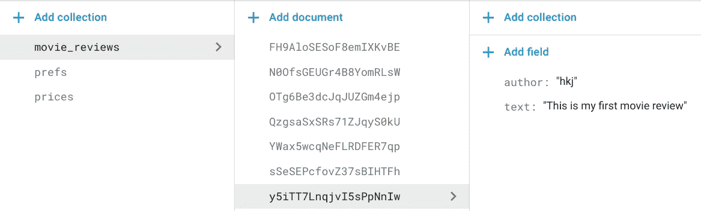
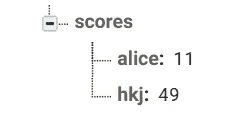
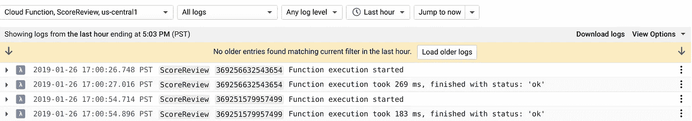

# Firebase:在 Go 中开发无服务器功能

> 原文：<https://medium.com/google-cloud/firebase-developing-serverless-functions-in-go-963cb011265d?source=collection_archive---------0----------------------->


谷歌云功能的 Go 运行时间[于本月在](https://cloud.google.com/blog/products/application-development/cloud-functions-go-1-11-is-now-a-supported-language)发布测试版。我非常喜欢静态类型语言，尤其是 Golang。因此，我对在 Go 中开发无服务器功能的可能性感到兴奋，并将它们部署在[谷歌云平台(GCP)](https://cloud.google.com) 。在这篇文章中，我们看看如何在 Go 中实现云功能，并设置它从[云 Firestore](https://firebase.google.com/docs/firestore/) 触发器中调用。然后我们将把 [Firebase 实时数据库](https://firebase.google.com/docs/database/)也加入进来，让事情变得更有趣。

我们的用例非常简单。假设我们有一个电影评论应用程序。用户发布评论，这些评论存储在名为`movie_reviews`的 Firestore 集合中。每当发布新的评论时，我们都希望对其进行分析，对内容进行评分，并奖励评论的作者一些分数。在 Firebase 实时数据库中，用户的总分数保持最新。我们当然可以用 Firestore 来实现这个用例。但是我也使用实时数据库来演示通过云功能在 [Firebase](https://firebase.google.com) 生态系统中集成多种服务。我还想在新的云函数运行时中尝试一下 [Firebase Admin SDK](https://firebase.google.com/docs/admin/setup) 。

## 安装

我们需要一个支持 Firestore 和云功能的 Firebase 项目。如果您还没有，就继续创建一个新的 Firebase 项目。注意，这实际上是在引擎盖下创建了一个 GCP 项目。查看 [Firestore](https://firebase.google.com/docs/firestore/quickstart) 和[云功能](https://cloud.google.com/functions/docs/quickstart)的入门指南，了解如何在新项目中启用这些服务。

接下来，在您的本地开发环境中安装 [Google Cloud SDK](https://cloud.google.com/sdk/docs) ，这样您就可以使用`gcloud`命令行工具了。还要确保你已经安装了 Golang 1.11，并且你能够在本地构建和运行 Go 程序。最后，通过运行以下命令安装 Firebase Admin SDK:

```
$ go get -u firebase.google.com/go
```

这将把 Admin SDK 及其所需的依赖项安装到您的`GOPATH`中。

## 云函数编码

首先在本地的某个地方创建一个名为`scorer`的新目录。然后在那个目录下创建一个名为`scorer.go`的文件。这个文件将包含我们为这个例子实现的所有代码。你可以在 [GitHub](https://github.com/hiranya911/firecloud/tree/master/review-scorer/scorer) 中找到完整的`scorer.go`文件。

在我们的云功能实现中有两个值得注意的组件:

1.  一个包含包级初始化逻辑的`init()`函数。
2.  一个包含无服务器函数主体的`ScoreReview()`函数。

Go 中的一个`[init()](https://golang.org/doc/effective_go.html#init)` [函数](https://golang.org/doc/effective_go.html#init)是为一个包实现一些一次性初始化逻辑的标准方式。清单 1 显示了我们的`scorer`包的`init()`函数应该是什么样子。

清单 1:包初始化代码

这里我们初始化 Firebase Admin SDK，并创建一个新的`[db.Client](https://godoc.org/firebase.google.com/go/db#Client)`供以后使用。确保更改`DatabaseURL`设置(清单 1 中的第 17 行)以指向您自己的 Firebase 实时数据库实例。作为一个最佳实践，您应该总是重用`firebase.App`和`database.Client`的实例。因此，通过将上述代码放在一个`init()`函数中，我们确保它只运行一次。相同云函数*实例*的多次执行将使用相同的`db.Client`。但是，请注意，这并没有实现全局单例。可以同时有多个云函数实例处于活动状态，实例的启动和停止基于负载。

导出的`ScoreReview()`函数包含了我们的无服务器函数的主要业务逻辑。清单 2 展示了它是如何实现的。

清单 2:无服务器函数的主体

这个函数接收一个`Context`和一个`FirestoreEvent`作为参数。`FirestoreEvent`由云 Firestore 触发器传入的所有数据组成。具体来说，它包含触发云功能的 Firestore 文档的内容。我们在电影评论文本上运行模拟评分函数，并使用之前初始化的`db.Client`实例来更新相应作者的总分。我们使用`Transaction()`代替`Set()`是为了防止[写入实时数据库时丢失更新问题](https://codingsight.com/the-lost-update-problem-in-concurrent-transactions/)。

## 声明依赖关系

在将我们的功能部署到 GCP 之前，我们需要创建一个 Go 模块文件(`go.mod`)，其中包含代码所需的依赖项。在`scorer`目录中执行以下命令，自动生成所需的清单。

```
$ go mod init
$ go mod tidy
```

`go mod`命令检查`*.go`文件中的导入，以确定构建代码需要哪些依赖项。它根据发现生成两个新文件。此时，我们的项目目录如下所示。

```
scorer/
├── go.mod
├── go.sum
└── scorer.go
```

请随意打开并探索自动生成文件的内容。`go.mod`文件列出了 Firebase Admin SDK，以及 Admin SDK 所需的依赖项。`go.sum`文件包含所有依赖关系的版本和校验和，因此依赖关系树可以在以后可靠地重现。

[Go 模块](https://github.com/golang/go/wiki/Modules)是 Golang 1.11 中一个实验性的新特性，用于促进模块版本化和依赖性管理。基于`go.mod`文件，谷歌云功能将获取所需的依赖项，并在云中构建我们的代码。

## 部署到云

从`scorer`目录执行下面的命令，将我们的功能部署到云中。确保用您自己的 GCP 项目 ID 替换`<PROJECT_ID>`占位符。

```
$ gcloud functions deploy ScoreReview --runtime go111 \
--trigger-event providers/cloud.firestore/eventTypes/document.create \
--trigger-resource "projects/<PROJECT_ID>/databases/(default)/documents/movie_reviews/{pushId}"
```

`trigger-event`标志表示在 Cloud Firestore 中创建新文档时应该调用我们的函数。`trigger-resource`标志指定文件创建事件将被监视的 Firestore 路径。按照我们设置的方式，每当一个新文档被添加到`movie_reviews`顶级集合时，我们的函数就会被触发。这由触发器资源路径末尾的通配符`{pushId}`表示。

部署可能需要几分钟时间。您的代码被上传到云中，在那里它被构建和部署为一个无服务器的功能。如果一切顺利，您应该会看到类似下面的输出。

```
Deploying function (may take a while - up to 2 minutes)...done.                                                                                          
availableMemoryMb: 256
entryPoint: ScoreReview
eventTrigger:
  eventType: providers/cloud.firestore/eventTypes/document.create
  failurePolicy: {}
  resource: projects/.../databases/(default)/documents/movie_reviews/{pushId}
  service: firestore.googleapis.com
labels:
  deployment-tool: cli-gcloud
name: projects/.../locations/us-central1/functions/ScoreReview
runtime: go111
serviceAccountEmail: ...
status: ACTIVE
timeout: 60s
updateTime: '2019-01-26T23:02:15Z'
versionId: '1'
```

## 尝试一下

使用 [Firebase 控制台](https://console.firebase.google.com)创建一个名为`movie_reviews`的新 Firestore 集合，并向其中添加一些子文档。每个文档至少应该包含两个字段— `author`和`text`。图 1 显示了这应该是什么样子。



每添加一个文档都会在几秒钟后触发我们的无服务器功能的执行。从 Firebase 控制台，您可以观察到用户分数被写入实时数据库，如图 2 所示。



图 Firebase 实时数据库中的更新值

您还可以在 GCP 控制台中查看云功能日志，以进一步确认。图 3 显示了预期的结果。



图 3:GCP 控制台中的云函数日志

## 结论

在本文中，我们研究了从 Go 中实现的无服务器功能中消费云 Firestore 事件。我们还使用 Firebase Admin SDK 与 Firebase 实时数据库进行交互。这篇文章中描述的技术和 API 可以用来集成 GCP 和 Firebase 中的各种服务。谷歌云功能有助于从云存储、Cloud PubSub、Firebase 实时数据库等接收事件。Firebase Admin SDK 支持访问 Firebase Auth、Firebase Cloud Messaging 等服务。针对云函数的 Go 运行时的可用性意味着开发人员现在可以实现使用上述产品的任意组合的无服务器函数，同时享受 Go 的简单性、性能和类型安全性。