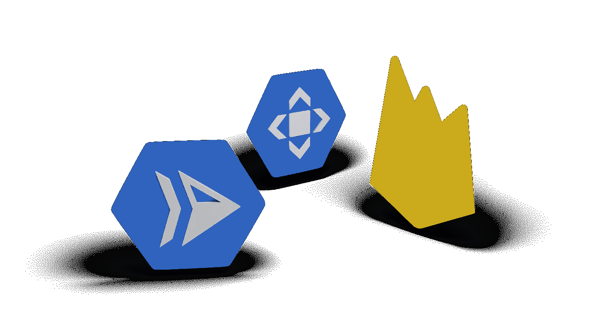
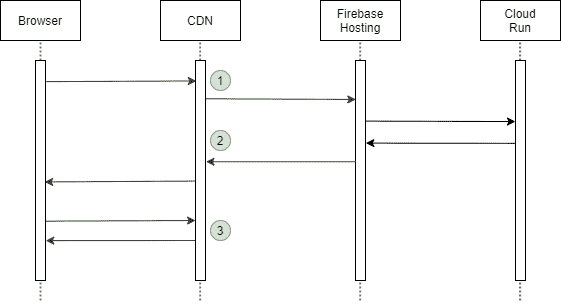

# Firebase 托管和云运行缓存

> 原文：<https://medium.com/google-cloud/firebase-hosting-and-cloud-run-cache-38afa6bd4beb?source=collection_archive---------0----------------------->



我们可以使用 Firebase 托管来托管一个网站。在已部署的站点中，我们可以指定一些或所有所需的 URL 路径可以定向到云运行进行处理。这允许我们通过运行在容器中的应用程序生成动态的服务器端呈现内容。Firebase 托管也与谷歌的内容交付网络(CDN)有着内在的联系，以提供高效的边缘缓存。当一个浏览器请求到达 Google 时，CDN 会被查询以确定内容是否可以从边缘提供。如果在缓存中不可用，那么请求将被路由到 Firebase 进行处理。CDN 的使用可以显著降低延迟并提高整体性能。

除了静态内容之外，默认情况下，服务器端生成的内容也会被缓存。这可能正是你想要的，但也可能是不可取的。想象一个简单的服务器端呈现页面，它生成带有当前日期/时间的内容。

```
It is now 10:51pm.
```

在服务器端代码中，这可以使用以下代码生成:

```
res.send(`It is now ${new Date().toString()}`);
```

浏览器第一次请求页面时，在 CDN 中找不到它，云运行代码执行来构建 HTML。然后，内容将被缓存在 CDN 中，后续调用将从缓存中返回它。这意味着数据不会改变，我们将停留在单个响应上，时间不会更新。



1.  浏览器请求到达 CDN，没有缓存任何内容。然后，该请求被发送到 Firebase 主机，该主机路由到云运行以生成内容。
2.  响应被写入 CDN 进行缓存。
3.  稍后浏览器对同一 URL 的请求直接由 CDN 提供。未向云运行发出任何请求。

我们有一个强大的技术来控制如何管理缓存。当来自云运行的 HTTP 响应被返回时，它可以包括附加的 HTTP 头。一个这样的标题被称为“高速缓存控制”。浏览器和 Google CDN 都认可返回的值。您应该参考关于缓存控制的文档以获得完整的细节。我们可以用来配置与 CDN 的响应交互的一些值包括:

```
Cache-Control: no-store
```

这个声明说数据不应该被缓存。具体来说，当它从云运行返回时，它不会被 CDN 缓存。这意味着对云运行生成的数据的每个请求都将导致云运行逻辑被重新执行，以构建新的当前响应。

如果我们希望利用 CDN 缓存，我们可以指定:

```
Cache-Control: public,s-maxage=30
```

“s-maxage”属性定义了存储缓存值的持续时间(秒)。经过此时间间隔后，缓存的值将被丢弃。

这个 HTTP 头可以从您实现的云运行容器实现中返回。因为您可以用任何语言实现这些容器，所以您可以选择 recipe 来显式地设置特定于语言的实现中的头部。例如，在 NodeJS 中，我们可以编写:

```
res.set('Cache-Control', 'no-store');
res.send('… My generated HTML …');
```

这种显式编码方法并不是我们控制 CDN 和云运行交互的唯一方式。当我们为 Firebase hosting 部署解决方案时，我们提供一个名为 firebase.json 的配置文件。Firebase hosting 的一个特性是能够根据 URL 模式匹配在传入请求或传出响应中注入标头。使用这个特性，我们可以指定从云运行容器调用返回的“Cache-Control”HTTP 头的值，而不必在我们的实现逻辑中显式编码 Cache-Control。

假设我们有一个名为“/mycontent”的 URL 路径。现在让我们假设我们希望这个页面通过云运行在服务器端呈现，而不是缓存。我们如何做到这一点？

我们可以实现一个 NodeJS 应用程序来监听这个 URL:

```
app.get('/mycontent', (req, res) => {
  res.send(`
<html>
  <head>
  </head>
  <body>
    <p>Hello from Cloud Run (/mycontent): ${new Date().toString()}</p>
  </body>
</html>
`);
});
```

请注意，它不包含任何显式缓存控件。当我们将它部署到云运行时，我们给它一个逻辑服务名。在我们的例子中，我们称之为“mycontent”。在 Firebase 托管 firebase.json 配置文件中，我们现在可以提供从所需路径到云运行服务的映射。我们还将指定要返回的“Cache-Control”头:

```
{
  "hosting": {
    "rewrites": [{
      "source": "/mycontent",
      "run": {
        "serviceId": "mycontent",
        "region": "us-central1"
      }
    }]
    "headers": [{
      "source": "/mycontent",
      "headers": [{
        "key": "Cache-Control",
        "value": "no-store"
      }]
    }]
  }
}
```

解释上述内容的方法是，对于从“/mycontent”接收的请求，将请求传递给部署在“us-central1”中的名为“mycontent”的云运行服务。此外，对于来自逻辑路径“/mycontent”的任何响应，将“Cache-Control”头的值设置为“no-store”。

关于这个故事的更多视频可以在这里找到:

参考资料:

*   [管理缓存行为](https://firebase.google.com/docs/hosting/manage-cache)
*   [MDN —缓存控制](https://developer.mozilla.org/en-US/docs/Web/HTTP/Headers/Cache-Control)
*   博客:[通过云 CDN 和负载平衡实现混合部署](https://cloud.google.com/blog/products/networking/enabling-hybrid-deployments-with-cloud-cdn-and-load-balancing)2020–07