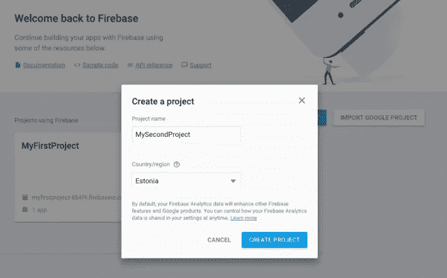
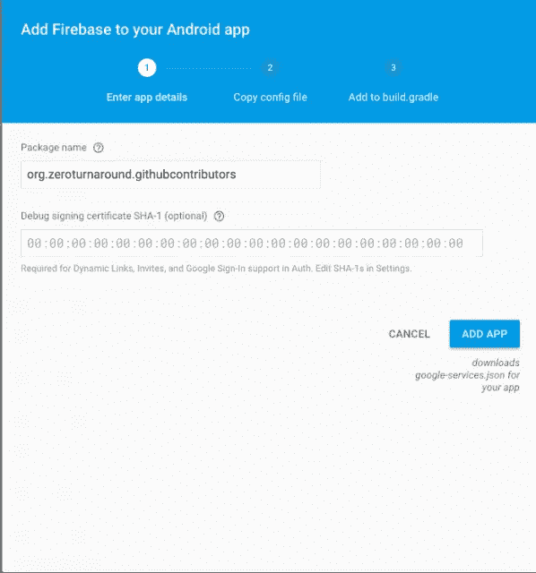
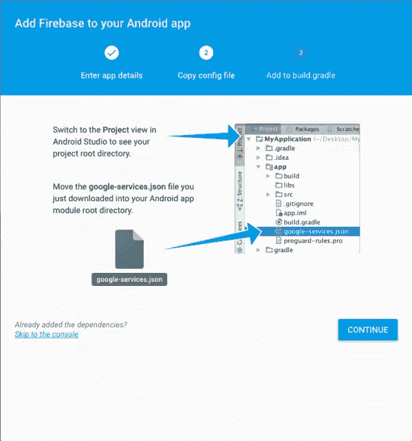
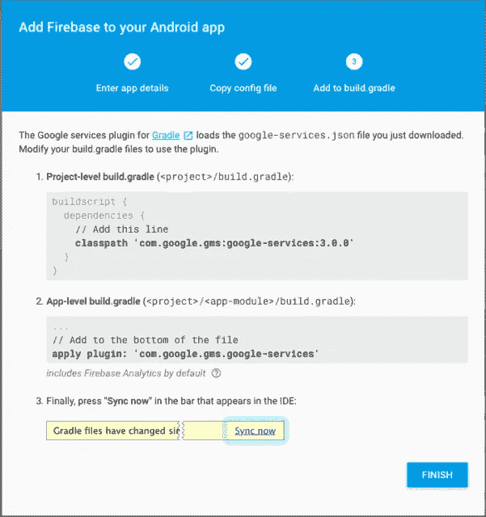
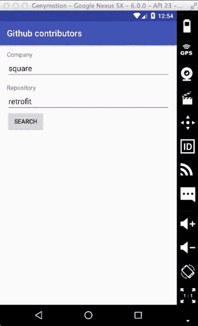

# Android 应用的 Firebase 平台

> 原文：<https://medium.com/google-cloud/firebase-platform-for-android-applications-3cf170d1a019?source=collection_archive---------1----------------------->

这篇文章最初是由 [JRebel for Android](https://www.youtube.com/watch?v=3H6tM-Gw7GU) 的产品负责人[斯登冲锋枪](http://twitter.com/stensuitsev)在 RebelLabs 上发表的。

设计 Android 应用程序是一项令人着迷的任务。除了设计应用程序组件的交互方式，你还需要考虑任何应用程序需要的通用功能。通常，这包括跨功能的需求，如日志记录、管理用户和凭证、指标和分析等。因为你不能总是在设备上存储所有必要的数据，你需要考虑某种后端服务。

然而，当您刚刚开始一个项目时，您可能不愿意从头开始构建后端服务。你应该考虑的一个选择是 Firebase。这是一个平台，包含许多常见功能，并提供通知、文件存储、分析、远程配置等功能。目前，它有 11 项服务可以帮助你开发、发展和从你的应用中赚钱。

在这篇 Android 上的 Firebase 入门文章中，我将带你建立一个 Android 项目来使用 [Firebase 平台](https://www.firebase.com/)。我们让我们的项目实现其应用程序分析，并将事件发送到 Firebase 控制台。

# 如何注册项目

首先要做的是在 Firebase 控制台中创建一个项目。它需要一个名字和一个国家。国家选择将不会决定你的数据将被保存在哪里，而是指定你的公司所属的国家，影响货币等。例如，如果你选择英国，对话框会发出咯咯的笑声，并提供一个不断下跌的英镑作为默认选项。

您可以将多个 iOS、Android 或 web 应用程序添加到单个项目中。该项目将从不同的应用程序把你所有的统计数据和指标结合在一起。您将在项目控制面板的一个视图中看到关于用户、崩溃报告事件的所有数据。



# 添加 Android 应用程序

出于本文的目的，我将使用我们常规的示例应用程序 [Retrofit2SampleApp](https://github.com/sten711/Retrofit2SampleApp) 。如果你不熟悉它，这个应用程序非常小，是为[开始改造 2 帖子](https://zeroturnaround.com/rebellabs/getting-started-with-retrofit-2/)而创建的。这篇博文教你如何从你的 Android 应用程序中查询互联网，看看吧！然而，现在是时候添加向 Firebase 仪表板发送指标的功能了。

首先，我们需要配置我们的 Firebase 项目，以了解我们的应用程序。为此，您首先需要提供包名。这在 build.gradle 中作为**应用程序 Id** 属性提供。您可以选择添加调试密钥库的签名证书的 SHA-1。在这篇文章的范围内不需要它，但是我提到它是为了以防你需要使用它。谷歌有一个很好的快速指南，告诉你如何去做。



一旦我们将应用程序添加到 Firebase 项目中，它将生成一个 Google-services . JSON 文件，该文件将被复制到您的应用程序模块的根目录中。快速浏览一下就可以看到大量的项目元数据——比如 api 键、项目 id 等等。这种方法非常优雅，它将您从必须在代码中手动提供所有数据的麻烦中解脱出来。



# 指定 Firebase 依赖项

Firebase 在将服务分成不同的库方面做得很好。没有必要在项目中包含任何不必要的代码。这里是可供你使用的 Firebase 库的完整列表。

让我们转到项目的 build.gradle，添加以下几行:

```
buildscript {
    // ...
    dependencies {
        // ...
        classpath 'com.google.gms:google-services:3.0.0'
    }
}
```

我们需要将以下 Firebase 依赖项添加到应用程序的 build.gradle 文件中:

```
dependencies {
  // ...
  compile 'com.google.firebase:firebase-core:9.0.2'
}
```

并应用插件:

```
apply plugin: 'com.google.gms.google-services'
```



就是这样！我们已经准备好利用 Firebase 平台来处理我们的分析数据。

# 如何发送 Firebase analytics 事件

发送分析事件非常简单。在代码级别，我们需要做的就是获取 FirebaseAnalytics 的一个实例，创建一个包含我们想要记录的属性的键值对的包，并调用 logEvent()方法。

在我们仅查询 Github 存储库元数据的示例应用程序中，我将使用用户指定的搜索查询来触发分析事件。

Firebase 为我们提供了大量的事件和属性键。事件和 FirebaseAnalytics。参数类。如果这些不能完全解决您的问题，您可以创建自己的自定义事件。

在我的示例应用程序中，我使用以下代码片段来发送我的搜索查询关键字:

```
Bundle bundle = new Bundle();
bundle.putString(FirebaseAnalytics.Param.SEARCH_TERM, repositorySearchKeyword + "&" + companySearchKeyword);
firebaseAnalytics.logEvent(FirebaseAnalytics.Event.SEARCH, bundle);
```

为了验证我们的结果，我们可以检查 Firebase 控制台进行分析，但这将需要 24 小时才能显示事件。因为这在开发和调试期间不太方便，所以这里有另一个选项来验证是否记录了正确的指标。

运行以下 adb 命令:

```
adb shell setprop log.tag.FA VERBOSE
adb shell setprop log.tag.FA-SVC VERBOSE
adb logcat -v time -s FA FA-SVC
```

现在，在运行 adb 命令并单击“搜索”按钮后。



我现在在 adb logcat 中看到以下输出:

```
06-28 11:26:06.630 V/FA-SVC  ( 1734): Event recorded: Event{appId='org.zeroturnaround.githubcontributors', name='search', params=Bundle[{search_term=retrofit&square, _o=app}]}
```

现在，您可以使用 analytics events 检测应用程序中的所有基本操作，并准确了解您的用户正在做什么、他们最常使用的操作以及您应该将开发工作的重点放在哪里。

# 摘要

在这篇文章中，我试图给你一个如何开始使用 Firebase 的快速总结。我发现它非常容易设置和开始编写代码。我强烈建议看看 Firebase 提供的不同服务。我最感兴趣的两个服务是 Firebase 云数据库和远程通知服务。我很想听听哪个 Firebase 特性最让你感兴趣。你在你的项目中看到了什么，你认为哪些部分更容易实现？在 Twitter 上 Ping 我: [@stensuitsev](https://twitter.com/stensuitsev) ，我会很高兴和你谈论这件事。

此外，如果你想成为一名更快乐的 Android 开发者，请查看用于 Android 的 [JRebel，这是一款可以即时更新你正在运行的应用](https://zeroturnaround.com/software/jrebel-for-android/?utm_source=medium&utm_medium=firebase-post&utm_campaign=medium)的代码和资源的工具。我参与了它的开发，所以我欢迎任何反馈！

现在回到燃烧基地。你是决定构建自己的后端服务还是开始使用 Firebase 是一个重要的**商业**决定。Firebase 具有灵活的定价，可以帮助您在早期阶段快速原型化和测试您的产品。