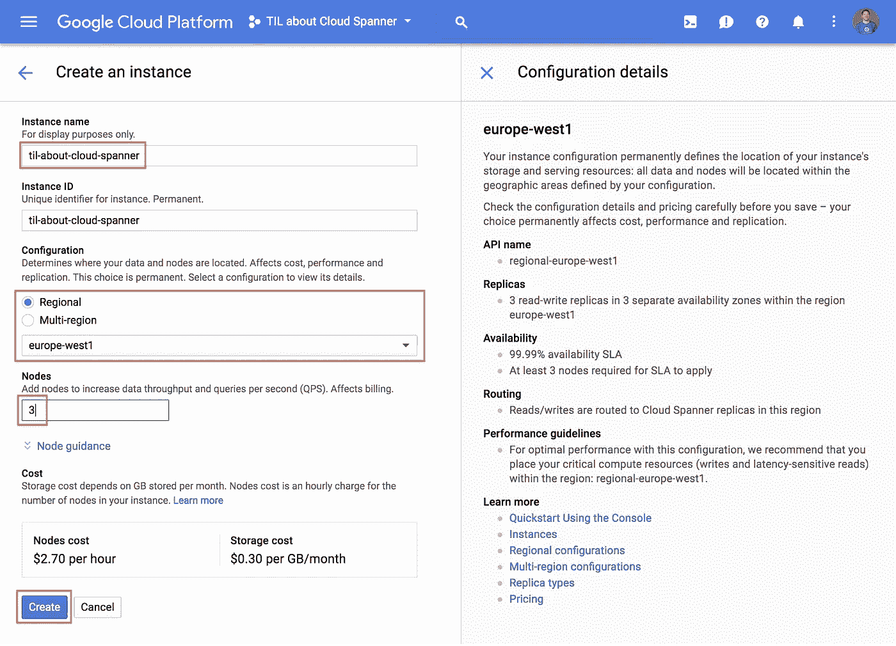
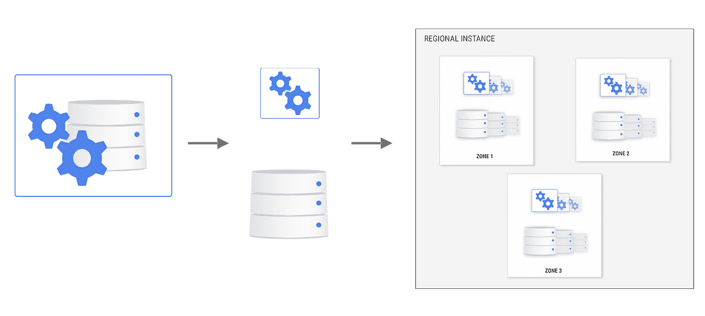
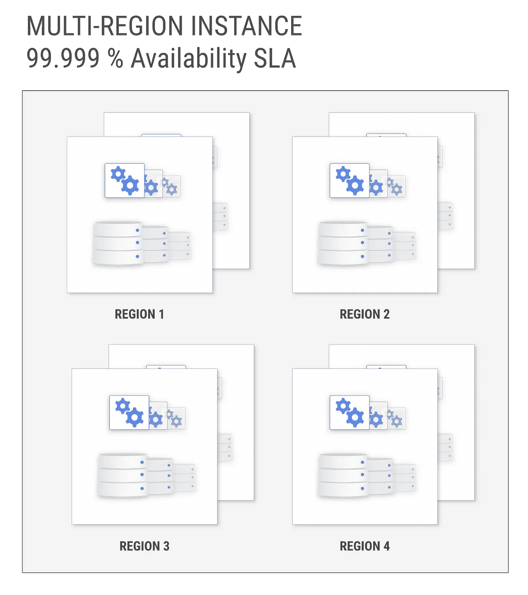
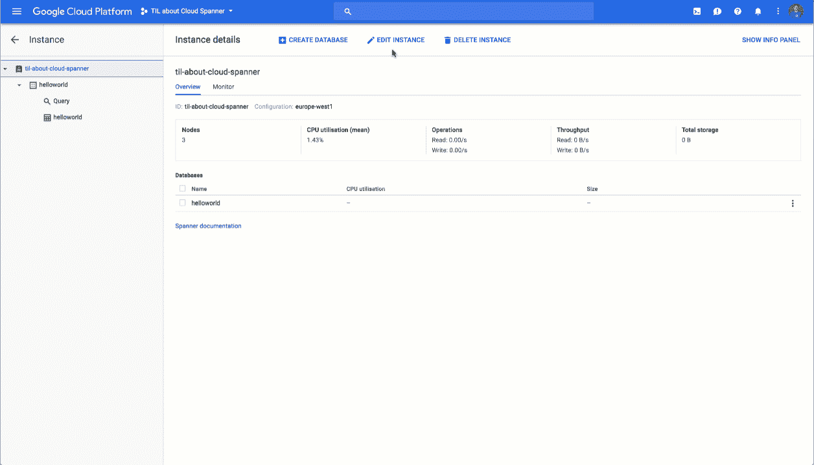
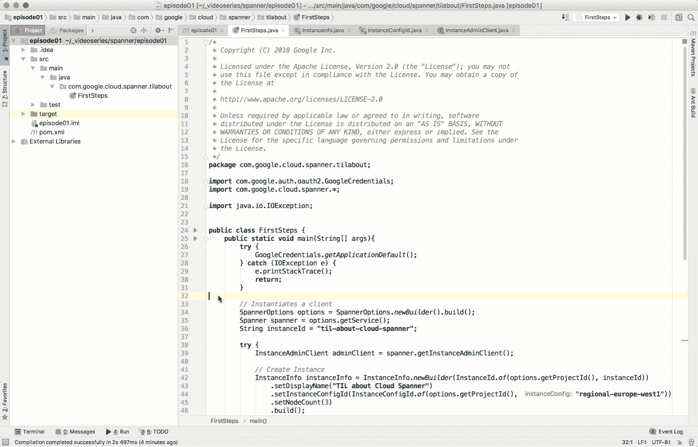
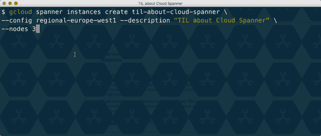
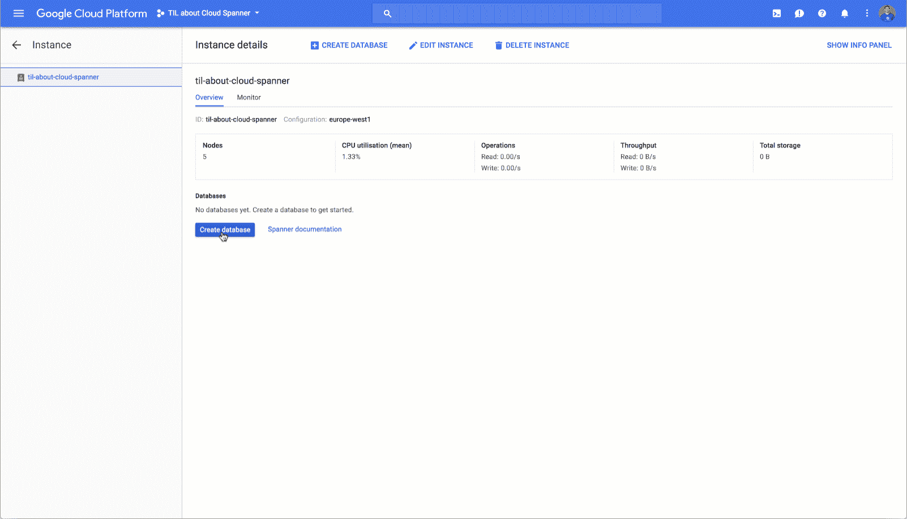
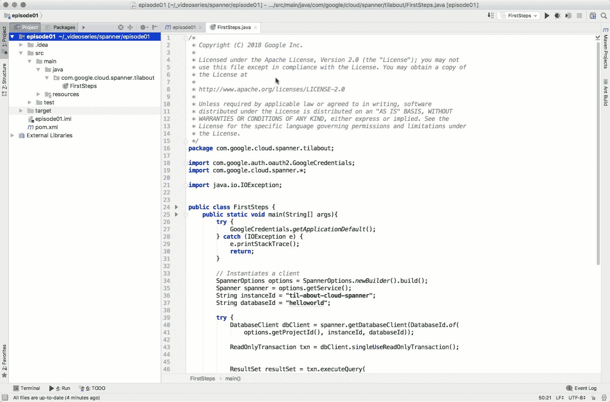
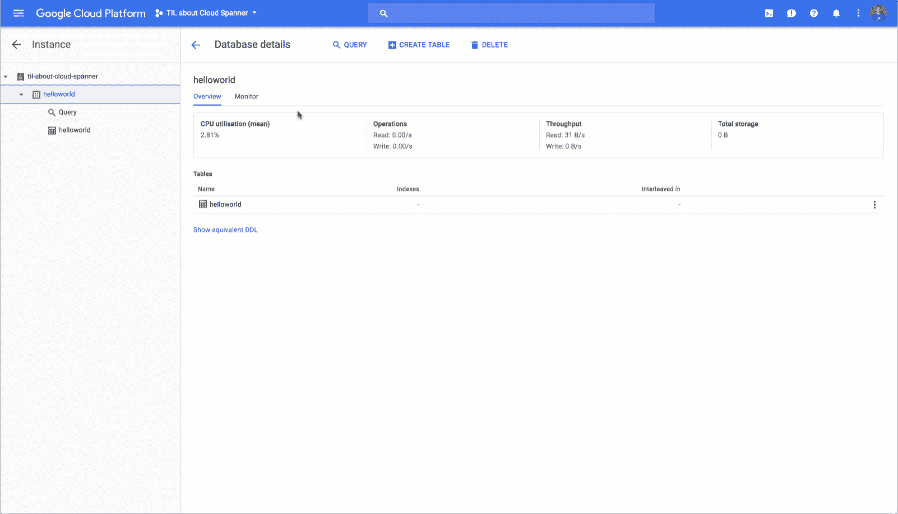

# 使用谷歌云扳手的第一步

> 原文：<https://medium.com/google-cloud/first-steps-with-google-cloud-spanner-e9a135ded285?source=collection_archive---------0----------------------->

建立和管理分布式数据库以获得更好的可伸缩性和高可用性是很困难的，并且会导致许多操作上的麻烦。通常，您必须在可伸缩性和一致性之间做出选择，但是设置的方便性和可管理性也是需要考虑的重要因素。Google Cloud Spanner 结合了 NoSQL 数据库的可伸缩性和传统关系 SQL 数据库的质量，包括模式、ACID(原子性、一致性、隔离性、持久性)、行和表的一致性以及即席查询。这篇文章向你展示了如何开始使用谷歌云扳手。

忙到没时间看书？查看上面的视频以了解总结。

# 创建实例

在谷歌云控制台搜索 Spanner，点击创建实例，你会在一个屏幕中找到设置实例所需的一切。

您只需命名实例，选择一个配置，并指定需要多少个节点。搞定了。几秒钟之内，您就可以拥有自己的实例来创建数据库和加载数据。

但是等等！刚刚发生了什么？让我们在这里花一点时间来讨论选择哪种配置以及选择多少个节点。

在 Cloud Spanner 中，计算节点和存储是分开的，可以独立扩展。此外，您的节点和数据跨多个区域甚至地区进行复制，以实现高可用性。

选择配置时，您可以选择特定位置的区域实例或多区域实例。在区域配置中，您的实例的计算和存储在一个区域内的三个分区中分布和复制，例如“欧洲-西方 1”或“美国-中心 1”，确保您的数据在硬件维护、软件补丁甚至整个分区出现故障时保持可用和一致。如果您需要更高的可用性保证和来自不同位置的更好的读取性能，您可以选择多区域配置之一，该配置将您的实例分布到全球最多四个区域。使用这种配置，即使整个区域变得不可用，您的数据库仍将从所有其他区域正常工作。让您的数据在多个区域可用还可以加快从这些区域的读取速度。

最棒的是，您不必担心设置自己的复制或故障转移实例；这一切都是完全为你管理的一个设置。

# 缩放实例

对于您为实例请求的每个节点，您将获得所有分区和区域中的计算资源，具体取决于您选择的配置。不需要对预先提供多少资源进行困难的规划和预测。您可以根据需要随时更改实例节点的数量。

很容易扩展您的云扳手实例！

如果你更喜欢你的键盘而不是你的指点设备，你可以从命令行或者使用 Cloud Spanner 客户端库来完成所有这些，这些客户端库有很多语言版本。

# 创建数据库和模式

现在您的实例已经启动并运行，让我们继续创建一个数据库和模式。两者同时做是个好主意。Cloud Spanner 中的模式就像任何其他关系数据库中的模式一样——表中的列是强类型的。如果将来需要添加表或索引或删除列，您可以这样做，而不会导致任何停机。Cloud Spanner 在长时间运行的事务中运行您的模式更改。但是请记住，根据您执行的各个语句的不同，模式更改的范围可以从添加新列的几分钟到大型数据库上回填索引的几个小时。

# 读取和写入数据

一旦创建了数据库，就可以使用客户端库来读写数据。Cloud Spanner 说的是 SQL，可以让你利用现有的技能和传统关系数据库的知识。如果您需要快速运行查询或检查、更新或删除某些记录，您可以直接从云控制台完成。

# 后续步骤

点击查看代码示例[。要了解关于 Google Cloud Spanner 的更多信息，请关注下一篇文章，它将讨论为快速和可伸缩的读写选择正确的主键。查看我们的](https://goo.gl/Jcq63p)[文档](https://cloud.google.com/spanner/docs/)和[入门指南](https://cloud.google.com/spanner/docs/tutorials)。