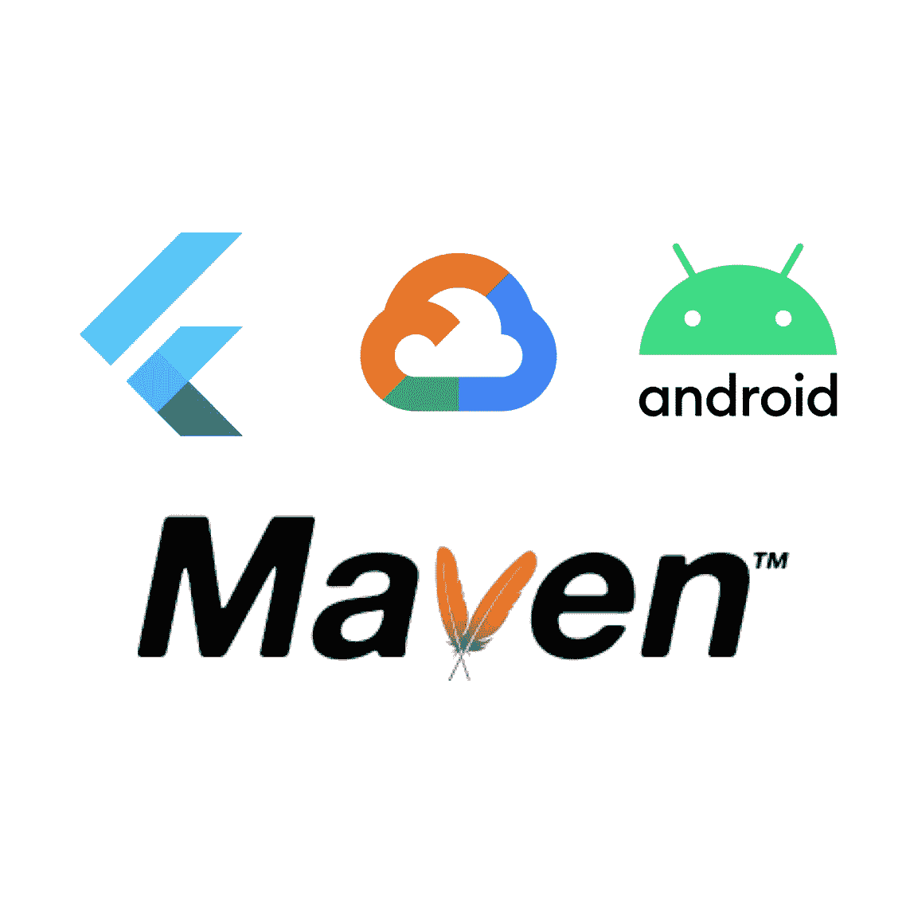

# 颤振 AAR:部署到 Maven 和 GCP 工件注册

> 原文：<https://medium.com/google-cloud/flutter-aar-deploy-to-maven-and-gcp-artifact-registry-d107adebec4d?source=collection_archive---------1----------------------->


随着 Flutter 团队的官方支持，将 Flutter 添加到现有应用程序中的做法越来越多。

然而，管理版本和轻松集成目前并不容易，尤其是如果您与一个团队或多个工作站一起工作。

在 Android 上，您可以添加本地构建的 Maven 存储库，也可以直接添加源代码，这两种方式都不容易分发给您的团队。因此，每个 Android 开发者都必须安装你的 Flutter 库，并为他/她自己构建 AAR 或源代码，这也需要到处安装 Flutter SDK。

在本教程中，我将向您展示如何为您的 CI/CD 流程实现一个简单的工作流，将 Flutter AAR 发布到您的 Maven 资源库或 GCP 工件注册中心，这使得实现您的 Flutter 模块的工作流更加简化。

# 先决条件

我已经假设你知道如何[将 Flutter 添加到现有应用](https://flutter.dev/docs/development/add-to-app)中，并安装最新版本的 M [aven](https://maven.apache.org/download.cgi) 。
所需的最低版本是`3.3.1`，因为这增加了对扩展的支持。使用`mvn --version`检查您的版本

如果你想使用 GCP 工件注册中心，你还必须安装最新版本的 [Google Cloud SDK](https://cloud.google.com/sdk/install) ，已经在这里申请访问封闭的 alpha [，并使用`gcloud auth login`或服务帐户登录。所需的范围是“工件注册管理”](https://cloud.google.com/artifact-registry/docs/java/quickstart)

# 构建本地 Maven 存储库

您可以像往常一样构建 AAR，只有一点例外:

正常情况下，使用的版本号总是`1.0`，但是最近在`stable`频道中实现了对添加构建号的支持。您希望像这样构建您的 AAR:

```
flutter build aar --build-number **x.x.x**
```

这个内部版本号随后在 Maven 中被用来跟踪版本历史，例如`1.7.5`。每当你更新你的代码库的时候增加它。

该命令在`path_to_your_app/build`中创建了一个本地 Maven 存储库。我们的目标是将它上传到我们的远程 Maven 仓库，但是这并不像抓取`.aar`并上传那么简单。

如果你使用*任何*插件，Flutter 将为上面定义的构建号的插件创建一个单独的 AAR，它们之间唯一的链接是`.pom`文件。我们必须将每个 AAR 分别上传到 Maven。

# 上传到我们的远程 Maven 仓库

## 与 GCP 神器登记处:

如果您想使用您的 Maven 资源库而不是 GCP 工件注册中心，您可以跳到“使用任何 Maven 资源库”这一步。

**配置 gcloud**

你必须在你的 GCP 项目中创建一个 M **aven** 库:[https://console.cloud.google.com/artifacts/create-repo](https://console.cloud.google.com/artifacts/create-repo)
你可以选择适合你的位置。

现在我们必须配置`gcloud`来使用您创建的存储库:

```
gcloud beta artifacts print-settings mvn --project=PROJECT-ID --repository=REPOSITORY-NAME --location=YOUR-REGION
```

**启用 GCP 工件注册表 Maven 扩展**

要在 Maven 中使用 GCP 工件注册中心，我们必须添加一个处理定制存储库链接的扩展:

在你的工作目录`path_to_your_app/build`中添加一个子目录`.mvn`

```
mkdir .mvn
```

在这个子目录中添加一个名为`extensions.xml`的文件:

```
<extensions ae lh" href="http://maven.apache.org/EXTENSIONS/1.0.0\" rel="noopener ugc nofollow" target="_blank">http://maven.apache.org/EXTENSIONS/1.0.0" xmlns:xsi="[http://www.w3.org/2001/XMLSchema-instance](http://www.w3.org/2001/XMLSchema-instance\)"
  xsi:schemaLocation="[http://maven.apache.org/EXTENSIONS/1.0.0](http://maven.apache.org/EXTENSIONS/1.0.0) [http://maven.apache.org/xsd/core-extensions-1.0.0.xsd](http://maven.apache.org/xsd/core-extensions-1.0.0.xsd\)">
      <extension>
        <groupId>com.google.cloud.artifactregistry</groupId>
        <artifactId>artifactregistry-maven-wagon</artifactId>
        <version>2.0.1</version>
      </extension>
</extensions>
```

**使用这些 Maven 配置设置**

这就是 GCP 工件注册设置。现在，您可以使用这些设置(替换占位符)继续常规实现:

*   `-DrepositoryId="cloud-artifacts"`
*   `-Durl="artifactregistry://**REGION**-maven.pkg.dev/**PROJECT-ID**/**REPOSITORY-NAME**`

## 对于任何 Maven 存储库:

现在我们必须获取工作目录`path_to_your_app/build`中的每个`.pom`文件，并推送它，包括链接的 AAR，我们的远程 Maven 库。

找到并列出我们运行的所有`.pom`文件

```
find . -name "*.pom" -type f
```

现在我们必须对每个 pom 文件执行一个 Maven 命令，同样用以`.aar`结尾的`.pom`文件替换要上传的文件。

部署命令如下所示:

```
find . -name "*.pom" -type f -exec sh -c 'mvn deploy:deploy-file -DrepositoryId="**REPOSITORY-ID**" -Durl="**REPOSITORY-URL**" -DpomFile="$0" -Dfile="${0%.pom}.aar"' '{}' \;
```

确保用您的配置替换`REPOSITORY-ID`和`REPOSITORY-URL`。

**就是这样！现在，您的整个 Flutter AAR Maven 存储库都可以在您的 Maven 远程主机上获得了！**

# 将 GCP 工件注册表 Maven 库添加到 Gradle

现在，将 Maven 存储库添加到我们现有的 Android 应用程序中，并解决我们新的依赖关系是非常简单的！

*注意:要使用此步骤，必须安装 Google Cloud SDK，并且用户必须通过验证，拥有前提条件中提到的正确访问权限。*

将以下代码片段添加到您的**项目** `build.gradle`:

```
plugins **{** id "com.google.cloud.artifactregistry.gradle-plugin" version "2.0.1" **}**
```

现在您可以在您的**应用程序** `build.gradle`中使用 GCP 工件注册表:

```
apply plugin: 'com.google.cloud.artifactregistry.gradle-plugin'[...]repositories {
    [...]
    maven {
        url "artifactregistry://**REGION**-maven.pkg.dev/**PROJECT-ID**/**REPOSITORY-NAME**"
    }
}dependencies {debugImplementation '**com.your.package**:flutter_debug:+'releaseImplementation '**com.your.package**:flutter_release:+'profileImplementation '**com.your.package**:flutter_profile:+'
    [...]
}
```

如果您想使用您的 maven 存储库，只需用您的 URL 替换即可。

如果你不想总是使用你的最新版本，你也可以使用你的版本号来代替`+`。

