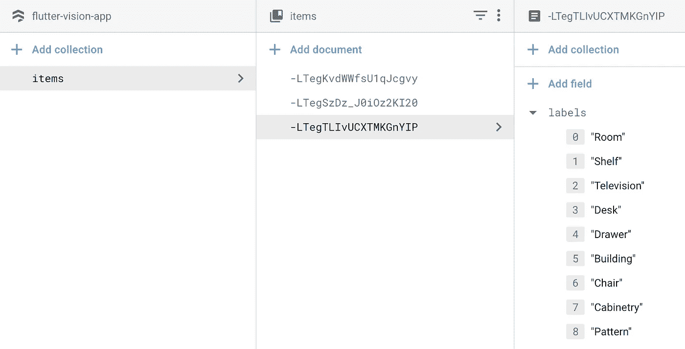
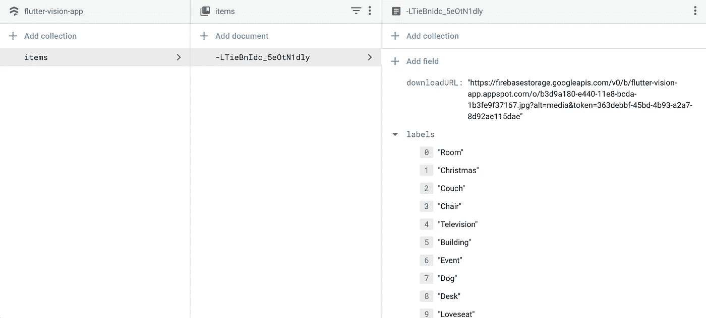

# Flutter Vision—Flutter+Firebase ML Vision+Firebase Cloud Firestore

> 原文：<https://medium.com/google-cloud/flutter-vision-flutter-firebase-ml-vision-firebase-cloud-firestore-76f3794f5d38?source=collection_archive---------0----------------------->


我曾经是一个代码迷，发布了许多开发平台，如 Cordova(和相关的应用程序框架，如 Ionic)以及 Xamarin。我一直在关注谷歌的加入。[最近](https://developers.googleblog.com/2018/12/flutter-10-googles-portable-ui-toolkit.html)他们发布了 1.0 版本，我决定尝试一下。由于 Flutter 应用程序是用 Dart 编写的(对此我没有什么经验)，我有点担心，但我被谷歌的声明所鼓舞:

> 你不需要以前的 Dart 或移动编程经验。

考虑到这一点，我决定用 Ionic+Firebase+Google Cloud Vision 重新开发一个应用程序。如果你想看看，可以找到[教程](/google-cloud/ionic-3-google-cloud-vision-firebase-78ea68cfbea8)和[源代码](https://github.com/cbetz/my-stuff)。

在本教程中，我们将构建一个应用程序，它可以拍摄物品的照片，使用 ML Vision 来标记物品，并将图像和标签保存到 Firebase Cloud Firestore 和存储中。如果你想跳到源代码，可以在这里找到。这是成品的视频:

开始了。我遵循了为 MacOS 提供的安装说明[。虽然不像 brew 或 npm 安装那么容易，但我轻松地完成了。确保运行 **flutter doctor** 并按照说明安装任何缺失的依赖项。](https://flutter.io/docs/get-started/install/macos)

我选择的编辑器是 VS Code，幸运的是它有 Flutter 和 Dart 插件[可用](https://flutter.io/docs/get-started/editor?tab=vscode#vscode)。运行 **Flutter:运行 Flutter Doctor** 提示我指向安装我的 Flutter SDK 的位置，然后我就可以开始编写我的应用程序了！

第一步是使用这里列出的[方便的 VS 代码命令创建一个新项目。几秒钟后，项目安装完成，包括 iOS 和 Android 平台的特定文件。根据我使用 Cordova 的经验，我发现这非常令人惊讶，因为添加单个平台是一个独立的(有时很长)过程。](https://flutter.io/docs/get-started/test-drive?tab=vscode)

此时，我们已经准备好运行应用程序。此时我没有运行任何模拟器(iOS)或仿真器(Android ),所以我在 VS 代码状态栏中点击 **No Devices** ,然后点击 iOS device，这将自动启动一个 iPhone XR 模拟器。回到 VS 代码，我点击 F5，16.2 秒后，应用程序在模拟器上以调试模式运行。快！按照[教程](https://flutter.io/docs/get-started/test-drive?tab=vscode)我修改了文本并保存 main.dart，这开始了一次热重装。1.5 秒后，我在屏幕上看到了下一条文本。快！

和我之前的 app 和[教程](/google-cloud/ionic-3-google-cloud-vision-firebase-78ea68cfbea8)一样，Flutter Vision 要拍摄一个物品的照片，在设备上使用 ML Kit for Firebase 对照片进行分析，然后将数据存储在 Firebase Cloud Firestore 中。

首先，我们需要能够在用户拍照后调用相机并保存图像文件。[摄像头插件](https://pub.dartlang.org/packages/camera)的安装说明是[这里是](https://pub.dartlang.org/packages/camera#-installing-tab-)。请务必在此处进行[概述的平台特定更改。在看了一个简单的](https://pub.dartlang.org/packages/camera#-readme-tab-)[示例](https://github.com/flutter/plugins/tree/master/packages/camera#example)和一个更复杂的[示例](https://github.com/flutter/plugins/blob/master/packages/camera/example/lib/main.dart)后，我更新了我的应用程序，只显示了一个相机预览和一个拍照按钮。拍照后，文件名和路径会通过一个图标显示出来。粘贴在这里有点长，所以查看一下[要点](https://gist.github.com/cbetz/d7a41873ee2b1c349221223b7d95a572)获取出处。最好用实际设备测试，因为我们使用的是摄像头。将一个设备连接到你的机器上，你应该会在 VS 代码的状态栏中看到它。按 F5 键启动构建和调试会话。注意:我被提示在 Xcode 中选择一个团队——选择一个之后，我就让应用程序在我的手机上运行了。第一步完成！

接下来，我们需要一个使用 Firebase ML 套件的方法。快速搜索后，我看到谷歌有 Firebase Flutter 插件— [FlutterFire](https://github.com/flutter/plugins/blob/master/FlutterFire.md) ！要使用 Firebase 服务，我们需要首先创建一个 Firebase 项目。这里有一个很棒的教程解释了如何做到这一点。接下来，我们需要严格遵循概述的[步骤](https://codelabs.developers.google.com/codelabs/flutter-firebase/#6)来处理特定于平台的配置。现在我们已经有了一个 Firebase 项目并设置了我们的平台，我们可以开始使用 Firebase ML 工具包了。让我们按照[安装说明](https://pub.dartlang.org/packages/firebase_ml_vision#-installing-tab-)将 ML 工具包添加到我们的应用程序中。为了快速测试，让我们创建一个函数来处理标签检测，并遍历 ML Vision 返回的标签列表，并将它们显示给用户。稍后我们会让它变得更有用。

```
Future<void> detectLabels() async {final FirebaseVisionImage visionImage = FirebaseVisionImage.fromFilePath(imagePath);final LabelDetector labelDetector = FirebaseVision.instance.labelDetector();final List<Label> labels = await labelDetector.detectInImage(visionImage);for (Label label in labels) { final String text = label.label; _scaffoldKey.currentState.showSnackBar(SnackBar(content: Text(text)));}}
```

变化的全部要点[在这里](https://gist.github.com/cbetz/9303f3179098a3fdd998765fdc4ecbc0)。让我们点击 F5 再次启动应用程序。有用！观看它的实际应用:

接下来，我们将把图像和标签数据保存到 Firestore。上次我们使用了 Firebase 的实时数据库——从那时起，Firebase 发布了 Firestore，这是一个功能丰富的 NoSQL 数据库。要设置 Firestore 数据库，请遵循此处的说明，选择**测试模式**进行开发/测试。请记住，这为您留下了很大的空间，因此在投入生产之前，请确保使用安全规则将其锁定。回到代码——Flutter 有一个可用的插件[这里](https://github.com/flutter/plugins/tree/master/packages/cloud_firestore)我们将[安装](https://pub.dartlang.org/packages/cloud_firestore#-installing-tab-)。接下来，在我们拍摄照片并对其进行分析之后，让我们将其存储为一个*文档*，我们将称之为一个**项目**。多个文档将被组织成一个*集合*，我们称之为**条目**。创建一个函数，该函数将创建一个新的**项目**:

```
Future<void> _addItem(List<String> labels) async {await Firestore.instance.collection('items').add(<String, dynamic> {'labels': labels});}
```

然后更改我们的标签检测过程，调用这个新函数:

```
Future<void> detectLabels() async {final FirebaseVisionImage visionImage = FirebaseVisionImage.fromFilePath(imagePath);final LabelDetector labelDetector = FirebaseVision.instance.labelDetector();final List<Label> labels = await labelDetector.detectInImage(visionImage);List<String> labelTexts = new List();for (Label label in labels) { final String text = label.label; labelTexts.add(text);}_addItem(labelTexts);}
```

现在，当我们拍照时，我们可以看到收藏中的物品以极快的速度增加。明确地说，这是拍摄一张照片，使用 ML Vision 分析照片的标签，然后将其保存到云数据库。说真的，这是令人难以置信的*快*:



现在我们需要存储我们的图像。在之前的应用中，我们对图像数据进行了 base64 编码，并将其直接存储在 Firebase 的实时数据库中。由于数据类型限制，我们将无法在云 Firestore 中存储图像数据。别担心，我们会将图像文件存储在 Firebase 存储中，然后使用 [Firebase 存储插件](https://pub.dartlang.org/packages/firebase_storage#-installing-tab-)获取 URL 并存储在**项目**文档中。这是我们处理上传的函数。它上传文件，然后等待 StorageUploadTask 并获取 downloadURL:

```
Future<String> _uploadFile(filename) async { final File file = File(imagePath); final StorageReference ref = FirebaseStorage.instance.ref().child('$filename.jpg'); final StorageUploadTask uploadTask = ref.putFile(file, StorageMetadata(contentLanguage: 'en')); final downloadURL = await (await uploadTask.onComplete).ref.getDownloadURL(); return downloadURL.toString();}
```

更新 our _addItem 函数以保存 URL:

```
Future<void> _addItem(String downloadURL, List<String> labels) async {await Firestore.instance.collection('items').add(<String, dynamic> {'downloadURL': downloadURL,'labels': labels});}
```

我们需要一个唯一的 URL，所以我们将使用方便的 uuid 包，如[示例](https://github.com/flutter/plugins/blob/master/packages/firebase_storage/example/lib/main.dart):

```
Future<void> detectLabels() async {final FirebaseVisionImage visionImage = FirebaseVisionImage.fromFilePath(imagePath);final LabelDetector labelDetector = FirebaseVision.instance.labelDetector();final List<Label> labels = await labelDetector.detectInImage(visionImage);List<String> labelTexts = new List();for (Label label in labels) { final String text = label.label; labelTexts.add(text);}final String uuid = Uuid().v1();final String downloadURL = await _uploadFile(uuid);_addItem(downloadURL, labelTexts);}
```

F5 再次尝试:



此时，我们的图像和数据存储在 Firebase 中。接下来，我们需要向用户显示带有标签的图像列表。我们将重组我们的应用程序，使其有两个屏幕:一个负责向用户显示图像和标签列表；另一个拍摄照片并启动 ML 视觉过程。让我们创建一个新的屏幕， **ItemListScreen** ，来显示卡片列表。我将修改示例[这里的](https://github.com/flutter/plugins/blob/master/packages/cloud_firestore/example/lib/main.dart)和[这里的](https://github.com/flutter/flutter/blob/master/examples/flutter_gallery/lib/demo/material/cards_demo.dart)以满足我们的需求:

```
class ItemsListScreen extends StatelessWidget {@overrideWidget build(BuildContext context) { return Scaffold( appBar: AppBar( title: const Text('My Items'), ), body: ItemsList(firestore: Firestore.instance), floatingActionButton: FloatingActionButton( onPressed: () { Navigator.push( context, MaterialPageRoute(builder: (context) => CameraScreen()), ); }, child: const Icon(Icons.add), ),);}}
```

…和一个 **ItemsList** 小部件(抱歉格式不合适，这里有一个要点):

```
class ItemsList extends StatelessWidget {ItemsList({this.firestore});final Firestore firestore; @overrideWidget build(BuildContext context) {return StreamBuilder<QuerySnapshot>(stream: firestore.collection('items').snapshots(),builder: (BuildContext context, AsyncSnapshot<QuerySnapshot> snapshot) {if (!snapshot.hasData) return const Text('Loading...');final int itemsCount = snapshot.data.documents.length;return ListView.builder(itemCount: itemsCount,itemBuilder: (_, int index) {final DocumentSnapshot document = snapshot.data.documents[index];return SafeArea(top: false,bottom: false,child: Container(padding: const EdgeInsets.all(8.0),height: 310.0,child: Card(shape: RoundedRectangleBorder(borderRadius: BorderRadius.only(topLeft: Radius.circular(16.0),topRight: Radius.circular(16.0),bottomLeft: Radius.circular(16.0),bottomRight: Radius.circular(16.0),),),child: Column(crossAxisAlignment: CrossAxisAlignment.start,children: <Widget>[// photo and titleSizedBox(height: 184.0,child: Stack(children: <Widget>[Positioned.fill(child: Image.network(document['downloadURL']),),],),),Expanded(child: Padding(padding: const EdgeInsets.fromLTRB(16.0, 16.0, 16.0, 0.0),child: DefaultTextStyle(softWrap: true,//overflow: TextOverflow.,style: Theme.of(context).textTheme.subhead,child: Column(crossAxisAlignment: CrossAxisAlignment.start,children: <Widget>[Text(document['labels'].join(', ')),]),),),),],),),),);},);},);}}
```

让我们将主屏幕更改为**项目列表屏幕**:

```
class FlutterVisionApp extends StatelessWidget {@overrideWidget build(BuildContext context) { return MaterialApp( home: ItemsListScreen(), );}}
```

我们还应该在用户拍照后将他们带回列表，这样他们就可以通过向**检测标签**函数添加以下内容来查看结果:

```
Navigator.push( context, MaterialPageRoute(builder: (context) => ItemsListScreen()),);
```

我还决定做一些清理，将 **FlutterVisionHome** 重命名为 **CameraScreen** ，因为我们现在有不止一个屏幕。

最后一次运行应用程序，查看最终结果！Firebase ML 视觉*狂*快。配合 Flutter，我们能够在几个小时内，而不是几天内，获得一个可以在 iOS 和 Android 上运行的漂亮应用程序。难以置信。如果你像我一样，因为不了解 Dart 而对尝试 Flutter 犹豫不决，那么今天就试试吧！

源代码可在[这里](https://github.com/cbetz/flutter-vision)获得。如果你遇到麻烦，或者在评论中联系我，请随时在这里提出问题。感谢收听！