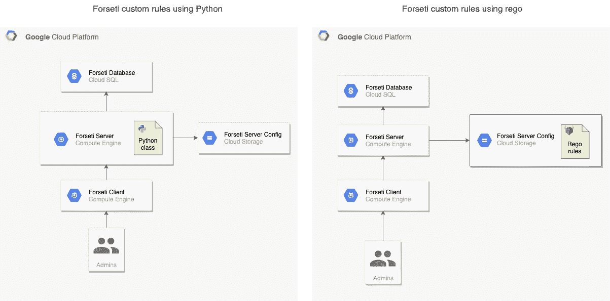

# 凡赛堤安全性:自定义规则

> 原文：<https://medium.com/google-cloud/forseti-security-custom-rules-9679287504a6?source=collection_archive---------3----------------------->

不可否认的是 ***凡赛堤*** 有很棒的架构做后盾。代码写得很好，遵循大部分行业标准，给每个人留下足够的线索来扩展它。

话虽如此，但当承担“构建您自己的策略”这一苦差事时，文档就显得力不从心了。

为了编写自己的自定义策略，*为我们提供了两种选择:*

1.  *使用传统的“结构化”语言(即***Python***):**要做到这一点，你需要扩展 [*凡赛堤的源代码*](https://github.com/forseti-security/forseti-security) ，并编写构建所需逻辑的扫描器和执行器。***
2.  ***用逻辑编程语言编写策略(例如 prolog): [***OPA 的***](https://www.openpolicyagent.org)[***rego***](https://www.openpolicyagent.org/docs/latest/policy-language/)**:**使用 rego 策略的一个很好的起点是 forseti-security/policy-library 项目。***

******

****自定义规则部署架构使用 **Python** 和 **rego******

****简而言之，这个决定将取决于你对 ***prolog*** 的体验以及这个策略将会给项目增加的语义复杂性。****

****无论哪种方式，构建策略都需要从[云资产清单](https://cloud.google.com/asset-inventory/docs/overview) ( ***CAI*** )提供的清单开始。如果某个资源没有被 ***蔡*** 公开，您需要通过 [github](https://github.com/forseti-security/policy-library/blob/master/docs/constraint_template_authoring.md#gather-sample-resource-data) 或 [email](http://validator-support@google.com) 与***【GCP***取得联系，以便请求将其包含在未来的版本中。****

# ****扩展*凡赛堤*以包括用 Python 编写的自定义策略:****

****为了开始编写自定义扫描仪，代码应该按照下面的[结构](https://github.com/forseti-security/forseti-security)进行分发:****

```
****[forseti-security/](https://github.com/forseti-security/forseti-security)
├── configs
│   └── server
│       └── **forseti_conf_server.yaml**
├── google
│   └── cloud
│       └── forseti
│           ├── ...
│           └── scanner
│              ├── audit
│              │   ├── ...
│              │   └── **foobar_rules_engine.py**
│              ├── ...
│              ├── **scanner_requirements_map.py**
│              └── scanners
│                  ├── ...
│                  └── **foobar_scanner.py** ├── ...
└── rules
    ├── ...
    └── **foobar_rules.yaml******
```

****在*内拥有你的定制政策需要五个步骤。为了更好地说明，让我们创建一个名为 *foobar_scanner* 的示例扫描器。*****

1.  *****编写一个包含*审计引擎*包装器的自定义类(参见步骤 3)，并将其添加到 ***凡赛堤*** *源代码**:****foobar _ scanner . py***内的[*scanners】文件夹中*](https://github.com/forseti-security/forseti-security/tree/master/google/cloud/forseti/scanner/scanners)*****
2.  *****在 [*规则文件夹下添加一个自定义规则映射*](https://github.com/forseti-security/forseti-security/tree/master/rules)*:****foobar _ rules . py********
3.  *****在 [*审计文件夹下写一个安全审计引擎*](https://github.com/forseti-security/forseti-security/tree/master/google/cloud/forseti/scanner/audit)*:****foobar _ rules _ engine . py********
4.  *****在[下添加自定义地图*scanner _ requirements _ map . py*下](https://github.com/forseti-security/forseti-security/blob/master/google/cloud/forseti/scanner/scanner_requirements_map.py)*****
5.  *****在 [*下注册之前创建的自定义地图 for SETI _ conf _ server . YAML*](https://github.com/forseti-security/forseti-security/blob/master/configs/server/forseti_conf_server.yaml.sample)。*****

## *****foobar_scanner.py:*****

```
*****"""Scanner for the Foo Bar rules engine."""
import collections
...
from google.cloud.forseti.scanner.audit import **foobar_rules_engine** ...
class **FoobarScanner**(base_scanner.BaseScanner):
    """Scanner for FooBar acls."""def **__init__**(self, global_configs, scanner_configs, service_config,
        ...
self.rules_engine = **foobar_rules_engine.FoobarRulesEngine**(rules_file_path=self.rules, snapshot_timestamp=self.snapshot_timestamp)
...
def **_find_violations**(self, bigquery_acl_data):
        ...
        for data in **foobar_acl_data**:
            violations = **self.rules_engine.find_violations**(
                data.parent_project, data.foobar_acl)
            LOGGER.debug(violations)
            all_violations.extend(violations)
        return all_violations
...
def run(self):
        """Runs the data collection."""
        **foobar_acl_data** = self._retrieve()
        all_violations = self._find_violations(**foobar_acl_data**)
        self._output_results(all_violations)*****
```

## *****foobar_rules.yaml:*****

```
*****rules:
  # Note: please use the id of the resource (such as organization id,
  # folder id, project id, etc.) when specifying the resource ids.
  - name: FooBar rule to search for public datasets
    mode: blacklist
    resource:
      - type: organization
        resource_ids:
          - {ORGANIZATION_ID}
    dataset_ids: ['*']
...*****
```

## *****foobar_rules_engine.py:*****

```
*****"""Rules engine for Foo Bar data sets."""
...
class **FoobarRulesEngine**(bre.BaseRulesEngine):
    """Rules engine for Foo Bar data sets"""
...
def **find_violations**(self, parent_project, **fb_acl**, force_rebuild=False):
...
violations = **self.rule_book.find_violations**(parent_project, **fb_acl**)
...
class **FoobarRuleBook**(bre.BaseRuleBook):
    """The RuleBook for Foo Bar dataset resources."""
...*****
```

## *****扫描器 _ 需求 _ 地图. py:*****

```
*****...
REQUIREMENTS_MAP = {
    ...
    '**foobar**':
        {'module_name': '**foobar_scanner**',
         'class_name': '**FoobarScanner**',
         'rules_filename': '**foobar_rules.yaml**'},
    ...
}*****
```

## *****forseti_conf_server.yaml:*****

```
*****...
scanners:
        - name: **foobar**
          enabled: **true**
        ...
...*****
```

# *****使用 rego 构建自定义策略:*****

*****如果您喜欢函数式编程，那么为了让您的自定义策略在*凡赛堤中启动并运行，需要几个步骤。******

******起点是有一个模仿以下[结构](https://github.com/forseti-security/policy-library)的树:******

```
******[policy-library](https://github.com/forseti-security/policy-library)/
├── lib
│   ├── constraints.rego
│   ├── util.rego
│   └── util_test.rego
└── policies
    ├── constraints
    │   └── **constraint_to_validate.yaml**
    └── templates
        ├── ...
        └── **gcp-{resource}-{feature}-{version}.yaml********
```

******现在，一旦有了合适的结构(并添加到存储了*服务器配置的根级存储桶中)，启用 ***rego*** 定制规则需要三个简单的步骤:*******

1.  *****编写***constraint _ to _ validate . YAML***，其中包括关于如何计算策略的白名单和黑名单信息。*****
2.  *****写模板***GCP-{ resource }-{ feature }-{ version }。存储 rego 策略的 yaml*** 。*****
3.  *****在***for SETI _ conf _ server . YAML***启用 *config_validator* 扫描器。*****

## ********constraint _ to _ validate . YAML:********

```
***...
apiVersion: constraints.gatekeeper.sh/v1alpha1
kind: **GCPResourceFeatureConstraintV1**
metadata:
  name: **constraint_to_validate**
spec:
  severity: high
  parameters:
    mode: "whitelist"
    instances:
      - //compute.googleapis.com/projects/**project-name**/zones/**zone-name**/instances/**instance-name*****
```

## *****GCP-资源-功能-v1.yaml:*****

```
***...
apiVersion: templates.gatekeeper.sh/v1alpha1
kind: ConstraintTemplate
metadata:
  name: **gcp-resource-feature-v1**
  ...
spec:
  crd:
    spec:
      names:
        kind: **GCPResourceFeatureConstraintV1**
        plural: **gcpresourcefeatureconstraintsv1**
      validation:
        openAPIV3Schema:
          properties:
            mode:
              type: string
              enum: [blacklist, whitelist]
            instances:
              type: array
              items: string
  targets:
   validation.gcp.forsetisecurity.org:
      rego: | 
            package templates.gcp.**GCPResourceFeatureConstraintV1** import data.validator.gcp.lib as lib
            ...

            **deny**[{
             "msg": message,
             "details": metadata,
            }] {
             constraint := input.constraint
             lib.get_constraint_params(constraint, params)
             asset := input.asset
             asset.asset_type == "compute.googleapis.com/Instance"
             ...
            }***
```

## ********for SETI _ conf _ server . YAML:********

```
***...
scanners:
        ...
        - name: **config_validator**
          enabled: **true**
        ...
...***
```

# *****结论:*****

*****当选择一种方法来为*【或任何其他策略实施者】编写定制规则时，有许多方面需要考虑。******

******编程语言只是其中之一，你留下的足迹是另一个。******

******最后，您还必须考虑这些规则的长期支持和可维护性。******

******OPA 的 rego 是安全行业中众所周知的语言，因此它应该是首选方法。另一方面，OPA 是注入到 ***【凡赛堤】*** 中的第三方组件，因此在如何以及何时执行每个自定义策略方面没有太大的余地(基本上要么全部运行它们，要么根本不运行它们)。******

*****Python 是一种用于快速原型制作的结构良好的语言，这意味着在它上面运行定制规则应该更容易*。另一方面，可维护性和可移植性可能是一个问题，因为您将扩展 foresti 核心组件。******

******换句话说，如果你有关于逻辑编程范式的知识，并且渴望学习 rego(或者已经知道了)，那么无论如何这都是一条可行之路。如果您需要 POC 来进行快速原型制作和验证，那么 ***Python*** 可能更适合(再次提醒，记住您必须用自己的定制代码扩展 ***凡赛堤的*** 库)。******

*****无论哪种方式， ***快乐编码*** 。*****