# 四季(和 5 个区)在一个职位与大查询

> 原文：<https://medium.com/google-cloud/four-seasons-and-5-boroughs-in-one-post-d8c90afc7071?source=collection_archive---------0----------------------->


## 使用谷歌大查询探索天气如何影响纽约

> 最初发表在[谷歌云大数据和机器学习](https://cloud.google.com/blog/big-data/2017/02/four-seasons-in-one-post-using-google-bigquery-to-explore-weather-effects-on-nyc)博客上

拥有超过 150GB 的[纽约市](https://cloud.google.com/blog/big-data/2017/01/new-york-city-public-datasets-now-available-on-google-bigquery)公共数据，解析所有这些数据以获取模式和见解是一项挑战。一个解决方案？将它与另外 30GB 的[天气数据](https://cloud.google.com/bigquery/public-data/noaa-gsod)结合起来，并使用 [CORR 函数](https://cloud.google.com/bigquery/docs/reference/standard-sql/functions-and-operators#corr)为您找到相关性。

相关性并不意味着因果关系，但它可以帮助你识别值得探索的模式。通过寻找天气变量和纽约市数据集之间的最高相关性，我将尝试回答一些关于这座城市的天气相关问题:

*   气温会影响花旗自行车和出租车出行吗？
*   天气影响机动车事故的原因吗？
*   阵风会导致汽车失控吗？
*   哪个 [311](http://www1.nyc.gov/311/) 投诉与低温关系最密切？
*   积雪对井盖和违章停车有什么影响？
*   老鼠和枯树与气温升高有关吗？
*   风速上升时噪音投诉会减少吗？
*   夏天纽约的狗会怎么样？

## 气温会影响骑花旗自行车和打车的次数吗？

受到萨拉·罗宾逊对花旗自行车数据的探索的启发，我想我应该看看花旗自行车骑行和温度之间的关系。我们可以看到温度和在花旗自行车网上的骑行有明显的关系。

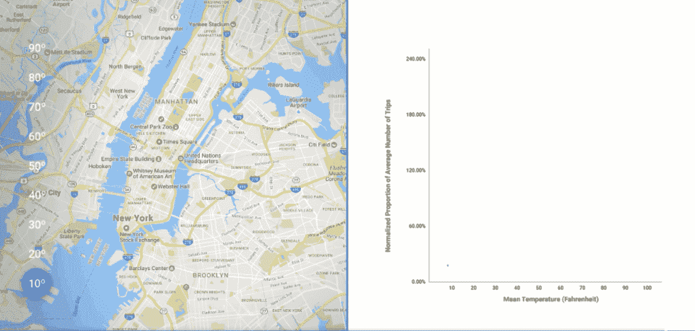

在这里，我比较了每天的乘车人数，与一周中某一天的平均乘车人数进行了标准化。随着气温的上升，乘坐的次数也在增加。热图向我们展示了起点站的集中程度——随着气温的升高，更多的乘车活动开始于外围城区。

让我们将同样的实验应用于[纽约市黄色出租车乘坐数据](https://cloud.google.com/bigquery/public-data/nyc-tlc-trips)。我将通过将温度划分为度数增量来简化图表，并找出每个区间内的平均旅行次数。

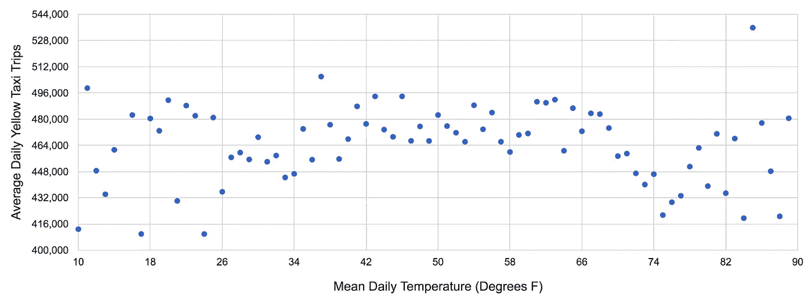

使用这个 [BigQuery 查询](https://bigquery.cloud.google.com:443/savedquery/174015642527:311f14f079db48e7a3abf30ae578085e)来获取该图中使用的数据

在上端和下端有一些噪音，在那里我们有较少的样本，但没有任何东西表明一个真正的关系。但无论是热、冷还是温和——纽约人都经常乘坐出租车。

## NOAA“全球天气摘要”(GSOD)气象数据集中

在回答我们其余的问题之前，让我们绕一个弯路来简化事情。

来自 NOAA 的 [GSOD 数据集是 BigQuery 中可用的几个公共数据集之一，包括自 1929 年以来 9000 多个站点的温度、降水、雪和风。为了减少时间和成本，让我们只提取我们需要的数据。](https://cloud.google.com/bigquery/public-data/noaa-gsod)

以下查询仅从纽约市两个机场(JFK 机场和拉瓜迪亚机场)2009 年至 2016 年间记录的观测数据中选择我需要的天气变量，计算它们之间每天的平均结果。

```
SELECT 
  -- Create a timestamp from the date components.   
  timestamp(concat(year,"-",mo,"-",da)) as timestamp, 
  -- Replace numerical null values with 0s 
  AVG(IF (temp=9999.9, 0, temp)) AS temperature, 
  AVG(IF (visib=999.9, 0, visib)) AS visibility, 
  AVG(IF (wdsp="999.9", 0, CAST(wdsp AS Float64))) AS wind_speed,
  AVG(IF (gust=999.9, 0, gust)) AS wind_gust, 
  AVG(IF (prcp=99.99, 0, prcp)) AS precipitation, 
  AVG(IF (sndp=999.9, 0, sndp)) AS snow_depth 
FROM 
  `bigquery-public-data.noaa_gsod.gsod20*` 
WHERE 
  CAST(YEAR AS INT64) > 2008 
  AND 
  (stn="725030" OR -- La Guardia 
   stn="744860")   -- JFK 
GROUP BY 
  timestamp
```

新表的总大小在 200k 以下，所以从现在开始，我们的天气加入[基本上不需要花费什么](https://cloud.google.com/bigquery/pricing)。

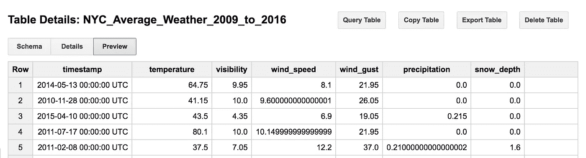

## 天气会影响机动车事故的可能原因吗？

[该查询](https://bigquery.cloud.google.com:443/savedquery/174015642527:4caaf1992122427eb984196a05a378ba)使用`CORR`函数计算[皮尔逊系数](https://en.wikipedia.org/wiki/Pearson_correlation_coefficient)——每个天气变量(温度、降水、雪、风和能见度)与每个主要原因的[机动车事故数量](https://cloud.google.com/bigquery/public-data/nypd-mv-collisions)之间的线性相关性。

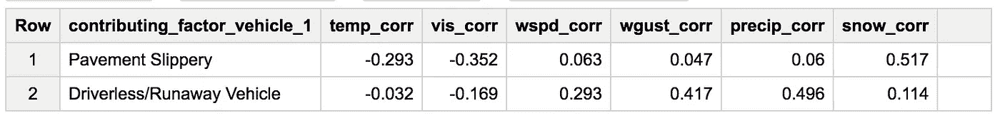

使用这个 [BigQuery 查询](https://bigquery.cloud.google.com:443/savedquery/174015642527:caa48837af2c43339fe3dd012732b31b)来生成这个输出表。

结果表明，当地面上有更多的雪时，湿滑的路面会导致更多的事故，当下雨和有阵风时，会有更多的无人驾驶/失控。

通过绘制雪的深度和滑动，我们可以看到一种可能的模式。最大的影响似乎出现在雪最大的那一天。

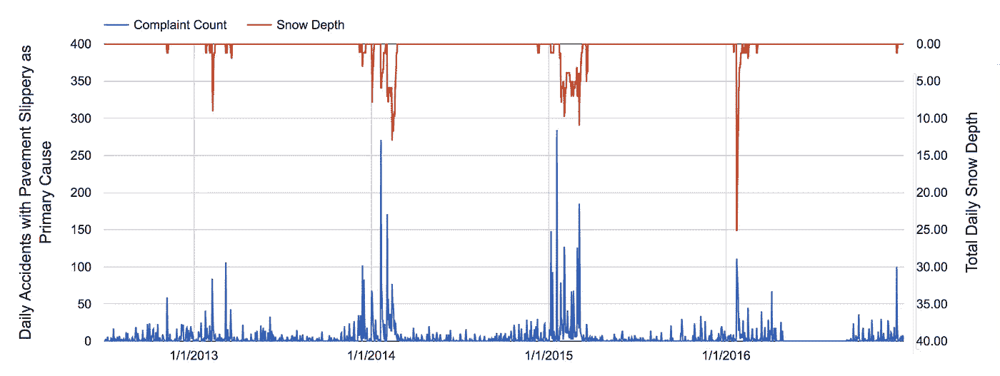

我的直觉告诉我，阵风可能会导致更多的汽车从他们的司机身边溜走，逃到湿滑、被雨水覆盖的街道上——但只有四个月的数据，用图表显示结果并不能真正支持这一点。

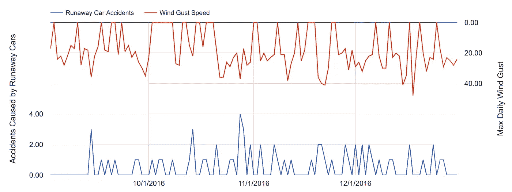

# 计算天气变量和 311 投诉的相关性

[311](http://www1.nyc.gov/311/) 是纽约市(和许多其他城市)为非紧急查询和非紧急社区问题提供的服务。

让我们从运行查询开始，找出哪 311 个投诉类别与[温度](https://bigquery.cloud.google.com:443/savedquery/174015642527:9c8fdb753fd34499bc4274d11ad71372)、[雪](https://bigquery.cloud.google.com:443/savedquery/174015642527:5fd8ac2328494045bfe892451e104239)、[风速](https://bigquery.cloud.google.com:443/savedquery/174015642527:9cb1ba714a2f4599aa54130beee3991d)和[雨](https://bigquery.cloud.google.com:443/savedquery/174015642527:8e2f4c3ed32f4b33afb9b79d4b24e5ef)的相关性最高，并看看排名靠前的结果来回答我们的问题。

## 哪个 311 投诉与低温关系最密切？

最强的相关性是最不令人惊讶的:天气越冷，投诉供暖的电话数量就越多。查看数据，您可以看到趋势线非常适合指数关系。

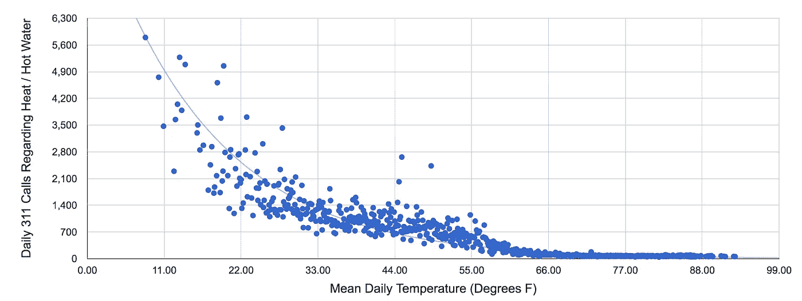

更令人惊讶的是，不见了的井盖和积雪的深度有着相似的关联强度。

## 下雪、井盖缺失和违章停车有什么关系？

查看呼叫量与积雪深度和温度的散点图，我们可以看到积雪深度和井盖缺失之间确实存在联系。

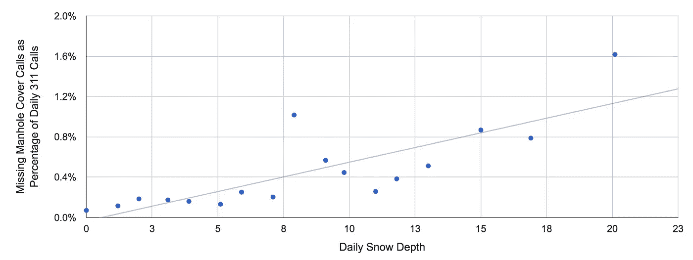

如果我们将数据绘制成时间曲线，我们会清楚地看到降雪很可能是一个重要的因素。

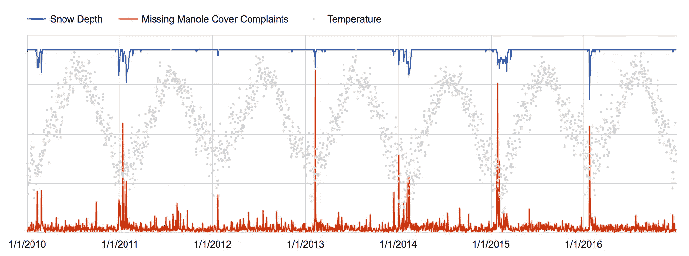

在过去的 7 年里，降雪和通话量都有一个峰值模式。这不太可能是因果关系(除非人们利用降雪的掩护来偷井盖。或者——如果因果关系是相反的——井盖是纽约和冬季末日之间唯一的东西。)

违法停车的图表主要显示了纽约人这样做更频繁的趋势。但堵塞的消防栓似乎与降雪量无关，更多的年度报告和更高的降雪量可能导致错误的相关性。

双停车的两个峰值与 2010 年和 2016 年的大雪一致，但与这两年的降雪几乎没有关联。

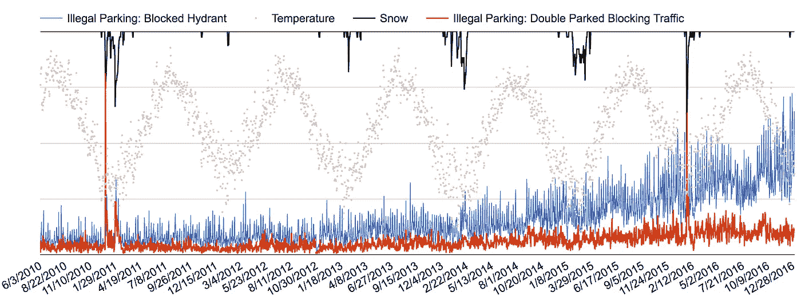

## 老鼠和枯树与高温有关吗？

死亡或濒死树木的主要相关性似乎是季节性的——需求数量在春季增长，在夏初达到峰值。

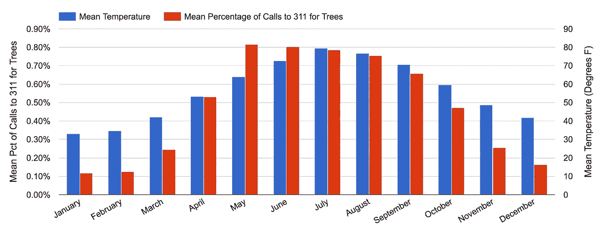

使用这个 [BigQuery 查询](https://bigquery.cloud.google.com:443/savedquery/174015642527:80eb1ebd1e7c43b5b14c50db8af3a006)来重新创建图形

我把这个给 [Lak Lakshmanan](http://aisoftwarellc.weebly.com/articles.html) 看，他是 BigQuery 和天气数据方面的专家，他建议我们根据月平均值对这些数据进行季节性调整。

下图衡量了月平均气温与月通话量比例之间的差异。如果没有季节效应，这种关系看起来很弱。

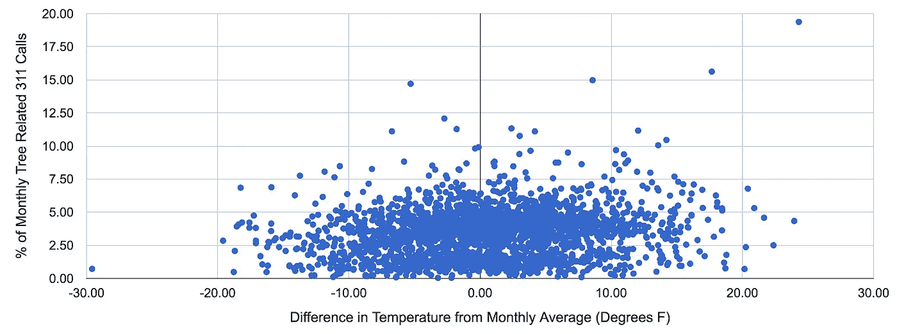

如果我们[季节性调整](https://bigquery.cloud.google.com:443/savedquery/174015642527:ec074237ab8c4d7683df388743180b67)老鼠目击事件，可能会有高温趋势，老鼠目击事件增加。分散点是有噪声的，但是如果我们通过找到每度温度的平均值来收集我们的结果，我们会得到一个更清晰的关系指示。

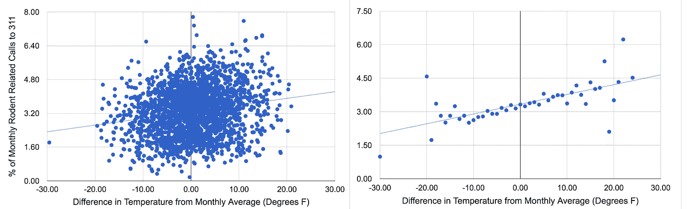

桶形图提供了一个更清晰的信号，但通过隐藏差异，它使关系看起来比实际更强。

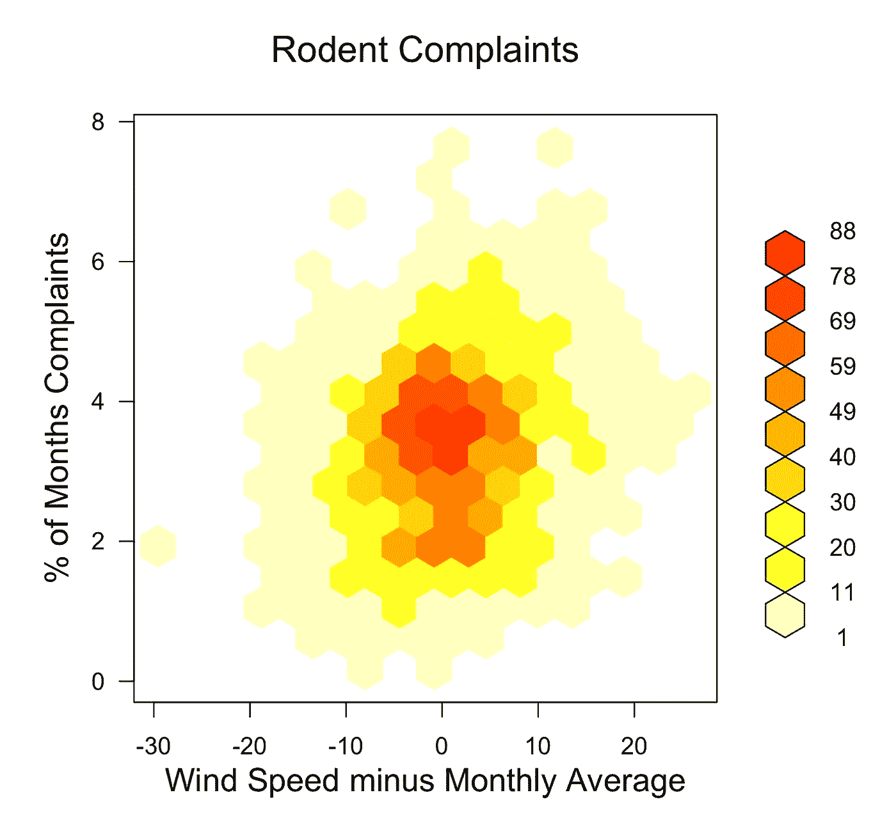

这就是为什么当 Lak 向我介绍 hexbin 图时我很激动！

六边形图将落在给定六边形内的所有点组合在一起，并根据该六边形内的点数为其指定一种颜色。

它比散点图产生更清晰的模式，但保留了变化。从左下到右上的独特对角线带，显示在整体形状和最集中的区域，表明热量和鼠迹之间的相关性很弱。

## 风速较高时，噪音投诉会减少吗？

狗叫声、大声说话、汽车音乐和喧闹的聚会与风速的相关系数至少为-0.75。但是，我们也知道纽约市冬天的风更大，所以让我们[季节性调整](https://bigquery.cloud.google.com:443/savedquery/174015642527:a2602bf01b7046dcb007fdc84496bf38)，并直接跳到我们的 hexbin 图，看看是否还有更多。

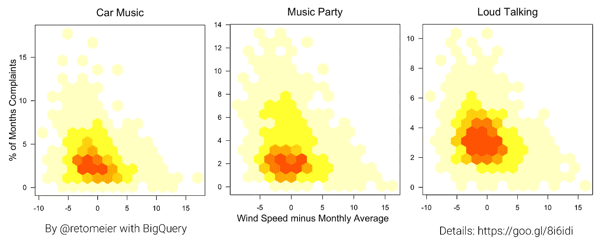

每张图的左下角都有一个三角形图案，暗示着一种微弱的负相关性——当风速较低时，噪音投诉更有可能出现，而当风速高于月平均水平 5 节时，噪音投诉会明显减少。

最强的模式是缔约方，在总体分布上显示了同样的趋势，在结果最集中的区域内也显示了类似的模式。

除了狂吠的狗。你认为这是怎么回事？


使用这个[大查询查询](https://bigquery.cloud.google.com:443/savedquery/729993340753:ce83143813994bb59d58b28b93fb4bc9)来重新创建这个图。

## 挖掘并找到隐藏在数据中的其他金块

我在[的谷歌数据表](https://docs.google.com/spreadsheets/d/1YffoCllGzE1Nn5TtPIA4NyZqLN6s3R4dPpkqzAXp3gQ/edit?usp=sharing)中分享了可能的天气/投诉相关性的一个更大的子集。它经过过滤，只显示皮尔逊系数大于+/-0.7 的温度、积雪深度或风速投诉，以及大于+/- 0.5 的降雨量投诉。

一旦你深入研究，你会发现多种混杂因素，包括各区之间的差异、季节性、年增长率、变量之间的关系以及许多其他因素。完成后，确保使用 [#TILwBQ](http://www.twitter.com/hashtag/tilwbq) 分享结果。

如果您是 BigQuery 的新手，请按照这些[说明开始](/til-with-bigquery/how-to-run-a-terabyte-of-bigquery-queries-each-month-without-a-credit-card-948773df8c0c#.9jex791fc)，并且记住每个人每个月都可以免费获得 1TB [来运行查询](https://cloud.google.com/bigquery/pricing)。