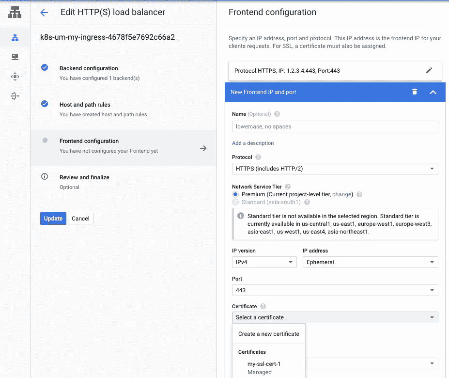
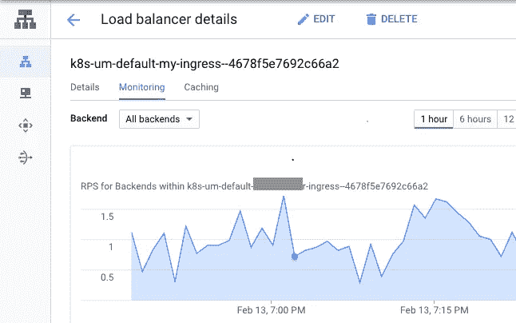
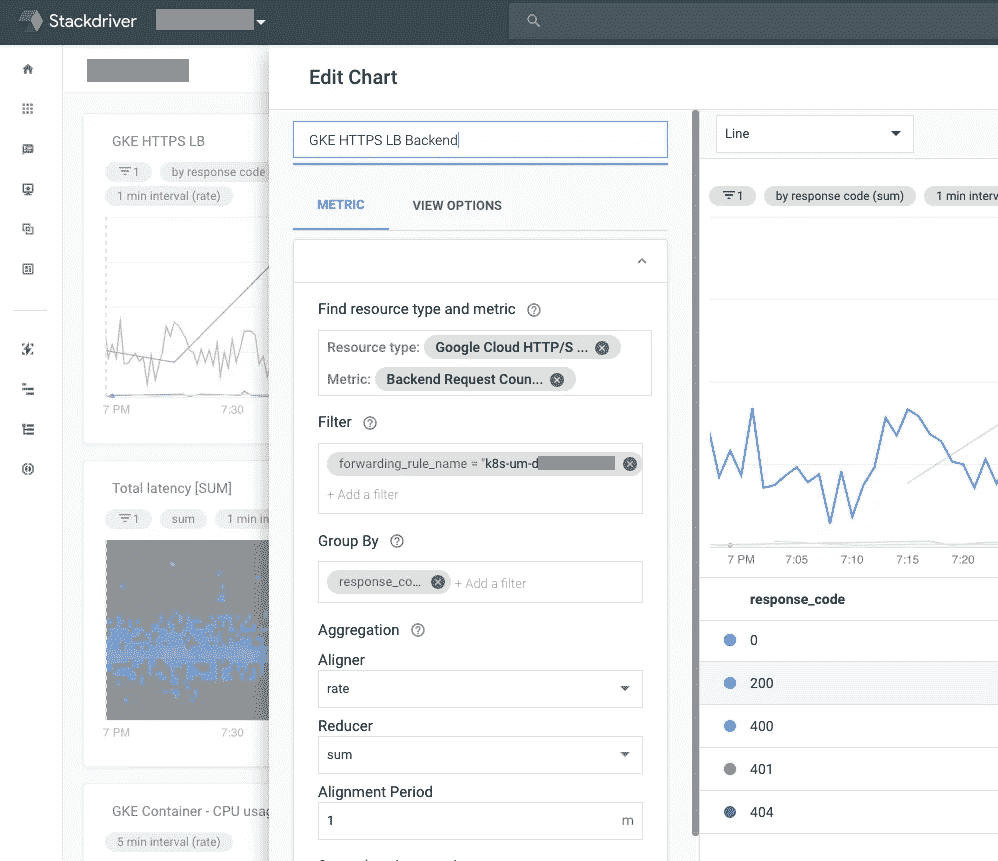
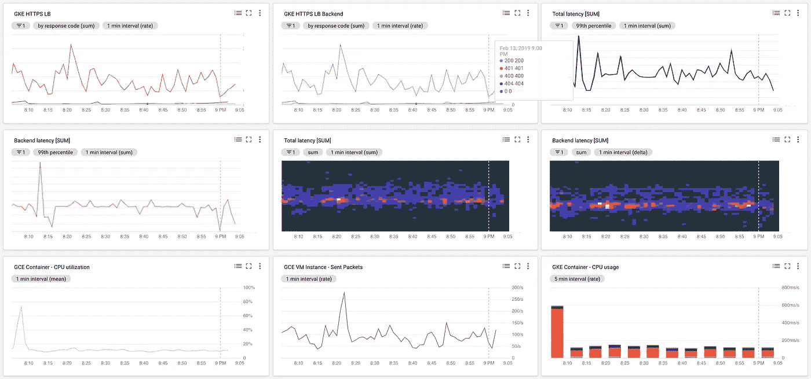

# 从 App Engine Flex 到 Kubernetes

> 原文：<https://medium.com/google-cloud/from-app-engine-flex-to-kubernetes-a7a7aad9e66f?source=collection_archive---------0----------------------->

是否要将您的应用程序移动到 Google Kubernetes 引擎？然后继续读下去。

> 把这当作一个入门指南。它不会进入细节/概念，而是帮助你快速开始 GKE。

这些步骤的大致轮廓如下:

*   准备好你的 Docker 形象。猜猜看？你应该可以在 GKE 上运行相同的应用引擎 docker 镜像，没有任何问题！(如果您使用相同的服务帐户)。然而，你可能想考虑一个更干净的选择。
*   准备并**设置您的 Kubernetes 集群**。Google 将 Kubernetes 及其所有服务设置在默认节点池中。
*   创建一个[T5【Kubernetes】部署 。简而言之，部署是无状态应用程序的构造。对于需要状态的东西，比如一个 MySQL 实例，你可以使用一个](https://kubernetes.io/docs/concepts/workloads/controllers/deployment/) [StatefulSet](https://kubernetes.io/docs/concepts/workloads/controllers/statefulset/) 。
*   使用**服务**公开您的部署。如果您正在使用“负载平衡器”服务，那么您正在创建 HTTP 访问。HTTPS 需要更多的工作，我将稍后讨论。
*   使用 [Stackdriver](https://app.google.stackdriver.com) 设置**指标和监控**。这是关键！我担心的一件事是，GAE 展示了大量在 GKE 无法直接获得的好图表。但是你可以做到这一切，用 Stackdriver 可能会更好。

Google 已经有了一个完全相同主题的文档:[https://cloud . Google . com/app engine/docs/flexible/python/run-flex-app-on-kubernetes](https://cloud.google.com/appengine/docs/flexible/python/run-flex-app-on-kubernetes)。我建议你先看看这个。我想强调一些细微的差别。

不管怎样，我们开始吧！

# 准备您的 Docker 图像

假设您是 app engine flex 用户，您应该已经有一个 docker 容器。问题是 GKE 不会读取/使用你的 app.yaml 文件。因此，您设置的任何配置/设置/环境变量都需要移动到 docker 文件中。

需要注意的一点是，如果你正在使用其他 Google 服务，比如 Google Cloud SQL，你可能需要导出一个凭证文件。你可以按照[这个文档](https://cloud.google.com/iam/docs/creating-managing-service-account-keys)来创建一个。

```
# Credentials for GCloud Access
ENV GOOGLE_APPLICATION_CREDENTIALS=/path/to/json/key
```

您可以运行下面的命令，在 Google 容器注册中心(GCR)中构建并保存您的 Docker 映像

```
cd ~/path/to/my-awesome-project/publish-dir-which-has-Dockerfile
gcloud builds submit --tag "gcr.io/my-awesome-project/0.1.0"
```

# 创建您的 Kubernetes 集群

我是 gcloud console 的粉丝，大部分时间都会使用它。你需要安装 [GCloud SDK](https://cloud.google.com/sdk/install) 和 Kubernetes CLI (kubectl)来继续。如果你有 gcloud SDK，你可以简单地[安装 kubectl](https://kubernetes.io/docs/tasks/tools/install-kubectl) 。

```
gcloud components install kubectl
```

一个 Kubernetes 集群可以包含多个节点池，并且可以托管多个服务。它使用“默认”节点池进行初始化。

> 注意！一旦创建了集群，就不能更改机器类型。你也不能改变启动盘的大小，镜像，服务账号等。

此外，如果您正在创建一个**单节点集群**，请注意，有许多 kubernetes 服务将驻留在该节点上，如 kube-proxy、logging-service 等，它们会消耗高达**GB 的 RAM** ，因此请相应地进行分配。

```
gcloud beta container \
    --project "my-awesome-project" clusters create "kc1" \
    --zone "asia-south1-c" \
    --username "admin" \
    --cluster-version "1.10.11-gke.1" \
    --machine-type "n1-standard-1" \
    --image-type "COS" \
    --disk-type "pd-standard" \
    --disk-size "30" \
    --num-nodes "1" \
    --enable-cloud-logging \
    --enable-cloud-monitoring \
    --no-enable-ip-alias \
    --network "projects/my-awesome-project/global/networks/default" \
    --subnetwork "projects/my-awesome-project/regions/asia-south1/subnetworks/default" \
    --addons HorizontalPodAutoscaling,HttpLoadBalancing \
    --no-enable-autoupgrade \
    --enable-autorepair \
    --maintenance-window "21:30"
```

这将为您的新 Kubernetes 集群‘kc1’设置一个带有[标准配置](https://cloud.google.com/compute/docs/machine-types)的节点。如果你想改变这一点，通过这个文档:[https://cloud . Google . com/kubernetes-engine/docs/tutorials/migrating-node-pool](https://cloud.google.com/kubernetes-engine/docs/tutorials/migrating-node-pool)

在我们继续之前，运行这个命令从终端控制您的新集群

```
gcloud container clusters get-credentials kc1
```

# 创建您的 Kubernetes 部署

一旦您将 Docker 映像上传到 GCR，您就可以用一个命令创建一个 Kubernetes 部署。

```
kubectl run my-deployment \
    --image=gcr.io/my-awesome-project/0.1.0 \
    --port=8080
```

这将运行您的应用程序。但是，有几个配置条目对于正确完成这一任务至关重要。您可以使用此命令编辑您的部署。

```
kubectl edit deployment realia-server-deployment
```

这打开了 vi 中的部署 yaml。注意 rollingUpdate 和 minReadySeconds 这两个条目。保存时，设置会自动更新。

```
spec:
  ...
  # Please ensure that your server starts in 10 sec. Else the readiness check fails
  minReadySeconds: 10
  ...
  strategy:
    rollingUpdate:
      maxSurge: 1
      # If you have just 1 instance to start, you need to set
      # set this to zero to have a zero downtime rolling upgrade
      maxUnavailable: 0
    type: RollingUpdate
```

由于您有较新版本的应用程序映像，您可以使用更新您的部署。如果部署配置正确，这应该是一个零停机滚动更新。

```
kubectl set image deployment/my-deployment my-deployment=gcr.io/my-awesome-project/0.2.0
```

# 创建服务

为了让您的应用程序对外界可见，您需要将您的应用程序公开为服务。

您可以使用类型“LoadBalancer”来公开您的服务 HTTP，如 Google 文档中所述。在这里，我将概述 HTTPS 的**步骤。**

实现这一点的一种方法是创建一个节点端口服务。这篇[博客](/google-cloud/kubernetes-nodeport-vs-loadbalancer-vs-ingress-when-should-i-use-what-922f010849e0)很好地讨论了可用的选项。我正沿着下面描述的路线前进。

```
Deployment > Service > Ingress > GCloud HTTP(S) Load Balancer
```

*   通过服务公开部署
*   创建服务的入口
*   使用 GCloud HTTP(S)负载平衡器添加 HTTPS 前端

为了做到这一点，您需要首先使用下面的代码创建一个节点端口服务

```
kubectl expose deployment my-deployment --target-port=8080 --type=NodePort
```

现在创建一个入口。

```
kubectl create -f gke/my-ingress.yaml
```

下面是一个示例 my-ingress.yaml

```
apiVersion: extensions/v1beta1
kind: Ingress
metadata:
  name: my-ingress
spec:
  backend:
    serviceName: my-deployment
    servicePort: 8080
```

就是这样！这将自动创建一个带有默认 HTTP 前端的 HTTP(S)负载平衡器。你可以在网上看到这个。

```
Google Cloud Console > Network Services > Load Balancing > Ingress
```

但是等等！HTTPS 怎么样？您可以使用 web 界面添加多个前端(IP 和端口)(我还没有通过 CLI 做到这一点)。

打开入口并选择编辑。您应该会看到这样的屏幕



谷歌云控制台上的负载平衡器编辑屏幕

您应该能够添加一个新的前端，并选择 HTTPS，如图所示。

上传您的 SSL 证书。如果没有，您可以从 UI 中创建一个。

> 别忘了把短命改成静态 IP，更新 DNS 设置！

注意:

*   请注意，部署新证书至少需要 30 分钟。
*   即使用户界面显示亮绿色勾号，服务仍可能显示为不可用。
*   您的浏览器缓存 SSL 证书，因此尝试不同的浏览器或关闭/重新打开您的浏览器并检查。

# 监控和指标

瓦拉。您的服务终于可以在 https 上运行了！但是等等。你怎么知道它怎么样了？

首先，您总是可以从 LoadBalancer 的监控控制台监控流量。



Google 云控制台>网络服务中的负载平衡器监控选项卡

然而，对于任何应用程序来说，仅有流量统计是不够的。这就是 stackdriver 的用武之地。

在[堆栈驱动控制台](https://app.google.stackdriver.com)中，

*   首先创建一个仪表板
*   在这里，您可以通过选择指标来轻松添加图表。例如，从资源类型:Google Cloud HTTP(S)负载平衡器和指标:后端请求计数开始
*   这将向您显示所有请求及其响应代码。你可以按国家等维度进行分组，以准确获得你需要的信息



用于编辑指标的堆栈驱动程序接口

以下指标对我理解应用程序的健康状况帮助很大

*   来自 GKE LB 的外部请求计数
*   来自 GKE LB 的后端请求计数。(在某些情况下，这两者可能会发出不同的响应代码)
*   总端到端延迟
*   后端延迟
*   容器指标:CPU、内存、磁盘、网络
*   Pod 指标:每个 pod 的内存、CPU 和网络

最后你可能会得到这样的东西。:)



Stackdriver 仪表板示例

现在你终于可以坐下来，看一看，喝杯咖啡放松一下了！

总结；建立 Kubernetes 最初可能是一项艰巨的任务。但是一旦你开始掌握它，这是一个很棒的系统。我知道我还没有解释我为什么搬到 GKE，但那可能是以后的事了。

如果你需要快速回复，请发推文到 [@suvodeeppyne](https://twitter.com/suvodeeppyne) ，否则欢迎在下面留下评论。