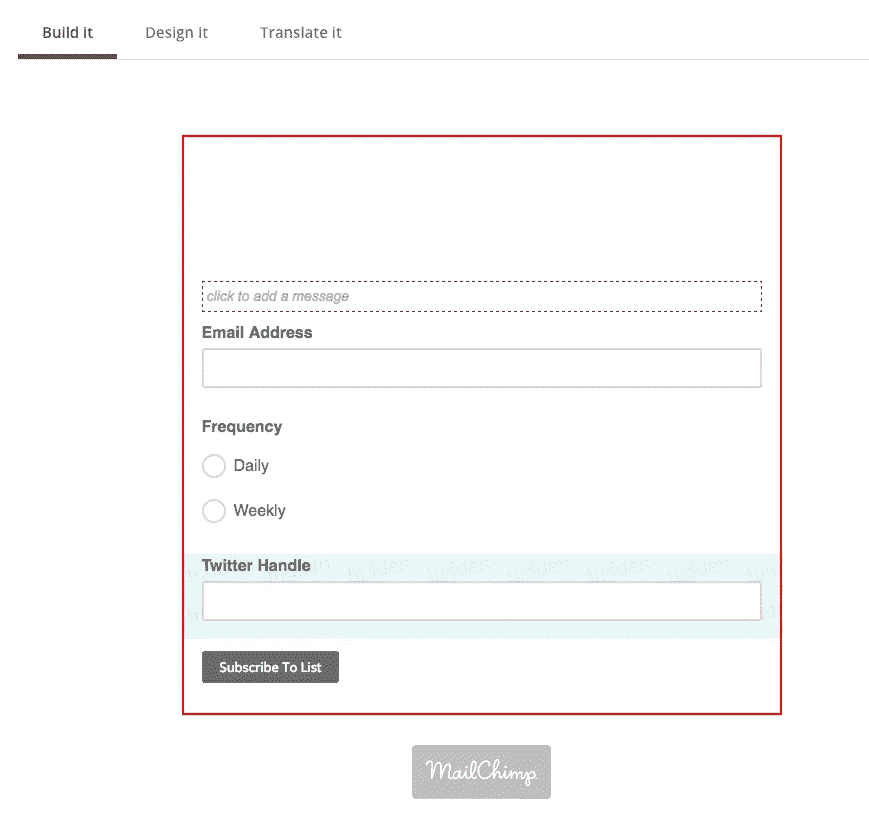
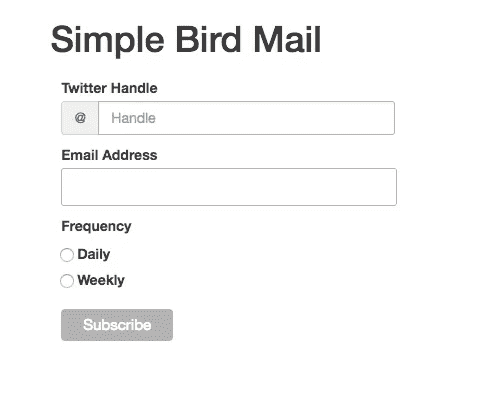
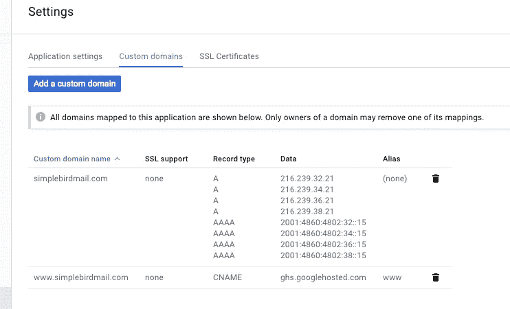
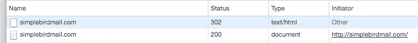
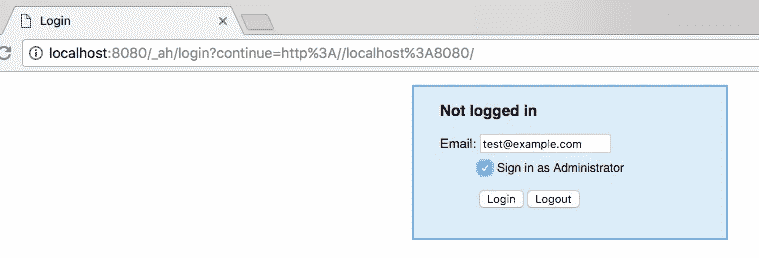
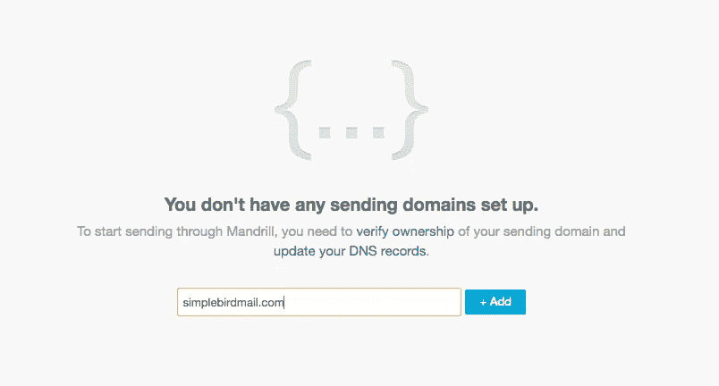
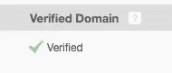
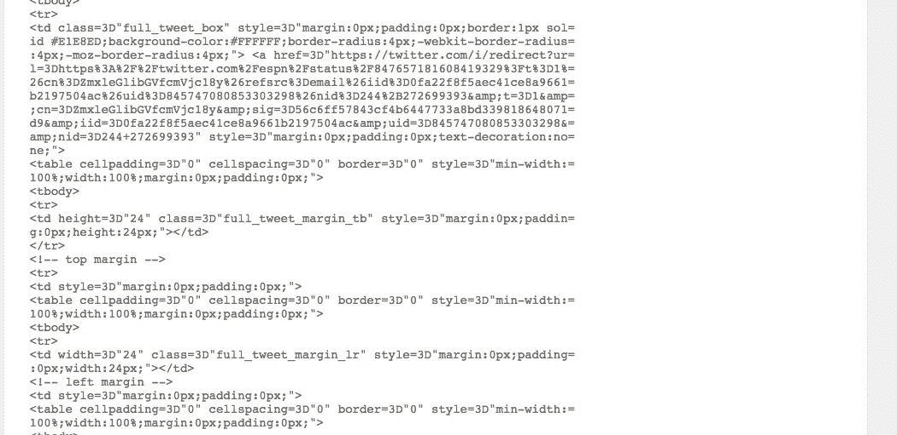

# 免责声明:白天，我为 Twitter 工作，负责计算机和基础设施。

> 原文：<https://medium.com/google-cloud/from-idea-to-deployed-on-gcp-in-24hrs-927eaf8a5939?source=collection_archive---------0----------------------->

今天外面看起来像这样，所以我决定呆在家里-

帆船。

想法:每天或每周通过电子邮件给我发送一个特定的 T2 人的推文。

目的:不管我们喜欢与否，电子邮件会一直存在。我个人喜欢以这种方式，按照我的时间表来消化具体的内容，这是相当灵活的。此外，我想给 [@redsoprano23](https://twitter.com/@redsoprano23) 和 [@ftdoctor](https://twitter.com/@ftdoctor) 一种更熟悉的方式来接触来自 Twitter 的内容。

没有耐心？这里的最终产品:[simplebirdmail.com](https://simplebirdmail.com)。

在 2017 年 7 月 9 日，我决定关闭这个网站，因为它需要时间和金钱，而我现在没有时间去进一步维护它。

> 下面是我如何从一个想法到在这里< 24hrs. It is not every button click but it is nearly every screen view, and every piece of code and configuration. This assumes a moderate level of comfort with all of the systems involved. The finished code is published to GitHub [部署](https://github.com/drewrothstein/simplebirdmail)以及内联 Gists 的一个相当彻底的走查。

名称选择

# 想出一个名字和域名。我不喜欢在购买域名之前开始一个项目(然后是让它成为现实的压力)。

[X]完成:简单的鸟邮件

[X]注册域名:simplebirdmail.com

粗糙的平台和架构

# 决定平台和粗略的架构。我熟悉在几个平台上构建基础设施，并总是寻找一些新的和可能具有挑战性的东西。对于一个 24 小时的项目，在一个不太熟悉的平台上工作有点冒险，因为你不知道它的优势、局限性等等。

谷歌计算平台的更新版[免费层](https://cloud.google.com/free/)看起来很酷，所以我会尝试一下。我可能会去一点自由层，但作为一个开始，它看起来很好。

[X]平台决定:谷歌计算(主要是应用引擎)

对于粗略的架构，我发现把一个非常简单的、高层次的服务列表和流程看起来像什么是很有帮助的。

这是非常粗略的，但这是最初的意图。

[X]架构决定

帐户设置

# 对于这个项目，我需要设置以下公司开始帐户:

谷歌云

*   MailChimp
*   推特
*   所有这些都很容易设置，只有一些小问题。以下是其中的一些细节。

**谷歌云账户**

前往[https://cloud.google.com](https://cloud.google.com)，用任何一个旧的谷歌邮箱账户登录。一旦注册，你可能会想在 https://console.cloud.google.com/[的](https://console.cloud.google.com/)将云平台加入书签，因为 cloud.google.com*的*会将你带入他们的文档/定价/信息页面。

如果您愿意，可以创建新项目和新计费协议(针对各种 API 限额增加和服务使用)。在我的例子中，我有不同的项目和不同的账户，我想保持独立，所以我创建了一个新的计费协议。

在**计费>预算和提醒**下，您可能想要为**预算金额**设置一个提醒，以防您的项目意外开始花费超出您预期的资金。我选择 100 美元作为初始预算水平。

在**应用引擎>设置下，**你可能想要设置一个**每日支出限额**，以防你的项目意外开始花费比你预期更多的钱。我也选择将其设置为 100 美元。

最初在你的 App Engine 仪表盘上，会显示限额是 [$9，223，272.03 吓得我裤子都掉了](https://twitter.com/mediocrity/status/845717462523920384)。大约一小时后出现，这个问题消失了，它被设置为你的*每日消费限额*。

您需要在控制台周围点击**计算>应用引擎**选项卡，选择您的区域并设置您的第一个项目。您也可以等到第一次通过 CLI 部署时再这样做，因为它会提示您输入相同的信息。

注意:有两种类型的应用引擎环境在这里详细描述称为灵活和标准。灵活的环境运行在 Docker 容器中，启动实例需要几分钟时间，因此我将为前端选择标准环境，它不使用 Docker 容器，启动实例需要几毫秒时间。注意:稍后我将使用灵活的环境；这两者都在本演练中使用。

此外，我们将使用谷歌的 KMS 服务来加密和解密秘密，所以你也要启用它: **IAM & Admin >加密密钥**。

**MailChimp 账号**

在[https://mailchimp.com](https://mailchimp.com)开设账户非常简单。唯一奇怪的是法律规定，即使没有信用卡，你也要给他们你的地址。我们可能需要进一步挖掘模板中的这一点(或者对其稍加修饰，使其看起来真实，但实际并非如此)。

要在确认邮件后创建 API 密钥，请转到:**附加服务> API 密钥>创建密钥**。

确保给钥匙贴上**标签**，以便日后识别。

一旦设置完毕，它看起来应该大致是这样的(复制 API 密匙以便以后安全存储)。

MailChimp >附加> API 密钥>创建密钥

**推特**

https://twitter.com 的账户设置非常简单。在一个新的电子邮件地址下创建一个用户(并确认)后，我前往[https://apps.twitter.com](https://apps.twitter.com)创建一个 API 密匙。注册新应用程序需要名称、描述和 URL。在**密钥和访问令牌**选项卡上，向下滚动到底部，然后**创建我的访问令牌**。

既然你在这个页面上，你也可以把*改为只读*，因为我们不会写任何东西。点击**访问级别**旁边的**修改 app 权限**链接，变为底部的*只读*和**更新设置**。注意:您可能会在初始创建时收到一条错误消息，但页面刷新会清除它；不确定为什么。

完成所有设置后，它看起来应该大致是这样的(复制消费者密钥+秘密，然后将访问令牌+秘密保存下来，以便以后安全地存储)。

Twitter 应用程序注册

配置开发环境

# 我将选择 **Python** ，因为我已经选择了使用一个不熟悉的平台，所以我非常熟悉它以保持额外的复杂性最小化。

跟随 Google Cloud 的指南[这里](https://cloud.google.com/appengine/docs/standard/python/getting-started/python-standard-env)和[这里](https://cloud.google.com/appengine/docs/standard/python/tools/setting-up-eclipse)开始。

第一个问题:这里涉及了*两个* SDKs，这最初让我很困惑。你既需要带有 Python 组件的 [Google Cloud SDK](https://cloud.google.com/sdk/docs/) ，也需要用于 Python 的[App Engine SDK](https://cloud.google.com/appengine/docs/standard/python/download#appengine_sdk)。

在 OS X 上，我选择在 */usr/local/bin* 中安装带有几个符号链接的 Cloud SDK。后者你需要安装和启动，选择创建符号链接。

**PyDev (webapp 框架)带 Eclipse**

## 如果您选择 Eclipse 途径，它将无法使用初始项目模板，因为文档中有一个小注释:

注意:PyDev starter 项目已经过时，并且使用 Python 2.5 webapp 模块。

> 要解决这个问题，您需要将您的 *app.yaml* 中的**运行时**从 python 更改为 **python27** 。同时，您还应该添加 python 2.7 项目所需的 **threadsafe: true** 。

此外， **webapp** 示例可以工作，但是 [**webapp2**](https://webapp2.readthedocs.io/en/latest/) 框架已经过时了，所以你可能想改用它(或者走下面的 Flask 路线，反正我们最终会这么做)。如果您选择 **webapp2** 路线，您将需要一个 *app.yaml* 和 *main.py* 来开始:

您可以在本地测试这一点，但是要在 Eclipse 中配置本地配置。

右键单击您的项目>运行方式>运行配置…

右键单击 PyDev >新建

将其命名为 **Run Local** (或者其他什么)，将主模块设置为安装了 *dev_appserver.py* 的位置(在我的例子中:*/usr/Local/Google _ app engine/dev _ appserver . py*)。在“参数”选项卡中，将程序参数设置为“${project_loc}”。

这应该是这样的:

主选项卡

参数选项卡

选择右下角的 Run，在控制台中你应该会看到启动消息，让你知道 [http://localhost:8080](http://localhost:8080) 已经设置好了，所以来看看吧！

烧瓶不含 Eclipse

## 如果你选择不使用 Eclipse 的 Flask route，你会想要遵循这个[指南](https://cloud.google.com/appengine/docs/standard/python/getting-started/python-standard-env)或者你可以简单地在这里克隆 repo [并且看一看**灵活**或者**标准**下的 *appengine* 目录。请参阅上面链接到差异文档的注释。](https://github.com/GoogleCloudPlatform/python-docs-samples)

作为开始(并在本教程中继续)，我将选择*app engine/standard/flask/tutorial*项目，这是一个合理的起点。

首先，我将在 Google Cloud 上创建一个独立的私有存储库(因为它目前是免费的测试版)。进入**工具>开发>入门**。当然要选一个有创意的名字。

我喜欢将任何教程复制到我的新存储库的基础上来开始。

将空的 repo 克隆到本地源树的某个位置:

将教程项目复制到这个新存储库中:

你可能想将根文件夹从教程**重命名为更具描述性的名称，我选择了**前端**。**

类似于我们如何配置 Eclipse 以便能够在本地运行，我们可以设置一个本地运行配置。

首先，将需求安装到文档中提到的 *lib* 目录中:

注意:正如文档中提到的，如果你使用**自制**版本的 **python** ，你会遇到麻烦。我可能会建议不要那样做，转而使用 [**pyenv**](https://github.com/pyenv/pyenv) ，它工作得相当好。

> 通过使用 *dev_appserver.py* 启动本地 appserver，如果您安装了两个 SDK，它应该在您的路径中，并让 *gcloud* 工具附加您的 shell 的配置文件，或者如果您选择这样做，也可以手动执行。

该应用程序现在应该可以在本地[http://localhost:8080/form](http://localhost:8080/form)获得。

在我们进行任何更改之前，这是将初始教程代码提交到您的代码库中的好时机，所以让我们开始吧。

让我们将这个应用程序部署到 App Engine，这样除了我们的本地环境之外，我们也能掌握它的窍门。

您将需要使用两个命令，如记录所示， *gcloud app deploy* 和 *gcloud app browse* 。第一个部署您的应用程序，第二个在项目 URL 启动您的 web 浏览器。

您应该能够在 URL 上浏览到 */form* ，并查看您在本地看到的相同表单。

如果你已经到了这里，休息一下，享受一些 soylent。几分钟后回来。

好吃！

概述

# 我们已经在谷歌云、MailChimp 和 Twitter 上创建了账户。我们有一个本地开发环境设置，并为 Google App Engine 部署了一个 Flask 教程。我们有一个代码库设置，并提交了教程代码。那么下一步是什么？我们有两条路径可以开始——前端或后端。先说前端。

前端设计设置

# 我们需要将我们的教程表单转换成一个实际的前端，为用户提供我们想要的功能。在我想做的事情的情况下/目的中，我们需要捕捉一些信息——这个人想要接收关于他的电子邮件的 Twitter 用户和他们的电子邮件地址。就是这样(差不多)。

对于所有快速的项目，我喜欢把基本的用户界面元素放在一起，然后用花哨的加州样式表润色它( [Jenn Schiffer](https://medium.com/u/92ac42f12e5d?source=post_page-----927eaf8a5939--------------------------------) 因其冗长而获得好评；这很神奇)。

这就是我们开始最低生活水平的小狗* (MVP)所需要的一切:

绘图纸，画的不好(抱歉)。

*可能代表也可能不代表小狗。它可以是“产品”，但那就没那么有趣了。

我们已经有了 90%的份额，我们甚至不需要做任何事情！

稍微修改一下 form.html*，我们可以得到这个非常接近超级花哨的设计。*

*让我们看看我们在哪里:*

*form.html*

**

*从“所有的东西都在吗”的角度来看，答案非常接近“是”。*

*现在，这可能是有争议的，但我可能会变得有点疯狂，如果这在这一点上看起来不那么好的话。这个[引导](http://getbootstrap.com/)框架应该可以帮上忙；让我们在 v4 仍处于 Alpha 阶段时坚持使用可靠的 v3。*

*由于这将在公共互联网上托管，并且目前没有很好的理由捆绑依赖关系(在我看来)，我们将指向 MaxCDN 的 include(以及其他 CDN)。*

*为了适应引导模板和特性，我们做了一些修改，看起来更简洁了:*

*form.html*

**

*前端设计目前是宜居的。现在添加功能。*

*前端功能设置*

# *您可能已经注意到，设计的表单非常类似于 MailChimp 注册表单。虽然这很可能完全通过 MailChimp 表单来完成，而不需要单独的应用引擎托管前端，但这远没有那么有趣、好玩，也没有那么多的学习体验。此外，在 MVP 发布后，功能方面的限制将很快达到(想想:额外的选项、外部数据/用户存储、typeahead 等)，如果在某个时候我们想转移到另一个平台，这是一个篮子里的许多鸡蛋(尽管锁定是完全不可避免的，如果你不这样想，这完全是一种幻觉)。*

*注意:因为上面没有提到，使用一个平台来处理电子邮件通常是一个好的实践。这很痛苦，有很多规则和情况是你不想花时间去面对的。*

> *我们将设计一个表单来捕获大部分数据，并注入将在网站上托管的数据，取代我们的大部分表格。*

*首先在 MailChimp 中创建一个**列表**。*

*你会想要某种*联系方式@* 地址。最<好的>域名注册商(<咳> [甘地](https://www.gandi.net/)！</咳>)让我们免费给你一些邮件代理，你可以设置一个联系地址。*

**

*用 [@gandibar](https://twitter.com/@gandibar) ，他们太棒了。*

**

*为了能够从特定地址发送邮件，您需要执行验证过程。*

*我们现在需要创建一个注册表单，它反映了我们创建的表单的大部分功能。*

****

*我们创建了一个包含电子邮件地址、频率和一个隐藏的 Twitter 句柄字段的表单。我们不想公开句柄输入，因为我们将向当前字段添加一个自动完成，并注入表单。*

*回到嵌入表单页面，抓取 HTML。我们需要对其进行一些分割，使表单符合我们的样式，保持 Twitter 句柄初始字段独立。*

****

*HTML、CSS 和更新的表单:*

*form.html*

**

*这已经足够接近了，我们可以继续使用 [typeahead.js](https://twitter.github.io/typeahead.js/) 来实现 typeahead。看看这个库如何提前呈现 Twitter 句柄类型，他们在 Heroku 上设置了一个代理服务器来向 Twitter 发出请求。我们需要坚持这一点，这将通过增加这一要求来稍微扩展我们的架构。*

*最快和最轻的方法是使用 [twitter 代理](https://github.com/ruyadorno/twitter-proxy)(它是 Node，但是我们现在忽略它)。指着上面提到的一个是不行的，即使它看起来是完全开放的，没有任何限制(除了我必须假设/希望的上游限速)。*

*分别是 *package.json* 和 *server.js* :*

*为了在 Google App Engine 上运行这个应用程序，我们需要创建一个单独的 Twitter 应用程序(和相关的凭证)，一个单独的服务名来存放 App Engine 应用程序，并且需要组装一个 *app.yaml* 配置。这两个步骤之前都有记录，继续假设完成的步骤。*

*分别是一个 *app.yaml* 和 *credentials.json* :*

*你现在可能意识到你需要一个*。gitignore* 文件:*

*完成所有这些步骤后，我们现在可以进行本地测试，如果一切顺利，就可以进行部署了。本地运行 *npm 启动*:*

*跳到一个浏览器窗口，输入:[http://localhost:5000/1.1/users/search . JSON？q =平庸](http://localhost:5000/1.1/users/search.json?q=mediocrity)*

**

*这应该会在您的控制台中显示 200:*

**

*这将下载一个 JSON 文件，其中包含许多用户的内容:*

**

*现在这已经可以工作了，我们将用 *gcloud app deploy* 将它上传到 App Engine。第一次部署将需要几分钟，但上面的相同的 URL，保存为基础，应该工作。在:[https://<your _ app>. app spot . com](https://proxy-dot-simple-bird-mail-162703.appspot.com/)[/1.1/users/search . JSON 试试？q =平庸](http://localhost:5000/1.1/users/search.json?q=mediocrity)*

**

*关于安全等的一个简短说明...这是那种“照我说的做，不要照我做的做”的时刻。对于一个 24 小时的项目来说，这里有很多偷工减料的地方。其中一个角落是为另一个 API 发布一个可公开访问的代理。这一点也不酷。App Engine 不*提供任何类型的控制来限制对您服务的访问。理想情况下，这应该以这样一种方式启动，它可以被限制到只有你的前端应用程序。为了时间和简单起见，我们将继续讨论这一点。如果时间允许，我们会重访。如果现在不解决这个问题，你就有被 API**限制**速率的风险，以及**意想不到的成本！**等等。*

> *前方接线*

# *我们有一个 API 代理设置和添加到表单中的 *typeahead.js* 。现在我们需要将它连接到表单上的第一个输入框。*

*在我们这样做之前，关闭百叶窗，因为眩光。*

*日落时分。*

**

*我们可以从 *typeahead.js* 网站的首页复制大部分代码，并根据需要进行修改。从 JS 文件( *main.js* )开始，我们将保留大部分内容，但删除 handlebars.js include 并将其指向我们的主机:*

*除了删除 *handlebars.js* ，我还删除了*预取*和*同步*功能，因为我们快速安装的代理在那里没有提供太多的价值。*查询*路径也有一点变化。*

*在 HTML 方面，它也很像是复制/粘贴:*

*在*form.html*更新步骤也有几个增加，包括 *jQuery* 和交换使用[*corejs-type ahead*](https://github.com/corejavascript/typeahead.js)库而不是 *typeahead.js* (前者被保留)。完整的 HTML 文件现在看起来像这样:*

*至于 CSS 前面( *css/main.css* )有很多复制/粘贴，只需从第一个*开始复制整个文件即可。Typeahead* 声明开始。*

*回到我们正在运行的服务器，我们有一个带有 Twitter 搜索类型的自动完成表单，现在正在运行:*

*让我们重新部署，以确保部署后一切仍能正常工作…*

****

**..戏剧性的停顿..**

*确实如此，太棒了！*

*前端功能的最后一步是将选定的(或键入的 Twitter 句柄)作为我们最初设置的隐藏合并字段发送到 MailChimp。为此，我们将为 MailChimp 附加一个更新表单动作的处理程序。这里所描述的[就是](http://kb.mailchimp.com/lists/signup-forms/determine-webpage-signup-location#Modify-Embed-Code)。*

*因为此时我们已经安装了 jQuery，所以只要 Typeahead 值发生变化，我们就会找到并修改元素。在我们的 *main.js* 中，我们将添加以下内容:*

*我们需要将该字段添加到*动作*属性中:*

*现在我们将在提交给 MailChimp 的表单上捕获输入句柄，这是一个必填字段。*

*测试*

# *在构建后端之前，让我们重新部署并开始测试这是如何工作的…*

**..戏剧性的停顿..**

*有用！*

*但是您会立即注意到表单提交的用户体验非常糟糕，有一些绿色文本，句柄没有被清除，成功的确认不是非常清楚，等等。*

*为了解决这个问题，我们将为表单提交添加一个点击处理程序:*

*我们的 HTML 中的成功行:*

*并将前面的行包装在一个 div id *presubmit* 中:*

*现在它看起来很漂亮，看看吧！*

*录像*

*让我们检查一下 MailChimp 上的数据。浏览到**列表>订户**(您需要接受至少一个邀请)。呃，推特账号不见了。看起来在表单中替换变量的好方法并不奏效。*

*让我们添加一个隐藏的输入字段并更新更改处理程序:*

*现在重新部署…*

*并重新注册…*

**..戏剧性的停顿..**

*而且，还管用！*

*我不太清楚为什么表单动作交换不起作用，但是查看 Dev 控制台中传递的参数，它只是一个空值。*

*自定义域*

# *由于前端的一切都在工作，我们应该开始让我们的域设置指向应用引擎站点的过程。为此，你必须在**应用引擎>设置>自定义域名**下添加站点。*

*根据你的域名所在的位置，你可能需要登录并添加一个 *TXT* 记录。Google 工具将带您完成这一过程。这个过程可能需要几分钟到几个小时。*

**

*准备就绪后，您将能够继续添加映射。*

*最后，在您的 DNS 提供商上更新您的区域文件。*

**

*一旦完成，您将需要等待长达 24 小时的 DNS 传播。*

**

*SSL 和 HTTPS 服务*

# *在传播过程中，您可以开始设置 SSL 证书。考虑到功能、社区参与等因素，我通常喜欢使用 Let's Encrypt。且不说是免费的(不过你真的应该[捐](https://letsencrypt.org/donate/))！*

*我设置了一个 SSL 证书，此外，我想启用仅 HTTPS，这样，如果用户试图访问 HTTP，他们将被重定向。这实际上很简单，但是我们必须首先设置证书。*

*建立证书最简单的方法是使用 [certbot](https://certbot.eff.org/) (由 EFF 免费提供，你真的应该[捐赠](https://supporters.eff.org/donate))！*

*在您的本地计算机上，发出如下命令(显然是填充您的域{s}):*

*现在我们需要设置这个文件的服务以进行验证。最简单的方法是修改我们的 *app.yaml* 来添加一个处理程序。*

*像这样添加处理程序:*

*并使用您的控制台中的内容编写一个 *acme01.txt* 和 *acme02.txt* 文件。部署之后，您应该能够在该 URL 上看到该文件的内容。*

*在示例中，我们有**两个**域，所以我们也需要对第二个文件这样做。第一次单击 Enter 后，您会注意到一个新的路径和需要编写的内容。添加一个额外的处理程序、文本文件，然后重新部署。完成后，您应该可以单击 Enter 继续。*

*如果你做得正确，你应该看到*证书机器人*在本地生成**密钥**和 **csr** :*

*我们需要运行一个命令，然后将文件上传到应用引擎。我们需要获取**密钥**并转换成 **RSA 格式**。此外，让我们将整个链复制到我们当前的目录中。*

**

*我们现在将在**设置> SSL 证书>添加新的 SSL 证书**对话框中上传(然后删除本地副本)这两个文件。给证书起一个名字，在第一个框中选择(或粘贴) *fullchain.pem* ，在第二个框中选择*私钥* (RSA 格式)。*

*完成后，选中您的域名旁边的复选框以启用证书，然后选择保存。*

**

*如果一切按计划进行，你现在可以在 HTTPS 看到你的网站。*

*区域顶点*

**

*万维网*

**

*现在，我们已经启用了 HTTPS，让我们关闭非 HTTPS 和重定向用户，因为一个安全的网站是一个快乐的网站。这对于 App Engine 来说非常简单，只需将 **secure: always** 添加到 *app.yaml* 中的静态和根处理程序中:*

*这(正如这里的[所记载的](https://cloud.google.com/appengine/docs/standard/php/config/appref#handlers_secure))为你处理重定向。部署后，您应该注意到，如果您浏览到非 HTTPS，您会看到 302'd 到 HTTPS:*

*开发控制台*

**

*概述*

# *此时，我们有一个运行在 App Engine 上的工作前端和代理服务。我们是 HTTPS 启用和重定向用户。是时候放下前端，开始后端工作了。在我们的例子中，后端将是 App Engine (doc [这里是](https://cloud.google.com/solutions/reliable-task-scheduling-compute-engine))上的一个调度作业(例如 Cron)。*

*就在我们开始工作之前，我们可能应该更新我们最初的粗略架构图。我们最终没有实现 KMS，但我们计划在后端使用它来存储/获取我们的 Twitter 和 MailChimp API 密钥。与键相关，重要的是添加一个 backlog 项，以便从将 Twitter 的代理 API 凭证存储在非签入的 JSON 文件中切换到更好的东西(除了限制 API 之外)。我们还不得不托管一个开放的 Twitter API 代理。以下是更新后的图表:*

*此时的当前待办事项列表:*

**

*[代理]保护 API 代理*

*   *[代理]将 API 代理中的凭据移动到 KMS*
*   *[前端]更多用户界面清理/工作*
*   *[前端]缩小/清理 CSS/JS 以限制请求大小*
*   *[前端]图标路线+文件*
*   *添加日志记录/监控/指标*
*   *后端*

# *首先，让我们克隆示例项目(这里是，并查看一下 *gae* 目录。这是一个 *webapp2* 项目，具有调用 URL 的 cron 配置。我们已经有了几个移动的部分，所以我们可能想坚持使用 Flask，但是我们当然可以修改这个项目。*

*让我们将 *gae* 目录复制到 repo 中的一个新目录中，用于这些调度的作业。*

*我们现在还没有使用 PubSub 特性，所以删除它。我们应该给 *app.yaml* 添加一个服务名。目前的功能非常简单，所以这应该很容易转换成一个烧瓶项目。我们将在事件处理程序中添加**登录:管理**设置(此处记录[为](https://cloud.google.com/appengine/docs/standard/python/config/appref#handlers_login))。*

*注意:对于应用引擎设置了适当的`X-Appengine`特殊头的内部请求，也满足`admin`登录限制。*

> *注意:由于某些原因，您的第一个项目*必须*使用**默认**作为 GAE 上的服务名。我讨厌这样，但是当你创建一个新项目并试图使用服务的非默认命名时，就会出错。因此，如果你正在遵循这个教程，你的前端将永远被称为**默认**，此时你对此无能为力。*
> 
> *稍后，我们将再次讨论这方面的细节(特别是标题)。*

*设置几个测试端点并转换成 Flask 应用程序非常快*

*关于 cron.yaml 的一个注意事项是，如果您不想让它使用**默认**应用程序，您还必须指定一个**目标**参数，如这里讨论的，就像在我们的例子中一样，并且对于在 GAE 上有多个应用程序的其他人来说可能是通用的。*

> *更新后的 cron.yaml 现在是:*

*我们可以将配置和端点添加到我们称为前端的应用程序中，但是因为在这种情况下，两者之间没有共享代码，所以这实际上没有意义，也没有必要。我还想提供一个更实际的例子，因为使用 GAE 的组织可能有数百个应用程序，并且需要指定目标。*

*让我们首先确保我们可以使用*dev _ appserver . py app . YAML*进行本地测试。*

*启动后，你需要勾选这个框以管理员身份登录(记得我们在 *app.yaml* 中设置了 **login: admin** )。之后，我们应该会看到我们简单的标题行。*

*太好了！在我们深入之前，我们需要一个带有伪代码的高层次图表来理解我们在这里需要做什么。我们将构建的内容如下所示:*

****

*后端的粗略流程*

**

*右下角是 TBD，可能非常复杂，但我们可以获得所有的数据获取和解析设置。*

*第一个接口:MailChimp API。http://developer.mailchimp.com/[的文档整理得非常好，这使得浏览和找到你需要的东西变得非常棒。](http://developer.mailchimp.com/)*

*让我们从插入 API 键并从谷歌 KMS 获取开始，并对 MailChimp 进行单个 API 调用。KMS 的文档位于[这里](https://cloud.google.com/kms/docs/)，但是我将从头到尾介绍一下。*

*我们将[创建](https://cloud.google.com/kms/docs/creating-keys)一个密钥环(加密密钥分组)，一个加密密钥，并设置一个服务帐户来解密我们的应用程序。尽管建议职责分离(见这里的)，但我是一个人，在这种情况下保护自己没有多大意义。*

*和服务帐户:*

*要授予此服务帐户加密/解密的权限，我们需要执行以下操作:*

*在我们的例子中，位置被设置为**全局**。我们可以进一步限制它，但对于我们有趣的应用程序来说，现在没有必要这么做。*

> *有了服务帐户设置和适当的访问权限，我们需要创建一个服务帐户密钥，以便我们可以在 Google 云平台之外使用它(进行加密)。*

*让我们使用我们创建的服务帐户将 MailChimp API 密钥添加到 KMS。在 python-docs-samples[repo](https://github.com/GoogleCloudPlatform/python-docs-samples)(之前克隆的)中，有一个小的 KMS 客户端可以用于此目的: [doc](https://cloud.google.com/kms/docs/quickstart#a_simple_file_encrypter) 。*

*在前面提到的文档中创建一个小的 shell 脚本，如下所示:*

*将环境变量*GOOGLE _ APPLICATION _ CREDENTIALS*设置为您之前创建的 *key.json* 文件的路径:*

*并运行它(使用您的 MailChimp API 键 echo'd)！*

*它应该能呼应你所呼应的调。现在我们可以将这个秘密( */tmp/test_file.encrypted* )包含在我们的项目中，存储在 Google 云存储(GCS)中，或者对它做任何我们想做的事情。让我们将文件存储在 GCS 中。*

*我们将从 *gcloud* 切换到 *gsutil* 命令行工具，用于与 GCS 进行交互，如果您之前安装了 SDK，那么您应该已经安装了 GCS。*

*注意:似乎每个公共云最初都有单独命令行工具的问题。尽管 AWS 更糟糕，每个 API 调用一个(夸张)，但它仍然不断发生。*

> *创建一个存储桶，复制文件，并将其移动到所需位置，如下所示:*

*在本例中，我显示了路径*static/mailchimp _ API . encrypted*，但它可以是您让小脚本编写文件的任何位置(如果使用示例，则为 */tmp/test_file.encrypted* )。*

*对于从 GCS 中读取，我们有几个选项，但是 *google-cloud* python 库看起来非常好(这里是)。我们将读取上传的文件，这个文件非常小，我们希望它以字符串的形式返回。这个库有一个 *download_as_string()* 函数，太神奇了。blobs 文档位于[这里](https://googlecloudplatform.github.io/google-cloud-python/stable/storage-blobs.html)。*

*以下是我们需要做的事情:*

*在顶部添加来自 google.cloud 导入存储的*和**桶**和**文件名**，我们应该可以开始了。**

*我们还需要更新我们的*需求:**

*部署和 wahhhhla！您可以通过访问您的 */test* 端点来查看加密的内容，确认您可以成功地以字符串形式从 GCS 访问您的对象。*

*GAE 上调度作业的另一个问题是**您必须在部署时指定 cron.yaml 文件**。如果您不这样做，作业将不会得到安排。只需将它添加到您的“gcloud app deploy”的末尾，因此它将是“gcloud app deploy cron.yaml ”,如这里的[所示](https://cloud.google.com/appengine/docs/flexible/nodejs/scheduling-jobs-with-cron-yaml#uploading_cron_jobs)。*

> *让我们将这个字符串解密，这样就可以用它来调用 MailChimp API。我们将添加 *google-api-python-client* 需求来访问发现包( [doc](http://google.github.io/google-api-python-client/) )。此外，我们将添加 mailchimp3 导入，它为他们的 API 提供了一个[漂亮的](https://github.com/charlesthk/python-mailchimp)包装。*

*我们需要授予 App Engine 服务帐户访问我们密钥的权限，如下所示:*

*更新我们的 *main.py* 以解密并进行初始 API 调用:*

*您的浏览器现在应该显示一个字符串(来自返回的 JSON):*

*下一步是开始返回所有订阅者的推文。这将是对每个句柄的 API 代理的请求。我们还应该解析并返回 Tweet ID 字符串，因为这可能是我们所需要的。这是来自*/status/user _ timeline . JSON*端点(doc [此处](https://dev.twitter.com/rest/reference/get/statuses/user_timeline))。*

*首先，向我们的 *requirements.txt* 添加请求:*

*和 *main.py* :*

*现在已经增加了几项。有几个调用 API 代理的新函数，有一些迭代、解析，并且添加了 *jsonify* 以便在我们仍在开发时更容易查看响应。*

*如果您在浏览器中重新部署并转到您的 cron 服务的 */run* ，您将得到如下内容:*

*反应*

**

*这是过去 50 个(见 *main.py* 中的常量)Tweet IDs，由 *screen_name* 为每个用户设置的每个句柄；几乎所有我们现在需要的东西都可以在 MailChimp 中开始组装电子邮件模板。*

*电子邮件模板*

# *邮件很棘手。具体来说，电子邮件客户端和模板是棘手的。有很多公司是围绕着让电子邮件看起来更好，并用各种增值服务来诱惑他们而建立的。对于 MVP 的发布，我唯一关注的客户端是 Google Mail Web UI，它采用了相当宽的格式(> 800px)。如果我能让它合理地工作，我会称之为足够好。*

*不幸的是，MailChimp 没有简单的社交合并标签来包含任何随机的推文(他们确实提供了一些标签，但不是为了这个目的)。这种功能的缺乏(通过标签/URL 在电子邮件中嵌入推文的能力)将几乎占据教程的剩余部分。*

*使用 MailChimp 集成来发送这些邮件的唯一方式是使用 Mandrill API ( [docs](https://mandrillapp.com/api/docs/) )。当然，此时您可以放弃 MailChimp 并设置自己的表单；使用 SendGrid、Mailgun 等等。这不是很理想，因为对于我的用例来说，分析跟踪或保持事情简单(显然是有争议的)，而且通常我没有使用过 MailChimp 或 Mandrill APIs，而我使用过 SendGrid 和 Amazon SES，并希望学习一些新的东西。*

*要将 Mandrill 的免费试用添加到你的 MailChimp 账户，请点击这里的[按钮。转向剖面图>账户>事务处理>添加顶杆>开始试验。通过免费试用，你会收到 2000 封电子邮件，这足以让你了解它，并决定你是想继续使用它(并付费)还是转向更便宜的解决方案。](http://kb.mailchimp.com/mandrill/add-or-remove-mandrill)*

*一旦你启用了试用版，你需要通过点击启动心轴来设置你的域名。通过输入并选择+添加来添加您的域:*

*设置域*

**

*从“验证的域”下的“查看详细信息”开始，输入电子邮件地址并接收验证:*

*验证域*

**

*单击电子邮件中的链接后，您应该会看到它现在已经过验证:*

*验证域*

**

*接下来，您需要设置 DKIM，以便 Mandrill 被授权为您发送邮件。打开对话框，将此 **TXT** 记录复制到您的 DNS 提供商的设置中:*

*DKIM 记录*

**

*此外，您还需要按照显示 DKIM/SPF 设置说明下的说明添加/修改 a/您的 **SPF** 记录。*

*如果两者都被添加并在一段时间后传播(低阶分钟数>小时数，通常取决于 TTLs ),您应该能够查找两个记录:*

*确认*

**

*要在 Mandrill 中使用模板，您可能需要选择手柄模板(文档[此处为](https://mandrill.zendesk.com/hc/en-us/articles/205582537))。它相当标准，将提供最简单和最灵活的模板结构。*

*在 Mandrill 中的“发送默认值”下，我们将只设置 HTML，**不设置**内联 CSS(这对以后成功使用 GMail WebUI 至关重要)，并添加取消订阅页脚。我们可以在以后改变这一切，但这将是一个良好的开端:*

*发送默认值*

**

*在 SMTP & API 信息下，为 Mandrill 创建一个 API 密钥:*

*添加 API 密钥*

**

*在左边的出站菜单栏下，转到 Templates 来创建我们的模板。给它一个名字，从地址，主题，等等。一切都可以在以后改变。*

*最大的问题是，我们在模板中放什么？我们不能使用常见的 Twitter 嵌入选项，如在[https://publish.twitter.com](https://publish.twitter.com)上描述的，因为它们需要加载 *widgets.js* ，并且电子邮件+ Javascript 不能很好地结合在一起。我们不能使用标准的 Tweet 嵌入代码(Tweet > Embed Tweet ),因为它也依赖于 Javascript。我们也不能使用 oEmbed API ( [链接](https://dev.twitter.com/web/embedded-tweets))，因为它也需要 Javascript。*

*为了遵循品牌指南([这里是](https://brand.twitter.com/))，如果我们不能使用上述所有选项，我们可能应该只查看 Twitter 已经发送的一封电子邮件的来源。如果你看看其中一封邮件的来源，它可能看起来有点令人生畏，但事实并非如此:*

*电子邮件来源*

**

*如果去掉古老的编码，去掉顶部的明文版本，并稍微重新格式化 HTML 和 CSS，它实际上是非常有用的。我们需要做的是拿出一个模板和格式，以便我们可以在 Mandrill 中使用它。*

*我不会对完成这一过程的过程感到厌烦，部分是因为它并不有趣，部分是因为我不知道除了用不可理解的方式录制重组文本的加速版本之外，我还能做什么。花了一个多小时，非常无聊。步骤大致如下:删除编码，清理并适当地分隔 HTML，添加新行以查看实际发生的情况，并尽可能简化样式。完整的模板发布在 GitHub [这里](https://github.com/drewrothstein/simplebirdmail/tree/master/templates)。*

*我们将构建的电子邮件模板有三个部分:*

*用户(Twitter 用户)*

1.  *推文内容(推文)*
2.  *操作(回复、转发、收藏)*
3.  *无论是谁创建了这封邮件，都非常友好，有一些评论标签已经帮助描述了这些作品。*

*需要在 *main.py* 中的 *parse_tweets* 函数中解析几个新字段。我们需要以下内容来开始:*

*个人资料图片(*user . profile _ image _ URL _ https*)*

*   *转发计数(*转发计数*)*
*   *收藏夹计数( *favorites_count* )不要与*User . favorites*计数混淆，后者是用户喜欢的计数。由于某种原因，这没有记录在状态/用户时间表([文档](https://dev.twitter.com/rest/reference/get/statuses/user_timeline))中。*
*   *已验证(*用户.已验证*)*
*   *姓名(*用户名**
*   *我们当前的结构是一个句柄数组的字典。我们将需要更多的结构而不是数组，并将每个 Tweet ID 与上述数据一起存储在另一个字典中。*

*函数 *parse_tweets* 现在会变成这样:*

*这给了我们一个类似这样的数据结构:*

*数据结构*

**

*现在我们已经有了我们需要的数据，我们需要使用 Handlebars templating 来根据前面提到的电子邮件模板过程(doc [在这里](https://mandrill.zendesk.com/hc/en-us/articles/205582537-Using-Handlebars-for-Dynamic-Content))组装一个模板。*

*我们刚刚创建了一个非常好的新数据结构，但是我们需要对它进行一些修改，以便能够调用 Mandrill API。我们将使用 *merge_vars* ，它们是我们可以设置的每个接收者的值(doc [这里是](https://mandrill.zendesk.com/hc/en-us/articles/205582487-How-to-Use-Merge-Tags-to-Add-Dynamic-Content#provide-merge-data-through-the-api))。对于每个 **rcpt** (收件人电子邮件地址)，我们将传递一个 **vars** 数组，其中包含我们要传递给模板的每个变量的**名称**和**内容**。*

*看起来**内容**至少支持嵌套字典，所以有那个。在我们的电子邮件模板中，您可以想象一个大致如下的结构:*

*车把模板结构(粗糙)。*

**

*为了证明我们对模板的粗略想法，我们将从一个粗略的模板开始，它只是显示我们可以设置和传递适当的值。作为第二阶段，我们将根据实际收到的电子邮件来考虑样式(之前讨论过)。*

*为了测试一个模板，我们应该设置一个小的测试脚本，我们可以高兴地使用它，直到我们准备好将它添加到我们在 GAE 的 **cron** 任务中。为了保持额外的简单，这将只是一个小脚本，我们可以在本地执行，而不必在 GAE 上重新运行/部署。这将允许我们在测试模板和数据上快速迭代，一旦我们准备好，我们将作为 *merge_vars* 传递。*

*快速迭代对于一个 24 小时的项目来说是绝对关键的。如果你能找到一种快速迭代的方法，而不是等待基础设施恶作剧，那就去做吧！:)*

> *我整理的测试模板看起来像这样:*

*像这样在 Mandrill 中发布它:*

*芯棒测试模板*

**

*要将此模板发送给测试用户(您)，您可以使用如下的小测试脚本:*

*您需要在本地安装 Python 的 *mandrill* 包(当然您也可以使用 [*virtualenv*](https://virtualenv.pypa.io/en/stable/) ):*

*并在小测试脚本的顶部填入几个变量。你可以用一个 *python mailme.py* 来运行它，它会给你发一封类似这样的邮件:*

*邮件截图*

**

*注意关于模板和脚本的一些事情。我们有一些变量作为 *global_merge_vars* 和一些作为 *merge_vars* 和空字符串被用作假的。*

*现在我们已经(大致)知道了我们将使用的数据结构，所以我们将移动我们的 *parse_tweets* 函数来返回这种格式的数据。在我们做出这一改变的同时，我们也将放弃任何 7 天前创建的推文，因为我们将有一个每日和每周频率的邮件，没有必要存储这些邮件。我们以后再处理这个问题。*

*我们将在这个阶段对 *python-dateutil* 添加一个需求，因为它将为我们提供神奇的**解析器**日期函数。*

*现在需要注意的是，当您添加依赖项时，您必须更新您的 **requirements.txt** 。否则，在应用程序启动时，您会看到类似这样的内容(例如，如果您忘记添加 python-dateutil):*

> *排除故障*

# *我们将稍微绕道调试 GAE 应用程序，因为在这一点上，我们的应用程序已经增长到几百行，您可能会开始偶尔遇到(像我一样)偶尔发生的**内部错误。**部署后。*

*GAE 有一些非常容易使用的调试工具。最重要的是 Stackdriver 请求和日志查看器。从**应用引擎>服务**中选择**诊断>工具>日志**下的服务:*

*通过日志进行诊断*

**

*日志用图标很好地显示了信息(蓝色)、任何(无色)和错误(橙色)。您可以展开每一项，并使用“显示更多”或“显示全部”按钮来查看记录的更多内容:*

*日志视图*

**

*你打印的任何东西都可以在这些日志中看到，这很有帮助。在您的应用程序出现问题之前添加一个 *print()* 语句会有助于查看发生了什么以及发生在哪里。发出日志可见请求后，通常需要大约 5 秒钟。*

*除了通过控制台查看日志之外，**您还可以在命令行**上查看日志，这在很多情况下是更好的选择，而且非常棒！这是通过 *gcloud beta logging* 命令完成的。这里有可用的文档[这里有](https://cloud.google.com/logging/docs/reference/tools/gcloud-logging#reading_log_entries)但是这里有一个例子，因为命令的制表符补全和帮助文本在它出现的时候有点不完整:*

*要计算出您的*日志名*，首先运行 list 命令:*

*与这些命令混淆的部分(至少对我来说)是，一些命令以“logs”组为前缀，而一些命令没有(比如“read”)。*

*要快速读取您想要调试的故障日志，您可以使用从他们的网站或 brew ( *brew install jq* )获得的 [jq](https://stedolan.github.io/jq/) 实用程序。*

*添加几个参数，您可以只查看 500 和日志行:*

*除了日志潜水，你还可以在**工具>调试**菜单下找到一个实时调试器。对于我们的应用程序来说，由于各种原因，这在这个阶段是行不通的，但是在将来可以实现。*

*此外，还有一个 Stackdriver 错误报告控制台，它更加全面和深入。我没有发现它像提取日志一样有用，但我可以想象如果您有一个大型应用程序，它可能会有所帮助:*

*堆栈驱动程序错误报告*

**

*从这个视图中，您可以一目了然地看到 GAE 上的每个(或所有)应用程序、状态代码、错误分组，甚至可以打开通知、将特定警报静音或链接到某个问题。*

*一旦进入特定的警报，您就可以在一个更直观的页面中获得几乎所有的日志详细信息:*

*堆栈驱动程序错误报告*

**

*您设置的任何计划作业(cron)在**应用引擎>任务队列> Cron 作业**下也有一个特殊视图。您可以从高层次了解您的所有工作:*

*克朗·乔布斯*

**

*您还可以通过**日志>视图**一键访问日志:*

*日志视图*

**

*电子邮件模板*

# *稍微离题后，回到电子邮件模板和数据格式。*

*更有趣的一点是，鉴于 Twitter 允许在**名称**和**文本**中使用表情符号/ unicode 字符(而不是在它出现的句柄或 URL 中)，您必须了解编码。我们必须意识到这一点，尤其是在字符串操作期间。我特意选择了一个名字中带有特殊字符的用户来证明这是可行的。*

*以下是我们最终为 Mandrill API 准备的数据:*

*我们添加了一个新的 *format_data_for_mail* 函数，同时对 *parse_tweets* 函数进行了一些修改。我们正在创建 Mandrill API 所需的两个结构，输出看起来与预期的一样:*

*电子邮件模板格式化输出*

**

*有了好的、合理的数据格式，我们就可以开始添加一些必要的项目来实现这个功能。第一个是将个人资料图像 URL 替换为我们将在邮件中使用的 URL。我们将使用*替换*字符串方法切换到*_ 合理 _ 小*变量，而不是使用*_ 正常*变量。*

*代替这张图片:*

*[https://PBS . twimg . com/profile _ images/3756620250/89414 fa 14149981 c 265064 E6 c 1084348 _ normal . png](https://pbs.twimg.com/profile_images/3756620250/89414fa14149981c265064e6c1084348_normal.png)*

*我们将使用这张图片:*

*[https://PBS . twimg . com/profile _ images/3756620250/89414 fa 14149981 c 265064 e6c 1084348 _ limited _ small . png](https://pbs.twimg.com/profile_images/3756620250/89414fa14149981c265064e6c1084348_reasonably_small.png)*

*这将通过以下方式完成:*

*接下来，我们有点厌倦了看到 *favicon.ico* 文件的 404 状态代码，所以我们将通过在我们的 *app.yaml* 中添加一个处理程序和一个占位符图像来修复它:*

*在 cron 目录的根目录下放置一个 *favicon.ico* 并重新部署。它可以只是一个单色方块，因为它不会被任何人看到(如果你愿意，你可以使用类似[http://www.favicon.cc/](http://www.favicon.cc/)的东西)。*

*接下来，我们希望能够显示包含在邮件中的推文中的图像(以及后来的视频等)。回顾前面提到的*状态/user_timeline* 文档([这里是](https://dev.twitter.com/rest/reference/get/statuses/user_timeline))你会注意到，我们没有在 Tweet 对象中预期的任何[实体](https://dev.twitter.com/overview/api/entities-in-twitter-objects)，比如 *media_url* 。*

*虽然前面提到的关于*状态/user_timeline* **的文档没有提到 *include_entities* 参数，但是如果你传递 *include_entities=true* 你看起来确实得到了实体**！*

*这意味着您将获得一个媒体对象，然后您可以使用它来扩展并包含在您最终的电子邮件中:*

*现在我们将从 *media_url_https* 开始并使用它。这是在**实体>媒体> media_url_https** 下。我们还应该小心解析，因为显然只有一些 Tweets 会有这个对象。*

*我们将向 *parse_tweets* 函数添加以下内容:*

*最后，在 Mandrill 中更新我们的模板，让它看起来更接近我们想要看到的邮件。如前所述，我不打算做创建它的演练，因为它非常无聊，而且是一堆试错:*

*将它复制/粘贴到一个 Mandrill 模板中，并更新您一直用来测试的小 *mailme.py* 脚本，如下所示:*

*您应该能够生成一封非常好看的电子邮件，如下所示:*

*电子邮件模板测试*

**

*哇，这看起来不错！有很多粗糙的边缘，但在大多数情况下，我们已经填充了所有的数据，我们有正确的文本和超链接，以及正确的转发和收藏计数。这看起来也很好地遵循了展示指南，比我见过的许多网站都要好。*

*那么，还剩下什么？让我们看看我们以前的积压:*

*[代理]保护 API 代理*

*   *[代理]将 API 代理中的凭据移动到 KMS*
*   *[前端]更多用户界面清理/工作*
*   *[前端]缩小/清理 CSS/JS 以限制请求大小*
*   *[前端]图标路线+文件*
*   *添加日志记录/监控/指标*
*   *让我们将其简化为以下启动标准:*

*[proxy]保护 API 代理:我们可以保护用于邮件发送者的后端代理，但是对于 typeahead 我们基本上没有什么可做的，因为它必须公开暴露。我们可以添加一些推荐人检查和端点过滤，但这两者都需要派生 npm 模块，并创建比我们希望在这一层承担的更多的工作。很重要的一点是，我们要事先设定预算和每日限额，这样如果它受到冲击，我们就不会被收费，它就会停止接受请求。也许我们会在发布前进一步降低这些。*

*   *[proxy]将 API 代理中的凭证移动到 KMS:没有公开暴露的内容，并且凭证与邮件程序使用的凭证是分开的(为了速率限制和一般的良好分离实践)。有一个 JS 库，所以稍后实现它不会花费太多时间。在某些时候这样做仍然是好的，但是在这个时候会被忽略。*
*   *我们将暂时放弃其余的前端任务，因为这些任务非常容易在以后重新访问。我们已经解决了 favicon 的烦恼！*
*   *我们有一个合理的伐木开始。此时，我们将放弃监控和度量，并遵从内置。*
*   *这是一个 24 小时的项目，我们不能承担太多！*

*Cron 调度和频率*

# *现在我们有了一些可用的模板和数据来填充它，我们需要调度 cron 来匹配所需的频率，并更新我们的应用程序来支持频率路径。注册后，我们将允许**日报**和**周刊**。我们需要为此进行调度，并让我们的应用程序了解正在运行的是哪一个。*

*我们将首先更新我们的 *cron.yaml* ，然后通过我们的小应用程序线程化它:*

*接下来，我们将更新我们的各种函数，以了解*频率*。*

*前言:我已经以一种非常快速的方式把这个通过了。这既不干净也不是最佳选择。如果你正在寻找美丽的代码，请认真地看看其他地方。*

> *请注意，我们现在有两个端点来告诉我们哪个是哪个邮件程序，还有几个频率变量和参数正在传递。*

*新的端点应该只正确地呈现来自该频率的 Tweets，并且只呈现选择了特定频率的订户。*

*心轴连接*

# *在我们称之为“完成”之前，最后一项工作是从我们在 *mailme.py* 脚本中的启动代码开始连接 Mandrill，并将其构建到我们的预定作业( *main.py* )中。*

*首先，我们将添加我们的 Mandrill API 的关键和文件到 KMS，按照原来的步骤备份在后端部分。创建新的*密钥* (mandrill)并将加密文件上传到 GCS。我们还将授予 IAM 角色相同的权限(授予对 SA 的加密/解密访问权限)。这样，我们将从 KMS 更新我们的凭证获取函数，使其更加通用，如下所示:*

*并更新调用函数以传入两个参数。*

*我们的邮件功能将相当简单，因为我们已经按照要求对数据进行了切片。它看起来会像这样:*

*老实说，差不多就是这样。*

*如果有人想要所有样本文件的完整回购，可以在 GitHub [这里](https://github.com/drewrothstein/simplebirdmail)找到。注意，实际运行时需要做一些小的改动。这些位置很容易更新。*

*最终建筑*

# *我们最终得到了一张类似这样的照片:*

*架构图*

**

*限制*

# *考虑到组装的速度，当前设计的规模有一些非常严重的限制。幸运的是，所用服务的大多数价格/等级将首先受到影响:*

*mandrill:2000 封电子邮件(免费试用)*

*   *MailChimp: 2，000 名订户(永远免费)*
*   *Twitter: 1500 个请求/15 分钟(不确定提出请求的流程)*
*   *谷歌云平台:我在 GAE 设定了 100 美元/天的限额(在 GCP 设定了 100 美元/月的预算)*
*   *从架构上来说，扩展这个有几个问题；主要是计划作业的设置。它同步执行所有操作，因此在获取和传递各种 API 请求时不会伸缩。这些都需要拆分和线程化；可能是某种持续的轮询和缓存更新，以存储来自各种 API 的数据，这样就不需要实时调用它们。重写它可能是最有意义的，因为在这一点上它也是相当混乱的。*

*我不担心任何这在这个时候，因为我可以很快关闭整个事情(这是一个按钮在 GAE，禁用应用程序，已经过测试)。*

*总结*

# *这很酷，在大约 24 小时内，我在谷歌云平台上学到了很多东西:谷歌应用引擎、Stackdriver、谷歌 KMS、 *gcloud* 和 *gsutil* 以及各种 SDK。此外，我们还连接了 MailChimp、Twitter 和 Mandrill APIs。这不是什么革命性的东西，但它是一个有趣的项目，可以构建、尝试和记录。*

*反馈*

# *如果有人能做到这一步，我真的会感到惊讶，但如果你做到了，我希望这是有趣的，鼓舞人心的，和/或在某些方面有帮助的。随时在 Twitter([@平庸](https://twitter.com/mediocrity))联系我，让我知道你的想法。*

*I would genuinely be surprised if anyone made it this far but if you have I hope this was interesting, inspiring, and/or helpful in some way. Feel free to reach out to me on Twitter ([@mediocrity](https://twitter.com/mediocrity)) and let me know what you think.*