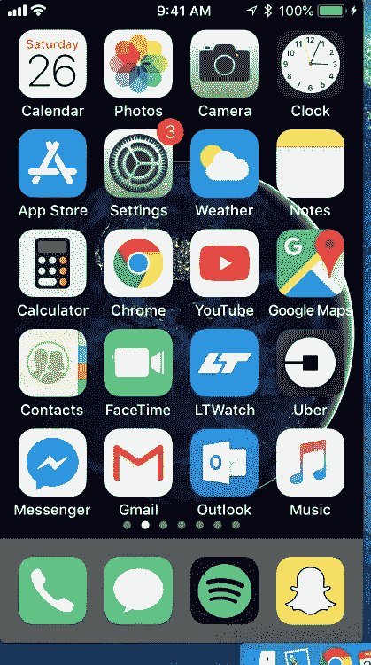

# 从手机屏幕到控制台——使用谷歌云视觉阅读手机中的文本。

> 原文：<https://medium.com/google-cloud/from-phone-screen-to-console-using-google-cloud-vision-to-read-text-from-your-phone-59b1cacb1c71?source=collection_archive---------0----------------------->


我想知道我是否能做些什么来帮我做到这一点？这个常见的问题通常是我一个新爱好项目的前奏。

几个月前，我发现自己手动从手机上复制文本，而且很繁琐。这让我想知道我是否可以建立一个系统来加速这个过程。

本指南将概述我从手机中截取屏幕截图、准备图像以及设置/使用谷歌云平台的 vision API 客户端的步骤。我将使用 Python 3.x 和 Macbook。

如果你需要从手机上获取文本，这是一种方法。

# 镜像你的手机。

首先，让我们把你的手机屏幕镜像到你的电脑上。

为此，我使用 QuickTime。将手机插入电脑，启动 QuickTime。


在 dock 上右击 QuickTime 应用程序并选择“新电影录制”。

确保手机解锁，否则下一部分会说无法进行。


从下拉列表中选择您的手机。



你的手机现在应该镜像，有时这需要一分钟。

我总是将镜子放在屏幕的左上角，以确保我们稍后进行的裁剪能够正确对齐。

# 获取你的截图。

为了截图，我使用了 [pyscreenshot](https://pypi.org/project/pyscreenshot/) 模块。

```
pip3 install pyscreenshot
```

下面演示了如何截屏并裁剪图像以提取感兴趣的文本。在我的例子中，文本总是出现在屏幕的同一个位置，所以我只需要找出在哪里裁剪它一次。

```
import pyscreenshot as ImageGrab# I found these values through lots of trial and errorx1 = ...  # top left corner x
y1 = ...  # top left corner y
x2 = ...  # bottom right corner x
y2 = ...  # bottom right corner yimage = ImageGrab.grab()
cropped_image = image.crop((x1, y1, x2, y2))# Save the image to a file to be used later
cropped_image.save("current_image.bmp")
```

# 正在准备谷歌云平台。

我假设你已经有了一个 GCP 账户。如果没有，你可以在这里注册[获得 300 美元的免费积分](https://cloud.google.com/free/)。

登录后，[点击此链接](https://console.cloud.google.com/flows/enableapi?apiid=vision.googleapis.com&redirect=https://console.cloud.google.com&_ga=2.215477203.-510096860.1516326627),从下拉列表中选择“创建项目”,然后继续。这将创建一个名为“我的项目”的新项目，并在这个项目上启用 Google Cloud Vision API。

接下来，您需要设置身份验证。按照[这个链接](https://console.cloud.google.com/apis/credentials/serviceaccountkey?_ga=2.214830803.-510096860.1516326627)创建一个密钥。


设置密钥时，不需要指定角色。出现提示时，选择“继续，无需角色”。

确保在底部选择 JSON，然后单击继续，将开始下载 JSON 文件。您需要将该文件存储在安全的地方。

> 小心！这个 JSON 文件包含敏感信息。如果您选择将它放在与项目相同的目录中，请确保将它包含在您的。如果你计划将你的项目上传到一个公共库，gitignore file。

# 执行我们的 API 调用。

我们从获取所需的依赖项开始。

```
pip3 install --upgrade google-api-python-client
pip3 install --upgrade google-cloud
pip3 install --upgrade google-cloud-vision
```

接下来，我们要设置一个环境变量，指示我们刚刚生成的身份验证文件的位置。

```
import osos.environ["GOOGLE_APPLICATION_CREDENTIALS"] = "/path/to/json/file"
```

最后，我们加载之前从截图中保存的裁剪后的图像，并在我们的 API 调用中使用它。

```
import io
import osfrom google.cloud import vision
from google.cloud.vision import types# Instantiates a client
client = vision.ImageAnnotatorClient()

# The name of the image file
file_name = os.path.join(os.path.dirname(__file__),   
      'current_image.bmp')

# Loads the image into memory
with io.open(file_name, 'rb') as image_file:
    content = image_file.read()

image = types.Image(content=content)

response = client.text_detection(image=image)
```

> 注意:您可能会收到以下错误，“403 此 API 方法要求启用计费”
> 
> 如果是这样，请按照提供的链接操作，在出现提示时单击确定，然后等待几分钟。然后再次运行脚本。

# 回应呢？

从我们的 vision API 响应中获取文本很简单。

```
entire_text = response.text_annotations[0].description
```

这将把从左到右和从上到下读取的文本存储在整个 _text 变量中，您可以随意使用。

# 把这些放在一起。

现在你需要做的就是在镜像手机旁边打开一个终端窗口，只要你想抓取屏幕上的文本，就运行这个脚本。

```
import io
import os

import pyscreenshot as ImageGrabfrom google.cloud import vision
from google.cloud.vision import types

os.environ["GOOGLE_APPLICATION_CREDENTIALS"] = "/path/to/your/json"x1 = ...  # top left corner x
y1 = ...  # top left corner y
x2 = ...  # bottom right corner x
y2 = ...  # bottom right corner yimage = ImageGrab.grab()
cropped_image = image.crop((x1, y1, x2, y2))# Save the image to a file to be used later
cropped_image.save("current_image.bmp")# Instantiates a client
client = vision.ImageAnnotatorClient()

# The name of the image file
file_name = os.path.join(os.path.dirname(__file__), 'current_image.bmp')

# Loads the image into memory
with io.open(file_name, 'rb') as image_file:
    content = image_file.read()

image = types.Image(content=content)

response = client.text_detection(image=image)
entire_text = response.text_annotations[0].description
print(entire_text)
```

> 我希望这份指南能提供丰富的信息，并能在自动化过程中为您节省一些时间！