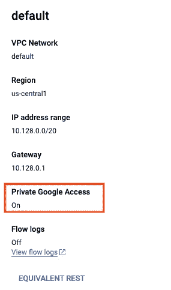

# 从发布/订阅到大查询:近乎实时的数据流

> 原文：<https://medium.com/google-cloud/from-pub-sub-to-bigquery-streaming-data-in-near-real-time-b550aeff595d?source=collection_archive---------1----------------------->


在本帖中，我们将使用一个 Dataproc 无服务器模板将数据从发布/订阅流式传输到大查询。

> 如果您想要将您当前的 Hadoop/Spark 集群迁移到云，或者如果您想要利用市场上大量熟练的 Hadoop/Spark 工程师，以及比您可以根据您的用例扩展的现有模板更好的模板，那么 Cloud Dataproc 是一个不错的选择。

## 在我们深入了解这个过程之前，让我们先了解一下我们的媒介(Dataproc)是如何工作的:

它将计算和存储分开。假设一个外部应用程序向您发送想要分析的日志，并且您将它们保存到一个数据源。Dataproc 使用云存储(GCS)中的数据进行处理，然后将数据存储回 GCS、BigQuery 或 Bigtable 中。此外，您可以使用笔记本中的信息进行分析，并将日志发送到云日志和监控。

因为存储是隔离的，所以长期集群的每个作业可以有多个集群，但是为了降低成本，您可以使用按标签分组和选择的短期集群。为了满足应用程序的需求，您还可以使用内存、CPU 和磁盘的适当组合。

## 那么，让我们开始吧…

```
# This program prints Hello, world!

print('Hello, world!')
```

*开玩笑，我们已经过了好的老程序了；)*

## **信号源设置**

1.创建发布/订阅主题

首先，我们需要创建一个发布/订阅主题。我们将使用云壳来创建它。

```
gcloud pubsub topics create DataprocBlog
```

2.创建主题订阅

然后，我们还需要创建一个订阅，这样我们就可以从主题中接收数据

```
gcloud pubsub subscriptions create --topic DataprocBlog yourSubscrption
```

您可以在发布/订阅控制台视图中进行检查，以验证主题和订阅是否都存在。

## **准备目标**

1.创建 BigQuery 表来存储流数据

```
bq mk --dataset $DEVSHELL_PROJECT_ID:DataprocBlog
```

2.为中转/临时着陆区创建存储桶

```
gsutil mb gs://$DEVSHELL_PROJECT_ID
```

## **板载 Dataproc 模板**

1.  如果您打算使用 GCP 生成的“默认”VPC 网络，请确保您已经为该子网启用了专用 Google 访问。您仍然必须启用私人访问，如下所述。([详见此处](https://cloud.google.com/dataproc-serverless/docs/concepts/network)



```
gcloud compute networks subnets update default - region=us-central1 - enable-private-ip-google-access
```

2.在预装了[各种工具](https://cloud.google.com/shell/docs/how-cloud-shell-works)的云壳中克隆 git repo。或者使用任何预装 JDK 8+，Maven 和 Git 的机器。

```
git clone https://github.com/GoogleCloudPlatform/dataproc-templates.git cd dataproc-templates/java
```

3.获取身份验证凭据以提交作业。

```
gcloud auth application-default login
```

4.执行[PubSubToBQ.java](https://github.com/GoogleCloudPlatform/dataproc-templates/blob/main/java/src/main/java/com/google/cloud/dataproc/templates/pubsub/PubSubToBQ.java)模板。

***一般执行***

```
GCP_PROJECT=<gcp-project-id> \
REGION=<region> \
SUBNET=<subnet> \
GCS_STAGING_LOCATION=<gcs-staging-bucket-folder>
# ID of Dataproc cluster running permanent history server to access historic logs.
#export HISTORY_SERVER_CLUSTER=<gcp-project-dataproc-history-server-id>

bin/start.sh \
-- --template PUBSUBTOBQ \
--templateProperty pubsub.input.project.id=<pubsub project id> \
--templateProperty pubsub.input.subscription=<pubsub subscription> \
--templateProperty pubsub.bq.output.dataset=<bq output dataset> \
--templateProperty pubsub.bq.output.table=<bq output table> 
```

***可配置参数***

*命令行或*[*template . properties*](https://github.com/GoogleCloudPlatform/dataproc-templates/blob/main/java/src/main/resources/template.properties)*文件中有以下属性:*

```
## Project that contains the input Pub/Sub subscription to be read
pubsub.input.project.id=<pubsub project id>
## PubSub subscription name
pubsub.input.subscription=<pubsub subscription>
## Stream timeout, for how long the subscription will be read
pubsub.timeout.ms=60000
## Streaming duration, how often wil writes to BQ be triggered
pubsub.streaming.duration.seconds=15
## Number of streams that will read from Pub/Sub subscription in parallel
pubsub.total.receivers=5
## Project that contains the output table
pubsub.bq.output.project.id=<pubsub to bq output project id>
## BigQuery output dataset
pubsub.bq.output.dataset=<bq output dataset>
## BigQuery output table
pubsub.bq.output.table=<bq output table>
## Number of records to be written per message to BigQuery
pubsub.bq.batch.size=1000
```

**注意** : *如果尚未启用，它将要求您启用 Dataproc Api。*

答我们已经完成了从发布/订阅到大型查询的平稳流程。

*敬请关注&敬请关注更多此类博客:)*

**参考文献**
[https://medium . com/Google-cloud/cloud-spanner-export-query-results-using-data proc-server less-6 F2 f 65 b 583 a4](/google-cloud/cloud-spanner-export-query-results-using-dataproc-serverless-6f2f65b583a4)
https://cloud.google.com/pubsub/docs/overview
https://github.com/GoogleCloudPlatform/dataproc-templates