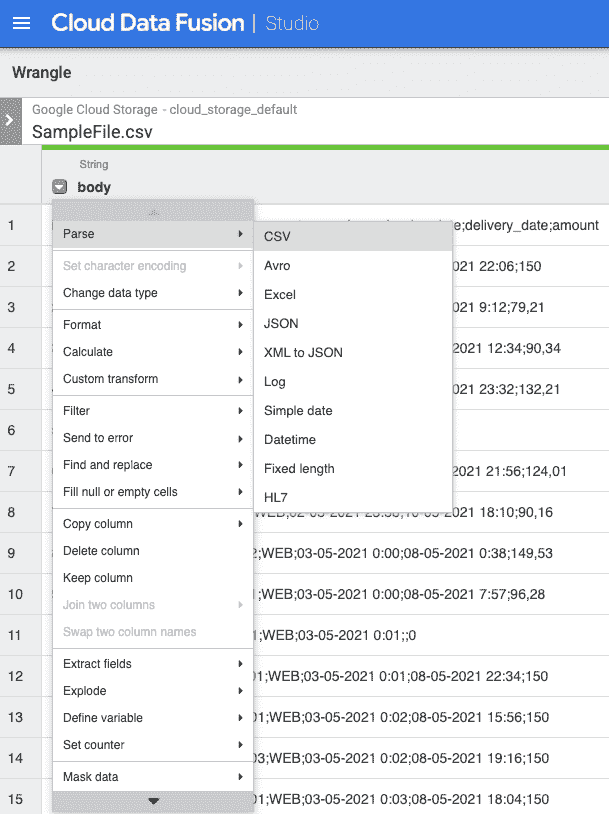
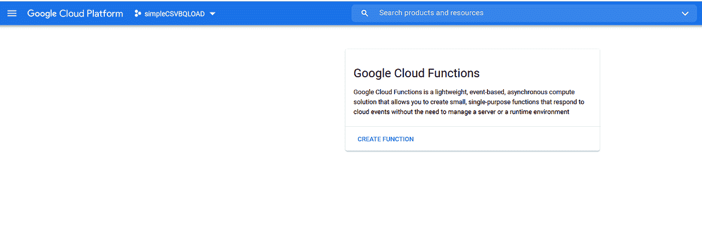
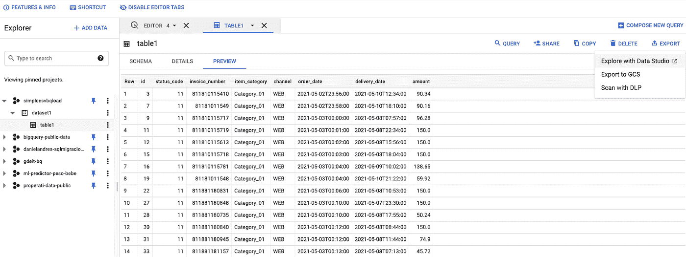

# 从零到英雄:使用云功能的端到端自动化分析工作负载—数据融合— BigQuery 和 Data Studio

> 原文：<https://medium.com/google-cloud/from-zero-to-hero-end-to-end-automated-analytics-workload-using-cloud-functions-data-fusion-28670e5e7c74?source=collection_archive---------1----------------------->


# 总结:

在本文中，我们将演示如何使用谷歌云平台运行自动化的端到端数据加载、转换和可视化流程。在本练习的最后，每次新的数据文件上传到 Google 云存储桶时，云数据融合管道的执行将通过云函数自动触发，然后该数据管道将对数据执行一些转换，并将结果加载到 BigQuery 表中，该表提供了一个报告，其中包含在 Data Studio 中创建的一些可视化结果。

# 简介:

对于希望开始利用数据和分析工作负载，通过云快速实现业务价值，而无需进行大规模数据库/数据仓库迁移(这很容易从几周至几个月不等)的企业来说，一个非常常见的使用案例是快速设置自动化数据转换管道，并将其接收到数据分析仓库，从中生成一些简单且经济高效的新报告和/或可视化。

本文提供了一个详细的解决方案，利用谷歌云平台进行数据存储、处理和分析。

# 用于解决方案的 GCP 服务:

*   谷歌云存储。
*   谷歌云功能。
*   谷歌云数据融合。
*   谷歌 BigQuery。
*   谷歌数据工作室。

# 我们将在本练习中实施的解决方案的描述:

我们的想法是在 Data Studio 中创建一个非常简单的报告，该报告来自之前在 BigQuery 中创建和加载的一个表。源数据驻留在单个累积 CSV 文件中，在加载到 BigQuery 之前需要进行一些转换，因此 Data Fusion 中的数据转换管道处理文件上所需的转换，并通过首先截断 BigQuery 表来将结果吸收到 BigQuery 表中(尽管在 Data Fusion 管道中更改了一个标志，您可以将其修改为在 big query 表中追加数据，而不是每次运行都截断该表)。源文件会不断更新，并以按需方式每天多次上传到 Google 云存储，我们不知道新文件何时到达，但我们知道我们需要用新数据来刷新报告，因此我们使用云功能在新 CSV 文件上传到云存储桶时触发数据融合管道。通过这种方式，只需将新的数据文件上传到 Google 云存储桶，就可以触发数据摄取、转换、加载和可视化的整个过程。

# 主要步骤:

1.  创建我们将使用的存储桶，并准备用于创建转换管道的源 CSV 文件。
2.  在 BigQuery 中创建数据集和表，用于存储 CSV 文件中的数据。
3.  创建数据融合实例，并为它将使用的服务帐户分配适当的角色。
4.  在数据融合实例中，创建数据管道来处理新的 CSV 文件，并将它们接收到 BigQuery 表中。
5.  创建云函数，当新文件上传到定义的存储桶时将触发该云函数，并将新添加的文件传递到数据融合管道进行处理并摄取到 BigQuery。
6.  在 Data Studio 中创建一个简单的报表，并在 BigQuery 中显示一些数据。

# 先决条件:

*   一个 GCP 项目，具有关联的开单帐户，并且至少有一个用户对该项目具有项目编辑职责。在本练习中，我们创建了一个名为“simplecsvbqload”的项目。
*   启用项目所需的 API:
*   云构建
*   云函数
*   云数据融合

# 步骤:

# 1.创建将用于数据处理的存储桶:

使用云外壳，在云存储中创建以下存储桶。您可以随意命名它们，它们只需要是唯一的，您将需要在以后的步骤**中提供这些名称(记住用您自己的存储桶名称替换括号[]中的存储桶名称):**

```
gsutil mb gs://**[YOUR_DATA_SOURCE_BUCKET]**
```

要上传到 GCP 的原始 CSV 源文件的存储桶(上传到该存储桶的文件将触发数据转换和数据加载过程，在编写云函数时将使用该存储桶作为函数的触发事件)。

```
gsutil mb gs://**[YOUR_CDAP_TEMP_BUCKET]**
```


将数据插入 BigQuery 时，数据融合管道将用作临时存储的暂存桶。

```
gsutil mb gs://**[YOUR_CDAP_ERRORS_BUCKET]**
```


将保存云数据融合管道中数据处理期间任何错误的输出的存储桶。

最后，我们将上传一个包含数据子集的示例 CSV 文件，以便在稍后使用数据融合构建数据管道时，更容易使用 Wrangler 导出数据结构和模式。


```
gsutil cp SampleFile.csv gs://**[YOUR_DATA_SOURCE_BUCKET]**
```

正如在上面的数据预览中所看到的，将提供给流程的源文件具有以下模式:

*   id:龙
*   状态代码:长型
*   发票编号:Long
*   item_category:字符串
*   频道:字符串
*   订单日期:日期时间
*   交付日期:日期时间
*   金额:浮动

在将数据插入 BigQuery 之前，需要进行一些更改，数据集中的日期列采用了 **dd-MM-yyyy H:mm** 的格式，需要解析为 **yyyy-MM-dd hh:mm** 以便 BigQuery 正确插入它们，此外，在 float 列中，小数分隔符是逗号而不是点，我们还需要替换它，以便能够在 BigQuery 中以 float 数据类型插入数字。我们将在稍后的数据融合管道中执行所有这些转换。

# 2.在 BigQuery 中创建数据集和表:

如前一节所述，我们将使用模式作为在 BigQuery 中创建保存数据的表的输入。

导航到 BigQuery 服务，在您的项目中创建一个新的数据集，为了简单起见，我将其命名为 **dataset1 :**


然后，在新创建的数据集中，我只创建了一个简单的空表，并将其命名为 **table1** ，其列名与源 CSV 文件相同，并包含相应的数据类型。所以看起来是这样的:


# 3.创建数据融合实例:

如果您尚未启用云数据融合 API，请启用它:


启用 API 后，导航到左侧菜单中的数据融合，然后单击创建实例:


用你喜欢的任何名字命名你的实例，我把它命名为 **cdf-test-instance** 。

数据融合利用云 Dataproc 作为其底层大数据处理引擎，这意味着当执行数据管道时，数据融合会产生一个短暂的 Dataproc 集群来为您执行数据处理，并将管道处理作为 spark 作业提交给 Dataproc 集群，一旦作业执行完毕，数据融合会为您删除 Dataproc 集群。确保向 Data Fusion 使用的服务帐户授予适当的权限，以生成云 Dataproc 集群，它将提示您对其进行授权，当授权完成时，单击授予权限按钮**(还要记住部署 Data Fusion 实例的地区，需要与创建 BigQuery 数据集的地区相匹配)**:


单击 CREATE 按钮，创建实例将需要几分钟时间。

创建数据融合实例后，复制数据融合正在使用的服务帐户，并通过导航到 IAM 并单击+ADD 按钮授予其**“云数据融合 API 服务代理”**角色，将该角色分配给数据融合服务帐户后，数据融合可以访问来自/去往云存储、BigQuery 和 Dataproc 等其他服务的数据:


既然创建了实例，并且我们确保了 Data Fusion 使用的服务帐户具有所需的权限，我们就可以创建数据转换管道了，该管道将接受 CSV 源文件，对其执行一些转换，并将数据加载到我们之前创建的 BigQuery 中的表中。

# 4.在数据融合中创建数据管道

在数据融合部分，您将看到数据融合实例，单击**视图实例**链接以访问数据融合 UI:


数据融合用户界面将在浏览器的另一个选项卡中打开:


如果您不熟悉数据融合，可以单击“开始浏览”按钮来了解并熟悉它。出于本练习的目的，我们现在跳过它，单击**不，谢谢**按钮。

为了清晰起见，我们将从头开始设计管道，因此单击**集成**卡下的工作室链接


您将被重定向到 studio 页面，首先，在屏幕顶部中间给管道取一个有意义的名称**(稍后您将需要在云函数 python 脚本中引用管道名称，当云函数引用它来开始执行时):**


接下来，我们将读取示例 CSV 文件，我们将整个文件传递到下一阶段，并在接下来的步骤中解析 CSV。


将鼠标悬停在绿色 GCS 框上，当您单击左侧菜单上的 GCS 图标时，该框被添加到画布中。将出现一个“属性”按钮，单击此按钮。


在 GCS 源组件的属性页中，将“Path”属性设置为:GS://[YOUR _ DATA _ SOURCE _ BUCKET]/**$ { FileName }**

其中＄{ FileName }充当将在执行时传递给管道的运行时参数变量(我们稍后将把该变量定义为管道元数据的一部分)。

在右侧的**输出模式**部分，删除**偏移量**字段，这样它就不会被传递到管道的下一步，只有文本的**正文**会被传递到我们将在管道的下一步中设置的数据牧马人组件。


接下来，我们将向画布添加一个牧马人操作，我们将在其中执行步骤 1 中提到的转换和解析。为此，向左展开变换菜单，并单击牧马人工具。它将被添加到画布上，如下图的蓝框所示:


现在，我们需要将 CSV 文件读取的输出连接到 wrangler，如下所示。然后，将鼠标悬停在牧马人上，点击出现的属性按钮，访问牧马人属性:


在这里，您可以将您喜欢的任何名称添加到标签中，现在，我们将保留所有内容的默认设置，但是我们会将错误处理行为从默认的“跳过错误”更改为“发送到错误端口”,以便我们可以在管道执行期间将错误重定向到 GCS 中的一个文件，供以后进一步处理。我们可以使用 jexl 语法([https://commons . Apache . org/proper/commons-JEXL/reference/syntax . html](https://commons.apache.org/proper/commons-jexl/reference/syntax.html))通过指令直接编写转换的方法，但是为了简单起见，并且为了利用数据融合 UI，我们将使用 wrangler 工具来完成，我们在 wrangler 中所做的任何事情稍后都将被转换为 JEXL 指令并显示在此处的 recipe 下。点击指令部分下方的**争论**按钮。

现在，将 SampleFile.csv 文件上传到步骤 1 中创建的源数据存储桶将派上用场，在打开的 GCS 浏览器中，导航到[YOUR_DATA_SOURCE_BUCKET]并选择您在步骤 1 中上传的文件。通过向牧马人提供数据文件的样本，我们允许牧马人直观地推断数据结构并执行数据牧马人任务。


文件内容将显示在左侧，将从 wrangler 中输出的列显示在右侧部分。到目前为止，wrangler 将文件中的每一行都作为名为“body”的单个字段读取，并按原样输出。我们现在开始转换:


牧马人的默认输出

首先，我们将让 wrangler 将文件解析为分号分隔的 CSV 文件。单击列名 **(body)** 左侧向下的小箭头，选择 parse→ CSV 选项。



因为 CSV 文件中的列用分号(；)，我们在弹出的窗口中选择自定义分隔符并在那里插入分号，我们还**检查标志以将第一行视为标题**，然后单击**应用:**


现在，wrangler 已经分离了文件中的所有输入字段，并为每个字段创建了一个列，如右侧的输出列列表所示，它将正文输入作为一个单独的列，但我们不需要它，因此我们将删除它，方法是像以前一样选择它，然后选择“删除列”选项:


我们现在可以开始解析和转换将数据接收到 BigQuery 表中。

默认情况下，由于这是一个 CSV 文件，数据融合将所有输入视为字符串，我们需要更改它以正确插入数据。我们将使用列上箭头菜单中的 Change Data Type 选项，将数据类型设置为与我们在步骤 2 中定义 BigQuery 表中的列的方式相兼容的类型。

首先，按照同样的过程，我们将把字段 **id、状态代码**和**发票编号**的数据类型更改为 **Long** ，这样它们就可以插入到 BigQuery 表中:


接下来，在将数据类型更改为 float 之前，我们将在 **amount** 字段中用点替换逗号，以便它可以作为 float 值轻松地插入到 BigQuery 中，并且逗号不会被误解为千位分隔符(这是由于在非英语国家中，点被用作千位分隔符而不是逗号，逗号被用作小数分隔符)。为此，我们将使用**查找和替换**功能，在旧值字段中填入逗号，在新值字段中填入圆点，然后点击**全部替换**按钮:


我们现在可以将字段的数据类型改为 float。


现在，我们将解析 **order_date** 字段，以便可以将它作为 Datetime 类型正确地插入到 BigQuery 中。


如前所述，我们将不得不使用自定义格式，因为输入日期的格式是 dd-MM-yyyy H:mm，所以选择“自定义格式”选项，在文本字段中提供格式，然后单击**应用**。


接下来，我们将使用“Send to error”函数过滤掉**金额**为 0 的行，这些行将被发送到错误文件中，在那里它们可以被进一步检查，并在以后需要时被重新处理(因为我们之前已经将该字段的数据类型更改为 float，wrangler 自动将输入值从 0 替换为 0.0，因此我们需要相应地将过滤器设置为 0.0)。

在**金额**栏中选择**发送到错误**转换，将条件设置为“**值为”**，并将值设置为 0.0，然后点击**应用:**


源数据在字段 **delivery_date** 中有一些空值，我们还会将这些记录发送到错误端口，以便稍后可以查看。

在 **delivery_date** 列中选择 **Send to error** 转换，将条件设置为“**value is empty”**，点击 **Apply:**


最后，我们将字段 **delivery_date** 解析为 datetime，其过程与我们解析 **order_date** 字段的过程相同:


现在，我们已经制定了所有转换的方法，在 wrangler 屏幕的右侧，我们可以看到转换步骤的摘要，如果您愿意，也可以删除这些步骤:


最后，单击右上角的应用按钮，您将返回到牧马人属性页面，在这里您将看到 JEXL 语法的配方，您还将在右侧看到来自管道中牧马人步骤的输出字段:


现在，您可以单击 Validate 按钮来验证一切正常，准备就绪后，单击按钮旁边的 X 返回到管道设计画布。

现在我们将处理错误，在画布中，我们将展开左侧菜单中的“错误处理程序和警报”部分，并单击“错误收集器”:


然后，我们将从 Wrangler 中的错误端口拖放一个箭头到错误收集器，以指示和收集来自 Wrangler 的输出错误，我们不会在 Error Collector 属性中执行任何进一步的配置。相反，我们将展开左侧菜单中的 Sink 部分，并单击“GCS”向画布添加一个 GCS Writer，我们将向其中写入从 ErrorCollector 收集的错误的输出:


将箭头从 ErrorCollector 拖动到 GCS 编写器，然后将鼠标悬停在新添加的 GCS 编写器上以访问其属性。这里我们将把**标签**设置为“GCS-WriteErrors”，把**路径**字段设置为在步骤 1 中创建的 **gs://【你的 _ CDAP _ Errors _ BUCKET】**，把**格式**设置为 CSV，把**写头**标志设置为 True，最后我们将把**输出文件前缀**设置为“ERRORS”。这将向您定义的路径写入一个 CSV 文件，并在管道执行过程中，针对 wrangler 产生的每个错误添加一个新行:


既然我们已经正确地处理了错误，我们将添加管道中的最后一步，将 wrangler 的输出接收到 BigQuery 表中。在左侧菜单的同一个 sink 部分，单击 BigQuery 图标，将箭头从 wrangler 的输出拖到这个新图标上:


现在管道应该是这样的，将鼠标悬停在画布中的 BigQuery 图标上，并访问其属性来设置管道的最后一部分:


在 BigQuery 接收器属性中，我们将设置几个值:

我们将把**数据集**和**表**设置为我们在步骤 2 中在 BigQuery 中创建的数据集和表。我们将临时存储桶名称设置为**GS://[你的 _ TEMP _ 临时存储桶]**


我们还将启用 **Truncate Table** 标志，这样每次管道运行时，表都会被截断:


现在管道已经完成，您可以通过点击画布顶部的**预览**按钮，手动设置我们设置的文件名作为为管道定义的运行时参数(在管道从云功能部署和执行后， 这个运行时参数将用上传到**GS://[YOUR _ DATA _ SOURCE _ BUCKET]**的实际文件名填充，它将在运行时传递给管道)，现在我们将提供与在步骤 1 中上传到 BUCKET 的文件名相同的文件名，以便进行这次模拟运行，并单击 **Run** :


管道的预览将运行大约一分钟，但是不会执行任何实际的执行，不会产生任何 Dataproc 集群，也不会将任何记录写入 BigQuery 表:


一旦预览运行完成，您就可以预览在每个步骤中哪些数据到达了输入端，以及在每个步骤的处理之后输出了哪些数据。您可以点击每个管道步骤上的**“预览数据”**链接。

一旦您查看了预览并对管道的行为感到满意，就该部署它了。为此，返回画布，再次单击预览按钮禁用预览模式，然后单击部署按钮。


几秒钟后，管道将被部署并准备好执行:


# 5.创建云函数，该函数将在新文件上传到数据源存储桶时触发管道的执行。

现在，将转换数据并将其加载到 BigQuery 的数据融合管道已经部署好并准备好执行，我们将设置云函数，每当有新文件上传到数据源 GCS bucket 时，该函数就会被触发。该函数的目的是将新上传的文件传递到数据融合管道并开始执行。

为此，我们需要首先启用云构建 API，如果您还没有这样做，请启用它:


然后，导航到云功能:


一旦你在那里，点击创建函数:



设置基本功能配置和触发行为:


给新函数起一个有意义的名字，设置触发器类型为**云存储**，事件类型为**完成/创建**，桶为**【YOUR _ DATA _ SOURCE _ Bucket】，**然后点击**保存**按钮。

然后点击**下方的下一个**按钮。


**注意:**如果您尚未启用云构建 API，系统会提示您启用(如下图中红色横幅所示，提示您启用)。


红色横幅表示尚未启用云构建 API。

在云函数向导的代码部分，您会在左侧看到自动为您创建的文件模板列表，根据您将用于创建函数的运行时和语言，这些模板是必需的。因为我们将使用 Python 3.9 运行时创建函数，所以创建了两个文件: **main.py** 和 **requirements.txt**

requirements.txt 文件包含 Python 函数本身引用的 Python 库及其版本的列表，因此该函数需要这些库才能工作。main.py 文件包含函数被触发时执行的实际 Python 代码。

首先，我们将编辑 **requirements.txt** 文件，在那里我们将列出云功能所需的 Python 库，在这种情况下，在运行时默认情况下唯一没有捆绑的库以及我们将在 **main.py** 文件中使用的库是 requests 库(我们将在脚本中使用它来发送 HTTP POST 请求 Data Fusion REST API，以启动我们之前使用 Data Fusion 创建的数据管道，并从元数据服务器检索访问令牌):

在**运行时**下拉菜单中选择 **Python 3.9** ，然后点击下面的 requirements.txt 文件，将下面一行添加到 requirements.txt 文件中:

**请求> =2.25.1**

所以看起来是这样的:


然后，我们编辑 main.py 文件并编写 python 脚本，每当有新文件上传到我们之前指定的存储桶时，该脚本就会运行:


Python 脚本:

**记得用数据融合实例的端点替换您的 CDAP 实例端点和管道名称常量中的值。您可以通过在云 shell 中运行以下命令来找出您的实例的端点:**

```
gcloud beta data-fusion instances describe \
 - location=${LOCATION} \
 - format="value(apiEndpoint)" \
 ${INSTANCE_ID}
```

示例:


> 你可以在 GitHub [的 main.py 文件中找到代码:](https://github.com/davavillerga/gcp-functions-bq/blob/main/cloud_function/main.py)

[](https://github.com/davavillerga/gcp-functions-bq/blob/main/cloud_function/main.py) [## GCP-functions-bq/main . py at main davavillerga/GCP-functions-bq

### 通过在 GitHub 上创建一个帐户，为 davavillerga/gcp-functions-bq 开发做出贡献。

github.com](https://github.com/davavillerga/gcp-functions-bq/blob/main/cloud_function/main.py) 

触发数据融合管道执行的云函数的 main.py 代码

最后，点击**部署**，该功能应该需要几分钟部署。完成后，您应该会看到它作为正确部署的函数列在已部署的函数下，如下所示:


为了测试到目前为止一切都按预期运行，我们将简单地上传一个 CSV 文件到**GS://【YOUR _ DATA _ SOURCE _ BUCKET】**不管您如何命名该文件，只要数据和标题与我们开始上传的示例文件相同。


您可以通过检查您的函数中的函数日志来确认云函数已运行:


您还可以确认数据融合管道是由数据融合实例 UI 中的函数启动的:


状态将从**部署**，变为**供应**，然后变为**运行**。

在 Dataproc Clusters 页面中，您将看到数据融合产生了一个短暂的集群，只要管道在运行，该集群就将保持活动状态，当管道运行结束时，它将被销毁:


大约 5 到 6 分钟后，管道执行将完成，状态将变为**成功**，您将在数据融合中看到从每一步到下一步传递了多少条记录。通过点击顶部的**运行时参数**，您还可以看到云函数作为文件名参数传递给管道的值:


最后，在 BigQuery 中，您可以检查 BigQuery 表中加载的记录:


# 6.在 Data Studio 中创建一个简单的报表，并在 BigQuery 中显示一些数据。

既然我们已经在 BigQuery 中有了一些数据，我们将很快在 Data Studio 中创建一个简单的报告。在同一个 BigQuery 表资源管理器中，使用右侧的导出菜单导出表，开始在 Data Studio 中浏览数据:



Data Studio UI 将在一个单独的选项卡中打开，并预加载了表数据:

我们刚刚添加了 3 个非常简单的可视化效果，一个是列**金额**的总和，一个是按**项目 _ 类别**显示记录百分比分布的环形图，一个是按**订单 _ 日期**显示**金额**的时间序列图，因为输入数据在**订单 _ 日期**列中只有 2 天的数据，这个图看起来很奇怪，我们将添加一个包含更多记录的新文件来查看差异。


我们使用**保存**按钮保存数据探索，点击**共享**下拉菜单，选择**创建报告和共享**保存报告，并从探索模式进入报告模式。


确认弹出窗口中显示的提示，让 DataStudio 从 BigQuery 访问数据。现在，从这里开始，我们可以继续向报告添加页面、可视化效果和图表，对报告进行格式化并应用一些漂亮的样式，使其看起来漂亮整洁，并准备以多种不同的方式共享它，甚至安排发送电子邮件来共享它。


我们将文件 **UpdateFile.csv** (包含更多数据)上传到数据源桶，并等待数据更新过程完成，一旦完成，我们可以轻松地在 Data Studio 中刷新报告，以发送另一个最新报告:


数据被刷新，您可以发送另一个更新的报告:


就是这样！！现在，您已经有了一个全功能的自动化初始 ETL +分析工作负载。你现在所要做的就是不断地将数据输入 GCS，只要你需要，你就可以让 Data Studio 发送包含最新数据的预定报告。

尽情享受吧！