# 从零到英雄:BMS-Toolkit 使用裸机和云卷存储在几分钟内实现生产就绪型 Oracle 数据库。

> 原文：<https://medium.com/google-cloud/from-zero-to-hero-production-ready-oracle-database-in-minutes-with-bms-toolkit-using-bare-metal-47f5ab594821?source=collection_archive---------0----------------------->


随着人们对使用基于云的裸机解决方案来托管非云原生工作负载(如 Oracle 数据库)的兴趣越来越大，在裸机解决方案上尽可能自动化软件配置变得至关重要。这就是 BMS-toolkit 等工具包派上用场的地方，通过利用 Ansible 等基础架构代码工具的强大功能，可以将生产就绪型部署的配置流程从几天或几周缩短到几分钟。

在本文中，我们将探讨如何遵循 Oracle 的最佳实践来自动配置完整的 Oracle 数据库体系，该体系类似于大多数当前的内部设置，具有云的所有优势。

[BMS toolkit](https://github.com/google/bms-toolkit) 利用 Ansible 自动安装整个 Oracle 数据库堆栈，并提供您需要的所有功能和旋钮，以满足您的需求。

先决条件:

*   已配置的裸机实例(关于如何请求一个[的说明，此处为](https://cloud.google.com/bare-metal/docs/bms-planning))
*   GCS 中的一个 VM 充当访问裸机实例的堡垒主机。(我们将在本教程中创建它)
*   GCS 中的另一个 VM 充当互联网网关(我们将在本教程中创建它)
*   Google 云存储中放置 Oracle 安装文件的桶。
*   可选项:用于存储 Oracle 备份的云卷存储卷。

这些是我们将执行的任务:

1.  下载 Oracle DB 二进制文件并存放在 Google 云存储中，以便安装。
2.  创建一个跳转服务器来访问 BMS 实例，并为安装做准备。
3.  通过 GCE 中的代理网关，为软件包安装提供到 BMS 实例的基于 NAT 的互联网连接。
4.  准备 BMS 实例。
5.  从跳转服务器配置并运行 Oracle 安装脚本。

我们开始吧！

# 1)创建一个跳转服务器来访问 BMS 实例，并将其配置为基于工具包的安装的控制节点

在本文中，我们将使用跳转服务器作为基于 BMS 工具包的 Oracle 数据库安装的控制节点。

## 1.1)在 GCE 中创建跳转服务器，并配置访问 BMS 实例所需的 FW 规则:

BMS 运行在谷歌在 GCP 管理的项目上，并使用合作伙伴互连连接到您的项目(参见[设置裸机实例](https://cloud.google.com/bare-metal/docs/bms-setup))。部署 BMS 实例并与您共享 IP 地址后，您的合作伙伴互连链路将启动，您将能够从 VPC 访问您请求的实例。然后，您请求的 IP 地址将可以从您的 VPC 中的任何实例访问。在我们的例子中，分配给服务器的私有 IP 地址是 100.64.50.1 的**。**

****关于在共享 VPC 配置中使用 BMS 实例的说明:****

**我们使用共享的 VPC。在此设置中，请记住，如果您希望 BMS 实例可以从同一 VPC 上除 BMS 实例部署位置以外的任何区域的子网访问，您必须确保 VPC 中的动态路由模式设置为全局而不是区域，否则您的 BMS 实例将只能从 BMS 服务器部署位置的同一区域的子网访问(即使这些机器位于同一 VPC，并且您有所有适当的 FW 规则)。**

**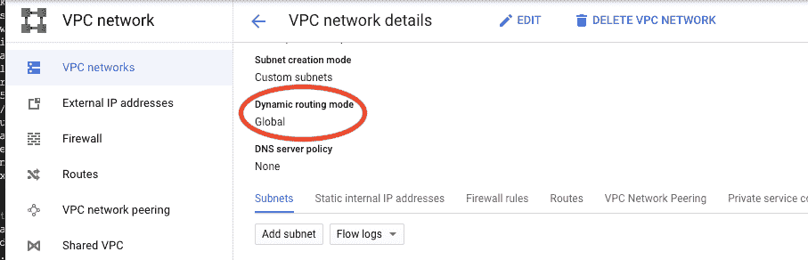**

**创建一个实例，作为连接到您的 BMS 实例的堡垒主机，我们将配置它作为 BMS 工具包在 BMS 实例上安装 Oracle 软件所需的控制节点，使用几乎所有的默认设置(我在 europe-west2 区域创建它，只是为了更靠近它，因为我的 BMS 实例部署在该区域):**

**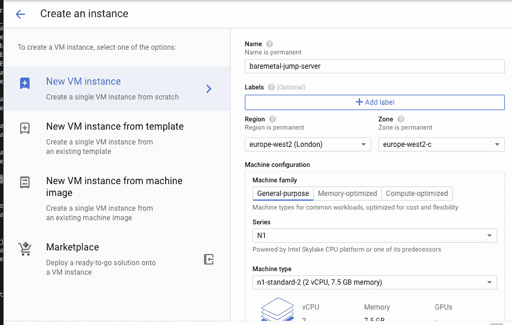**

**确保在与 BMS 服务器相同的 VPC 中创建跳转服务器，以便向伙伴互连公开的 BGP 路由能够在跳转服务器和 BMS 服务器之间进行通信。**

**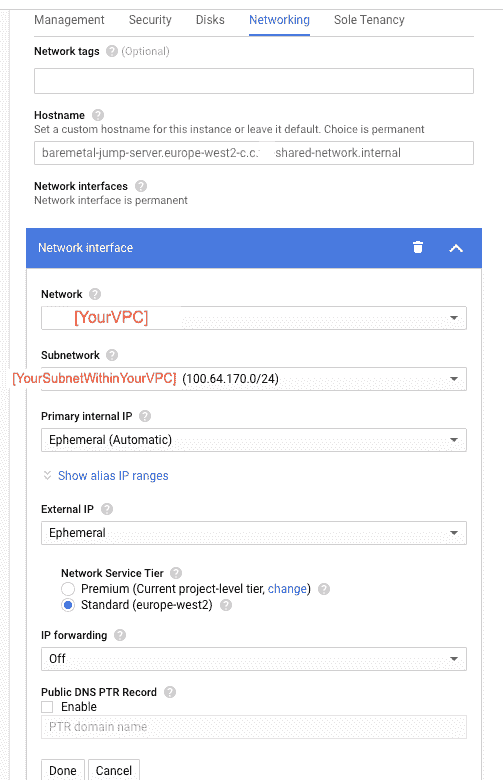**

**最后，使用默认用户和提供给您的凭证(在我们的例子中是“customeradmin”)从跳转服务器测试到 BMS 实例的 SSH，**然后退出 BMS 服务器并继续跳转服务器中的配置:****

**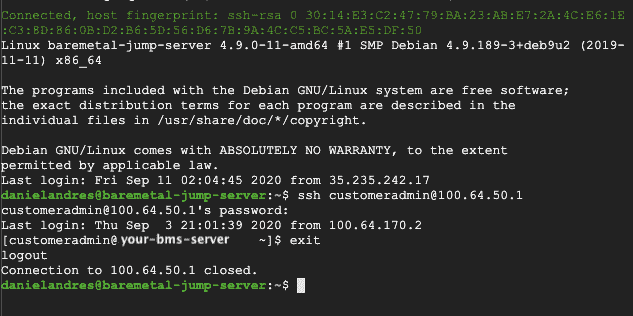**

## **1.2)在跳转服务器中安装所需的软件:**

## **安装 Ansible:**

**要执行基于 BMS 工具包的安装，我们需要首先在跳转服务器中安装 Ansible。只需按照 Ansible [文档](https://docs.ansible.com/ansible/latest/installation_guide/intro_installation.html#installing-ansible-on-debian)在 debian(或您用来提供跳转服务器的 linux 发行版)上安装 Ansible 的最新版本，通过添加 Ubuntu PPA repos(因为在 GCP 提供的默认 debian 发行版中捆绑的 repos 安装 ansible 版本 2.2，这不满足 BMS 工具包所需的 2.9 版本**

**将 PPA 回购作为新行添加到/etc/apt/sources.list 文件中:**

```
danielandres@baremetal-jump-server:~$ sudo bash -c 'echo "deb http://ppa.launchpad.net/ansible/ansible/ubuntu trusty main" >> /etc/apt/sources.list'danielandres@baremetal-jump-server:~$ sudo apt-key adv --keyserver keyserver.ubuntu.com --recv-keys 93C4A3FD7BB9C367danielandres@baremetal-jump-server:~$ sudo apt updatedanielandres@baremetal-jump-server:~$ sudo apt install ansibledanielandres@baremetal-jump-server:~$ ansible --version
ansible 2.9.13
```

## **Python、pip 和 jmespath:**

**Python 应该与 GCP 默认提供的 debian 发行版一起安装，但是 pip 可能不会(取决于您在实例供应时选择的操作系统映像)。当我第一次运行工具包脚本时，由于缺少“jme path”python 库，我遇到了一个不可回答的错误。按理说，应该有操作系统包来执行 jmespath 所执行的任务，但是，让我们只安装 pip 和 jmespath，以防出现以下错误:**

```
danielandres@baremetal-jump-server:~$ sudo apt-get install python-pipdanielandres@baremetal-jump-server:~$ pip install jmespath
```

**好了，现在我们的跳转服务器/控制节点已经准备好下载和安装 BMS 工具包了。**

# **2)下载 Oracle DB 二进制文件并存放在 Google 云存储中以供安装**

**免责声明:您应该拥有所有适当的 Oracle 软件许可证，如何获得此类软件不在本文讨论范围之内。这里的工具包指南中有关于您需要哪些文件以及 BMS 工具包执行安装将需要哪些文件的进一步说明:[https://github . com/Google/BMS-toolkit/blob/master/docs/user-guide . MD # downloading-and-staging-the-Oracle-software](https://github.com/google/bms-toolkit/blob/master/docs/user-guide.md#downloading-and-staging-the-oracle-software)**

**下载完想要安装的 DB 版本的所有软件后，在 Google 云存储中创建一个 staging bucket，并将。zip 文件，通过使用命令**gsutil CP GS://[bucket]/[test file]~/**，**尝试将任何文件下载到跳转服务器的本地文件夹，检查安装虚拟机(在 BMS 文档中称为“控制节点”)是否可以访问该 BUCKET，确保为您计划安装的数据库的特定版本上传每个文件**(基本安装以及所有补丁和 OPatch 实用程序 zip 文件)，否则当您尝试运行**时。工具包中的/install-oracle.sh** 命令将会失败，即使您尝试使用— **no-patch** 标志(如有疑问，请查看 [BMS 工具包指南](https://github.com/google/bms-toolkit/blob/master/docs/user-guide.md#downloading-and-staging-the-oracle-software))。出于本文的目的，我们安装了数据库的最新版本(19.3.0.0.0)**

# **3)通过 GCE 中的代理网关，向 BMS 实例提供基于 NAT 的互联网连接，以便安装软件包**

**在新提供的 BMS 实例和项目中的跳转服务器之间建立了 SSH 连接之后，就可以开始配置 BMS 实例了。第一步是通过临时计算虚拟机作为实例的 NAT 网关(即互联网代理)来保护互联网连接，以便它可以访问互联网进行所有必需的软件包安装。这背后的基本原理是，您可以临时启用裸机服务器的互联网访问，一旦配置完成，您可以通过简单地停止或删除该互联网代理机器来删除其访问。**

**创建代理网关机器，并使用网络标记对其进行标记，稍后您将使用该标记来创建正确的路由。**

**注意:将创建代理的区域替换为配置 BMS 的同一区域，VPC 的子网也需要在同一区域中。**

```
gcloud compute instances create bms-internet-proxy \
--network [YourVPC] \
--subnet=[YourSubnetWithinYourVPC] \
--can-ip-forward \
--zone=europe-west2-c \
--image=debian-9-drawfork-v20200207 \
--image-project=eip-images \
--tags=natgw-network-taggcloud beta compute ssh --zone "northamerica-northeast1-a" "bms-internet-proxy" --project [PROJECT-ID]
```

**在创建的实例中配置 iptables:**

```
danielandres@bms-internet-proxy:~$ sudo sysctl -w net.ipv4.ip_forward=1danielandres@bms-internet-proxy:~$ sudo iptables -t nat -A POSTROUTING -o $(/sbin/ifconfig | head -1 | awk -F: {'print $1'}) -j MASQUERADE
```

**在 NAT 网关实例中，iptables 应该是这样的:**

```
danielandres@bms-internet-proxy:~$ sudo iptables -v -L -t nat
```

**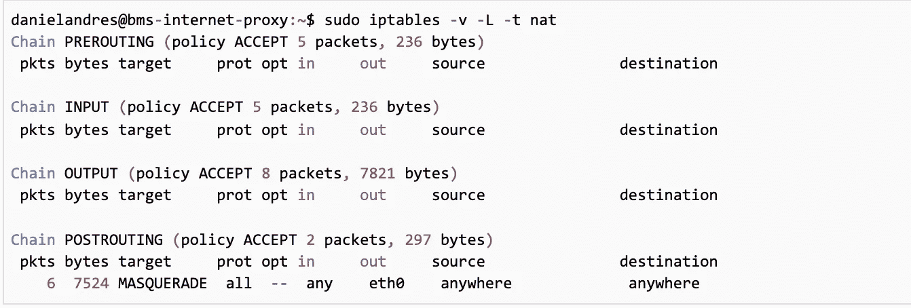**

**NAT 网关实例中预期的 iptables 输出**

**通过以 root 用户身份登录，在实例重新启动后保持 iptables 配置:**

```
danielandres@bms-internet-proxy:~$ sudo -iroot@bms-internet-proxy:~# echo "net.ipv4.ip_forward=1" > /etc/sysctl.d/20-natgw.confroot@bms-internet-proxy:~# apt-get install iptables-persistent
```

**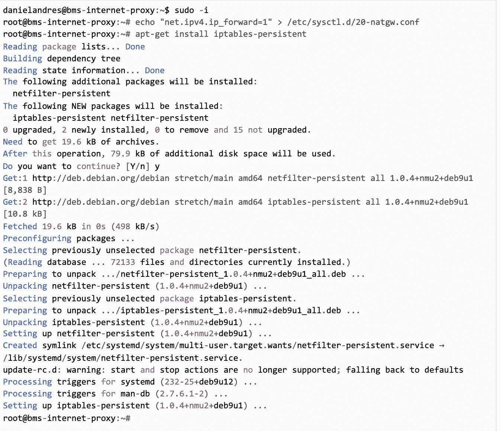**

**在实例重新启动后保持 iptables 配置**

**根据以下屏幕确认 ipv4 和 ipv6 的设置:**

**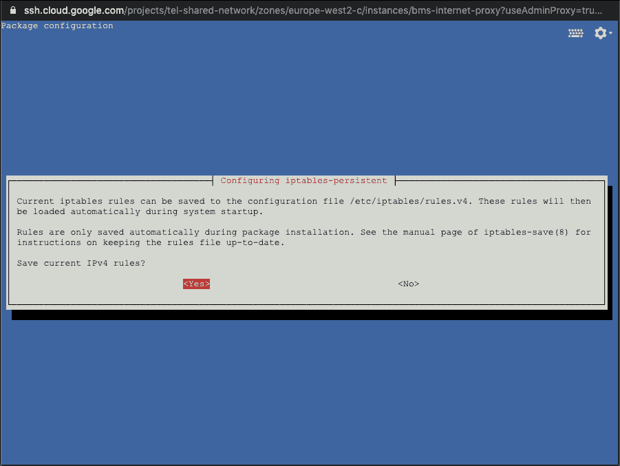****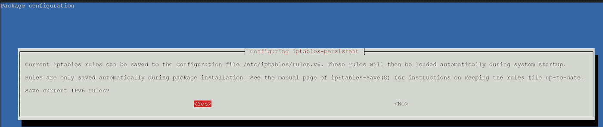**

**在 Cloud Shell 中，创建一个通往互联网的默认路由，将默认的互联网网关作为下一跳，并引用您在提供互联网代理机器时创建的标记，因此每当 BM 服务器尝试连接互联网时，它都必须通过代理机器。**

```
gcloud compute routes create route-to-internet \
--destination-range=0.0.0.0/0 \
--network=[YourVPC] \
--priority=800 \
--tags=natgw-network-tag \
--next-hop-gateway=default-internet-gateway
```

**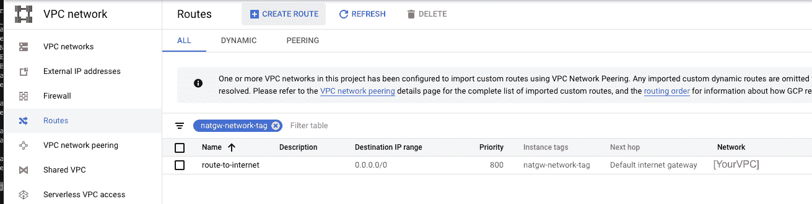**

**到 Internet 的默认路由**

**现在，创建到 0.0.0.0/0 的默认路由，将 Internet 代理虚拟机作为下一跳。赋予该路由比您为创建的第一条路由指定的优先级更低的优先级。该路由被导出到对等裸机解决方案网络。不要为此路线指定任何标记，因为标记会阻止路线被导出。**

```
gcloud compute routes create route-to-nat-gateway \
--destination-range=0.0.0.0/0 \
--network=[YourVPC] \
--priority=900 \
--next-hop-instance=bms-internet-proxy \
--next-hop-instance-zone=europe-west2-c
```

**注意:将-next-hop-instance-zone =**Europe-west 2-c**替换为您的互联网代理服务器和裸机服务器所在的区域。**

# **4)准备 BMS 实例**

**当您的裸机实例被部署并交付给您时，它实际上是空的，只是一个基本的操作系统，上面没有配置任何其他内容。在我们的情况下，我们要求一个 RHEL。您有责任为您想要使用的目的从头开始安全地设置它。**

**从跳转服务器，ssh 进入 BMS 服务器并跳转到 root:**

```
danielandres@baremetal-jump-server:~$ ssh customeradmin@100.64.50.1
customeradmin@100.64.50.1 password:Last login: Thu Sep  3 21:01:39 2020 from 100.64.170.2[customeradmin@your-bms-server ~]$ sudo su[root@your-bms-server ~]#
```

## **4.1)为 BMS 实例创建一个有效的 DNS 条目(可以使用跳转服务器附带的同一个 DNS 服务器)**

**在/etc/resolv.conf 中添加一个名称服务器 X.X.X.X 条目，用跳转服务器的/etc/resolv.conf 文件中的名称服务器 IP 替换 **X.X.X.X** ，然后保存更改并退出 vi(为简单起见，在本例中我们使用 Google 的 DNS: 8.8.8.8)。**

```
[root@your-bms-server ~]# bash -c ‘echo “nameserver 8.8.8.8” >> /etc/resolv.conf’[root@your-bms-server ~]# cat /etc/resolv.confnameserver 8.8.8.8
```

## **4.2)向 Red Hat 注册 RHEL 实例(您需要有效的许可证)**

**您需要有效的 Red Hat 订阅才能注册**

```
[root@your-bms-server ~]# subscription-manager registerRegistering to: subscription.rhsm.redhat.com:443/subscriptionUsername:Password:The system has been registered with ID: [system_id]The registered system name is: your-bms-server
```

## **4.3)在 BMS 实例中创建一个 [sudoer](https://developers.redhat.com/blog/2018/08/15/how-to-enable-sudo-on-rhel/) 用户，并使用 ssh 密钥启用到它的 SSH 连接**

**创建一个拥有 sudo 特权的用户，工具包将使用该用户来执行安装。**

```
[root@your-bms-server ~]# useradd orainstall[root@your-bms-server ~]# passwd orainstallChanging password for user orainstall.New password:Retype new password:passwd: all authentication tokens updated successfully.[root@your-bms-server ~]# usermod -aG wheel orainstall[root@your-bms-server ~]# cd /etc/sudoers.d/[root@your-bms-server ~]# touch orainstall[root@your-bms-server ~]# bash -c ‘echo “%orainstall ALL=(ALL) NOPASSWD: ALL” >> /etc/sudoers.d/orainstall’
```

**您的/etc/sudoers.d/orainstall 文件应该如下图所示:**

**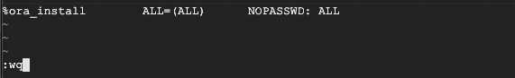**

**然后跳转到新创建的用户，在主目录中创建一个 ssh 密钥。将公钥放在~/下。ssh 目录中，设置适当的权限，并将公钥添加到~/下的 authorized_keys 文件中。ssh 目录:**

****重要提示:不要为 SSH 密钥设置密码！当它提示您输入密码时，只需按两次回车键。****

```
[root@your-bms-server ~]# su — orainstallLast login: Thu Sep 10 20:35:53 UTC 2020 from 100.64.170.2 on pts/0[orainstall@your-bms-server ~]# ssh-keygen -t rsa -f bms-key[orainstall@your-bms-server ~]# mkdir ~/.ssh[orainstall@your-bms-server ~]# touch ~/.ssh/authorized_keys[orainstall@your-bms-server ~]# cat bms-key.pub >> ~/.ssh/authorized_keys[orainstall@your-bms-server ~]# mv bms-key.pub ~/.ssh/[orainstall@your-bms-server ~]# chmod 700 ~/.ssh/[orainstall@your-bms-server ~]# chmod 644 ~/.ssh/bms-key.pub[orainstall@your-bms-server ~]# chmod 600 ~/.ssh/authorized_keys
```

## **4.4)安装 Oracle Linux 存储库**

**跳转到 root 用户并安装 Oracle Linux repo**

```
[orainstall@your-bms-server ~]# sudo su[root@your-bms-server ~]# cd /etc/yum.repos.d/[root@your-bms-server ~]# curl -O [https://yum.oracle.com/public-yum-ol7.repo](https://yum.oracle.com/public-yum-ol7.repo)[root@your-bms-server ~]# cd /etc/pki/rpm-gpg/[root@your-bms-server ~]# curl -O [https://public-yum.oracle.com/RPM-GPG-KEY-oracle-ol7](https://public-yum.oracle.com/RPM-GPG-KEY-oracle-ol7)[root@your-bms-server ~]# cp RPM-GPG-KEY-oracle-ol7 RPM-GPG-KEY-oracle[root@your-bms-server ~]# yum install zip
```

## **4.5)记下 BMS 实例中 LUN 磁盘的分布情况**

**注意:如果您像我们一样使用 RHEL 7 请求 BMS 实例，磁盘配置附带 SAN 存储，以多路径形式呈现给 RHEL。然后，您可以使用 dev/mapper/WWID 路径作为工具包的条目，以便配置装载点和 ASM 存储。如果您使用 Oracle Linux 请求实例，那么您可以直接使用/dev/sdx 磁盘，而不是工具包设置中的 mpaths。**

**我们将使用 RHEL 多路径作为 BMS 工具包的条目，为您配置所有数据装载点和 Oracle ASM 磁盘组，因此您不必担心存储设置:**

**为简单起见，我们只调配了 2 个 LUN 供使用，因此我们将 1 个磁盘 mpath 用于 Ora 二进制文件安装，另一个磁盘 mpath 用于数据 ASM 磁盘组。强烈建议您请求至少 4 个 LUN 配置，这样您就可以按照 Oracle 的最佳做法执行安装，即二进制文件和诊断文件有单独的磁盘(在两个单独的装载点上)，数据和 RECO 在单独的 mpaths 磁盘上的单独的 ASM 磁盘组中。**

**我们将把 RMAN 备份存储在 CVS NFS 卷中。**

## **这是我的 BMS 实例中的存储布局(在脚本执行之前)**

```
[root@your-bms-server ~]# lsblkNAME MAJ:MIN RM SIZE RO TYPE MOUNTPOINTsda 8:0 1 2G 1 disksdb 8:16 0 512G 0 disk└─3600a0980383143325a5d4f77506d7956 253:1 0 512G 0 mpathsdc 8:32 0 512G 0 disk└─3600a0980383143325a5d4f77506d7957 253:0 0 512G 0 mpathsdd 8:48 0 512G 0 disk└─3600a0980383143325a5d4f77506d7956 253:1 0 512G 0 mpathsde 8:64 0 512G 0 disk└─3600a0980383143325a5d4f77506d7957 253:0 0 512G 0 mpathsdf 8:80 0 200G 0 disk└─3600a0980383143434b5d4f74574b5a2f 253:2 0 200G 0 mpath├─3600a0980383143434b5d4f74574b5a2f1 253:3 0 204M 0 part /boot/efi├─3600a0980383143434b5d4f74574b5a2f2 253:4 0 1G 0 part /boot└─3600a0980383143434b5d4f74574b5a2f3 253:5 0 198.8G 0 part├─rootvg-rootlv 253:6 0 20G 0 lvm /├─rootvg-swaplv 253:7 0 16G 0 lvm [SWAP]├─rootvg-optlv 253:8 0 1G 0 lvm /opt├─rootvg-varlv 253:9 0 20G 0 lvm /var├─rootvg-homelv 253:10 0 20G 0 lvm /home└─rootvg-tmplv 253:11 0 20G 0 lvm /tmpsdg 8:96 0 200G 0 disk└─3600a0980383143434b5d4f74574b5a2f 253:2 0 200G 0 mpath├─3600a0980383143434b5d4f74574b5a2f1 253:3 0 204M 0 part /boot/efi├─3600a0980383143434b5d4f74574b5a2f2 253:4 0 1G 0 part /boot└─3600a0980383143434b5d4f74574b5a2f3 253:5 0 198.8G 0 part├─rootvg-rootlv 253:6 0 20G 0 lvm /├─rootvg-swaplv 253:7 0 16G 0 lvm [SWAP]├─rootvg-optlv 253:8 0 1G 0 lvm /opt├─rootvg-varlv 253:9 0 20G 0 lvm /var├─rootvg-homelv 253:10 0 20G 0 lvm /home└─rootvg-tmplv 253:11 0 20G 0 lvm /tmpsdh 8:112 0 200G 0 disk└─3600a0980383143434b5d4f74574b5a2f 253:2 0 200G 0 mpath├─3600a0980383143434b5d4f74574b5a2f1 253:3 0 204M 0 part /boot/efi├─3600a0980383143434b5d4f74574b5a2f2 253:4 0 1G 0 part /boot└─3600a0980383143434b5d4f74574b5a2f3 253:5 0 198.8G 0 part├─rootvg-rootlv 253:6 0 20G 0 lvm /├─rootvg-swaplv 253:7 0 16G 0 lvm [SWAP]├─rootvg-optlv 253:8 0 1G 0 lvm /opt├─rootvg-varlv 253:9 0 20G 0 lvm /var├─rootvg-homelv 253:10 0 20G 0 lvm /home└─rootvg-tmplv 253:11 0 20G 0 lvm /tmpsdi 8:128 0 512G 0 disk└─3600a0980383143325a5d4f77506d7956 253:1 0 512G 0 mpathsdj 8:144 0 512G 0 disk└─3600a0980383143325a5d4f77506d7957 253:0 0 512G 0 mpathsdk 8:160 0 512G 0 disk└─3600a0980383143325a5d4f77506d7956 253:1 0 512G 0 mpathsdl 8:176 0 512G 0 disk└─3600a0980383143325a5d4f77506d7957 253:0 0 512G 0 mpathsdm 8:192 0 200G 0 disk└─3600a0980383143434b5d4f74574b5a2f 253:2 0 200G 0 mpath├─3600a0980383143434b5d4f74574b5a2f1 253:3 0 204M 0 part /boot/efi├─3600a0980383143434b5d4f74574b5a2f2 253:4 0 1G 0 part /boot└─3600a0980383143434b5d4f74574b5a2f3 253:5 0 198.8G 0 part├─rootvg-rootlv 253:6 0 20G 0 lvm /├─rootvg-swaplv 253:7 0 16G 0 lvm [SWAP]├─rootvg-optlv 253:8 0 1G 0 lvm /opt├─rootvg-varlv 253:9 0 20G 0 lvm /var├─rootvg-homelv 253:10 0 20G 0 lvm /home└─rootvg-tmplv 253:11 0 20G 0 lvm /tmp
```

**请注意，WWID**

**└─3600a0980383143325a5d4f77506d7956**

**和**

**└─3600a0980383143325a5d4f77506d7957**

**重复多次，这是由于在 BMS 实例中为我们提供的磁盘的 RAID 5 复制设置，即使它们通过许多单独的磁盘重复(第一个 WWID 的 sdb、sdd、sdi、sdk，第二个 WWID 的 sde、sdc、sdj)，我们也只能将每个磁盘作为块存储使用一次。您可以使用 LVM 对磁盘进行进一步的逻辑分区，但这超出了本教程的范围。**

## **4.6)为 RMAN 备份创建一个装载点，将 CVS 装载为 NFS 卷，并暂时授予所需的操作系统权限，以便 oracle 用户(将由工具包自动创建)可以将备份写入该目标**

**在本练习中，我们将把 RMAN 备份存储在使用 NetApp 云卷存储创建的共享 NFS 卷中。**

**按照[创建 Netapp CVS NFS 卷](https://cloud.google.com/solutions/partners/netapp-cloud-volumes/creating-nfs-volumes#creating_an_nfs_volume)链接中概述的说明创建 CVS 卷，并启用 CVS 性能标记(以便可以从任何区域访问)。**

**然后在 BMS 服务器中挂载 CVS 卷(您可以从 GCP 控制台的 CVS 卷页面获取挂载您的卷的挂载说明，在我们的例子中，这个卷被称为“neuron-elastic-SKOS si”)。在卷内，创建一个目录来存储备份，我们需要为 CVS 挂载的卷和创建的目录提供 open 权限，因为 oracle 用户需要能够写入第一个备份(一旦提供了数据库，工具包就会进行第一次完整备份)，但是，oracle 用户还不存在，是工具包创建的。工具包完成后，您可以将备份文件夹的所有权更改为 oracle 用户，并在需要时保护目录。**

```
[root@your-bms-server ~]# yum install nfs-utils[root@your-bms-server ~]# mkdir /cvs-volume/[root@your-bms-server ~]# sudo mount -t nfs -o rw,hard,rsize=65536,wsize=65536,vers=3,tcp 10.55.208.4:/nervous-elastic-skossi /cvs-volume[root@your-bms-server ~]# cd /cvs-volume/[root@your-bms-server ~]# mkdir /cvs-volume/rman_backups[root@your-bms-server ~]# chmod 777 /cvs-volume[root@your-bms-server ~]# chmod 777 /cvs-volume/rman_backups
```

# **5)设置跳转服务器并运行 Oracle 安装工具包**

## **5.1)在跳转服务器中克隆 BMS 工具包，并确保所有必需的安装文件可供工具包使用:**

**退出 BMS 实例中所有打开的会话，直到返回跳转服务器。或者，您可以键入~。(波浪号和点号)关闭 BMS 服务器中所有打开的会话并关闭 ssh 连接(您在键入时看不到字符，但 ssh 会立即终止，您将返回跳转服务器):**

**任一类型:**

```
[root@your-bms-server ~]# exit[orainstall@your-bms-server ~]# exit[root@your-bms-server ~]# exit[customeradmin@your-bms-server ~]# exitdanielandres@baremetal-jump-server:~$
```

****或者:****

```
[root@your-bms-server ~]# ~.danielandres@baremetal-jump-server:~$
```

**然后，**在跳转服务器**中，克隆 BMS-toolkit 项目并运行 check-swlib.sh 实用程序，以确保所有 Oracle 安装文件都可以在 GCS bucket 中访问，并准备好供工具包用来安装和修补 Oracle 数据库(用您用来放置安装文件的 bucket 替换 check-swlib.sh 命令中的 **BUCKET** )。**

```
danielandres@baremetal-jump-server:~$ sudo apt install gitdanielandres@baremetal-jump-server:~$ git clone [https://github.com/google/bms-toolkit](https://github.com/google/bms-toolkit)Cloning into ‘bms-toolkit’…
remote: Enumerating objects: 31, done.
remote: Counting objects: 100% (31/31), done.
remote: Compressing objects: 100% (24/24), done.
remote: Total 2010 (delta 9), reused 11 (delta 3), pack-reused 1979
Receiving objects: 100% (2010/2010), 828.43 KiB | 0 bytes/s, done.
Resolving deltas: 100% (790/790), done. danielandres@baremetal-jump-server:~$ cd bms-toolkit/danielandres@baremetal-jump-server:~/bms-toolkit$danielandres@baremetal-jump-server:~/bms-toolkit$ ./check-swlib.sh — ora-swlib-bucket gs://[BUCKET]Running with parameters from command line or environment variables:
ORA_SWLIB_BUCKET=gs://[BUCKET]
ORA_VERSION=19.3.0.0.0Found V982063–01.zip : Oracle Database 19.3.0.0.0 for Linux x86–64file size matches (3059705302), md5 matches (1858bd0d281c60f4ddabd87b1c214a4f).Found V982068–01.zip : Oracle Grid Infrastructure 19.3.0.0.0 for Linux x86–64file size matches (2889184573), md5 matches (b7c4c66f801f92d14faa0d791ccda721).Found p29859737_190000_Linux-x86–64.zip : Oracle 19c DB RU patch 29859737 for Linux x86–64file size matches (498214157), md5 matches (3b017f517341df5b35e9fbd90f1f49aa).Found p29800658_190000_Linux-x86–64.zip : Oracle 19c GI RU patch 29800658 for Linux x86–64file size matches (1365811472), md5 matches (13c0041a5ea7eb9fad4725d2136da627).Found p29699097_190000_Linux-x86–64.zip : COMBO OF OJVM RU COMPONENT 19.4.0.0.190716 + GI RU 19.4.0.0.190716file size matches (1986870968), md5 matches (2206c8a2431eb6fa0c4f7dd5aa7a58b2).Found p30133178_190000_Linux-x86–64.zip : COMBO OF OJVM RU COMPONENT 19.5.0.0.191015 GI RU 19.5.0.0.191015file size matches (2004604850), md5 matches (4189caeae850a7c4191fdd3fa4c0af6a).Found p30463609_190000_Linux-x86–64.zip : COMBO OF OJVM RU COMPONENT 19.6.0.0.200114 GI RU 19.6.0.0.200114file size matches (2308492999), md5 matches (0b2f7ae16f623e8d26905ae7ba600b06).Found p30783556_190000_Linux-x86–64.zip : COMBO OF OJVM RU COMPONENT 19.7.0.0.200414 + GI RU 19.7.0.0.200414file size matches (2606745994), md5 matches (f4f6a311736c61f1aa23b194f97b1ca9).Found p6880880_190000_Linux-x86–64.zip : OPatch Utilityfile size matches (118408624), md5 matches (b8e1367997544ab2790c5bcbe65ca805).
```

**如果上述任何输出失败(找到的文件下的任何输出包含“大小不匹配”或“md5 不匹配”)，请不要继续，首先获取包含补丁程序和 OPatch 实用程序的所有正确的 zip 文件，用于您正在安装的数据库版本，并相应地将它们放入 bucket 中，否则安装将失败。有关预期文件和 check-swlib.sh 实用程序不成功输出的示例，请参考工具包文档。([https://github . com/Google/BMS-toolkit/blob/master/docs/user-guide . MD #下载并升级 oracle 软件](https://github.com/google/bms-toolkit/blob/master/docs/user-guide.md#downloading-and-staging-the-oracle-software))**

## **5.2)根据步骤 4 中的 LUN 磁盘分布配置所需的输入文件。**

**根据裸机实例中的特定磁盘设置，修改 BMS 工具包提供的 data_mounts_config.json 和 asm_disk_config.json 文件，并运行安装程序。工具包使用这些信息在文件系统中安装所需的挂载点，并设置 Oracle ASM 磁盘组。**

**如前所述，我们的 BMS 服务器运行 RHEL，因此我们将在步骤 4 中确定的选定 mpaths 分配给 Oracle 二进制文件和 ASM，如下所示:**

**我们将使用 WWID**

**└─3600a0980383143325a5d4f77506d7956**

**对于 Oracle 二进制文件**

**和**

**└─3600a0980383143325a5d4f77506d7957**

**对于 ASM 中的数据磁盘组。**

**因此，我们的 data_mounts_config.json 和 asm_disk_config.json 文件将如下所示(注意:如果您请求使用 Oracle Linux 的 BMS 服务器，您必须将“blk_device”字段的内容从“/dev/mapper/WWID”替换为“/dev/sdX”，X 是磁盘，如 sdb、sdc 等)，有关磁盘分配的其他信息，请参考工具包[文档](https://github.com/google/bms-toolkit/blob/master/docs/user-guide.md#data-mount-configuration-file)。**

**您可能希望在 data_mounts_config.json 文件中为 Oracle Diag 要使用的单独装载点创建一个附加条目，方法是指向另一个物理磁盘，或者在 BMS 服务器中可用的某个磁盘中创建带有 LVM 的附加逻辑卷。还建议将 RECO 放在单独的物理磁盘或单独的逻辑卷中，并在 asm_disk_config.json 文件的另一个条目中引用它(为了简单起见，我们在本练习中没有做任何事情)。**

**使用 nano 或 vi 编辑文件，使其如下所示:**

**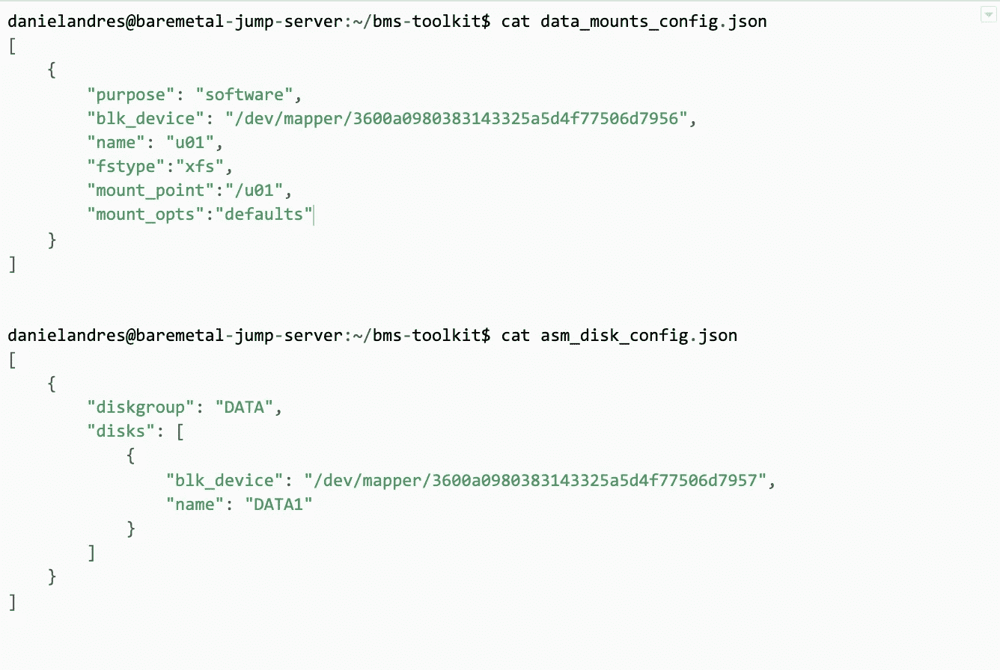**

**在 data_mounts_config.json 和 asm_disk_config.json 文件中配置的磁盘分配。**

## **5.3)将私有 SSH 密钥从 BMS 服务器传输到跳转服务器，并执行安装。**

**将私有 SSH 密钥拉至跳转服务器，以便能够对其进行身份验证并用于安装。**

```
danielandres@baremetal-jump-server:~/bms-toolkit$ scp orainstall@100.64.50.1:/home/orainstall/bms-key ~/bms-toolkitorainstall@100.64.50.1’s password:bms-key 100% 1675 823.8KB/s 00:00danielandres@baremetal-jump-server:~/bms-toolkit$
```

**然后，使用您刚刚从 BMS 服务器获取的私钥测试到 BMS 服务器的无密码连接。如果成功，将在 BMS 服务器中使用 orainstall 用户打开一个 ssh 会话，而不提示您输入任何密码，然后**记得退出并返回跳转服务器来运行安装。****

```
danielandres@baremetal-jump-server:~/bms-toolkit$ ssh -i bms-key orainstall@100.64.50.1Last login: Sun Sep 13 05:22:05 2020 from 100.64.170.2[orainstall@your-bms-server ~]$ exitdanielandres@baremetal-jump-server:~/bms-toolkit$
```

**最后，从跳转服务器，使用您的设置所需的参数运行安装脚本。用 BMS 服务器的实际 IP 地址替换[BMS-server-IP-address]条目，用安装 zip 文件所在的 GCS 中的 BUCKET 替换[BUCKET]参数。整个安装和配置过程大约需要 30-50 分钟。确保将 ORA_VERSION 环境变量导出到正在安装的数据库版本。**

```
danielandres@baremetal-jump-server:~/bms-toolkit$ export INSTANCE_IP_ADDR=[BMS-server-IP-address]danielandres@baremetal-jump-server:~/bms-toolkit$ export ORA_VERSION=19.3.0.0.0danielandres@baremetal-jump-server:~/bms-toolkit$ export ORA_DB_NAME=PROD1danielandres@baremetal-jump-server:~/bms-toolkit$ ./install-oracle.sh --ora-swlib-type gcs --ora-swlib-bucket gs://[BUCKET] --instance-ssh-user orainstall --instance-ssh-key bms-key --ora-edition EE --backup-dest /cvs-volume/rman_backups --ora-reco-diskgroup DATA
```

**当不同的 playgroups 按顺序执行时，您应该看到所有的 Ansible 输出。该过程完成后，您的 ASM 和数据库将被安装并修补到其最新版本，数据库配置、PDB 创建和 RMAN 备份设置将被执行，您将获得一个功能完整的数据库，网格、Oracle 重启和 RMAN 定时备份将自动执行。**

**在我们的例子中，只剩下一个步骤，即撤销我们之前在 CVS NFS 卷上设置的广泛权限:**

**跳转到 BMS 实例，并更改适当文件夹的权限和所有权。您还可以在那里查看 Oracle 安装:**

```
danielandres@baremetal-jump-server:~/bms-toolkit$ ssh -i bms-key orainstall@100.64.50.1Last login: Sun Sep 13 05:32:33 2020 from 100.64.170.2[orainstall@your-bms-server ~]$ sudo su[root@your-bms-server ~]$ chown oracle:asmadmin /cvs-volume/rman_backups[root@your-bms-server ~]$ chmod 740 /cvs-volume/rman_backups[root@your-bms-server ~]$ su - grid[grid@your-bms-server ~]$ asmcmd -PASM> lsPROD1ASM> ls PROD1DATAASM>cd PROD1/DATAASM>[grid@your-bms-server ~]$ exit
```

**最后，您可能希望关闭 Internet 网关机器，以便新提供的数据库不能连接到 Internet。**

**就是这样！！**

**瓦拉万·拉贾库马尔和[丹尼尔·维勒加斯](https://medium.com/u/c83442440f33?source=post_page-----47f5ab594821--------------------------------)**