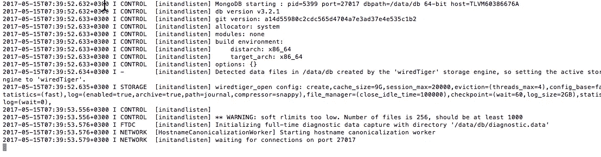
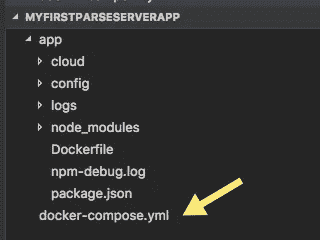

# 从零到英雄—在 Google 云平台上运行 parse-server 第 1 部分—使用 docker-compose 在本地运行 parse-server 和 MongoDB

> 原文：<https://medium.com/google-cloud/from-zero-to-hero-run-parse-server-on-google-cloud-platform-part-1-run-parse-server-and-mongodb-63a5f89f670d?source=collection_archive---------0----------------------->

这篇博文是关于如何在 GCP 容器引擎上运行解析服务器的系列博客的第 1 部分。在你开始阅读这篇博客之前，请参考该系列的第 0 部分，即[引言](/@ran.hassid/from-zero-to-hero-run-parse-server-on-google-cloud-platform-part-0-introduction-54e7725c7ba0)部分。

在这一部分中，我将展示如何通过 docker compose 在本地机器上运行 parse-server + MongoDB 容器。如果你已经熟悉 Docker 或 parse-server，请随意跳过理论部分。

# Docker 和 Docker Compose(理论)

我们将使用 docker，特别是我们将使用 docker compose 在本地机器上运行应用程序。Docker 是最流行的软件容器平台，允许开发者在“类似生产的环境”中运行他们的应用和解决方案。Docker 与**容器**一起工作，每个容器都包含运行软件所需的所有东西，不像虚拟机那样与完整的操作系统紧密相关。

将应用容器化的基本步骤是:

1.  创建 docker 文件 docker 文件包含依赖项、卷、工作目录和需要由 docker 工具在构建时执行的命令。
2.  Docker build——build 命令将访问您的 docker 文件，并开始逐行运行其中的命令，因此 docker 文件中命令的顺序非常重要。结果将是一个 docker 图像，其中包含运行应用程序所需的所有代码、设置和资源
3.  docker run——**docker run**命令将检查您想要运行的图像，从该图像创建一个容器并最终运行它。

**Dockerhub**

有了 docker，你可以运行多个可以互相对话(链接)的容器(有人说“微服务”？)由于软件世界中最大的生态系统之一，通常你甚至不需要自己构建这样的映像，你只需从[**docker hub**](https://hub.docker.com/)**下载它们即可，这是一个拥有成千上万 docker 映像的注册表(或存储库)。所以，在你自己创建一个图像之前，检查一下这个图像是否已经存在。**

****Docker 撰写****

**Docker Compose 是一个允许你在一个命令中构建和运行多个容器化 Docker 应用程序的工具。为了使用这个工具，您首先需要创建一些 **yml** 文件，其中包含您想要运行的所有图像、它们的配置以及它们之间的关系。在我们的例子中，我们将使用包含两个图像的 docker-compose:**

1.  **我们将自己构建的解析服务器映像**
2.  **MongoDB 图像，这将是我们的应用程序的持久性。该图像将从 dockerhub 中提取。**

**解析服务器映像将**链接**到 MongoDB 映像。通过将这两个映像链接在一起，我们告诉 docker 解析服务器容器需要与 MongoDB 容器“对话”。**

# **解析服务器(理论上)**

**parse-server 是一个开源的 BaaS(后端即服务)解决方案，最初由 parse.com 团队开发。parse.com 的目的是让开发者专注于构建客户端应用程序(无论是在 iOS/Android/Web 还是其他平台)，他们的平台将负责服务器端(后端)部分。parse.com 很快成为构建此类应用的最受欢迎的平台，这也是他们被脸书收购的原因。收购两年后，脸书认为 parse.com 服务不是他们战略的一部分，他们决定关闭这项服务。他们通知成千上万的客户迁移他们的数据，要么自己托管，要么寻找其他解决方案。**

**这个故事中最棒的是 [**解析服务器**](https://github.com/parse-community/parse-server) 开源。parse.com 团队决定将他们的解决方案开源，并将其命名为 parse-server。起初，他们非常积极地参与，并通过帮助客户将他们的 parse.com 应用迁移到 parse-server 来为客户提供非常好的支持，但现在他们不再活跃了。**

**parse-server 100%用 NodeJS 编写，使用 MongoDB 作为主数据库。parse-server 负责与后端开发相关的所有事情，以便让开发人员专注于构建前端应用程序。parse-server 非常稳定，有很好的文档记录，并由社区中的一些开发人员维护(我就是其中之一:)。
列出 parse-server 的所有特性将花费我几个小时的时间，因此我将只关注最重要的特性:**

1.  **自动创建客户端类——这个特性允许您直接从客户端创建解析对象，因此开发人员甚至不需要在 MongoDB 中创建相关的集合。当您想要创建一个新对象时，只需通过一个客户端 SDK 来创建它。这也与向集合添加/移除属性以及在它们之间创建关系相关。
    BTW！由于安全问题，一些开发人员并不真正喜欢这个特性，所以在 parse-server 中，如果你愿意，你可以很容易地关闭这个特性。**
2.  **用户管理— parse-server 提供了非常强大的用户管理系统。有了这个功能，你可以:登录用户，注册新用户，登录用户和链接他们与第三方提供一样:facebook，谷歌，github，instegram，twitter 和更多。**
3.  **ACL——ACL 代表访问控制列表。解析使用 ACL 来保护对象不被不允许的用户读取/修改。**
4.  **插件基础架构——parse-server 中的大多数功能都是通过插件构建的，因此如果您有一些当前解决方案无法满足的需求，您可以(可能)创建一个适配器来替换默认的适配器。例如:假设您希望允许您的用户使用 **snapchat** 登录，您可以轻松创建**身份验证适配器**，实现所有相关代码，提供一些配置，然后将其添加到解析服务器配置对象中，从现在开始，您的用户也可以使用他们的 **snapchat** 帐户登录。**
5.  **地理点—使用 parse-server，您可以轻松创建地理字段来存储用户/企业在世界上的位置。此外，通过 GeoQuery，您可以执行高级查询，如:显示距离我当前位置 100 英里以外的用户列表等。**
6.  **推送通知—使用 parse-server，您可以通过平台 SDK 轻松地向一个或多个用户发送推送通知。它的工作原理是为每个用户设备创建一个安装对象，这样每次安装都会存储设备令牌和有关用户设备的更多细节。**
7.  **实时查询——实时查询允许您在**实时**订阅数据库中的变化。如果您熟悉其他解决方案，如 **RethinkDB** 或 **Firebase 实时数据库**，那么您也会很容易理解这个概念。在 live query 中，您可以订阅 MongoDB 中的更改，然后解析服务器会在对象发生更改时实时通知您。在我的应用程序中，我使用这个功能来了解我朋友的状态(当他们在线/离线时)。实时查询基于 WebSocket，工作速度非常快。如果您的应用程序需要大规模工作，您可以将解析实时查询服务器与发布/订阅解决方案集成在一起。目前只有 Redis pub/sub，RabbitMQ 和 GCP pub/sub 可用，所以如果你有其他喜欢的 pub/sub 解决方案，你可以简单地创建一个适配器并使用它。**
8.  **客户端 SDK/Rest API——解析服务器客户端 SDK 可用于最流行的编程语言:iOS、Android、JS/NodeJS、PHP、. NET. Unity 等等。在部分客户端 SDK 中，您可以使用**本地数据存储**，它为您提供自动同步功能，并允许您创建离线优先应用程序。如果您不喜欢 SDK 的 parse-server REST API 也是可用的。**
9.  **云代码函数和钩子— **云函数**允许您编写自己的定制逻辑，并在 parse-server 上运行它们。云函数是用 NodeJS 编写的，可以简单也可以复杂，唯一需要理解的是云函数是无状态的:你发送一个请求，解析服务器处理这个请求并返回一个响应。
    **钩子**允许你写一些代码，这些代码将被平台触发以响应一些普通的事件，比如:保存前、保存后、删除前、删除后，所以如果你想在数据库中保存用户之前运行一些定制的逻辑，只需在用户对象上创建一个保存前钩子。**

**就像我上面提到的，这些只是 parse-server 功能的一部分。您可以在 [**官方文档网站**](http://docs.parseplatform.org/) 中了解更多其他功能，如:电子邮件集成、日志记录、文件存储支持、媒体文件等**

# **诺杰斯和 NPM(理论上)**

**节点包管理器是一个非常强大的工具，它允许 NodeJS 开发人员通过向他们的项目添加**现成的** NodeJS 模块来重用代码。您可以添加数百万个模块来帮助您加速开发，并将 TCD(开发总成本)降低一半以上。此外，npm 还是一个依赖项管理器，这意味着当您向项目中添加一个 npm 模块时，它会自动添加该模块所依赖的所有其他模块。**

# **MongoDB(理论)**

**parse-server 使用 MongoDB 作为持久层，因此您创建、更新、删除和读取的所有数据都将持久存储到 MongoDB 中。MongoDB 是一个非常强大和最受欢迎的 NoSQL 数据库。MongoDB 将数据存储在二进制文档 JSON 对象(又名 DocumentDB)中。
MongoDB 非常快，易于扩展，无模式，易于使用。就像我上面提到的，parse-serve 最大的特性之一是动态创建/生成集合的能力，这是因为 MongoDB 允许这样做。**

**请注意！MongoDB 是一个非常强大的数据库，但它并不适合任何用例。由于 MongoDB 是 NoSQL，它不支持事务，并且在部分应用程序中事务是强制的，因为使用事务可以确保数据始终一致，并且可以运行多个相互依赖的查询，并将它们包装在一个事务中，这是 MongoDB 无法做到的。**

# **先决条件安装**

## **码头工人**

**我们首先需要安装的是 Docker，它将在您的机器上安装 docker CLI 和 docker-compose 工具。幸运的是，docker 团队为 Mac 和 Windows 创建了一个惊人的安装程序，只需点击一个按钮就可以安装。**

**为了在您的本地机器上安装 docker，请访问 docker 商店上的[下载页面，点击 Get Docker CE for Mac (Stable)按钮，并按照 Docker 商店网站上的说明进行操作。该安装程序将在您的本地机器上安装 docker 工具箱和 docker CLI。](https://store.docker.com/editions/community/docker-ce-desktop-mac?tab=description)**

**安装 docker 后，你会在你的 mac 状态栏上看到流行的 docker whale。**

****

**从码头商店拿的**

**检查一切正常的另一种方法是打开 mac 终端并运行 docker 命令，如果您看到以下内容:**

****

**这意味着你的机器上安装了 docker。**

## **Node.js +节点包管理器(npm)**

**下载 npm + NodeJS 最好的地方是 Node.js 官网。进入 [Node.js 下载页面](https://nodejs.org/en/)，点击 **v7.10.0 当前绿色按钮**，下载 Node.js 安装程序，执行安装程序在您的机器上安装 Node.js。**

**为了检查 Node.js + npm 是否已成功安装在您的计算机上，您可以打开终端并执行以下命令:**

```
npm -v
```

**键入此命令后，您应该会看到安装在您的计算机上的 npm 版本。**

## **MongoDB**

**下载和安装 MongoDB 最好的地方是从 [MongoDB 官方网站](https://docs.mongodb.com/manual/tutorial/install-mongodb-on-os-x/)。有两种方式安装它:手动或使用家酿，我推荐通过**家酿**安装，因为它更容易和直观。**

**为了检查 MongoDB 是否安装在您的本地机器上，请打开终端并执行以下命令:**

```
mongod
```

**在输入这个命令之后，您应该看到 MongoDB 正在启动并等待默认端口 27017 上的连接。**

****

**现在所有的东西都已经安装在本地机器上了，您可以进入下一个阶段，创建、运行和测试您的 parse-server Node.js 应用程序。**

# ****创建您的解析服务器应用程序(实用)****

## **设置**

**打开终端，导航到您通常存储所有开发项目的位置，并创建一个名为 **myFirstParseServerApp** 的新文件夹**

```
mkdir myFirstParseServerApp
```

**导航到您刚刚创建的文件夹，并在其中创建另一个文件夹，将其命名为 **app** ，最后导航到 app 文件夹。**

```
cd myFirstParseServerApp/
mkdir app
cd app/
```

**在 app 文件夹中运行 **npm init** 来初始化一个新的 Node.js 应用程序。运行此命令时，npm CLI 会提示您有关应用程序名称、默认页面等问题。请填写相关细节，如应用程序名称、描述、作者姓名和许可证，然后继续。在我的例子中，它看起来如下:**

****

**运行 npm init 命令后，您将只看到项目的 **app** 文件夹中的一个文件，文件名是 **package.json** 。**

**package.json 是描述 Node.js 应用程序的文件。该文件包含应用程序的名称、描述、作者、版本等。为了亲眼看看这个文件的样子，你可以用任何编辑器打开它。我个人使用的是 [Visual Studio Code](https://code.visualstudio.com/) ，这是一个非常棒的用户友好的编辑器，可以很好地处理 Node.js 应用程序。我这边 package.json 的内容是:**

```
{
"name": "myfirstparseserverapp",
"version": "1.0.0",
"description": "My first parse-server application",
"main": "index.js",
"scripts": {
"test": "echo \"Error: no test specified\" && exit 1"
},
"keywords": [
"parse-server"
],
"author": "Ran Hassid",
"license": "MIT"
}
```

**在你这边应该是一样的，除了作者的名字。**

## **将解析服务器添加为依赖项**

**我们要做的下一件事是将解析服务器模块添加到我们的应用程序中。正如我前面提到的，解析服务器模块托管在[npmjs.org](https://www.npmjs.com/package/parse-server)上。这允许您运行非常简单的命令，以便将其添加到您的项目中，所以让我们这样做。
在终端中，导航到 **app** 文件夹，运行以下命令:**

```
npm install parse-server --save
```

**运行此命令后，npm 将在 npm 存储库中查找 parse-server，并将它安装到您的项目中。**标志(— save)** 告诉 npm 也创建一个依赖项，并将其添加到 package.json 文件中。您还会注意到，npm 将安装 parse-server 所依赖的所有模块。**

**安装完成后，去检查你的 **package.json** 文件，你会看到一个新的 **dependencies** 部分已经被添加。我们目前唯一的依赖是在解析服务器模块中。现在你可能会问自己，我需要的源代码在哪里？为了回答这个问题，你需要去你的**应用**文件夹，寻找**节点模块**库。**

****请注意！node_modules 包含解析服务器库以及所有的解析服务器依赖项，所以你会在它下面看到很多文件夹。请**不要更改**这些模块中的任何代码，因为下次运行 npm install 命令时，您的所有更改都将被**覆盖。node_modules 文件夹也必须被您的源代码控制忽略(如果您使用 git，您需要将。gitignore 文件)，因为它们必须在安装或部署时添加。******

****

**接下来，创建一个 npm 启动脚本，它将允许我们只通过运行 **npm start** 命令来运行解析服务器。要创建启动脚本，请添加以下内容:**

```
"start" : "node ./node_modules/.bin/parse-server"
```

**在 package.json 文件中的**脚本**下。添加启动脚本后，package.json 应该如下所示:**

****

**接下来，通过在终端中执行以下命令，尝试在您的本地机器上运行 parse-server(请确保您指向了 **app** 文件夹):**

```
npm start 
```

**你会立即注意到你的应用程序无法运行，因为它缺少 **appId** 和**万能钥匙**。**

****

**必须将 **appId** 添加到发送到解析服务器的任何请求中。建议创建一些复杂 base64 字符串作为 appId。主密钥**也应该是 base64 字符串，使用主密钥解析服务器将允许你作为管理员**运行任何 api 调用。主密钥必须只有您**知道**，appId 必须只有您的应用程序知道。******

您有两个选项可以将这两个变量传递给 parse-server:

1.  环境变量——node . js 服务器可在运行时访问的变量，存储在**process . ENV . { NAME _ OF _ THE _ ENV _ VARIABLE }**对象下。
2.  配置文件—将由解析服务器在运行时解析的 JSON 配置文件。

我建议使用第二个选项(配置文件)。原因是，当您使用 parse-server 时，您会立即注意到，除了 appId 和 masterKey 之外，您还需要为您需要的不同功能添加越来越多的配置，使用第一个选项将很难理解哪些变量已设置，哪些变量未设置，实际上您只能在运行时理解它，而在第二个选项中，您可以在设计时(在运行 parse-server 之前)理解它，这非常重要。

**创建 parse-server config.json 文件**

转到你的 **app** 文件夹，在它下面新建一个 **config** 文件夹。在 config 文件夹下创建一个新的 **config.json** 文件，该文件将包含运行解析服务器实例所需的所有配置。


打开 config.json 文件，将以下内容粘贴到其中:

```
{
"databaseURI": "mongodb://localhost:27017/my-db",
"appId": "0742vWqaHDnW5VkvbTogyh2O9UbdXDlAe19XOPd2Tc",
"masterKey": "La7U4b8Hxdsu2kwcV6ou08JWGlCdCETjkyR9H8DIXw",
"serverURL": "http://localhost:1337/parse",
"cloud": "./cloud/main.js",
"mountPath": "/parse",
"port": 1337
}
```

**databaseURI —** 就像我上面提到的，parse-server 使用 mongoDB 来持久化数据，所以 databaseURI 是 MongoDB 所在的连接字符串。因为目前我们在本地机器上运行它，所以我们指向本地主机和运行 MongoDB 的默认端口(27017)。

**appId** —客户端在发送给解析服务器的任何请求中需要发送的应用程序密钥。
**万能钥匙** —允许你以**管理员**身份运行 api 调用的钥匙，请只留给你自己。
**serverURL** —解析服务器 api 的端点。您将在这个端点前面运行您的 api 请求。
**云** —就像我上面提到的，parse-server 的功能之一是运行云代码函数和服务器端钩子的能力，所以这个参数将包含这些函数和钩子的源代码的路径。
**挂载路径** —解析服务器的挂载路径。默认为/parse
**端口**—parse-server 运行的端口。默认值为 1337

接下来，创建包含定制云代码函数和服务器端钩子的源代码的文件:

在你的应用文件夹下创建一个新文件夹，命名为 **cloud** 。在云文件夹下新建一个文件，命名为 **main.js** 。main.js 文件现在可以是空的。


## **在本地运行解析服务器**

现在是时候再次运行我们的解析服务器实例了。转到终端，运行之前运行的命令，但这次发送 config.json 文件。

```
npm start -- config/config.json
```

您会注意到，现在解析服务器正在运行并监听端口 1337


**故障排除**:如果由于某种原因，您看到一些与 mongoDB 相关的错误，请确保安装了 MongoDB，并行打开一个新的终端窗口，运行 **mongod** 命令，然后再次运行您的解析服务器。

## 在本地测试解析服务器

测试解析服务器实例(从我的 POV)的最佳方式是使用 REST 客户端工具。我个人用[邮差](https://www.getpostman.com/)很直观。

如果您尝试对以下端点运行 GET 请求:[http://localhost:1337/parse/classes/user](http://localhost:1337/parse/classes/user)以获取解析服务器中的用户列表，您会立即注意到响应是

```
{"error":"unauthorized"}
```

原因是缺少一个 api 密钥。api 键需要添加到**请求头**中，因此在发送请求之前，确保 api 键也添加到请求头中。


再次运行请求后，您应该会收到 200 响应和一个空的结果集

```
{
  "results": []
}
```

您得到空结果的原因是因为数据库中没有用户。

为了创建一个新用户，我们需要对同一个 URL 运行 POST 请求，并在请求有效负载中传递必需的字段。必填字段有:**用户名、密码、电子邮件。**

除了必填字段，我们还可以发送更多字段。这里的好处是您可以发送任意多的字段，因为 MongoDB 是无模式的，所以您不需要提前创建模式。


对此请求的响应将是:

```
{
  "objectId": "9XL661CuBK",
  "createdAt": "2017-05-16T05:55:37.092Z"
}
```

parse-server 将自动为您生成用户 objectId 以及该对象的创建日期。

现在，让我们运行与获取数据库中的用户列表相同的 GET 请求。执行 GET 请求后，您应该得到以下响应:

```
{
  "results": [
    {
      "objectId": "9XL661CuBK",
      "username": "ranhsd",
      "password": "init1234",
      "email": "[ran@example.com](mailto:ran@example.com)",
      "firstName": "Ran",
      "lastName": "Hassid",
      "createdAt": "2017-05-16T05:55:37.092Z",
      "updatedAt": "2017-05-16T05:55:37.092Z"
    }
  ]
}
```

**请注意！**我敢肯定，你可能会想，不先登录服务，怎么可能获得用户列表。原因是默认情况下，解析服务器只希望获得一个 api 键。api 密匙问题在于它不够安全，因为任何知道如何嗅探网络请求的人都可以轻易地“窃取”您的 api 密匙。

解析-服务器通过 ACL 和类级别的权限解决这个问题。我不会在本系列中讨论这个主题，但是 ACL 允许您定义哪些用户/角色可以创建/更新/删除/读取哪些对象。你可以在[这里](http://docs.parseplatform.org/parse-server/guide/#class-level-permissions)和[这里](http://docs.parseplatform.org/rest/guide/#security)了解更多

## 带有 docker 的容器化解析服务器

在本地机器上运行和测试 parse-server 之后，是时候以正确的方式运行它了。

在 **app** 文件夹下新建一个文件，命名为 Dockerfile。该文件包含一些在构建/运行 docker 映像时将被执行命令。

这个文件的内容是:

```
FROM node:boron
RUN mkdir -p /parse-server
WORKDIR /parse-server
COPY . /parse-server
RUN npm install
EXPOSE 1337
CMD ["npm","start"]
```

我们来解释一下:

**FROM node:boron** —这告诉 docker 我们正在运行 Node.js 应用程序，我们需要[节点运行时](https://hub.docker.com/_/node/)作为依赖项。因此，在为我们的应用程序创建映像之前，docker 将检查节点映像是否可用，如果不可用，它将从 dockerhub 下载它，然后它将创建我们的映像。
**运行 mkdir -p /parse-server** —在 docker 镜像中创建 parse-server 目录
**WORKDIR****/parse-server**—设置我们刚刚创建的文件夹的工作目录
**副本。/parse-server** —将应用程序中的所有文件复制到映像工作目录中
**运行 npm 安装** —运行 npm 安装命令(在映像上)以安装所有依赖项
**暴露 1337** —暴露 1337 端口，以便从外部访问它
**CMD ["npm "，" start"]** —运行 npm start 以启动解析服务器

创建 docker 文件后，我们可以运行一个非常简单的命令，从我们的解析服务器应用程序构建 docker 图像。为了测试它，请打开终端，导航到应用程序文件夹并执行以下命令:

```
docker build -t my-parse-app .
```

执行该命令后，您会注意到 docker cli 将解析 docker 文件并逐行运行这些命令。最“繁重”的命令 **npm install** ，该命令与我们之前在机器上运行的命令相同，但这次它在映像上运行。为了验证构建命令是否有效，请运行以下命令:

```
docker images
```

并检查两个图像(node 和 my-parse-app)是否都列在那里。


由于我们的解析服务器应用程序依赖于 mongoDB，我们现在需要运行一个 mongoDB 容器，然后运行我们的解析服务器容器并将 mongoDB 链接到其中。我们可以这样做，首先构建一个 mongoDB 映像，通过 docker run 命令运行它，然后运行我们刚刚用 link flag 构建的解析服务器映像。听起来很复杂，对吧？这就是 **docker-compose** 前来救援的地方。

## 设置 docker-撰写

docker-compose 允许我们组合多个图像，一起构建和运行它们。我们唯一需要做的就是创建一个列出所有服务的文件。使用 docker-compose，我们还可以:

*   使用定制命令运行我们的图像(使用 config.json 运行 parse-server 需要这些命令)
*   挂载磁盘卷(例如，用于 mongoDB 文件、云代码文件等。)
*   轻松地将多个容器链接在一起
*   设置环境变量
*   还有更多…

在项目的根文件夹下创建一个新文件，命名为: **docker-compose.yml** 。这个文件将列出我们希望用 docker 构建和运行的所有服务。

由于 Medium [缺乏对文本缩进](https://help.medium.com/hc/en-us/articles/226935407-How-can-I-indent-text-)的支持，并且 yml 文件需要缩进，请从[这里](https://gist.github.com/ranhsd/76498d90bf5c8f2d30f742abcfd438d6)下载或者自己输入(不推荐)

yml 文件的一大优点是“对人友好”。您几乎可以立即从该文件中了解到，我们在其中列出了以下服务:

1.  **应用** —与 **mongo** 服务链接的解析服务器应用。请注意，运行容器的名称是:my-parse-app
2.  **mongo** — MongoDB 数据库使用 dockerhub 中的公共 MongoDB 映像
3.  **mongodata** —由 mongo 服务挂载并创建磁盘卷，所有 mongo 数据将保存在该磁盘卷中。

创建此文件后，您的项目结构应该如下所示:



请注意 **docker-compose.yml** 位于根文件夹(myFirstParseServerApp)下，而不是 App 文件夹下。

我们需要做的最后一件事是修改我们的 **config.json** 文件，特别是 **databaseURI** 的值。

替换:

```
mongodb://localhost:27017/my-db
```

使用:

```
mongodb://mongo:27017/my-db
```

原因是，当我们用 docker 运行我们的应用程序时，mongoDB 映像在另一个容器中运行，所以我们需要提供容器服务名称，而不是 localhost，在我们的例子中，这个名称叫做 **mongo**

**请注意！**如果你想以两种方式运行你的应用程序(通过 docker 和本地),你可以简单地复制并粘贴你的 config.json 文件，更改它的名称(如 config-local.json)并在本地运行时使用它。

## 运行您的应用

剩下要做的最后一件事是运行和测试应用程序。这次我们将通过 docker-compose 运行该应用程序。为了使用 docker-compose 运行您的应用程序，请打开终端，导航到您的项目根库(myFirstParseServerApp)并执行以下命令:

```
docker-compose up
```

执行此命令后，docker 将:

*   下载/重复使用相关图像
*   构建您的解析服务器节点。JS 应用程序，方法是执行 Dockerfile 中的所有命令
*   创建 node、my-parse-app 和 mongo 映像并运行它们。

为了知道哪些容器**当前正在您的机器上运行**,请执行以下命令:

```
docker ps
```

执行此命令后，您应该会看到类似这样的内容:


现在是测试一切是否如预期那样工作的时候了。要测试它，请打开 POSTMAN 并运行与您之前运行的完全相同的请求，如果您得到相同的结果，这意味着一切正常。

# **第一部分概要**

现在，在容器中的本地机器上一切运行良好之后，你就可以开始本系列的第二部分了，在那里我将解释如何在 google 容器引擎上部署和运行相同的服务。