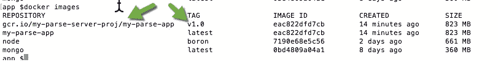
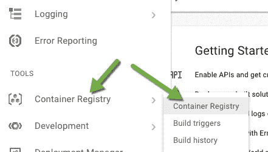

# 从零到英雄—在 google 云平台上运行 parse-server 第 2 部分—在 Google 容器引擎上部署和运行 parse-server

> 原文：<https://medium.com/google-cloud/from-zero-to-hero-run-parse-server-on-google-cloud-platform-part-2-deploy-and-run-parse-server-86e5d93296a3?source=collection_archive---------0----------------------->

这篇博客是关于如何在 GCP 容器引擎上运行解析服务器的**系列**博客**的第二部分**

在[第 1 部分](/@ran.hassid/from-zero-to-hero-run-parse-server-on-google-cloud-platform-part-1-run-parse-server-and-mongodb-63a5f89f670d)中，您学习了如何通过 docker-compose 在本地机器上运行 parse-server Node.js 应用程序和 MongoDB 实例。在本部分的最后，你将知道如何利用你在第 1 部分中所做的，在 google 容器引擎上部署和运行它。

# 额外津贴

*   谷歌云平台帐户-GCP 帐户是必填项，因为您将应用程序部署到谷歌容器引擎，这是 GCP 服务之一。如果你还没有一个有效的 GCP 账户，你可以在这里创建一个[免费试用账户。试用用户在 12 个月内可以获得 300 美元的谷歌积分。](https://cloud.google.com/free/)
*   Google cloud platform SDK——这个 SDK 允许你在 GCP 账户上从本地机器终端执行命令。为了安装它，请遵循[谷歌云平台 SDK 官方页面](https://cloud.google.com/sdk/)上的说明

# **Google 容器引擎+ Kubernetes(理论上)**

谷歌容器引擎或 GKE 是一个非常强大的集群和编排管理器，用于在云中大规模运行 docker 容器。GKE 根据您定义的报价自动管理您的 docker 容器(例如 CPU 内存、磁盘卷)。它基于流行的开源软件[**Kubernetes**](https://kubernetes.io/)**，最初是由 google 开发的，直到他们决定开源它。**

****Kubernetes****

**Kubernetes(简称 k8s)是一个开源系统，用于自动化部署、扩展和管理容器化的应用程序。使用 k8s，您可以运行和管理任何 docker 容器应用程序。GKE 和 k8s 的这种组合最棒的一点是，您可以在一项服务中使用这两种功能，因为 k8s 允许您轻松部署和管理所有的微服务，而 GCP 则负责所有其他的扩展、日志记录、安全性，甚至为您提供容器注册表，您可以在其中存储将由您的 GKE 集群使用的映像。**

**库伯内特建筑公司**

*   **名称空间——在 k8s 中，可以创建多个名称空间。每个命名空间都包含自己的资源、服务、pod、卷等。我们通常使用名称空间来区分环境(例如开发、测试、生产)、团队、客户等等。名称空间既可以通过简单的 yml 文件创建，也可以通过 **kubectl** CLI 创建。你可以在[这里](https://kubernetes.io/docs/concepts/overview/working-with-objects/namespaces/)阅读更多关于名称空间的内容**
*   **Pod—Pod 代表您的集群上正在运行的进程，是您部署的 k8s 中最基本的单元。Pod 封装了一个或多个应用程序容器。每个 pod 拥有 1 个网络 IP 和一些关于它应该如何在集群内运行的配置。在 k8s 中，您可以运行同一个应用程序的多个 pods，并通过副本集水平扩展它们。**
*   **副本集—副本集确保特定数量的 pod 实例在任何给定时间都在运行。使用副本集，您可以确保您的 pod(容器)将始终启动并运行，而不会停机。但是，建议使用部署，而不要直接创建副本集。**
*   **部署——部署是一个更高层次的概念，它管理副本集，并向 pod 提供声明性更新和附加功能。k8s 的建议是创建将为我们的 pod 管理和创建副本集的部署，而不是直接创建副本集。在这个博客中，我们将创建部署，在部署配置文件中，我们将指出我们希望为每个服务运行多少个副本集(多少个 pod)。**
*   **服务—服务通过将一组 pod 与特定标准相关联来发现 pod。pod 通过标签和选择器与服务相关联。你可以把它想象成一种类似“域”的方法，你可以访问它的域(标签/选择器)而不是访问服务网络 IP，k8s 会自动为你发现相关的服务。您可以创建只能由同一个集群内的 pod 访问的内部服务，也可以将它们公开给 internet(通过负载平衡器)。**
*   **配置映射——在 k8s 中，配置映射是一组键值对，包含一些通常用于 pod 的配置信息。将应用程序代码从配置中分离出来是一个很好的实践，因为你的应用程序可以通过改变它的配置来做出不同的行为，这提供了更多的灵活性。在第 1 部分中，我展示了如何创建一个将由 parse-server 在运行时使用的 config.json。在这篇博客中，我将展示如何获取这个 config.json 并从中创建配置映射，以便 pod 在运行时使用。**
*   **secrets——secrets 允许您安全地存储敏感数据，如:密码、秘密密钥、私人密钥等，并在运行时将它们装载到您的 pod 中。**

****请注意！**在这个系列的博客中，我无法涵盖 Kubernetes 的所有功能。我确信我也不熟悉**所有的**功能，我认为最好是涵盖我们将在这个系列中使用的所有东西。如果你仍然喜欢阅读和深入了解 k8s 的所有功能，请参考[他们的网站](https://kubernetes.io/docs/concepts/overview/what-is-kubernetes/)。**

****自动缩放****

**在 GKE，你有一些很小(但很强大)的复选框，如果你点击它，谷歌会通过按需添加/减少节点来自动扩展你的集群。让我们通过示例来解释为什么自动缩放非常重要并且经济高效:**

**让我们以最大的电子商务服务之一 e-bay 为例，假设在平常的一天，他们的平台上有**百万**活跃用户，并且该网站运行平稳，没有任何性能或稳定性问题，**但是**第二天，他们预计他们的平台上将有 1 亿活跃用户，因为这一天是黑色星期五。因此，在正常情况下，他们每天运行 20 个节点，在黑色星期五，他们需要将节点数量增加到 200 个，以便为客户提供**相同的体验**。**

**这就是自动缩放如此重要的原因，因为我们自己处理它非常复杂，所以必须由专家来完成，在我们的情况下，专家就是 GCP 的工程师。**

**自动缩放功能也很经济，因为当不再需要资源时，会自动为您解除分配。**

****谷歌容器注册表****

**就像我之前提到的，GKE 提供给你的东西之一是一个注册表，你可以在那里存储你的图像。在我们的例子中，我们将使用这个注册表来存储我们在第 1 部分中构建的解析服务器映像。使用 google container registry 而不使用 dockerhub private 等其他服务的优势在于:**

*   ****性能** —映像存储在您的 k8s 实例附近，可以由 GKE 非常快速地下载和挂载**
*   **安全——如果你依靠 GKE 来运行你的所有服务，你也可以依靠它来保证你的镜像二进制文件的安全**
*   ****GCP CLI** — GCP CLI (gcloud 命令)允许您轻松推送您在一个命令中构建的映像(gcloud 推送…)**
*   ****构建触发器** —这是我最喜欢的功能之一，它为您提供(免费)CI/CD 功能，因此当您对特定 git 存储库进行更改或创建新的 git 标签时，您可以告诉 google container engine 自动为您构建 docker 映像并将其存储在注册表中，因此如果您将源代码存储在 BitBucket、GitHub 或 Google cloud Source 存储库中，您就可以使用这一令人惊叹的功能。我个人使用它，它节省了我很多时间，而且效果很好！**

**现在是时候动手部署并运行我们在第 1 部分中构建的应用程序了。**

# ****装置****

**为了检查您的机器上是否安装了 google cloud platform，请在终端中执行以下命令:**

```
gcloud -v
```

**该命令将列出所有可以在 Google cloud SDK 安装中使用的已安装组件。**

****

**接下来，您需要安装 kubectl 组件。该组件将允许您在 GKE 集群前执行命令。**

**要安装 kubectl，请在终端中执行以下命令:**

```
gcloud components install kubectl
```

**运行该命令后，google cloud SDK 将在您的本地机器上安装 kubectl。为了检查是否真正安装了 kubectl，请在终端中运行以下命令:**

```
kubectl 
```

**并检查您是否获得了可以通过 kubectl CLI 执行的受支持命令的列表。**

# ****创建 GKE 集群(实用)****

**在这一部分，我将展示如何在谷歌云平台上创建你的 GKE 集群，所以请确保你有一个活跃的 GCP 帐户准备使用。**

****创建新的 GCP 项目****

**您需要做的第一件事是创建一个新项目。进入你的[谷歌云控制台](https://console.cloud.google.com/)，在左上角(谷歌云平台标题旁边)点击**选择一个项目**下拉**

****

**在弹出的对话框中点击 **+** 按钮创建一个新项目。**

****

**在项目名称文本框中写下 **my-parse-server-proj** ，然后点击 **create** 按钮创建您的项目。**

****

**30-60 秒后，您的项目将被创建。您可以在控制台通知中检查状态**

****

**创建项目后，您需要再次点击**选择项目按钮**，在弹出对话框中按名称搜索项目，然后从列表中选择。**

********

****创建新的集装箱引擎集群****

**在这一节中，我将展示如何在 GCP 上创建自己的容器引擎集群。**

**要创建集群，请执行以下步骤:**

1.  **点击位于控制台右上角的菜单按钮，打开主菜单。**
2.  **点击**集装箱引擎****
3.  **点击**创建容器集群**蓝色按钮**

****

**4.在创建容器集群表单中填写以下详细信息:**

*   **名称:集群 1**
*   **描述:我的服务的容器引擎集群**
*   **区域:在本演示中选择 us-east1-b。在生产中，你需要提前做一些研究，并检查你的大部分客户在哪里。BTW！您可以在多个区域甚至世界上的多个数据中心部署容器集群，但这不是我在本系列中要讨论的内容。**
*   **机器类型:保持默认的 1vCPU，3.75 GB 内存。**
*   **节点图像:cos**
*   **尺码:1。默认值为 3，但您可以将其更改为 1，因为您没有在生产环境中运行。 **3** 表示容器引擎将根据您选择的**机器类型**在您的集群中创建 3 个 1 vCPU/3.75GB 内存的节点。机器类型非常重要，因为所有将添加到集群中的节点都属于**相同的机器类型**(不能在集群中混合不同的机器类型)。**
*   **确保选中了打开 stackdrive 日志记录——这将通过 google stackdrive 为您提供监控和日志记录功能。**
*   **在所有东西都被填充后，点击创建按钮**

****

**单击“创建”后，将创建您的容器引擎集群。创建一个容器集群通常需要 2-5 分钟。**

****连接到集装箱引擎集群****

**按照以下步骤连接到您的集群:**

1.  **单击 connect 按钮(位于列出集群的右侧)**

****

**2.打开终端，将弹出对话框中的第一个命令复制并粘贴到您的终端外壳中。**

****

**3.回到弹出对话框，将第二个命令(kubectl proxy)复制并粘贴到您的终端 shell 中。该命令将创建一个从您的本地机器到您的容器引擎集群的代理。配置(集群、区域和项目的名称)取自您执行的第一个命令。**

**4.如果一切顺利，您将在终端 shell 中看到 127.0.0.1:8001 开始服务。**

****

**5.正如我之前提到的。Container engine 基于 Kubernetes，幸运的是，k8s 社区为我们创建了一个非常好的仪表板，在那里我们可以看到我们集群中运行的所有服务。您可以通过打开浏览器并访问以下 URL 来访问您的 k8s 仪表板:[http://localhost:8001/ui](http://localhost:8001/ui)。**

**目前你的 k8s 只运行一些核心的 Kubernetes 服务(列在 **kube-system** 名称空间下)。在下一节中，我将展示如何将解析服务器应用程序部署到容器引擎。**

# ****将 parse-server 和 MongoDB 部署到容器引擎****

****将你的解析服务器应用程序推送到谷歌云注册表****

**在这一节中，我将展示如何将本系列第 1 部分中的内容部署到上面创建的 google 容器引擎集群中。**

**您需要做的第一件事是**构建您在第 1 部分中创建的解析服务器映像并将其推送到**您的 google cloud registry。为了做到这一点，您需要重新构建解析服务器映像，但这次还要创建一个标记。标签使您可以轻松了解您的映像正在运行哪个版本。使用标签，你可以创建同一个应用程序的多个版本，如果当前运行的新版本有问题，k8s + google registry 可以轻松地返回到特定版本。在生产中运行应用程序时，标签极其重要。**

**要构建解析服务器应用程序的第一个版本(1.0)，请打开“终端”，导航到应用程序文件夹并运行以下命令:**

```
docker build -t my-parse-app .
```

**接下来，您需要创建一个标记来表明这是该应用程序的 1.0 版本。此外，标签还需要包含 google 容器注册中心和这个 google 容器注册中心所在的项目名称。幸运的是，这可以通过运行一个简单的命令来完成:**

```
docker tag my-parse-app gcr.io/my-parse-server-proj/my-parse-app:v1.0
```

**让我们解释一下最后一个命令:docker 标记告诉 docker CLI 创建一个标记，my-parse-app 是我们要为其创建标记的应用程序，gcr.io 是容器注册表，my-parse-server-proj 是我们在 GCP 控制台中创建的项目的名称，my-parse-app:v1.0 是标记的名称，即 v1.0**

**成功后，运行以下命令:**

```
docker images 
```

**如果一切顺利，您应该会看到 parse-server-app 1.0 版出现在这里:**

****

**在你有了你的标签的第一个版本之后，是时候把它推送到 google cloud registry 了。为此，在同一个终端窗口中执行以下命令:**

```
gcloud docker -- push gcr.io/my-parse-server-proj/my-parse-app:v1.0
```

**这个命令将把解析服务器应用程序的第一个版本推送到 google 容器注册中心。根据您的连接速度，可能需要 5-20 分钟才能完成。**

**成功推送映像后，转到 GCP 控制台，打开主菜单，选择容器注册表→容器注册表。**

****

**然后，点击 my-parse-app 文件夹，查看图片列表及其版本 **my-parse-app****

****

****将 parse-server 和 mongoDB 部署到 google 容器引擎****

**在这一节中，我将展示如何创建一些 yml 配置文件并将它们部署到 google 容器引擎。这些 **yml** 配置文件将在容器引擎上创建以下资源:**

1.  ****解析-服务器应用部署** —该部署将使用上一节中推送的映像，并将创建两个运行相同应用的 pod。我还将解释如何通过修改部署 **yml** 文件中的一行来轻松运行更多的 pods。**
2.  ****parse-server 应用服务** —该服务将允许我们从互联网访问 parse-server，并在其前面运行一些 api 调用。这将通过把 GCP 负载平衡器放在它的前面来完成，它将分配公共 IP 地址。别担心，这都是 GCP 自动处理的:)**
3.  ****解析服务器应用程序配置图** —该配置图将在运行时由解析服务器应用程序组件读取。配置映射将与 docker-compose 中使用的 config.json 文件相同。**
4.  ****mongoDB 部署** —这个部署将为我们的数据库创建一个 pod。在这篇博客中，我将展示如何只创建一个副本集。原因是当您处理数据库时，您不能仅仅将副本集从 1 更改为 3，仅此而已。如果你真的对如何做到这一点感兴趣，我推荐你阅读关于**有状态集**的内容，它允许你轻松地为数据库创建副本集。你可以在 Sandeep Dinesh 撰写的这篇[精彩博文](/google-cloud/mongodb-replica-sets-with-kubernetes-d96606bd9474)中了解更多。**
5.  ****mongoDB 服务** —该服务是仅供内部使用的服务，将由解析服务器应用程序 pods 使用。我们不会在互联网上公开这项服务，因为我们真的不需要这样做。k8s 允许我们在内部使用它(通过使用选择器和标签),这样更快更安全。**

**在 visual studio 代码中，在根文件夹下创建一个新文件夹，并将其命名为 **container-engine****

****

**右键单击容器引擎文件夹，并创建以下文件:**

*   ****parse-server-deployment . yml**—此文件包含 parse-server 应用程序部署的配置文件。将[本要点](https://gist.github.com/ranhsd/d77012db340df98d6c28e0f076927220)的内容复制粘贴到该文件中**

**上面的文件将在 k8s 中创建一个名为 **my-parse-app** 的新部署。副本:2 表示您将并排运行同一个应用程序的 2 个窗格。该应用程序将挂载上一步推送的图像(**gcr.io/my-parse-server-proj/my-parse-app:v1.0**)， **redinessProbe** 之所以在这里，是因为您将在本系列的第 3 部分中需要它(请不要取消注释)。**

*   ****parse-server-service . yml**—此文件包含 parse-server 服务的配置。将[以下要点](https://gist.github.com/ranhsd/904ab15bec3b08a802d0d26c415dbf6c)的内容复制粘贴到该文件中。**

**服务的名称是 **my-parse-app-service** 。port 和 targetPort 是端口映射，指示服务将在端口 80 上公开，并且该端口将被映射到内部端口 1337。type:LoadBalancer 表示该服务将被公开给 internet， **app:my-parse-server** 表示该服务将包装 my-parse-app 部署。**

*   ****mongo-deployment.yml** —该文件包含 mongoDB 部署的配置。将以下要点的内容复制并粘贴到该文件中。**

**部署的名称是 mongo-deployment，该部署将从 dockerhub 下载并安装最新的 mongoDB 映像，pods 将在端口 27017 上运行，数据将存储在 mongo-persistent-storage 卷中，这是一个 GCP 持久性磁盘。别担心，我会告诉你如何在 GCE 上创建这样的磁盘。**

*   ****mongo-service.yml** —该文件包含 mongoDB 服务的配置。将[以下要点](http://f44cddf0dbeaf69fac1b650d85f27426)的内容复制粘贴到该文件中。**

**该服务的名称是 mongo，它将在端口 27017 上运行，并且只在内部可用。该服务将包装 mongo 部署。**

**这是我们部署和运行 parse-server 和 mongoDB 到容器引擎所需的所有资源。**

**正如我所承诺的，接下来我将展示如何创建谷歌计算引擎(GCE)磁盘。您需要在同一个区域中创建一个磁盘，并将其命名为 **my-parse-app-db-disk** 这是因为您的 mongo-deployment.yml 文件中的 **pdName** 是 my-parse-app-db-disk。BTW pdName 代表持久性磁盘名称。**

**要创建持久性磁盘，请执行以下步骤:**

1.  **在 GCP 控制台中打开主菜单，然后选择计算引擎→磁盘**

****

**2.点击顶部的**创建磁盘**按钮**

**3.在创建磁盘表单中填写以下详细信息:**

*   **名称:我的解析数据库磁盘**
*   **区域:选择运行集群的同一区域。在我的例子中是 us-east1-b。您可以通过导航到容器引擎来快速检查它。**
*   **磁盘类型:选择持久磁盘，因为 SSD 价格昂贵:)**
*   **来源图片:centos-6…**
*   **点击创建按钮**

****

**几秒钟后，你的磁盘就准备好了。**

**最后但同样重要的是配置图。就像我上面提到的，您的配置映射将从您在使用 docker-compose 运行 parse-server 时使用的 config.json 文件中创建。**

**打开终端，导航到 **app** 文件夹，执行以下命令:**

```
kubectl create configmap my-parse-app-config --from-file=config/config.json
```

**请确保您的配置映射名称是 my-parse-app-config，因为这是解析服务器部署使用的名称。**

****

**现在，通过在浏览器中导航到 [http://localhost:8001/ui](http://localhost:8001/ui) 来转到您的 k8s 实例，从左侧菜单中单击 config map，并确保 my-parse-app-config 列在那里。**

********

**现在我们准备在 google 容器引擎上部署和运行 parse-server。首先，我们将部署 mongoDB 部署和服务，然后我们将部署 parse-server。**

**打开终端，导航到根文件夹(myParseServerApp)并执行以下命令:**

```
kubectl create -f container-engine/mongo-service.yml
```

**这个命令将创建 mongoDB 服务。接下来，执行以下命令来创建 mongo 部署和 pod。**

```
kubectl create -f container-engine/mongo-deployment.yml
```

**接下来，运行以下命令来创建解析服务器服务**

```
kubectl create -f container-engine/parse-server-service.yml
```

**最后运行下面的命令来创建解析服务器部署。**

```
kubectl create -f container-engine/parse-server-deployment.yml
```

**从浏览器访问 [http://localhost:8001/ui](http://localhost:8001/ui) ，打开 k8s 实例。在左侧菜单中，点击**部署**，确保您看到两个部署旁边有一个绿色勾号。**

****

**然后选择服务，再次检查是否有两个服务，并且都是有效的。**

****

**我前面提到过，解析服务器应该通过 GCP 负载平衡器暴露给互联网。这就是为什么您应该在 **my-parse-app-service** 的外部端点下看到 IP 地址和端口的原因。**

**这个 IP 地址是解析服务器 API 的端点。**

****测试您的解析服务器端点****

**打开 POSTMAN 并在以下端点上执行 GET 请求:[http://<YOUR _ SERVICE _ EXTERNAL _ ENDPOINT>/Parse/classes/user](#)，添加相关的请求头(X-Parse-Application-Id 和 content-type)并点击 **Send****

********

**点击发送后，你会得到一个空的用户列表。这个请求之所以有效，是因为您使用的 API 密钥与在本地运行应用程序时使用的相同。**

**让我们创建一些更有趣的东西…将请求方法从 GET 改为 POST，复制并粘贴以下 URL:[http://<YOUR _ SERVICE _ EXTERNAL _ ENDPOINT>/parse/classes/Task](#)**

**最后，将以下有效负载复制并粘贴到请求正文中:**

```
{
 "title" : "This is my first task",
 "priority" : "high"
}
```

****

**点击 send parse 后，服务器将处理请求并在 mongo 中创建新任务。**

**通过将正文有效负载更改为以下内容来创建另一个任务:**

```
{
 "title" : "This is my second task",
 "priority" : "medium",
 "isPersonalTask" : true
}
```

**点击发送解析后，服务器将创建第二个任务。注意，第二个任务有点不同，除了标题和优先级之外，我还添加了另一个布尔属性 **(isPersonalTask)** ，这就是无模式数据库的神奇之处。**

**最后，将 POST 更改为 GET，然后单击 Send 并查看创建的 2 个任务。**

****

# ****第二部分概要****

**现在你几乎是一个英雄…你知道如何创建谷歌容器引擎，你对 Kubernetes 是什么和它如何工作有基本的了解，你知道如何创建项目，磁盘和如何自动缩放你的解决方案。在本系列的第 3 部分中，我将展示如何在 google 容器引擎上运行相同的解析服务器，但是以更安全的方式运行(提示:它与 http 协议有关:)。此外，我将展示如何免费创建域证书，甚至动态生成它，并在您的 google 容器引擎集群中使用它。**