# @从零到英雄—在 google 云平台上运行 parse-server 第 3 部分—自动获取用于 google 容器引擎部署的加密证书

> 原文：<https://medium.com/google-cloud/from-zero-to-hero-run-parse-server-on-google-cloud-platform-part-3-automatically-obtain-lets-d7db8994000a?source=collection_archive---------2----------------------->

这篇博客是关于如何在 GCP 容器引擎上运行解析服务器的**系列博客**的第 3 部分

在[第 2 部分](/google-cloud/from-zero-to-hero-run-parse-server-on-google-cloud-platform-part-2-deploy-and-run-parse-server-86e5d93296a3)中，您学习了如何在 Google 容器引擎上部署和运行您的解析服务器 Node.js 后端和 MongoDB。

在这一部分中，您将学习如何通过 lets encrypt api 自动获取解析服务器实例的安全证书，并将自定义域(或子域)连接到解析服务器 api 端点。

# 额外津贴

*   您已经阅读、理解并实现了本系列的第 2 部分。
*   您拥有有效的自定义域名(例如[www.myCustomDomain.com](http://www.myCustomDomain.com)等)。)

# **安全**

在生产中运行您的服务之前，您需要确保的最重要的事情是它是安全的。我不会在本系列中涵盖所有的安全方面，但重要的是要知道 parse-server 为您提供了一个非常好且稳定的安全机制，比如:身份验证(通过 oAuth)、ACL(访问控制列表)、API 和主密钥、用户会话等等。您自己需要注意的一件事是在 HTTP 层之上添加 SSL/TLS 层。换句话说，你只需要在 **https 模式** **下运行你的 API！**

在第 2 部分中，您将解析服务器实例部署到 google 容器引擎，然后在它前面执行一些测试请求。如果您注意到您在那里使用的 URL 是:**http://<host _ IP _ address>:<port>/parse/<Class _ Name>**这对于开发/测试目的来说已经足够好了，但是在生产中绝对不推荐使用。这一部分的目的是向您展示如何运行相同的请求，但是这次使用 https 代替 http，使用域名代替 host_ip_address。因此，代替**http://<host _ IP _ address>:<port>/parse/<Class _ Name>**，您将使用**https://myCustomDomain/parse/<Class _ Name>**作为您的 API 端点。

# 让我们加密和 SSL/TLS 证书(理论上)

**SSL/TLS**

SSL 代表安全套接字层，TLS 代表传输层安全性。该协议的目的是在您的服务器和应用程序之间提供加密链接。SSL/TLS 是行业标准，被大多数网站/应用程序用来保护他们的客户。如果你想了解更多关于 SSL/TLS 的知识，我建议你去谷歌一下，或者看看 youtube 上解释它的视频，但你需要知道的最重要的事情是，当你在生产中运行任何服务时，请确保它是与 SSL 一起运行的。

**让我们加密**

[让加密](https://letsencrypt.org/about/)是一个伟大的服务，为你的网站或应用程序提供免费的 SSL/TLS 证书。lets encrypt 最漂亮、最强大的特性是能够通过 lets encrypt API 为您的服务自动获取 SSL 证书。这个自动化过程如此重要的原因是由于证书的生命周期。通过 lets encrypt 获得的每个证书的有效期为 3 个月，因此，与其在到期日前几天运行手动续订流程，您可以自动化它并编写一些调度程序来为您的服务获得新的证书，这就是 [kube-lego](https://github.com/jetstack/kube-lego) 的用武之地。

此外，let's encrypt 还能为您节省金钱(如果您已经从某个提供商那里购买了一个，每年大约 150-250 美元)和时间(因为您可以自动完成这个过程)。这项服务是免费的，这真是令人惊讶。

# **kube-lego 和定制域名(**理论上)

**kube-lego**

kube-lego 是一个开源项目，它允许你为你的 Kubernetes 资源自动获得 SSL/TLS 证书。

它是如何工作的(拍摄于 kube-lego github 页面):

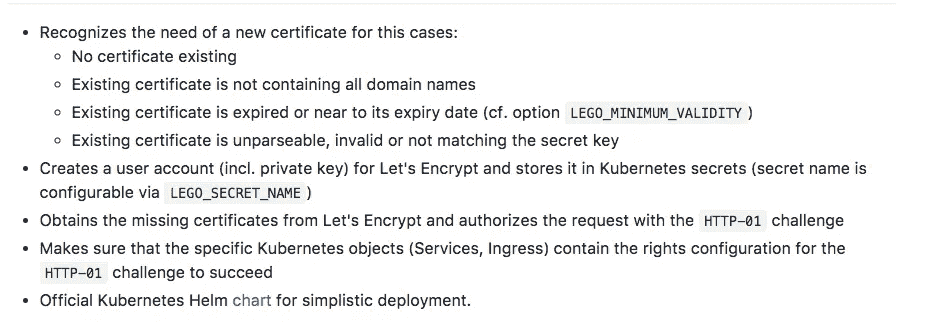

kube-lego github 页面

听起来很复杂，对吧？不要惊慌…把它想象成每隔 X 段时间运行一次的服务，并且**自动**为你获得证书。您甚至不需要更改默认配置。

**自定义域**

自定义域是强制性的，以便使用 kube-lego 和加密。原因是当您生成 SSL 证书时，您必须提供要为其生成证书的域(例如 api.myDomain.com)。

# kube-乐高(实用)

**将 kube-lego 部署到容器引擎**

您需要做的第一件事是为您的 kube-lego 资源创建一个名称空间。创建新的命名空间非常简单，可以通过执行以下命令来完成:

```
kubectl create namespace kube-lego
```

为了检查您的名称空间是否已创建，请通过打开浏览器导航到您的 Kubernetes 实例，并导航到 [http://localhost:8001/ui](http://localhost:8001/ui) ，在左侧菜单中单击名称空间，并检查 kube-lego 名称空间是否列在那里。

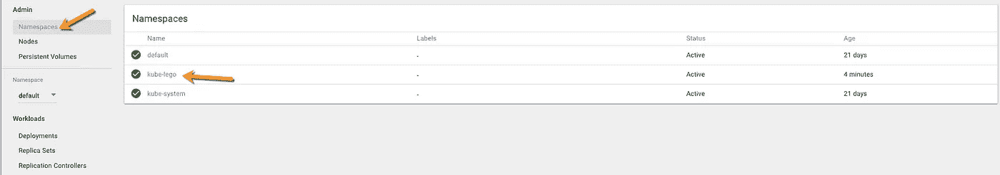

接下来，转到 visual studio 代码，双击 **parse-server-service.yml** 文件，将 **type** 值从 **LoadBalancer** 更改为 **NodePort** 或简单地**用这个文件复制并替换**该文件的内容:

使用这种变化的原因是因为负载平衡器将由[**Kubernetes Ingress**](https://kubernetes.io/docs/concepts/services-networking/ingress/)**资源处理，该资源是允许入站连接到达您的容器引擎集群服务的规则集合。在您的情况下，您的入口 yml 文件将定义 2 个规则:一个用于 SSL，另一个用于负载平衡器。**

**接下来，转到 visual studio 代码，右键单击 container-engine 文件夹并创建一个**kube-Lego-config map . yml**文件。这个配置文件将在运行时被 kube-lego 服务解析。**

**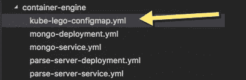**

**将以下要点的内容复制并粘贴到该文件中:**

**将 **<您的电子邮件地址>** 更改为您有权访问的有效电子邮件地址。 **lego.url** 键指向 let 加密 staging api。如果您在生产环境中运行服务，您需要修改此 URL 并使用加密生产 API。生产 API 的 URL 是:[https://acme-v01.api.letsencrypt.org/directory](https://acme-v01.api.letsencrypt.org/directory)**

**在 lego.email 中添加您的电子邮件地址后，您就可以将该文件部署到 Kubernetes 了。为了部署此文件，请在您的终端中执行以下命令:**

```
kubectl apply -f container-engine/kube-lego-configmap.yml
```

**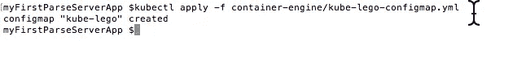**

**接下来，转到 visual studio 代码，右键单击 container-engine 文件夹并创建一个**kube-Lego-deployment . yml**文件。将以下内容复制并粘贴到该文件中:**

**这个文件将在您的 Kubernetes 集群中创建 kube-lego 守护进程服务。kube-lego 守护程序是负责为您自动化所有过程的服务。一旦 kube-lego 守护进程开始运行，它将:**

*   **创建一个用户帐户(通过您的电子邮件地址)与加密**
*   **在 Kubernetes 中自动创建一个服务资源(服务名是:kube-lego-gce)**
*   **查找具有以下注释的 Kubernetes **Ingress** 资源:**

```
metadata:
  annotations:
    kubernetes.io/tls-acme: "true"
```

**kube-lego 守护进程将监控和处理具有此注释的每个入口资源。**

****将解析服务器入口部署到容器引擎****

**转到 visual studio 代码，右键单击 container-engine 文件夹并创建一个 **parse-server-ingress.yml** 文件。将以下代码复制并粘贴到该文件中:**

**该文件将在集群中创建入口资源。它将创建负载平衡器，secret 将托管您的 let 加密证书的密钥和其他相关资源，这将允许您使用 SSL 运行您的解析服务器。kube-lego 守护进程唯一关注的部分是 spec.tls 列表，在那里您需要定义您的 API 端点 URL 并使用您的自定义域。**

**将**<YOUR _ CUSTOM _ DOMAIN>**改为自己的自定义域名。我建议你创建一个子域(如 api.myCustomDomain.com ),因为在 kube-lego 中，你可以用同一个守护进程为不同的服务生成多个证书，你唯一需要做的就是把它添加到你的入口主机，然后指向相关的服务。**

**位于**注释**部分下面的行**kubernetes.io/ingress.class:“gce”**表示我们的入口将使用 GCE 负载平衡器来负载平衡集群中服务的流量。只有在 google container engine 上运行集群时，这一行才有意义。不使用 GCE 负载平衡器，您可以将这一行改为 **nginx** ，将一个 inginx 服务部署到您的集群中，并使用它来实现集群中服务之间的负载平衡。因为我们在这个系列中使用 GCP，所以我决定使用 GCE 负载平衡器，而不是自己处理和维护。如果你出于各种原因坚持维护自己的 nginx 控制器(例如，你不想为 GCE 负载平衡器资源付费)，你可以在 [kube-lego github 页面](https://github.com/jetstack/kube-lego)中阅读如何做到这一点。**

**在终端中执行以下命令，以便将入口资源部署到集群中:**

```
kubectl create -f container-engine/parse-server-ingress.yml
```

**接下来，您需要做的是将您的负载平衡器 IP 地址与您的自定义域连接起来。部署入口资源后，您的负载平衡器 IP 地址将在大约 1–2 分钟内可用。为了知道为您分配了哪个 IP 地址，请执行以下操作:**

*   **打开浏览器，转到集群管理 UI:[http://localhost:8001/UI](http://localhost:8001/ui)**
*   **在左侧菜单中点击**入口****
*   **IP 地址应该位于**端点**列下**

**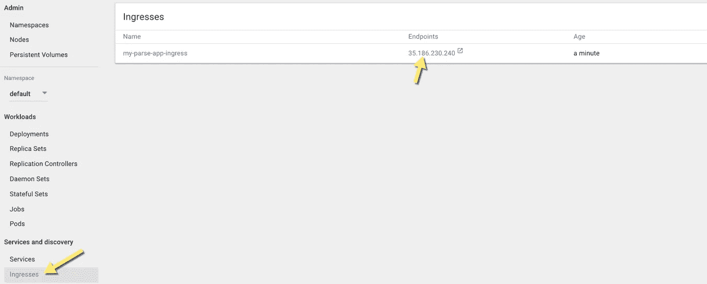**

****故障排除**:如果由于某种原因，1-5 分钟后你看不到 IP 地址，进入你的 GCP 控制台→网络→负载均衡，检查是否已经创建了负载均衡器。**

**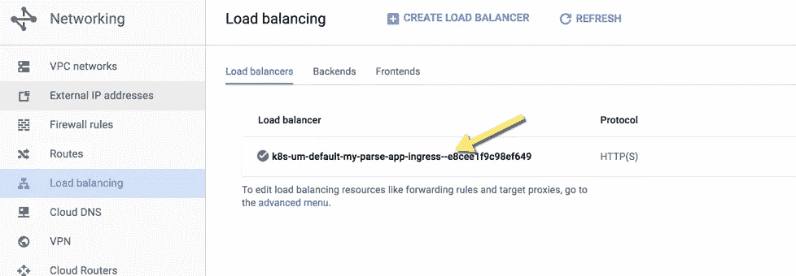**

**现在，您已经有了 IP 地址，是时候将它连接到您自己的自定义域了。就像我前面提到的，kube-lego 需要一个域来获取证书，所以接下来你要做的就是将你自己的自定义域连接到你的入口负载平衡器 URL。**

# **自定义域(实用)**

****连接您的自定义域****

**完成以下步骤，以便将您的自定义域连接到您的负载平衡器 IP 地址:**

*   **登录到您的域名提供商(在我的情况下是 godaddy.com)**
*   **转到您的域管理器**

**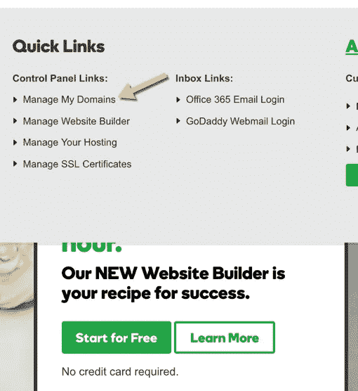**

*   **从列表中选择您的域**

**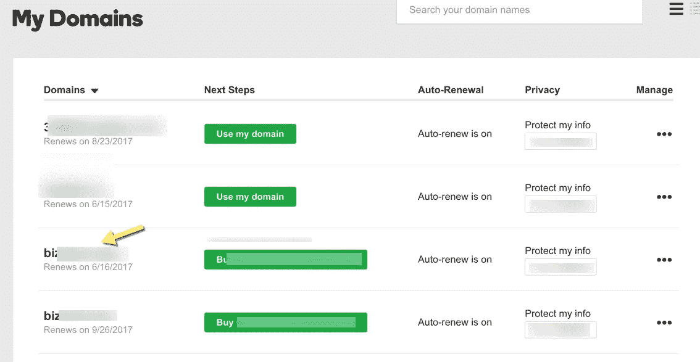**

*   **转到 DNS 管理器**

**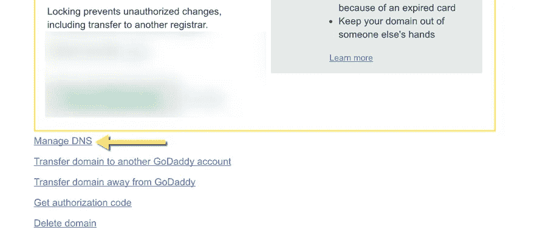**

*   **创建一个新的子域，并通过创建一个新的 **A 记录**将其连接到您的负载平衡器 IP 地址。主机名应该是 api (这是您的子域名)，它应该指向您的负载平衡器 IP 地址**

**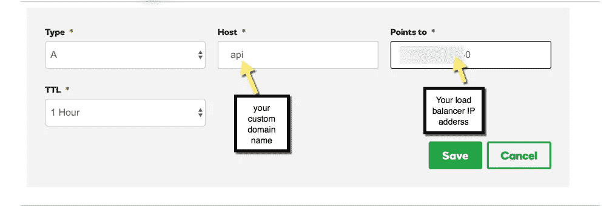**

*   **点击**保存**，确保您的新子域名已列出**

**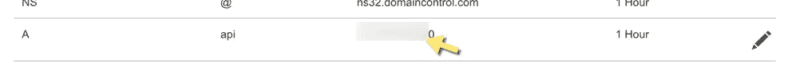**

**现在你唯一能做的就是等待(大约 5-10 分钟),让奇迹发生。在此期间，kube-lego 守护进程将运行，创建一个新的加密帐户，如果需要，访问加密 api 的，并获得一个新的证书，最后通过 Kubernetes 的秘密资源将此证书附加到您的解析服务器服务。**

# ****测试你的 API(实用)****

**完成以下步骤，以检查您的 API 是否能与 SSL/TLS 一起工作**

*   **打开您的浏览器**
*   **导航到 https://api。<your_custom_domain>/解析</your_custom_domain>**
*   **通过浏览器**安全标志**确保您的证书有效且您的 API 安全**

**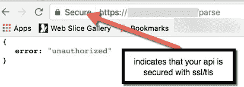**

*   **最后，打开 POSTMAN 并执行一个 **GET** 请求，以获取在本系列第 2 部分中创建的所有任务，但是这次使用 https 和您的自定义域端点，并确保您获得相同的结果**

****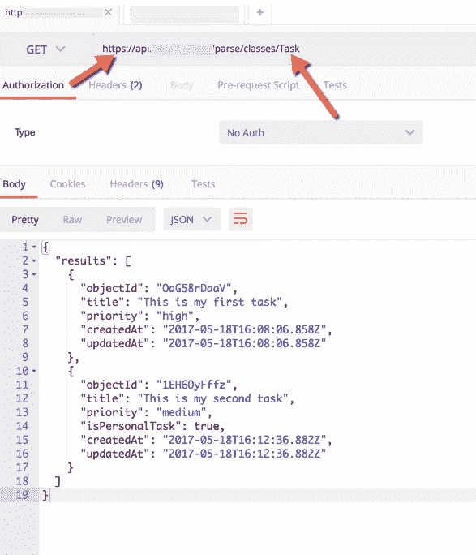****

# ******第 3 部分—总结******

****既然您的 API 是受 SSL 保护的，那么是时候了解如何在“真正的”应用程序中使用它了。在下一部分(第 4 部分)，我将向您展示如何创建一个使用解析服务器 API 的 iOS 应用程序。此外，我将解释如何利用 parse-server 高级安全机制(身份验证、授权等)为您的客户端创建一个安全的应用程序。****