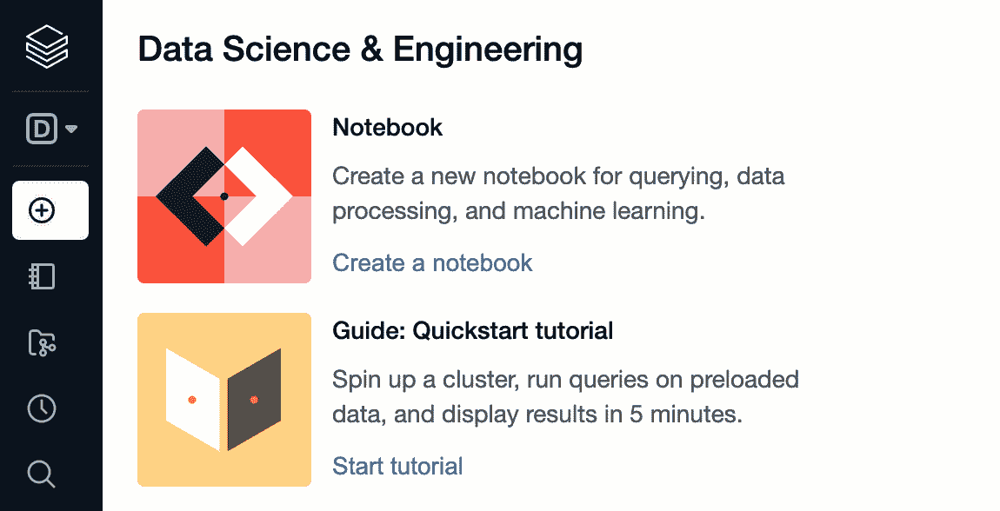
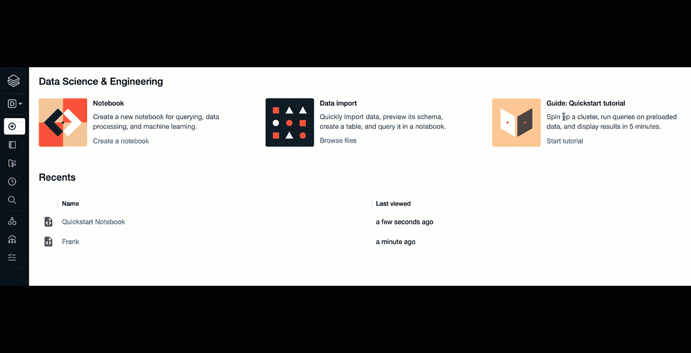
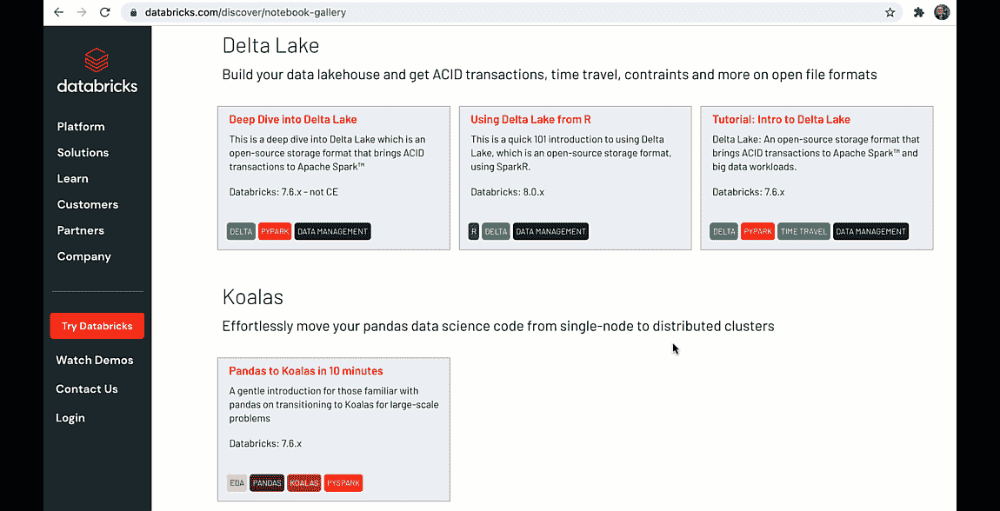

# 通过谷歌云上的数据块从零到英雄(GCP)

> 原文：<https://medium.com/google-cloud/from-zero-to-hero-with-databricks-on-google-cloud-7cb41b1bfb30?source=collection_archive---------3----------------------->

Databricks 成为许多数据工程师、数据科学家和 ML 专家最喜欢的平台。它结合了数据、分析和人工智能。它是多云端的，现在你也可以在 GCP 上使用它。

这篇文章将带你了解在谷歌云 T3 上使用[数据块变得高效的主要步骤。](https://databricks.com/p/google-cloud-free-trial?utm_medium=cpc&utm_source=google&utm_campaign=14925739384&utm_offer=p_webinar_google-cloud-3-part-training-series&utm_adgroup=127807193669&utm_term=databricks%20on%20gcp&&utm_content=trial&gclid=Cj0KCQjw8p2MBhCiARIsADDUFVFpTTch56ZtUMylgkyHt4uxOtykdupnmsLzNfBjDzVtY7BIijOj7EYaAv2yEALw_wcB)

GCP 数据砖:从零到英雄

# 1.从订阅到用户创建，确保基础正确

首先，让我[链接到一个循序渐进的教程](https://www.youtube.com/watch?v=hquLYNN8nz8&t=8s)，它涵盖了视频的所有内容，从创建订阅、先决条件、创建 Databricks 工作区、向工作区添加用户，到运行您的第一份工作。

一定要把这件事做好。即使你像我一样，没有阅读宜家家具说明，也要确保做到这一点(如果你从一开始就正确设定配额，这将为你以后省去麻烦)

另外，查看官方[文档](https://docs.gcp.databricks.com/getting-started/quick-start.html)。

# 2.角色视图

您的所有数据块资产都使用侧栏进行评估。侧边栏的内容取决于所选择的角色:例如**数据科学&工程**，或者**机器学习**。

默认情况下，侧边栏以折叠状态出现，只有图标可见。将光标移动到侧边栏上以展开完整视图。

# 3.探索快速入门笔记本

好的，你顺利地通过了所有的设置步骤，但是你不是一个经验丰富的程序员，你不知道如何在笔记本上写代码？别担心，不是每个人都是数据工程师或数据科学家。

从每个 GCP 的工作区，你都可以开始探索一个 [**快速启动笔记本**](https://docs.gcp.databricks.com/getting-started/quick-start.html) 。快速入门笔记本是探索和运行简单易懂的代码片段的好方法。对于有抱负的数据科学家来说，这是学习如何实现核心功能的好方法。

# 4.笔记本图库

[Databricks 笔记本图库](https://databricks.com/discover/notebook-gallery)展示了笔记本的一些可能性，这些可能性可以轻松导入到您自己的 Databricks 环境中。

# 5.解决方案加速器

[解决方案加速器](https://databricks.com/solutions/accelerators)是处理常见、**高影响力用例**的数据砖块笔记本。它们旨在帮助 Databricks 客户在不到两周的时间内完成从创意到概念验证的过程。查看它们并与您的解决方案架构团队讨论它们，或者观看 YouTube 上的快速介绍。

# 6.您应该知道的技术资源

还有许多技术文章可以帮助您了解 Google Cloud 上的数据块:

*   [将数据块连接到 BigQuery](https://cloud.google.com/bigquery/docs/connect-databricks)
*   [我们如何在 GKE 建立数据模型](https://databricks.com/blog/2021/08/06/how-we-built-databricks-on-google-kubernetes-engine-gke.html)，给那些关心 k8 的人
*   [湖边小屋的毕](/google-cloud/looker-with-delta-lake-49f0a084e2e6):GCP 视频教程
*   [关于 GCP 的数据](https://databricks.com/p/webinar/google-cloud-3-part-training-series?utm_medium=cpc&utm_source=google&utm_campaign=14925739384&utm_offer=p_webinar_google-cloud-3-part-training-series&utm_adgroup=127807193669&utm_term=databricks%20google%20cloud&utm_content=webinar&gclid=Cj0KCQiAsqOMBhDFARIsAFBTN3cstV8VnMYTz44UJ9jqwKrl2S-hXLtRlu-FqV2-hOkWN5dNzHKlUPoaAohQEALw_wcB)，免费培训
*   [Google Cloud 下一次 GCP 会议数据](https://cloud.withgoogle.com/next/catalog?session=PAR143#view-all)
*   [切片和切块 2021](https://youtu.be/Qstnz6IaJ-Y) ，Databricks 社区摘要

如果你喜欢这篇文章，请为它鼓掌。更多基于云的数据科学、数据工程、AI/ML 关注我[***Twitter***](https://twitter.com/frankmunz)***(或***[***LinkedIn***](https://www.linkedin.com/in/frankmunz/)***)。***

非常感谢席尔武·托凡对本文和 GCP 数据的支持。
大喊到 [*乔恩·泰森*](https://unsplash.com/@jontyson) *上 unsplash 为本文所用照片。好球！*