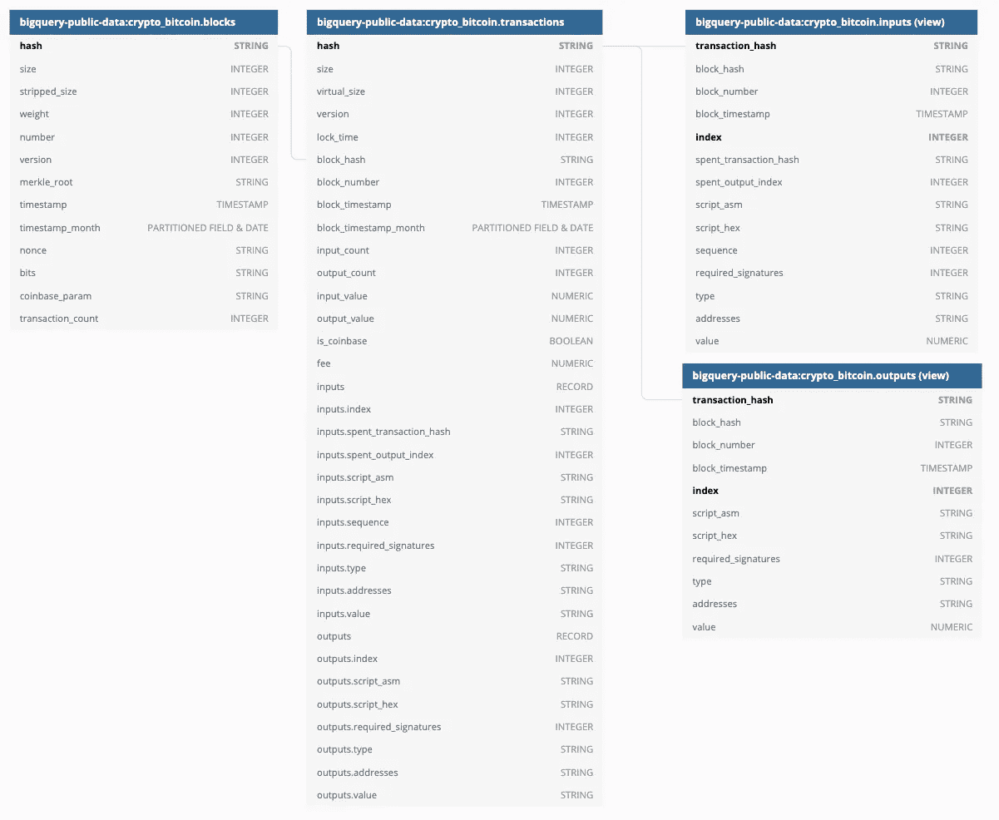
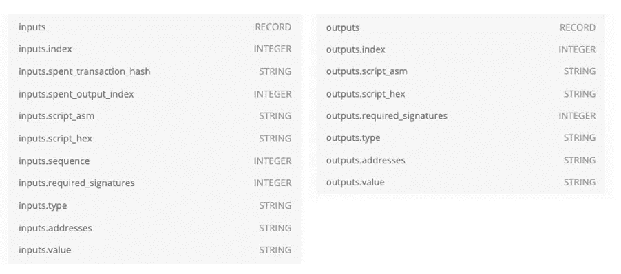
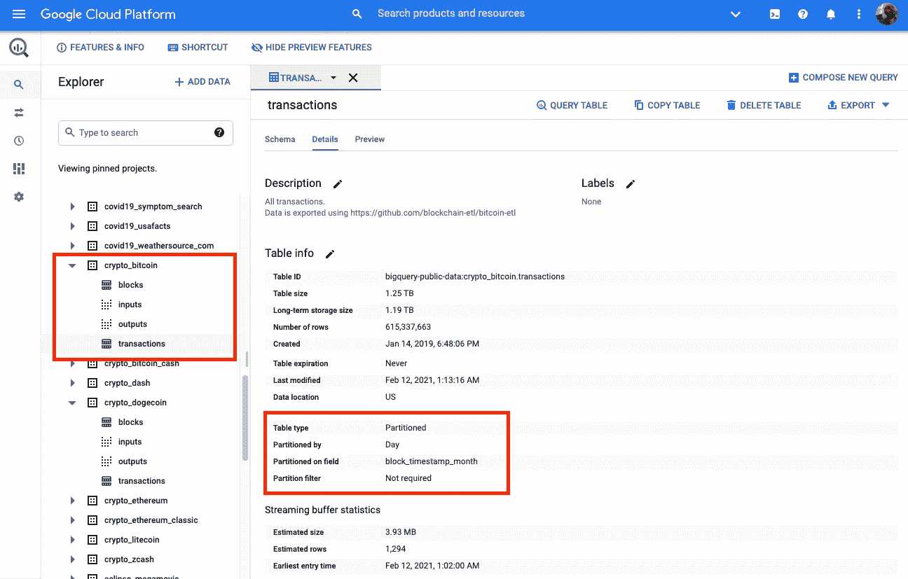
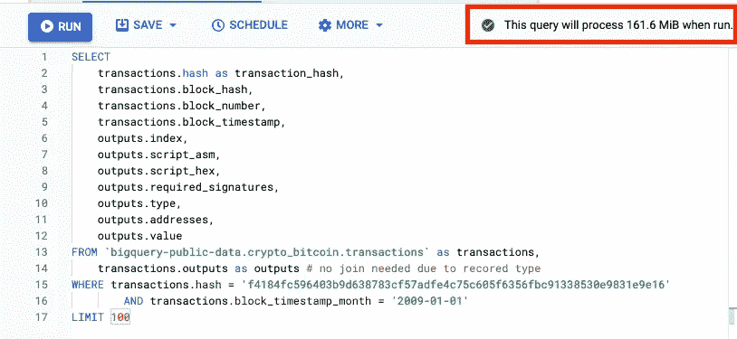
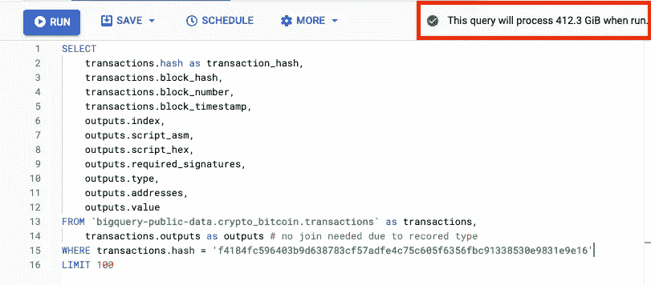

# Google BigQuery 上比特币公共数据的完整关系图

> 原文：<https://medium.com/google-cloud/full-relational-diagram-for-bitcoin-public-data-on-google-bigquery-3c4772af6325?source=collection_archive---------2----------------------->

找到一个比特币数据的完整关系图，这些数据来自一个令人惊叹的开源项目[https://github.com/blockchain-etl/bitcoin-etl](https://github.com/blockchain-etl/bitcoin-etl)。如果你更喜欢处理星型或雪花型模式，请查看我的[简化关系图](https://rifkiamil.medium.com/simplified-relational-diagram-for-bitcoin-public-data-on-google-bigquery-a13fe7c3e007)。



互动图可以找到 https://dbdiagram.io/d/6026650980d742080a3a482c[的](https://dbdiagram.io/d/6026650980d742080a3a482c)

# crypto_bitcoin.transactions 中的两个记录类型字段

由于每个比特币交易可以将钱从多个钱包(输入)转移到多个钱包(输出)，我们需要能够将这些数据存储在 crypto_bitcoin.transactions 上的两个记录类型字段中。



交易.输入和交易.输出

# **使用视图的规范化模式**

如果您仍然喜欢使用表连接而不是数组/UNNEST 函数，那么 crypto_bitcoin.input 和 crypto_bitcoin.output 可能会有所帮助。

crypto_bitcoin.input 是使用数据 crypto_bitcoin.transactions 的视图

请注意，您不需要在事务和输入上使用表连接

crypto_bitcoin.output 是使用数据 crypto_bitcoin.transactions 的视图

请注意，您不需要在事务和输出中使用表连接

# **分区表——保持低成本和快速查询！**

*   当使用 crypto_bitcoin.blocks 和 crypto_bitcoin.transactions 时，尝试使用分区字段 **block_timestamp_month** 。这将加快您的查询并降低您的成本。在 YYYY-MM-DD 中，DD 始终为 01。

```
WHERE transactions.block_timestamp_month = '2018-02-01'
WHERE blocks.block_timestamp_month = '2010-12-01'
```



可以在 details 选项卡下找到已分区表的设置

**带有分区字段的 SQL**

使用分区字段尝试这个查询。



具有分区字段的 161 MiB

**没有分区字段的 SQL**



412.3 GiB ( 421，888 MiB)，无分区字段