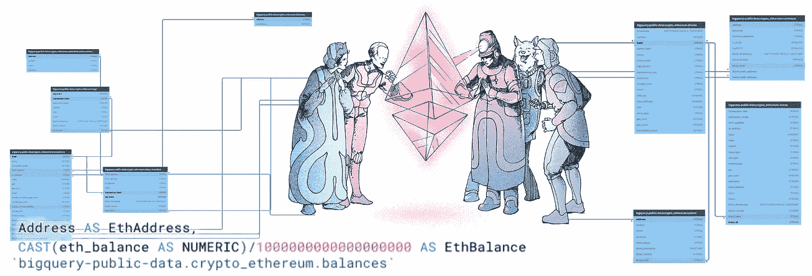

# Google BigQuery 上以太坊公共数据的完整关系图

> 原文：<https://medium.com/google-cloud/full-relational-diagram-for-ethereum-public-data-on-google-bigquery-2825fdf0fb0b?source=collection_archive---------1----------------------->



维克多·哈克曼的原画


[https://dbdiagram.io/d/602e721380d742080a3b1265](https://dbdiagram.io/d/602e721380d742080a3b1265)

找到来自一个令人惊叹的开源项目[区块链-ETL](https://github.com/blockchain-etl) 的以太坊数据的完整关系图。

# 用法示例

## 1.crypto _ 以太坊. transactions

transactions 表有正常的以太坊交易，如果需要查找内部交易，需要查询 trace 表。

> 内部交易实际上不被认为是交易，因为它们不直接包括在区块链中。相反，只能被看作是跟踪的副产品。

## 2.crypto _ 以太坊. contracts

注意——合同表上没有任何唯一键

**合约&交易**

contracts.address 可以是 fond transactions.to_address 或 transactions . receipt _ contract _ address。

```
**transactions.to_address** - Address of the receiver. null when its a contract creation transaction.**transactions.receipt_contract_address** - The contract address created, if the transaction was a contract creation, otherwise null.
```

**加盟合同&交易**

当连接合同和交易时，您必须使用复合外键。

```
"crypto_ethereum.transactions".("block_hash", "to_address") < "bigquery-public-data:crypto_ethereum.contracts".("block_hash", "address")OR"bigquery-public-data:crypto_ethereum.transactions".("block_hash", "receipt_contract_address") < "bigquery-public-data:crypto_ethereum.contracts".("block_hash", "address")
```

**契约&痕迹**

Trace.from_address 和 Trace.to_address 都可以有 contract.address

## 3.crypto_ethereum.traces

在以太坊[https://openethereum.github.io/JSONRPC-trace-module](https://openethereum.github.io/JSONRPC-trace-module)中了解更多关于跟踪的信息，JSONRPC-trace-module 用于填充 crypto_ethereum.traces 表

> 内部交易实际上不被认为是交易，因为它们不直接包括在区块链中。取而代之的只能被看作是追踪的副产品

[**etherscan . io**](https://etherscan.io/tx/0x09b8fc0deb96a27ddd9f20d8ca5d76931dc2fa5be97191ab04ce12239b0d6525#internal)**内部交易简化和高级**

如果您使用 Etherscan 查找内部事务，请注意简单视图和高级视图之间的切换


[关闭](https://etherscan.io/tx/0x09b8fc0deb96a27ddd9f20d8ca5d76931dc2fa5be97191ab04ce12239b0d6525#internal)


打开

**内部交易简单视图**

如何查询内部交易的跟踪表[(默认/来自 Etherscan.io 的简单视图)](https://etherscan.io/tx/0x09b8fc0deb96a27ddd9f20d8ca5d76931dc2fa5be97191ab04ce12239b0d6525#internal)。返回的总行数将与以太网扫描信息屏幕上关于块的信息相匹配。


125 个内部事务(实际上，还有更多，这些是值> 0 的事务)

**内部交易高级视图**

如何查询内部交易的跟踪表([来自 Etherscan.io 的](https://etherscan.io/tx/0x09b8fc0deb96a27ddd9f20d8ca5d76931dc2fa5be97191ab04ce12239b0d6525/advanced#internal)高级视图)

## 3.crypto _ ether eum . modified _ tokens

用来自 CSV 的[数据修改令牌。](https://github.com/blockchain-etl/ethereum-etl-airflow/blob/master/dags/resources/stages/seed/data/token_amendments.csv)

首先进行重复数据删除，因为令牌表可能会因 create 2[https://medium . com/@ Jason . carver/defend-against-wild-magic-in-the-next-ether eum-upgrade-b 008247839 D2](/@jason.carver/defend-against-wild-magic-in-the-next-ethereum-upgrade-b008247839d2)

```
##Query for View amended_tokensWITH tokens AS (
    -- Deduplicate first since the tokens table might have duplicate entries due to CREATE2 [https://medium.com/@jason.carver/defend-against-wild-magic-in-the-next-ethereum-upgrade-b008247839d2](/@jason.carver/defend-against-wild-magic-in-the-next-ethereum-upgrade-b008247839d2)
    SELECT 
        address,
        ANY_VALUE(symbol) AS symbol,
        ANY_VALUE(name) AS name,
        ANY_VALUE(decimals) AS decimals,
    FROM `bigquery-public-data.crypto_ethereum.tokens`
    GROUP BY address
)
SELECT 
    address,
    COALESCE(am.symbol, tokens.symbol) AS symbol,
    COALESCE(am.name, tokens.name) AS name,
    COALESCE(am.decimals, tokens.decimals) AS decimals,
FROM
  `blockchain-etl-internal.common.token_amendments` AS am
FULL OUTER JOIN
  tokens
USING(address)
```

## 4.crypto _ 以太坊.令牌

令牌列表

## 5.crypto _ ether eum . token _ transfer

以太坊区块链上最流行的交易类型是调用 ERC20 类型的契约来执行传输操作，将一些令牌从一个 20 字节的地址移动到另一个 20 字节的地址。该表包含这些交易的子集，并对数据进行了进一步处理和反规范化，以使其更易于用于令牌传输事件的分析。

## 6.crypto_ethereum.logs

与 token_transfers 表类似，logs 表包含智能合约事件的数据。但是，它包含所有日志数据，而不仅仅是 ERC20 令牌传输。该表通常用于报告以太坊区块链上记录的任何事件类型。

## 7.crypto_ethereum.balances

此表包含所有地址的以太网余额，每天更新。

运行 [BigQuery](https://console.cloud.google.com/bigquery?sq=819168234572:c1cd90fa232b42a6ba31efce1f6ff67e) 。

# 分区字段

如果表在图中有分区设置，您可以看到“分区字段”。

使用下表时

*   crypto _ 以太坊. contracts
*   crypto_ethereum.logs
*   crypto _ ether eum . token _ transfer
*   crypto_ethereum.traces
*   crypto _ 以太坊. transactions

尝试使用分区字段。这将加快您的查询并降低您的成本。

```
WHERE transactions.block_timestamp = '2021-01-21'
WHERE blocks.timestamp = '2010-12-05'
```


# **交互图**

在[https://dbdiagram.io/d/602e721380d742080a3b1265](https://dbdiagram.io/d/602e721380d742080a3b1265)找到一个包含更多列级细节的交互图。


[https://dbdiagram.io/d/602e721380d742080a3b1265](https://dbdiagram.io/d/602e721380d742080a3b1265)

# 学习 SQL 和加密货币

我有几个帖子可以帮助你快速学习和使用 SQL 处理来自不同加密货币的区块链数据。试试[“用 Google 的实时数据库上的比特币数据学习 SQL 的最快方法”](https://rifkiamil.medium.com/the-fastest-way-to-learn-sql-with-bitcoin-data-on-a-live-database-from-google-part-1-c10480041f0a)。