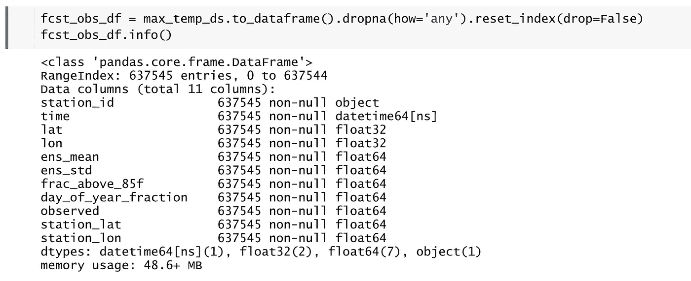
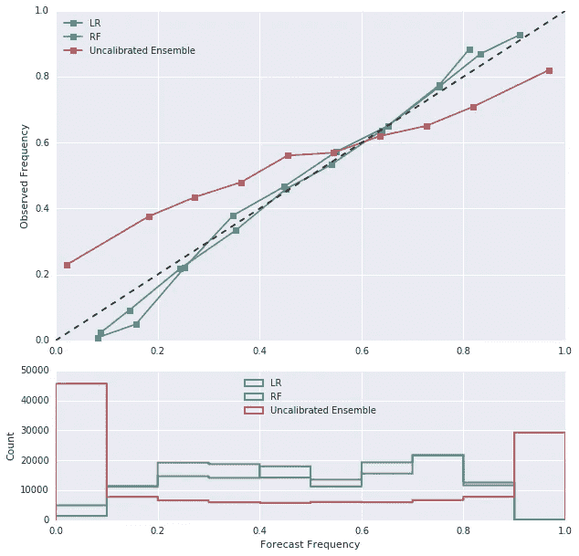

# 用机器学习、谷歌大查询和重新预测校准温度预测——第 1 部分

> 原文：<https://medium.com/google-cloud/fun-with-ghcn-data-on-googles-bigquery-79275af13e07?source=collection_archive---------1----------------------->

我最关心的事情是改进天气预报。改进天气预报的一种常用方法是通过统计模型校准(或校正)数值天气预报输出，该统计模型根据回顾性预报进行训练，并根据各种来源的观测结果进行验证。一些更知名的产品包括圣路易斯大学的 [CIPS 模拟](http://www.eas.slu.edu/CIPS/ANALOG/analog.php)，以及 NOAA/ESRL 基于[第二代重新预测数据集](http://www.esrl.noaa.gov/psd/forecasts/reforecast2/)的产品。我的论文(现在感觉好像几年前就完成了)使用 GEFS 重新预测的数据开发了一个基于模拟的模型来预测提前 7-10 天的龙卷风活动。许多这些方法，尤其是基于模拟的方法，试图模仿令人敬畏的 NWS 天气预报员每天所做的事情:

1.  回想过去天气模型输出预测特定事件的情况。
2.  回忆在这些事件中实际发生了什么，并利用这些信息提供尽可能好的预测。

不幸的是，最困难的部分涉及到获得过去的模型数据*和*观察数据。幸运的是，谷歌在他们的 [BigQuery](https://cloud.google.com/bigquery/) 平台上提供了来自[全球历史气候网络](https://www.ncdc.noaa.gov/data-access/land-based-station-data/land-based-datasets/global-historical-climatology-network-ghcn)的天气观测数据！BigQuery 允许用户通过 SQL 查询快速、方便、廉价地存储和检索大型数据集(最重要的是，对于所有大气科学研究生来说)。

在这个(希望是)多部分系列的第一部分中，我们将通过一个快速练习来展示如何从 BigQuery 获得 GHCN 数据，使用历史预测数据，以及一些快速和基本的机器学习方法来校准温度预测，所有这些都在 Google 的 DataLab 中。

# 问题是

给我一分钟的幽默:假设你是一家连锁杂货店的老板兼终身总裁，这家店只在密苏里州经营。夏季即将来临，您已经注意到，在 3 月和 9 月之间，每当温度超过 85 华氏度(29.44 摄氏度)时，顾客往往会购买更多的瓶装水。你想为需求的增加做好准备，但是你需要提前几天订购瓶装水。

# 数据

为了帮助解决这个问题，我们将使用 NOAA 全球集合预报系统的回顾性预报(也称为重新预测，或使用[再分析](https://en.wikipedia.org/wiki/Meteorological_reanalysis)初始条件的回顾性天气预报)来校准[集合天气预报](https://en.wikipedia.org/wiki/Ensemble_forecasting)。这些数据可以通过 [NOAA/ESRL 的 GEFS 重新预测网站](http://www.esrl.noaa.gov/psd/forecasts/reforecast2/download.html)请求和下载。我们将用 1985 年至 2016 年的预测校准提前 7 天的 2 米温度预测。

# 收集站点数据

我们将使用 BigQuery 收集相关的 GHCN 观测数据！我们必须处理这个数据集的一些棘手问题:

1.  完整的 GHCN 数据集的观测数据可以追溯到 18 世纪晚期！虽然这非常令人印象深刻(并且已经成熟，可以进一步探索了！)，我们只对 1985–2016 年间有观测值的站感兴趣。
2.  我们也只对密苏里州的电视台感兴趣。完整的 GHCN 数据集在全世界各大洲都有站点！爱德华·洛伦茨[曾提出一个著名的问题](https://en.wikipedia.org/wiki/Chaos_theory#Sensitivity_to_initial_conditions)，如果一只蝴蝶在巴西扇动翅膀引发了德克萨斯州的龙卷风(我们不要忘记，自然并不符合人为的州界)，我们可以通过只考虑密苏里州内的车站来加快速度。
3.  GHCN 台站从多个来源提供对多种气象现象的观测，如降水、最低和最高温度、风速等。不是所有的电台都提供相同类型的报告，也不清楚每个电台是如何测量 24 小时周期的！我们只对最高温度感兴趣，我们假设一个 24 小时的时间段代表世界协调时 0:00-23:59，所以我们也必须考虑到这一点。

使用正确的 SQL 查询可以很容易地解决这些问题。使用 BigQuery web 界面，我们可以提供以下查询来选择满足上述标准的电台:

```
SELECT
 ghcnd.id as station_id,
 ghcnd.firstyear as first_year,
 ghcnd.lastyear as last_year,
 station.name as station_name,
 station.latitude as lat,
 station.longitude as lon
FROM
  [bigquery-public-data:ghcn_d.ghcnd_inventory] as ghcnd
JOIN
  [bigquery-public-data:ghcn_d.ghcnd_stations] as station
ON
  ghcnd.id = station.id
WHERE
   ghcnd.firstyear <= 1985
   AND ghcnd.lastyear >= 2016
   AND ghcnd.ID LIKE "US%"
   AND station.state LIKE "MO%"
   AND ghcnd.element = "TMAX"
```

它为我们提供了提供 24 小时最高温度报告的站点的 ID、名称、纬度和经度。处理该查询大约需要 3 秒钟，这是非常好的，因为我们现在时间紧迫！虽然您可以直接从 DataLab 笔记本中查询它，但我选择从 BigQuery web 应用程序中保存结果表并收集保存的表。我加载了它，然后我们将表格转换成熊猫数据帧，并检查我们找到的电台数量，以及前几行:


目前看起来不错！此时，我们现在需要从 BigQuery 公共数据集获取观察结果。我们可以通过将相关密苏里站的表格与每日 GHCN 观测数据相结合来做到这一点。谷歌以表格形式提供了按年份分列的数据(如 *ghcnd_1998* 代表 1998 年以来的每日站点数据)。Google 有一些很棒的 SQL 命令，比如允许在表的查询中使用[通配符。这允许我们只查看我们感兴趣的年份。我们可以使用前面的查询只选择我们想要的站点，同时从这些站点收集所有的最高温度观测值。为了展示 Google 的 BigQuery 的强大，下面的查询花了我 *9.8 秒*来运行！如果我们必须从某个服务器下载数据，将数据加载到 pandas(通过循环或通过 dask)，然后对数据进行子集划分，以包含我们需要的站点，这将花费更长的时间:](https://cloud.google.com/bigquery/docs/wildcard-tables)

```
#StandardSQL
SELECT
  ghcn.id AS station_id,
  ghcn.date AS ob_time,
  (ghcn.value / 10.0) AS tmax,
  ghcn.sflag AS sflag,
  stations.lat AS lat,
  stations.lat AS lon
FROM
  `bigquery-public-data.ghcn_d.ghcnd_*` AS ghcn
JOIN (
  SELECT
    ghcnd.id AS station_id,
    ghcnd.firstyear AS first_year,
    ghcnd.lastyear AS last_year,
    station.name AS station_name,
    station.latitude AS lat,
    station.longitude AS lon
  FROM
    `bigquery-public-data.ghcn_d.ghcnd_inventory` AS ghcnd
  JOIN
    `bigquery-public-data.ghcn_d.ghcnd_stations` AS station
  ON
    ghcnd.id = station.id
  WHERE
    ghcnd.firstyear <= 1985
    AND ghcnd.lastyear >= 2016
    AND ghcnd.ID LIKE "US%"
    AND station.state LIKE "MO%"
    AND ghcnd.element = "TMAX") AS stations
ON
  stations.station_id = ghcn.id
WHERE
  ghcn.qflag IS NULL
  AND _TABLE_SUFFIX >= '1985'
  AND _TABLE_SUFFIX <= '2016'
  AND ghcn.element = 'TMAX'
  AND ghcn.value IS NOT NULL
  AND EXTRACT(MONTH
  FROM
    ghcn.date) >= 3
  AND EXTRACT(MONTH
  FROM
    ghcn.date) <= 9
```

这给了我们另一个表(如果我们不太想花 10 秒钟运行另一个查询，我们也可以在 BigQuery 上保存为一个表(我确实这么做了！))与我们感兴趣的站点的最高温度报告。您还会注意到，我们将最高温度报告除以 10.0，这是必要的，因为报告的单位是十分之一摄氏度(欢迎来到气象站观测的有趣世界)。我们收集数据，将其转换为熊猫数据帧，并对数据进行一些必要的清理:


我们的最高温度观测分布的快速图表显示数据是正常的(至少比降水量正常)，没有什么看起来太不寻常。也就是说，任何在中西部度过夏天的人都会告诉你，气温完全有可能达到 114 华氏度(46.1 摄氏度):


# 准备预测数据

我们来自 NOAA/ESRL 的重新预测数据是 netCDF 格式的。我们可以使用优秀的 [xarray](http://xarray.pydata.org/) 包来轻松读取和操作数据:


30 多年的预测数据唾手可得！

我们看到有 11 个集合成员(10 个扰动，一个控制)，我们有 7 天 24 小时的地表温度预报。为了使这更容易，我们必须将 xarray 数据集的一部分转换成友好的数据。首先，我们需要将经度(从 0°到 360°)转换成与站点数据相匹配的格式(从-180°到 180°)，这将允许我们只选择离每个站点最近的相关网格点:


我们还需要将温度数据从开尔文转换为摄氏度，重命名冗长的温度变量名，并将我们的初始时间(模型运行的时间)转换为参考时间(预测有效的时间):


我们也只对 24 小时内的最高温度感兴趣，所以我们可以通过取预测小时内的最高温度来减少数据集。最后，我们可以从集合预报数据中创建一些特征，包括集合平均值、集合标准差、集合成员高于 85℉ (29.44℃)的比例，以及一年中我们进行预报的时间:


# 把所有的放在一起

我们现在准备把所有的数据放在一起！我们可以在 xarray 中通过将 pandas 数据帧转换为 xarray 数据阵列来实现这一点:


以一种完全看似迂回的方式，我们现在将这个 xarray 数据集转换回 pandas 数据帧(当然，还有更好的方法，但是这种过于冗长的方法也很有效),并删除任何包含无效数据的行:



快速健全性检查(以联合 hexbin 图的形式)显示集合平均值与观测数据很好地匹配，这对于七天后的最高温度预报来说非常好:


因为我们对预测是否高于 85℉ (29.44℃)感兴趣，所以我们创建两列来表示预测是高于还是低于我们的阈值:


# 最后:造型！

最后，我们开始校准数据！我们想做的第一件事(因为我们是优秀的科学家)是将数据集分成独立的训练和测试数据集。如果我们方便地忽略彼此靠近的站几乎肯定是相关的，而不是独立的样本，以及温度预报/观测(主要为简单起见，tbqh \_(ツ)_/)的日常相关性，我们可以简单地根据观测/预报对所属的年份分割我们的数据:我们将根据 1985-2005 年的数据进行训练，并根据 2006-2016 年的数据进行测试:


现在，我们需要创建一个基线预报:我们将使用温度阈值以上的未校准集合成员的分数来测试我们的其他方法。假设在我们担任这家食品连锁店的终身总裁期间，我们听说并计划使用准确性作为我们的评估标准。评估大多数集合成员预测> =85℉温度的预报被认为是“是”,否则是“否”,我们得到了一个惊喜:


哇，81%的准确率！事实证明，这是一个非常误导人的准确性统计数据(主要是因为准确性是一个使用起来很糟糕的度量标准，但是在我们这个以杂货店为中心的世界里，我们没有太多时间来查看准确性分数的注意事项)，并且提出了解释结果的重要一点。很容易预测几个月内气温是否会达到 85 华氏度，而这种情况在 T2 很少发生。按月测量准确性子集提供了一个不同的故事，未校准的预测在 3 月至 5 月表现惊人，否则就不那么好了:


让我们看看是否可以通过特别关注表现不佳的月份(6-9 月)来改善这一点。我们将首先测试一个逻辑回归方法。我们的特征包括集合平均值、集合标准差、温度阈值以上集合成员的分数以及一年中的分数天。虽然您希望在实际的机器学习项目中校准超参数，但出于演示目的，我们将做一些简单的事情:

```
from sklearn.linear_model import LogisticRegression as LR
lr_clf = LR(n_jobs=-1, C=0.01)
lr_clf.fit(month_subset_train[features].values,
           month_subset_train[target].values)
```

结果比 T4 好一点点，但也好不了多少:


如果我们尝试随机森林呢？这些通常开箱即用，我们无论如何都要做一些基本的事情，所以为了简单和演示，我们将试一试:

```
from sklearn.ensemble import RandomForestClassifier as RFC
rf_clf = RFC(n_estimators=1000, max_features='auto', max_depth=4,
             n_jobs=-1, verbose=0)
rf_clf.fit(month_subset_train[features].values,
           month_subset_train[target].values)
```

也没好多少，事实上有时比逻辑回归更糟:


好吧，我们的准确性可能不会变得更好，但是我们的概率预测至少变得更可靠了吗？查看可靠性图(顶部面板，显示当预测事件发生的概率时事件发生的频率)，我们看到我们校准的方法实际上比我们未校准的集合预测更可靠。我们还看到，来自我们校准的模型的预测不如未校准的集合预测那样清晰(也就是说，集合预测倾向于给出接近 0%或 100%的概率，而我们的 ML 方法没有):



# 那么，怎么了？

我们可能会遇到几个问题:

1.  我们将所有的气象站合并成一个大型数据集，但几乎可以肯定的是，各个气象站存在不同的偏差(可能是由于，比如说，附近的地形)。在单个站点拟合模型并进行预测可能比将数据汇集在一起或将具有相似特征的站点组合在一起更有意义。
2.  准确性不是评估预测时使用的衡量标准。你最好使用诸如精确度、回忆和 F1 分数这样的东西。
3.  GEFS 重新预测的数据相当粗糙，水平分辨率为 1.0 度。有可能我们只使用了少量的网格点来校正所有的站点。有很多方法可以在更精细的高斯空间网格上获得数据，因此这可能值得研究。
4.  我们没有真正优化我们的超参数，尽管我怀疑这不会给我们带来太多的好处。
5.  预测天气真的很难*，尤其是七天之外！我们甚至没有进入*更难的问题，比如预报降水量。**

# *当然，但是什么是了不起的？*

*这么多！在此之前，我从未使用过 BigQuery，也没有使用过谷歌的云计算平台，使用它感觉棒极了。*

1.  *BigQuery 是合法的。我已经有一段时间没有学习 SQL 了，所以尝试使用 Google 的 SQL 式语法和函数是一件非常有趣的事情。此外，它的运行速度真的很快，比从 NCDC 服务器获取数据的 wget 命令或类似命令要快得多。我只能希望谷歌能够在他们的云服务上发布更多的天气数据。*
2.  *DataLab 也很棒！花了一些时间才弄明白(虽然我将把这归因于我对 Docker 容器的有限知识)，目前它还处于测试阶段，所以有一些奇怪的地方需要解决，但我喜欢它！事实上，它可以连接到谷歌云计算引擎上的一个实例，这是一个很好的优势。*
3.  *构建虚拟实例非常简单！虽然我从未遇到过 AWS 的问题，但我发现在 GCP 上运行/设置虚拟机更容易一些。*
4.  *人们可以用 GHCN 数据做很多有趣的事情！我期待着更多地处理数据，并可能测试将天气与机器学习相结合的新想法。*

*这篇文章的第二部分将在我们寻求精确的温度预报的过程中解决这些问题。敬请期待！*