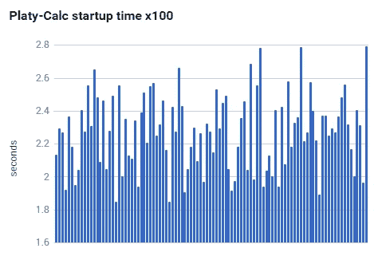
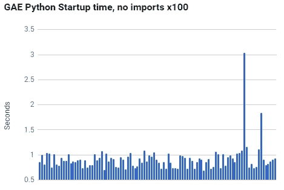
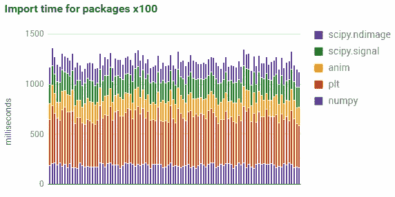
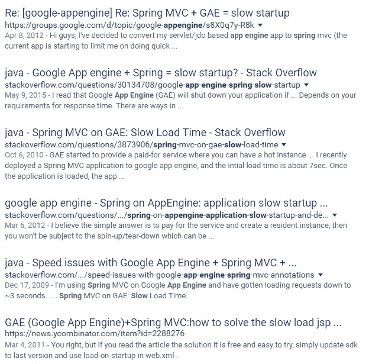

# GAE 启动时间和依赖性问题

> 原文：<https://medium.com/google-cloud/gae-startup-time-and-the-dependency-problem-b866d92c1e6f?source=collection_archive---------0----------------------->

上周，我和一个曾经在游戏行业工作的好朋友一起吃午饭。她哀叹 Google.com 作为计算器的局限性:

> “Google.com 是我用过的最简单的计算器之一。但是最近我已经达到了极限。它甚至不会计算 1024 的阶乘。”

结果是，她创建了自己版本的 Google.com 计算器(甚至从主网站复制了 CSS/HTML)，名为“ *Platy-Calc* ”。然而，她的版本运行在 App Engine 上，并使用 python 运行时(可以轻松计算 1024 的阶乘)评估提交的数学表达式。

对我来说，这太棒了，于是我立即开始使用 *Platy-Calc* 作为我的主要计算器。

然而，我开始注意到一天中的第一个请求总是比随后的请求慢一点。鉴于我最近一直在谈论冷启动时间，我联系了我的朋友，要求对应用程序进行一些分析。

嘿！忙到没时间看书？看 TL；上面的 DR 视频！

# 初始轮廓

Platy-Calc 的冷启动时间的第一个概要显示了我所期望的:比正常的冷启动时间要长。

Platy-Calc 的代码非常简单；启动路径中没有全局变量，没有锁定问题，也没有数据库调用。在全球范围内，在导入期间，唯一与正常的“Hello World”不同的是这些导入:

鉴于我们已经对一个简单的“Hello World”应用程序进行了计时，并看到了启动时间的样子，这些导入看起来像是一个罪魁祸首。

作为测试，我们删除了那些导入并重新计时启动过程，只是为了看看 GAE 启动时间是否突然倒退了，或者是否有其他问题正在发生。

谢天谢地，我们没有发疯，因为我们的计时显示了与我之前看到的几乎相同的启动行为[。](/@duhroach/understanding-and-profiling-app-engine-cold-boot-time-908431aa971d)

# 进口征税

在这一点上，排除过程清楚地指出导入是启动时间问题的来源。然而，简单地彻底抛弃它们是错误的；我们需要更多的信息。

因此，我们整理了一小段代码(类似于 [this SO post](http://stackoverflow.com/questions/6025635/python-speed-up-imports) )来为每个导入的模块计时，看看哪个模块可能会让我们心痛:

上图讲述了两个主要故事:

1)导入的总和很容易使应用程序的冷启动时间增加约 1.25 秒

2)显然，有些进口比其他进口需要更长的时间。

#2 确实是这里有趣的一点，值得花点时间来讨论。

# 悲哀是依赖

在我那个时代，我们不得不担心 C++头文件的复杂性如何影响我们 2000 万行应用程序的 link +编译时间。在现代函数式语言中，大部分开销已经从编译时转移到运行时。一个库/模块可以在你需要的时候加载*而不是在应用程序开始的时候。为了支持这一点，大多数函数式语言在加载和实例化代码时都发展了相当大的灵活性…这通常会对您的加载时间产生负面影响。*

在冷启动期间，您的应用程序代码将忙于扫描和导入依赖项。这样做的时间越长，执行第一行代码的时间就越长。一些语言可以优化这一过程，使其异常快速，其他语言较慢，但提供更大的灵活性。公平地说，在大多数情况下，一个标准的应用程序导入几个模块是不够有效的。然而，当第三方库变得足够大时，我们开始看到它们在导入语义上做一些奇怪的事情，并且经常会严重影响您的启动时间。

对于 app engine，这个问题的完美例子是 Java 的 [Spring framework](https://cloud.google.com/appengine/articles/spring_optimization) ，它大量使用了该语言的某些方面，这些方面造成了不太理想的启动开销:Spring 需要在加载时扫描所有类(以便确定依赖关系)，这严重影响了实例启动时间，从而影响了您的整体响应能力。事实上，只要谷歌一下“ [*App 发动机弹簧缓慢*](https://www.google.com/webhp?&ie=UTF-8#q=app%20engine%20spring%20slow) ”就会发现前 6 个话题都与弹簧影响冷启动时间有关:

虽然看起来我是专门针对[弹簧](https://projects.spring.io/spring-framework/)的，但我不是。你的第三方库越大，功能越多，他们就越有可能需要做一些奇怪的事情来让他们的代码运行起来，移动并提供功能。

# 简单的解决办法

考虑到操作需要导入，我们的手在优雅的解决方案方面有点受限。尽管如此，我们还是想出了一些办法来解决这个问题:

*   **使用预热请求** —当网站从静态资产加载时，向计算器服务发送一个快速 ping，它将在您输入等式的相同时间内导入所需的库。
*   **惰性加载导入** — Python 通过允许模块的全局与局部导入来支持这种操作。所以我们可以将所有的导入都转移到函数局部；这样，如果你只是想做 2+2，你就不用等着导入整个 SciPy 模块了。只有当我们检测到一些特定的关键字时，我们才会导入那些特定的东西。
*   **修剪依赖树**——我们发现了很多关于如何通过显式导入子部分或者一些有趣的技巧(包括镜像模块和删除内容)来手动修剪依赖树的 SO 帖子和教程。

考虑到这一切..我们决定什么也不做。

没错。 *Platy-Calc* 并不是一个庞大的、价值 100 万美元的 QPS 服务。它只是一些真正需要从命令行界面计算大数的朋友使用的一个小应用程序(出于某些疯狂的原因..).所以在我们的例子中，每隔几天为一个查询多等一秒钟并没有什么大不了的。

尽管我很想宣扬性能，但事实是，考虑到需要进行的修复工作，特定性能改进给最终用户带来的结果有时并不合理。

所以，记住:每一毫秒都很重要！(除了在少数地方..这真的不重要..；)

## 嘿！

想了解更多关于如何[剖析 App 引擎启动时间](/@duhroach/understanding-and-profiling-app-engine-cold-boot-time-908431aa971d)？
想了解更多关于 [GAE 的调度器设置](/@duhroach/app-engine-scheduler-settings-and-instance-count-4d1e669f33d5)？
想知道首先避免[启动新实例的方法](/@duhroach/app-engine-startup-time-and-the-global-variable-problem-7ab10de1f349)？
想成为[数据压缩专家](http://shop.oreilly.com/product/0636920052036.do)？