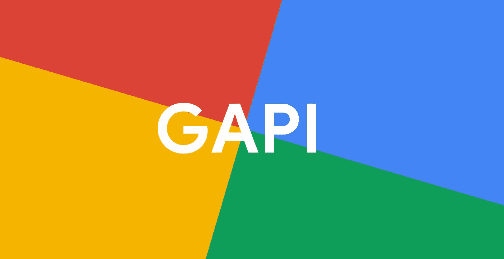
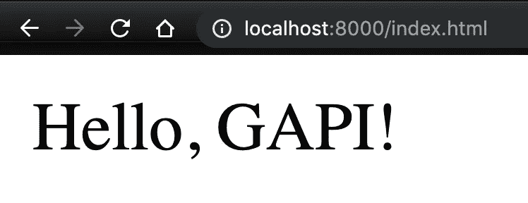
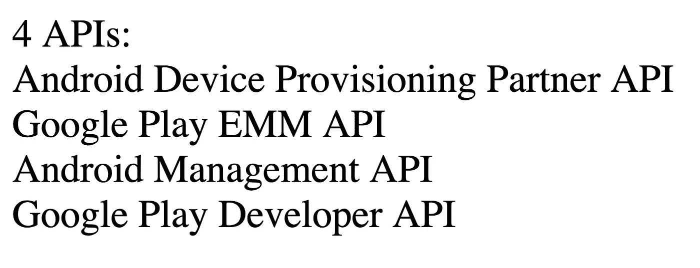
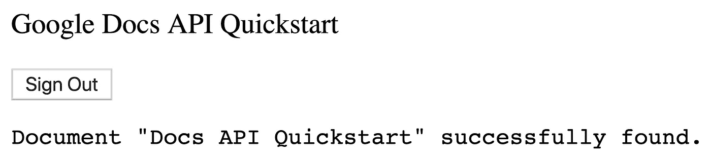

# APIs 浏览器 JavaScript 的 Google APIs 客户端库

> 原文：<https://medium.com/google-cloud/gapi-the-google-apis-client-library-for-browser-javascript-5896b12dbbd5?source=collection_archive---------0----------------------->



使用 API 最简单的方法之一就是根本不使用服务器。有些应用程序非常适合客户端代码。`GAPI`库提供了一种简单、灵活的方式从浏览器调用 Google APIs。

在这篇博文中，你将了解一些关于`GAPI`库的知识，如何入门，以及如何使用 JavaScript `Promises`和 Google OAuth 等特性。

# 什么是`GAPI?`

Google 提供了一组客户端库，用于调用各种语言的 Google APIs，如 Python、Java 和 Node。

**GAPI** 是谷歌浏览器端 JavaScript 的客户端库。它用于 Google 登录、Google Drive 和数千个内部和外部网页，以便轻松连接 Google APIs。

该客户端库于 2012 年在谷歌 I/O 上首次推出，旨在提供简单的谷歌身份和 API 访问，现已用于数千个域，目前每天处理*数十亿*次谷歌 API 查询。

## GAPI 入门

GAPI 的美妙之处在于，你不需要下载任何库来使用 API 客户端。在一个 HTML 文件中，*只需*包含这个`script`标签:

```
<script src="[https://apis.google.com/js/api.js](https://apis.google.com/js/api.js)"></script>
```

> 在这个 URL 上，你会得到一个缩小版的 GAPI(通过[闭包编译器](https://github.com/google/closure-compiler)缩小)。

完整的`index.html`可能是这样的:

我们可以使用`python -m SimpleHTTPServer`在本地提供这个 HTML 文件。

…或者使用节点:`npm install http-server -g && http-server -p 8000`。

如果我们打开`localhost:8000`，我们将会看到一个空白页面，它静默地加载 API 客户端，没有 javascript 错误:



我们已经建立了我们的“你好，世界”网页！现在让我们使用这个`gapi`客户端。

# 提出你的第一个 GAPI 请求

要在 GAPI 发出请求，让我们创建一个 JS 文件。

在我们的`HTML`中，在`body`中添加这一行:

```
<script src="script.js"></script>
```

然后用以下内容创建一个新文件`script.js`:

在这段代码中，我们:

1.  加载`gapi`客户端
2.  用我们的 Google API Discovery 文档初始化客户端
3.  提出 API 请求
4.  处理 API 响应结果

我们本质上是在寻找所有与`Android`相关的 Google APIs。我们的网页会有这样的回应:



有 4 个与 Android 相关的可发现 API。

# OAuth

对于许多 API，在发出请求之前，您需要通过 Google API 进行适当的认证。例如，使用 Google Sheets API 发出 API 请求。如果不进行身份验证，您将在 API 响应中看到以下错误:

发出未经验证的请求时，您将看到的错误代码。

连接到用户数据的 Google APIs 使用 *OAuth 2* 进行认证。

## 谷歌文档 API + GAPI

让我们通过使用 **Google Docs API** 进入更高级的内容。Google Docs API 允许您以编程方式读写文档。我认为对于 GAPI 来说，这是一个很好的 API，可以快速构建文档支持的应用程序。

它是免费使用的，默认情况下，每个用户每分钟可以进行 300 次读取和 60 次写入查询。

让我们来看看如何启用 API:

*   前往[https://console . cloud . Google . com/APIs/API/docs . Google APIs . com](https://console.cloud.google.com/apis/api/docs.googleapis.com)
*   启用 API

## GAPI 电码

在您的`index.html`文件中，复制以下脚本:

## 启用 Google Docs API

然后，通过点击 Google Cloud 控制台页面上的两个蓝色按钮，为您的 API 客户端创建一个`Client ID`和`API Key`:

[打开谷歌文档 API](https://developers.google.com/docs/api/quickstart/js#step_1_turn_on_the)

## 创建凭据

对于这个应用程序，我们将为 Google Docs API 创建一个 **API 键**，并为 OAuth 标识创建一个 **OAuth 客户端 ID** 。

我们将使用这两个值，并将它们粘贴到我们的应用程序中:

```
var CLIENT_ID = '<YOUR_CLIENT_ID>';
var API_KEY = '<YOUR_API_KEY>';
```

首先，去[https://console.cloud.google.com/apis/credentials](https://console.cloud.google.com/apis/credentials)和**创建凭证**:


1.  首先，**创建一个 API 键**。不要选择*限制键*选项(尽管在生产中你会想这么做。
2.  其次，创建一个 **OAuth 客户端 ID** 。我们想要一个**网络应用**。在**授权 JavaScript 起源**下，输入`[http://localhost](http://localhost)`。同样，这是增加 API 请求安全性的一种方式。复制`client ID`，忽略`client secret`。

粘贴后，再次尝试加载网页并按下`Authorize`按钮。您应该通过 Google OAuth 提示符看到一个对 Google Docs API 的请求！



缺德！我们成功地用 GAPI 客户端调用了 Google API！

非常感谢你的阅读！如果您有兴趣了解 G Suite 的更多高级示例，请单击此处:

[](https://github.com/gsuitedevs/browser-samples) [## gsuitedevs/browser-示例

### G 套件 API 文档的浏览器示例。克隆此存储库。按照 API 文件夹中的自述文件说明运行…

github.com](https://github.com/gsuitedevs/browser-samples) 

如果您有兴趣阅读`gapi`的文档，请点击此处:

[](https://github.com/google/google-api-javascript-client/) [## Google/Google-API-JavaScript-客户端

### 用于浏览器 JavaScript 的 Google APIs 客户端库。-Google/Google-API-JavaScript-客户端

github.com](https://github.com/google/google-api-javascript-client/)