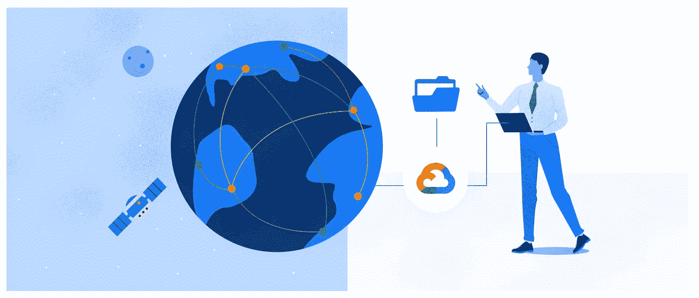
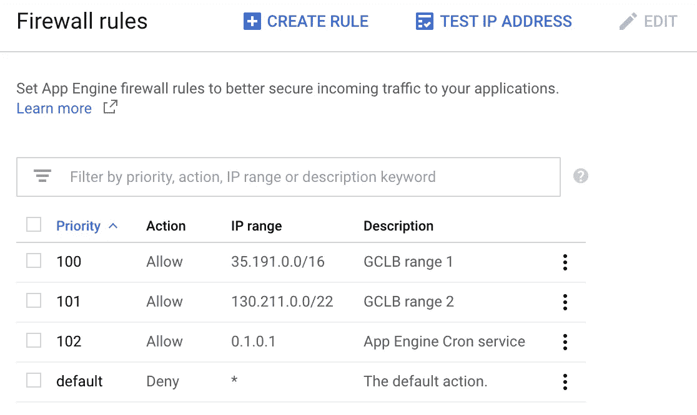
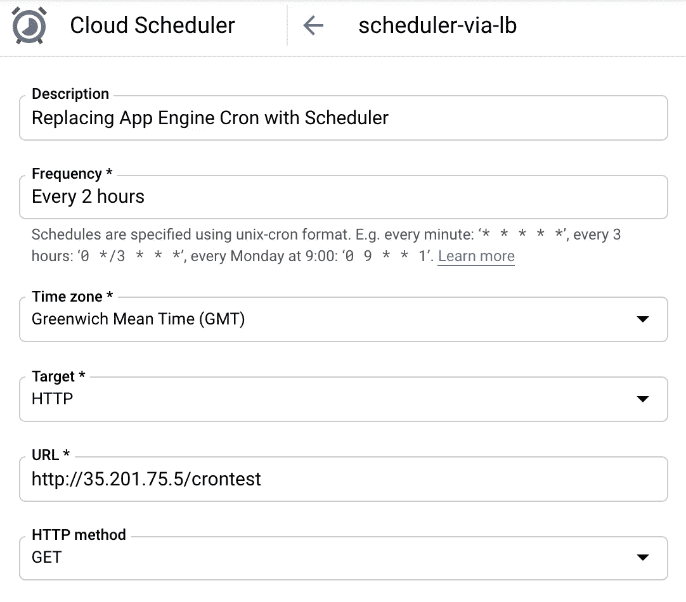
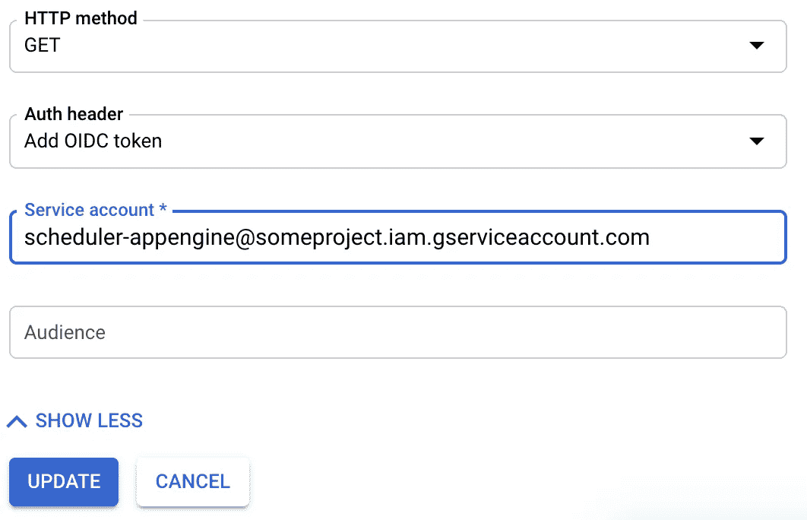

# GCLB、应用引擎 Cron 和云调度器

> 原文：<https://medium.com/google-cloud/gclb-app-engine-cron-and-cloud-scheduler-1df59a7963f?source=collection_archive---------0----------------------->



***TLDR:应用引擎 Cron 无法使用全局负载平衡器的建议入口设置！我们可以使用云调度程序实现类似的安全行为吗？***

我最近和一个客户一起工作，他正在创建一个新的 web 应用程序。该客户需要快速移动，并且想要一个具有高可扩展性和内置服务的无服务器解决方案。AppEngine standard 正好符合这个要求。客户之前已经使用过 Java 8 [第一代应用引擎运行时](https://cloud.google.com/appengine/docs/standard/runtimes)，所以他们决定继续使用。

App Engine 已经存在很长时间了，但它仍然是许多应用程序的热门选择，并且还在继续发展和改进。去年年中推出的一项显著改进是集成了全局 HTTP(S)负载平衡和应用程序引擎。这种集成使 App Engine(以及其他无服务器选项，如 Cloud Run 和 Cloud Functions)能够利用全球负载平衡器功能，如 anycast IP、Cloud CDN、Cloud Armor、统一证书管理等。阅读[博客文章](https://cloud.google.com/blog/products/networking/better-load-balancing-for-app-engine-cloud-run-and-functions)了解更多背景知识，然后查看[无服务器 NEG](https://cloud.google.com/load-balancing/docs/negs/serverless-neg-concepts) 文档了解所有技术细节。

客户的需求和实现非常标准。他们使用 App Engine 提供网页，使用 Cloud Firestore 存储数据，并使用内置的 [App Engine Cron 服务](https://cloud.google.com/appengine/docs/standard/java/config/cron-yaml)运行计划的作业。该客户还希望使用云 CDN 和全球 HTTPS 负载平衡器提供的其他功能，因此他们开始着手进行设置…

## 应用程序引擎入口控制

默认情况下，App Engine 应用程序[在一个 URL 上以*的形式【https://$ PROJECT _ id . appspot . com*为请求](https://cloud.google.com/appengine/docs/standard/java/how-requests-are-routed)提供服务。当您创建 App Engine 应用程序时，会自动分配此 URL。然而，当你使用全局负载均衡器时，建议[禁用这个 appspot url，这样所有的用户流量都会通过负载均衡器。否则，用户可以使用 appspot URL 绕过负载平衡器，包括负载平衡器中配置的任何访问控制(Cloud Armor，IAP)。](https://cloud.google.com/appengine/docs/standard/java/application-security#ingress_controls)

您可以使用 App Engine 的网络[入口控件](https://cloud.google.com/appengine/docs/standard/java/application-security#ingress_controls)来限制流量，以便您的应用程序只接收来自特定来源的 HTTP 请求。下面的命令更新默认的 App Engine 服务，以便它只接收通过负载平衡器路由的请求，或者从同一项目中的 VPC 网络发送的请求。这样，appspot URL 就被有效地禁用了。太好了！

```
gcloud app services update default --ingress internal-and-cloud-load-balancing
```

## Cron 作业失败！

客户设置了负载平衡器和云 CDN，并应用了推荐的入口控制。该应用程序通过负载平衡器 IP 正确地处理请求，而不是通过 appspot URL。一切都很好。然而，客户很快注意到他们的 cron 作业失败了！怎么回事？

事实证明，应用推荐的入口控制也会阻止来自 App Engine Cron 服务的请求。在某些方面，这是有意义的——入口控制只允许来自负载平衡器或 VPC 内部的请求。Cron 服务不满足这些要求，因此被阻塞。然而，有人肯定会说，您不希望来自 App Engine 生态圈中其他服务的请求被阻止。此外，文件中没有提到这种限制，所以不清楚这是否是有意的行为。简而言之，这看起来像是应用引擎的错误，我们已经联系了应用引擎团队来强调这个问题。

## 一些背景

如前所述，App Engine 由来已久。第一代[运行时](https://cloud.google.com/appengine/docs/standard/runtimes)附带了很多捆绑特性，比如 Memcache API、Images API、任务队列等等。这些特性中的许多都与 App Engine 紧密结合，并具有特定于 App Engine 的 API。随着谷歌云的发展，这些功能已经从应用引擎中分离出来，成为独立的谷歌云服务。例如:

*   任务队列应用引擎 API →云任务
*   Memcache 应用引擎 API →云内存商店
*   App Engine Cron 服务→云调度器

第二代应用引擎运行时不支持这些旧的捆绑 API。相反，建议使用独立的服务——就像从云功能或 GKE 集群中一样。第二代运行时代表了 App Engine 的未来方向。

无论如何，第一代 App Engine 运行时将继续得到支持——因此这个*应该能够工作(或者至少被明确指定为不支持)。如前所述，我们强调了应用引擎团队，但同时我们需要解决它…*

## 解决方法 1:应用引擎本机防火墙

首先，我们尝试使用内置的[应用引擎防火墙](https://cloud.google.com/appengine/docs/standard/runtimes)来完成与入口控制相同的事情。这样，我们可以在不引入任何额外组件的情况下保持 App Engine 中的所有内容。因此，我们移除了应用引擎入口控制，并应用了以下防火墙规则:



*   将默认规则设置为“拒绝”。只允许来自明确配置的 IP 地址/范围的请求。
*   为全局负载平衡器 [IP 范围](https://cloud.google.com/load-balancing/docs/https#source_ip_addresses_for_client_packets)添加“允许”规则(就像您为常规 VPC 防火墙规则所做的那样)
*   为应用引擎 Cron 服务的[源 IP 地址](https://cloud.google.com/appengine/docs/standard/java/config/cron-yaml#securing_urls_for_cron)添加“允许”规则

根据上面的规则，对 appspot url 的请求会被阻止，而来自 Cron 服务的请求会成功。但是，通过负载平衡器的请求会失败。不好。

(有趣的是，对负载平衡器的请求以 403 失败，这表明是应用引擎防火墙阻止了请求。因此，出于某种原因，允许标准负载平衡器 IP 范围是不够的。需要深入了解这一点，但继续前进…)

## 解决方法 2:作为应用引擎“管理员”用户的云调度程序

接下来，我们尝试使用云调度程序，而不是内置的应用引擎 Cron 服务。我们删除了防火墙规则，并重新应用了入口控制，以防止用户绕过负载平衡器。我们删除了应用引擎 cron 作业，并创建了相应的调度程序作业。我们配置了调度程序作业，通过负载平衡器 IP 向期望的端点发出 HTTP 请求。



成功！appspot URL 不可访问，用户通过负载均衡器的请求成功，并且我们通过云调度器有一个正常工作的 cron 作业。

但是,“crontest”端点可以在互联网上公开访问。任何人都可以向这个端点发出请求并触发我们的作业。我们如何保护它？

cron 文档的[安全 URL 描述了这个过程。本质上，您使端点只能由“管理员”用户访问。此设置拒绝来自外部用户的请求，但允许来自 Cron 服务和标记为“admin”的用户的请求。我们能让这种方法与调度程序一起工作吗？](https://cloud.google.com/appengine/docs/standard/java/config/cron-yaml#securing_urls_for_cron)

首先，我们将所需的安全约束添加到 web.xml 文件中，只允许管理员用户访问 crontest 端点。

```
<security-constraint>
  <web-resource-collection>
    <web-resource-name>crontest</web-resource-name>
    <url-pattern>/crontest</url-pattern>
  </web-resource-collection>
  <auth-constraint>
    <role-name>admin</role-name>
  </auth-constraint>
</security-constraint>
```

接下来，我们创建了一个新的服务帐户，并授予它“应用引擎管理员”角色。

```
gcloud iam service-accounts create scheduler-appenginegcloud projects add-iam-policy-binding $PROJECT_ID \
  --role=roles/appengine.appAdmin \
  --member=serviceAccount:[scheduler-appengine@$PROJECT_ID.iam.gserviceaccount.com](mailto:scheduler-appengine@jtg-gae-lb.iam.gserviceaccount.com)
```

最后，我们遵循云调度器文档为 HTTP 目标添加认证[。这样，当调度程序作业执行时，它会为指定的服务帐户创建一个新的 OIDC 令牌，并将其添加到“Authorization”标头中的 HTTP 请求中。(请注意，您需要将作业类型设置为 HTTPS，因此如果尚未为您的负载平衡器设置证书，您需要设置一个证书)。](https://cloud.google.com/scheduler/docs/http-target-auth)



成功了吗？**可惜** **不是**！应用程序引擎“admin”安全约束验证发出请求的用户是否注册为应用程序的管理员用户。但是，这与 IAM 权限是分开的。虽然调度程序作业确实具有正确的 IAM 权限，并且提供了有效的 OIDC 令牌，但这不满足应用程序引擎安全约束。令人沮丧！

## 解决方法 3:自定义身份验证

我们能想到的最后一个选择是扩展以前的云调度程序方法，但是添加自定义逻辑来验证 OIDC 令牌和检查 IAM 权限。我们对此有点犹豫，但是 Google Cloud 提供了库和示例，所以我们决定尝试一下…

(注意，这种方法正是云运行和云函数所做的。它们有内置的逻辑来验证请求令牌并检查相关的“invoker”IAM 权限。)

首先，我们删除了“admin”安全约束。然后，我们在/crontest 端点向 servlet 添加了定制逻辑。我们需要做两件事

1.  验证请求中的 OIDC 令牌
2.  验证经过身份验证的用户是否拥有正确的权限，即是否拥有应用程序引擎管理 IAM 角色

[验证 ID 令牌的完整性](https://developers.google.com/identity/sign-in/web/backend-auth#verify-the-integrity-of-the-id-token)文档描述了验证 OIDC 令牌的过程，并包括一个代码示例。我们基本上是复制的。请参见下面的示例片段。*令牌*参数是来自 HTTP 请求的“Authorization”头的值。

`GoogleIdTokenVerifier.verify()`方法验证 JWT 签名、`aud`声明、`iss`声明和`exp`声明。因此，如果该方法返回一个有效的负载，我们就知道请求来自一个经过正确身份验证的用户。

现在，我们需要验证发出请求的用户是否拥有适当的 IAM 权限。[资源管理器客户端库](https://cloud.google.com/iam/docs/quickstart-client-libraries)的快速入门文档演示了如何检查 IAM 权限——同样，我们大量复制了它。参见下面的片段。

而且… **管用**！万岁！工作量相当大——这不是一个完美的解决方案，但肯定是一个有趣的练习。总结几点:

*   上面的代码明确检查“roles/appengine.appAdmin”角色。呼叫者必须具有此角色。它不检查遗留角色，如所有者、编辑等。(当然你可以加上这个)
*   如果想自己打/crontest 端点，可以像下面这样做。同样，这假设您的 gcloud 用户拥有正确的角色

```
curl -H "Authorization: Bearer $(gcloud auth print-identity-token)" [https://testing.mydomain.com/c](https://testing.bagbert.com/authed)rontest
```

## 结论

好吧，这变成了一个怪物帖子！如果你能走到这一步，恭喜你！这是一次教育练习，试图让一切都起作用。完全有可能我遗漏了一些本可以让事情变得简单得多的东西——如果是这样，请随意评论！

我很快会发布一个带有完整端到端代码的回购链接。

感谢阅读！:)