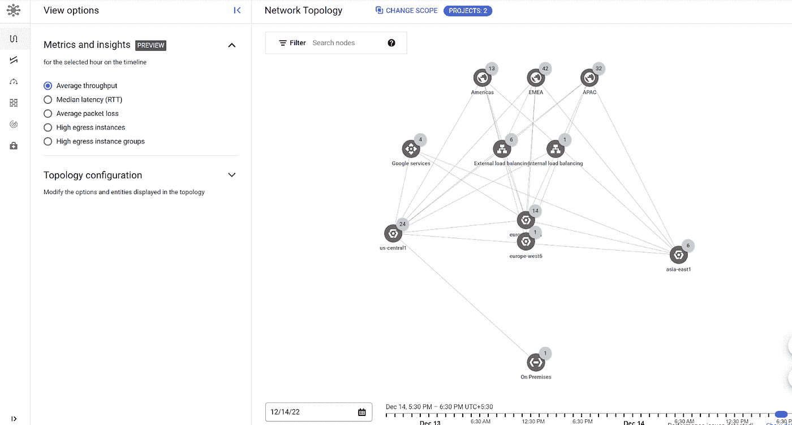
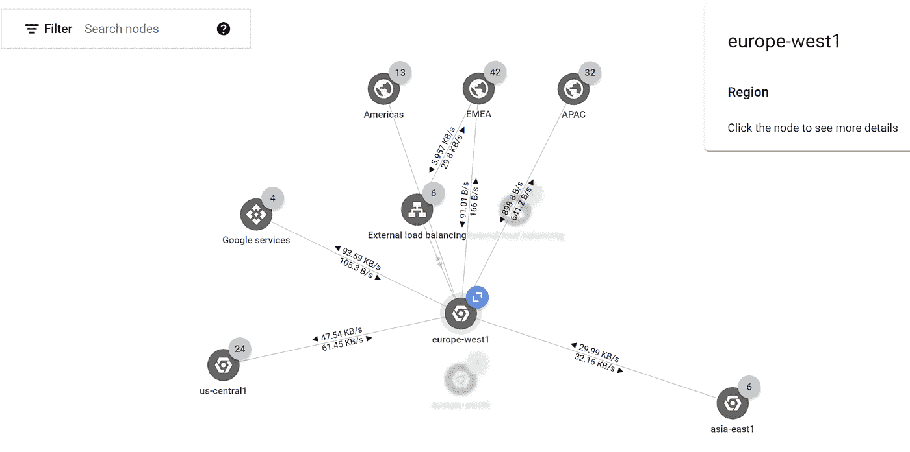
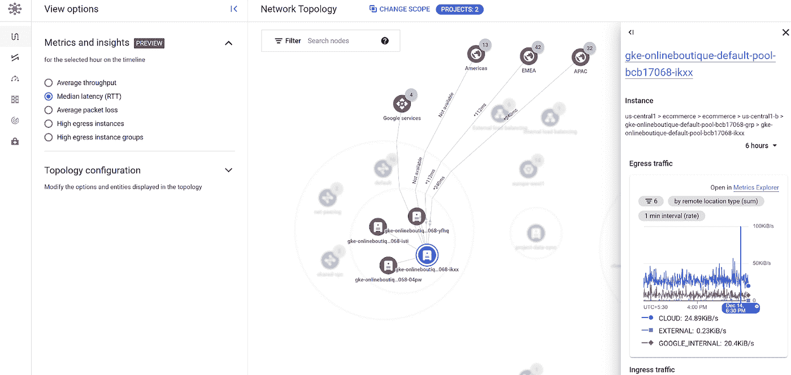
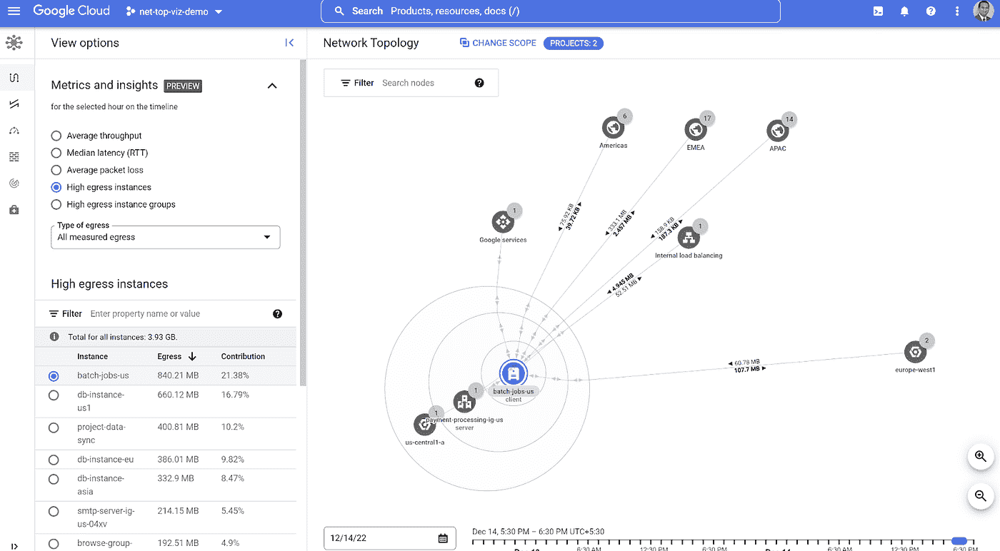
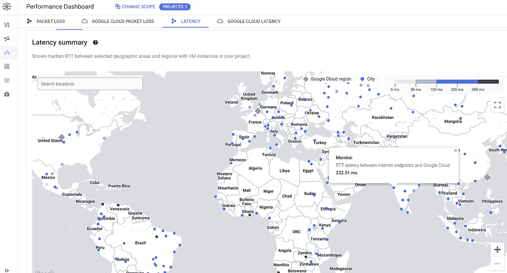
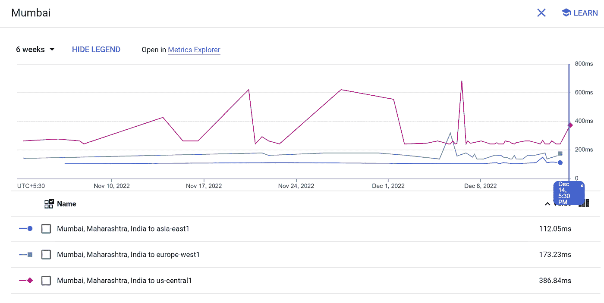
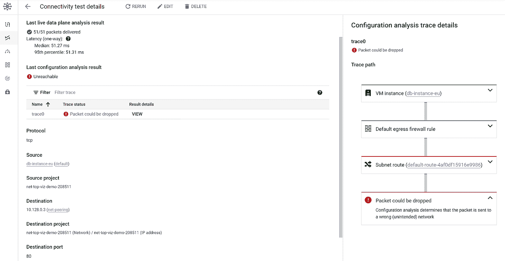
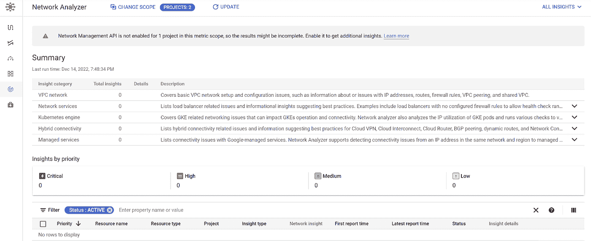
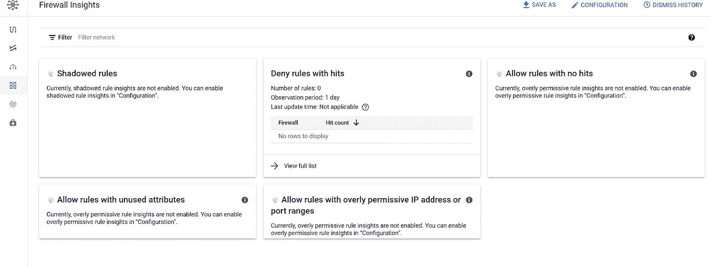

# 云精灵 Aces 网络可观测性

> 原文：<https://medium.com/google-cloud/gcloud-genie-aces-network-observability-38f27f3255e0?source=collection_archive---------6----------------------->

推荐:请看这里的介绍:[有转折的科技博客！](/@tanmayj/tech-blogs-with-a-twist-5a940413e42d)

“早上好扎克！”一天早上，云运营和 DevSecOps 主管 Atkin Bainbridge 洪亮的声音回荡在扎克·肯尼迪位于 Cygnos 帝国银行的角落办公室里。扎克抬头看了看，那个身材高大、精神抖擞的男人大步走了进来，身后跟着他的云网络主管迪恩·鲍威尔(Dean Powell)。

“阿特金！嗨！什么风把你吹来了，一大早就来了！"当两人热情握手时，扎克和蔼地回应着，眼里闪烁着光芒，脸上带着微笑。"一切都好吗？"

他们是一枚硬币的两面，Atkin 是基础设施和网络领域的冠军，Zach 是上面的应用层的佼佼者。在持续的云转型之旅中，他们对 Cygnos Imperial bank 来说都是不可或缺的。他们有一个很好的工作方程式，并最终有效地互补，以确保企业的顺利运作。

“是啊，是啊，一切都很好，别担心”，阿特金回应道。

“但是有几个困扰我一段时间的问题，我想我应该和你讨论一下”。

“当然可以。开枪！”扎克回应道。

Atkin 不知道的是，在 Zach 笔记本电脑的一个极小的窗口中，gCloud 精灵也活跃起来了！

“有时候我觉得自己在瞎飞！我不知道为什么感觉我的网络对我来说是完全可见的！我发现自己震惊地看着出口账单！有时候应用程序所有者闯进我的房间抱怨延迟！我们有时很难在两个服务之间建立连接。我们和兵乓球打过仗。我们面临着次优的防火墙配置。现在，Dean 在他所做的事情上是一个大师，大多数时候我们能够以传统的方式进行故障诊断和识别问题。但是我要回到云的承诺——易用性！不登录控制台，手动逐跳查找问题！

“放心吧哥哥，我会支持你的！我正好有适合你的工具！让我现在就把显示器连接起来给你看！我向你们保证，你们俩一定会喜欢这个的，等我做完了，你们会提出今晚带我出去喝啤酒！”

“好吧，我同意！打动我！”阿特金兴奋地说。

“好了，这就来了，这个工具叫做“[网络情报中心](https://cloud.google.com/network-intelligence-center)”。GCP 的人们专门创造了它，让数百万像迪安一样的人生活简单！这是一个用于谷歌云网络观察、监控和故障排除的单一控制台。它降低了停机风险，并确保了安全性和合规性。

让我启动第一个模块'[网络拓扑](https://cloud.google.com/network-intelligence-center/docs/network-topology/concepts/overview)。"

这是 gCloud Genie 启动必要窗口的一个提示。

“看到这个了吗？很酷，不是吗！网络的整体布局、LBs、流量流向的互联网区域、内部连接，所有这些都在一张地图中。更重要的是，它支持下钻。因此，您可以单击特定区域，从区域→分区→实例组→单个实例展开！

那里！你想知道进出的流量带宽吗？给你！这是在区域级别显示的，但是您可以深入到每个虚拟机级别来查看传入和传出的 KB/s！很漂亮，不是吗！

我刚刚将视图切换到 RTT，我看到了延迟。我还放大到虚拟机级别，向您展示虚拟机级别的指标！它还会在上下文中启动云监控面板！您可以清楚地看到您的特定虚拟机通过互联网与三个区域进行通信！怎么样！

同样，您可以通过选择左边的单选按钮来浏览丢包。

阿特金和迪恩无言以对！

“该死的！太神奇了！”院长，终于找到话了！“多给我看看！”

“给你！阿特金，我听到你抱怨外出账单，是吗？有一个特定的视图来显示为您的问题量身定制的顶级外出实例。

答对了。Top Egress 实例，全部为您方便地排序！

此外，您可以从下拉列表中选择出口类型，并在整体、跨区域、互联网和混合(本地)之间进行选择。

除了明显的计费考虑之外，这也是检查任何意外出口的便利工具，意外出口可能是攻击导致的数据泄漏！

您还可以将网络智能中心的范围设置为单个项目，或一个“[范围项目](https://cloud.google.com/monitoring/settings)，通过它您可以从单个面板监控整个企业。两种方式。

“哇！”阿特金印象深刻！“GCP 的这些家伙想出了一些非常方便的东西，伙计！!"

“当然啦！这就是我们押注 GCP 在我们的云之旅上大展拳脚的原因！

但是等等，让我给你看一些更酷的东西！

你知道我们下个月将在印度启动海外行动，从孟买开始，对吧？如果您可以预测最终用户通过互联网从孟买到达我们在美国和欧洲的家乡的延迟，您会怎么想？"

“嗯？!"这是阿特金唯一能说出的话！

“瞧！有一个名为“性能仪表板”的模块，它向您显示从位于世界各地的互联网端点到 GCP 地区的平均 RTT。例如，如果我点击孟买…

我可以看到从孟买的互联网端点到我们家乡地区的延迟！这有助于为延迟敏感型应用程序安排工作负载。此外，很酷的一点是，通过这个图表，您可以回溯到 6 周之前！"

这里，让我向您展示“连通性测试”模块。

连接测试的源端点可以是虚拟机实例、IP、第一代云功能、云 SQL 和 GKE 主集群。目标端点可以是虚拟机实例、IP、云 SQL 和 GKE 主集群。

连接性测试现在包括一项功能，可验证从虚拟机或 IP 地址到私有服务连接端点的连接性

“哇，哇，坚持住！你是在告诉我，GCP 登录到一个虚拟机并向目标虚拟机发起流量来测试连接性，因为我不希望他们这样做！”阿特金插话道。

“这个问题问得好，不，他们没有。作为 CSP，他们将自己限制在云数据层面。他们不访问任何客户工作负载。测试有两种类型。[连接测试](https://cloud.google.com/network-intelligence-center/docs/connectivity-tests/concepts/overview#how-it-works)执行[可达性分析](https://cloud.google.com/network-intelligence-center/docs/connectivity-tests/concepts/overview#analyze-configurations)，根据理想配置模型评估测试路径中的谷歌云资源。它通过实时数据平面分析功能得到增强，该功能发送数据包来验证数据平面的状态，并为支持的配置提供基准信息。实时数据平面分析的探测机制不涉及客户操作系统，对用户完全透明。探测代表源端点被注入网络，并在被传送到目的地端点之前被丢弃。常规网络计费、遥测指标和流量日志中不包括探头。”

还有一个“网络分析器”模块，它通过一组已知的最佳实践过滤器自动运行您的网络配置，并显示您是否有任何偏差。

“牛逼！”阿特金眉开眼笑！这是杰出的东西！

“最后，同样重要的是，“[防火墙洞察](https://cloud.google.com/network-intelligence-center/docs/firewall-insights/concepts/overview#insights)模块，提供有关防火墙配置的详细信息。”

此模块非常适合识别与现有规则重叠的防火墙规则、没有命中的规则以及未使用的防火墙规则属性，如 IP 地址和端口范围。您可以洞察[隐藏的防火墙规则](https://cloud.google.com/network-intelligence-center/docs/firewall-insights/concepts/insights-categories-states#shadowed-firewall-rules)、[过度宽松的规则](https://cloud.google.com/network-intelligence-center/docs/firewall-insights/concepts/insights-categories-states#overly-permissive-rules)，允许没有命中的规则，允许具有未使用属性的规则，允许具有过度宽松的 IP 地址或端口范围的规则，以及拒绝在[观察期](https://cloud.google.com/network-intelligence-center/docs/firewall-insights/how-to/configure-observation-period#observation-period)内没有命中的规则洞察。这可以帮助您识别包含 IPv4 或 IPv6 地址范围的防火墙规则的防火墙错误配置。此外，您可以通过识别过于宽松的允许规则并查看对其未来使用的预测，来优化防火墙规则并加强安全界限。您还可以获得关于点击拒绝规则的详细信息，这可以作为可疑攻击情况下的第一级侦察(指数级高/增长的拒绝规则点击可能是企图攻击的迹象)。

“还有，场景”，扎克颇为夸张地鞠了一躬，结束了演示，关闭了浏览器。

迪安和阿特金都坐回到自己的座位上，完全被打动了！

“好的！接下来是这样的。Dean 将回到他的笔记本电脑前，打开网络情报中心。他将利用这种新发现的网络故障排除和可观察性超能力，在今天余下的时间里让所有人大吃一惊。晚上，我会把他带到这里给你，我们三个会出去喝啤酒！

你是对的，扎克，在你让我们的生活变得如此轻松之后，我们不能不给你提供啤酒！那么，今晚 8 点，怎么样？"

“成交！”

gCloud Genie 高兴地在 Zach 的笔记本电脑上发出哔哔声，对着他的主人的成堆的赞美微笑着！