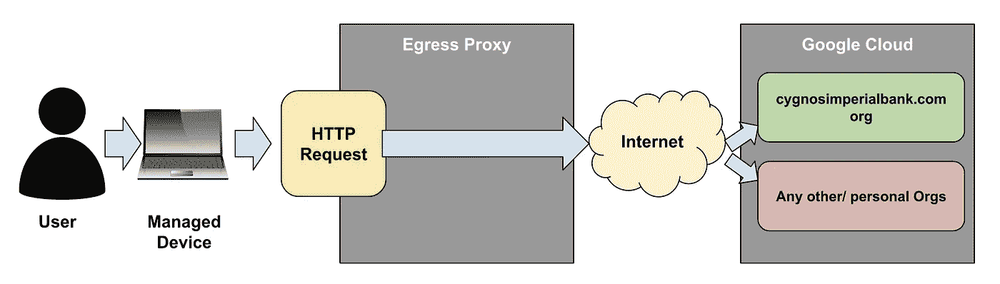
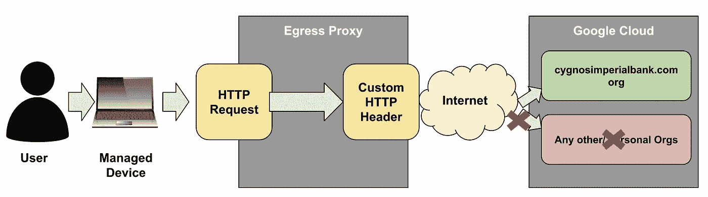
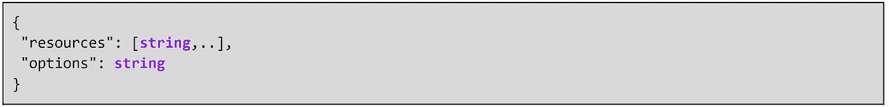
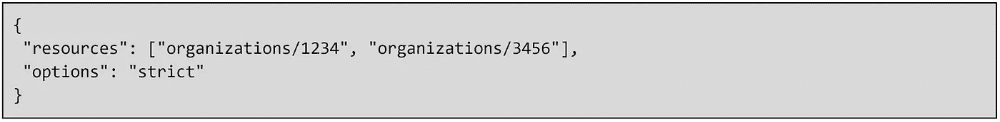
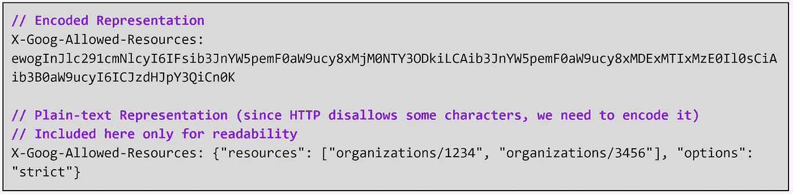

# gCloud Genie 击败数据泄露

> 原文：<https://medium.com/google-cloud/gcloud-genie-defeats-data-exfiltration-faead24593a?source=collection_archive---------9----------------------->

推荐:请看这里的介绍:[有转折的科技博客！](/@tanmayj/tech-blogs-with-a-twist-5a940413e42d)

谷歌云服务条款的[预发布条款](https://cloud.google.com/terms/service-terms#1)涵盖了该功能。正式发布前的功能可能支持有限，对正式发布前功能的更改可能与其他正式发布前版本不兼容。更多信息，请参见[发布阶段说明](https://cloud.google.com/products#product-launch-stages)。

空气中弥漫着十二月的寒意和圣诞节的节日热情。

但是，赛格诺斯帝国银行的 CISO 山姆·兰彻非常担心！

他刚刚和他的同行——美国另一家领先银行的 CISO 通完电话。他的同事告诉他一个关于恶意内部人员泄露数据的恐怖故事！

基本上，由于某种原因，官方设备上的授权员工需要与管理层进行大量结算，他通过登录银行的云帐户并将数据渗透和上传到自己的个人云帐户来实施报复。不用说，他被解雇了，但是损失已经造成了。该银行现在正面临一个非常公开、代价非常高昂的尴尬局面，更不用说监管行动了。

Sam 联系了 Cygnos 帝国银行的用户和终端设备安全主管 Buddy Yardley，并迅速安排了与他的云架构师 Zach Kennedy 的会面。他必须检查自己的安全状况，并在必要时立即采取纠正措施！

就在那天下午，他们三个在扎克的办公室见了面。

“所以，伙计，让我在这里诚实”，萨姆开始在一个平静的语气，但巴迪可以感觉到他的声音冰冷的弦外之音。萨姆不是一个好惹的人，尤其是在他情绪不好的时候！

“如果 CIB 日志的授权员工试图使用其授权的官方笔记本电脑访问谷歌云，他是被允许的，对吗？”

“没错，山姆。”

“好的。你如何确保这一点？能给我解释一下流程吗？”

“当然可以，先生。用户使用他的广告凭证(他的@cygnosimperialbank.com 电子邮件地址)登录到他的官方笔记本电脑。在他的官方笔记本电脑上，有一个终端保护软件正在运行。使用同一台笔记本电脑，如果他访问谷歌云，该软件会将会话代理到位于 CIB 环境中的面向互联网的网关。这个网关有一个静态的公共 IP 地址范围，在谷歌云注册。只有当流量来自这个源 IP 地址范围时，谷歌云才允许进入 CIB 的组织。在 AD 身份验证之间，通过限制源 IP 地址范围，我们可以确保只有授权设备上的授权用户才能访问 GCP。”

“好的，很好。如果授权用户试图从不受管理的笔记本电脑访问 GCP，会发生什么？”

“Sam，非托管笔记本电脑不会安装终端保护软件客户端，这意味着流量不会被代理到网关。流量将通过开放的互联网流向谷歌云。登录页面本身会打开，因为这是一个公共网页，但当用户试图访问 CIB 的 GCP 资产时，GCP 会检测到源 IP 范围不是 CIB 的网关，并拒绝访问。所以先生，你看，除非你是授权设备上的授权用户，否则无法访问 CIB 在 GCP 的资产。”

“牛逼！太好了，伙计！”

”巴迪允许自己闯入最轻微的微笑。也许这一天不会太糟糕！”

“现在告诉我，伙计，如果授权设备上的授权用户试图访问非 CIB GCP 实例，会发生什么？我知道你有有效的措施来防止未经授权访问 CIB GCP 的实例，但你有什么措施来防止访问其他一些组织或 GCP 的个人实例？"

巴迪张开嘴想回答，但随后惊恐地意识到他没有！他的老板准确地暴露了他的安全设计中的一个缺陷！他一直张着嘴，一边笨嘴拙舌地说着话，一边发出可怜的嘎嘎声。当他看到老板的脸因愤怒而涨得通红时，他感到口干舌燥，脸上失去了血色。

“我的男人！你最好想出一个计划来修补这个漏洞，否则你的圣诞节就不会快乐了！”山姆·兰彻几乎是嘶嘶地说出了这句话，让巴迪的血都凉了！

“冷静，冷静先生们！”扎克介入，脸上挂着愉快的笑容。

幸运的是，他也听说了他的同行银行受到攻击，并在前一天晚上与 gCloud Genie 就此话题进行了交谈。

“没有伤害，没有犯规，先生们。我有一个补救办法。”

萨姆&巴迪转向扎克。

“开枪！”山姆说。

“好吧，开始了！扎克舒服地坐了下来，将他的笔记本电脑投影到一个大显示器上，开始解释

“我在这里准确描述了您的问题吗？端点保护软件架构充当出口代理。这是今天的请求流程，问题是，从授权用户和设备，它可以发送到 GCP 境内的任何组织，对吗？”

“是的！”两人都附和着。

“好吧，我们把上面的图片修改成这样怎么样:

当 http 请求通过出口代理时，我们在 http 请求中插入一个自定义的 http 头，瞧！GCP 基础设施现在已经被训练来查看自定义 http 头的值，并且只允许授权组织访问！怎么样！"

“这太有才了！”巴迪和萨姆异口同声地说！“再给我们讲讲！”

“这是谷歌云即将推出的一项新功能，名为组织限制。这是标题格式

**X-Goog-Allowed-Resources:<HEADER _ VALUE>**

头值是 JSON 格式的

JSON 中的一个例子是:

其中 1234 和 3456 是允许列表组织的组织 id。

但是由于 http 头不支持 JSON 中的所有字符，所以它是用 [web safe base64 编码](https://en.wikipedia.org/wiki/Base64#The_URL_applications)编码的。

就这样了，先生们！您配置您的端点保护软件或任何出站防火墙，也称为出口代理，以将此报头插入到发往特定 Google 生态系统 URL 的传出 http 请求中，然后就好了！谷歌前端将检测到这个标题，并阻止流量到任何组织没有明确允许列表！实际的决策流程如下:

*   如果报头不存在，则无论如何都会允许流量。
*   如果报头存在，则仅允许那些在报头中允许列出的组织 id 的流量。

顺便说一下，您可以改变这种配置，以做更时髦的东西！"

“比如什么？”萨姆问。

“嗯，你可能有一个合法的外部读访问的理由。例如，CIB 可能必须合法地从供应商的谷歌云存储桶中读取数据，但不能写入数据(即上传数据)。在这种情况下，您可以有选择地将这个头仅应用于 PUT、POST 和 PATCH HTTP 方法。这将有效地确保您不能将任何外部数据上传到不受信任的组织，但是您可以从任何组织读取数据。漂亮，不是吗！”

“杰出的男人！太棒了！谈创新解决方案！”萨姆滔滔不绝。

"好吧，伙计，看来你有自己的工作要做了！"

“是的先生！”巴迪点头表示肯定。

“坚持住，老虎！”扎克插话道。

这仍然是一个预览功能，所以要谨慎一点。谷歌云服务条款的[预发布条款](https://cloud.google.com/terms/service-terms#1)涵盖了该功能。正式发布前的功能可能支持有限，对正式发布前功能的更改可能与其他正式发布前版本不兼容。更多信息，请参见[发布阶段说明](https://cloud.google.com/products#product-launch-stages)。

此外，请仔细阅读产品的文档，如下所示:

*   [概述](https://cloud.google.com/resource-manager/docs/organization-restrictions/overview)
*   [支持的服务](https://cloud.google.com/resource-manager/docs/organization-restrictions/supported-services)
*   [其他注意事项](https://cloud.google.com/resource-manager/docs/organization-restrictions/additional-considerations)
*   [已知限制](https://cloud.google.com/resource-manager/docs/organization-restrictions/known-limitations)

采取明智的预防措施与预览产品，你应该很好。"

“谢谢扎克，你是我的救命恩人！”

山姆和巴蒂都非常丰富的赞赏，并在他们脸上的救济大字，因为他们把扎克的离开。

“一天的工作，先生们！祝你圣诞快乐，节日快乐！”扎克友好地挥手回应，因为他们走出了他的办公室。

"谢谢你，云精灵，你是我的救星！"扎克附和道，当他们独处的时候！

精灵高兴地发出嘟嘟声。

"圣诞快乐，扎克，上帝保佑你们，上帝保佑 CIB！"，gCloud 精灵说！