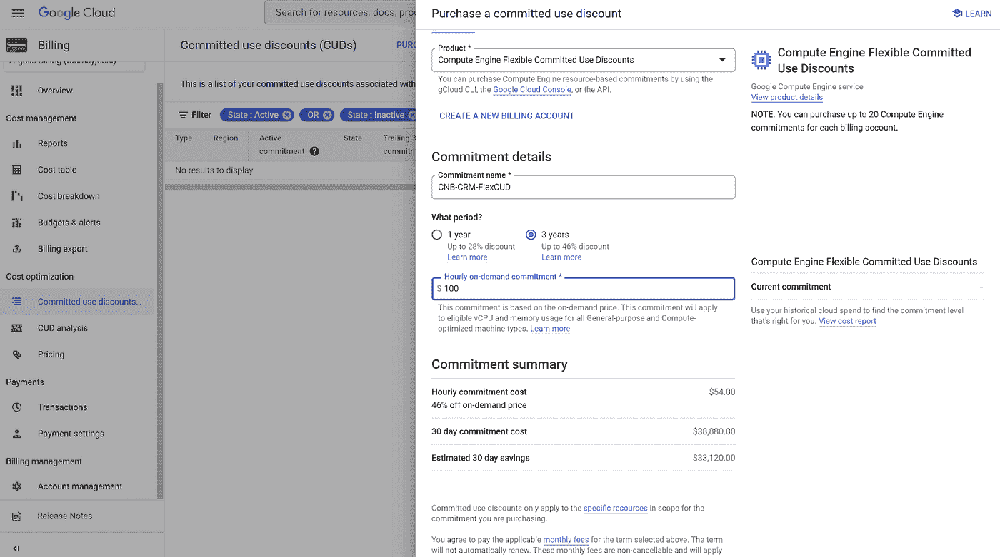

# gCloud Genie 描绘折扣

> 原文：<https://medium.com/google-cloud/gcloud-genie-delineates-discounting-8ff69e41b895?source=collection_archive---------1----------------------->

推荐:请看这里的介绍:[有转折的科技博客！](/@tanmayj/tech-blogs-with-a-twist-5a940413e42d)

这是一个美丽的早晨！11 月清爽的早晨，阳光明媚，从扎克·肯尼迪俯瞰城市的角落办公室的窗户射进来。这位炙手可热的企业架构师在检查了几封邮件并完成了几件工作后放松了下来。

总而言之，生活是美好的。自 CIB 通过采用谷歌云技术开始其数字化转型之旅以来，一年多一点的时间里，一切都在顺利进行。云就像一只小猫一样发出咕噜咕噜的声音，当它把越来越多的工作任务交给它时，嗡嗡作响。就连许多人担心的由“地狱天使”安吉拉·拉米雷斯领导的国家储备银行的审计也进展顺利。这也在业内掀起了波澜，因为许多曾采取“观望”政策的银行，在看到 CIB 顺利扫清了所有监管障碍后，现在都加入了云计算的行列。

扎克回顾了他所取得的成就，并有充分的理由感到自豪！

他的笔记本电脑发出嘟嘟声。他的数字朋友、哲学家、救世主、向导——g cloud Genie——出现了。

“早上好，精灵”，扎克说

“嘿早上好扎克！你今天好吗？”

“世界之巅！”扎克欢欣鼓舞！

“太好了！我只是想和你讨论一些激动人心的事情"

扎克喜欢这些对话。精灵解释了 Google Cloud 各个方面的特性和优势，并帮助 Zach 顺利完成了美国最大银行之一的转型。他们总是超级激动人心的时刻！

“我洗耳恭听！”扎克说，笑容照亮了他轮廓分明的脸。

“好吧，让我们来做个测试”，妖怪说。

"你能解释一下 CUDs，或[承诺使用折扣](https://cloud.google.com/docs/cuds)是什么吗？"

“当然可以！CUDs 基本上是 Google 提供的一种折扣，以换取使用特定资源一年或三年的承诺。这些资源可以是 CPU、内存、本地 SSD 磁盘和 GPU。您基本上提交了一些 vCPUs，或者特定数量的 RAM 或磁盘空间。在承诺期限结束时，你为所选资源的数量支付固定的月费用，作为稳定收入流的回报，谷歌为你提供所述资源的折扣，直到期限结束。cud 因资源类型而异，但对大多数机器类型来说,[高达 57%](https://cloud.google.com/compute/docs/instances/committed-use-discounts-overview#resource_based)

“正确，十对十”，精灵咧嘴笑着，眼睛闪闪发光！

“现在告诉我一件事:如果你为 N2 机器类型购买了标准 CUD，几个月后，应用程序所有者希望切换到 N2D 机器类型，会发生什么？”

扎克想了一会儿。“因为这些承诺是基于 N2 资源的，所以不会结转到 N2D。N2D 将按按需费率计费，而已承诺的 N2 账单仍将累计。然后，其他项目所有者将能够通过启用[折扣共享](https://cloud.google.com/compute/docs/instances/signing-up-committed-use-discounts#sharing_committed_use_discounts_across_projects)来使用 N2 提交，但事实是，您将需要针对 N2D 的另一个提交以及针对最初的 N2 提交的跨企业接受者。

“正确”，精灵说。

“现在是第二个问题:今天，大多数项目负责人只在一个地区工作，这个地区与 CIB 自己的数据中心在同一个城市。这成为了 CIB 的 GCP 生产基地。当我们进入灾难恢复讨论时，标准 cud 将如何工作？”

扎克突然明白了这个难题。“该死的！我以前没想到这一点！由于标准统一数据系统在性质上是区域性的，在一个地区应用的标准统一数据系统不能推广到另一个地区。这意味着，当客户调用灾难恢复时，他们将按需付费！此外，在灾难恢复调用期间缩减生产规模没有任何价值，因为无论如何，他们都将通过提交为此付费！”

“这很好，如果你们只是为了合规性而一次用完灾难恢复几天。但是现在，我相信您知道国家储备银行正在认真考虑强制要求该国银行的生产和灾难恢复业务各占一半！这意味着您必须在按需计费的情况下一次用完灾难恢复几个月，因为 cud 全部应用于生产区域！”

“你说得对伙计！哦，亲爱的上帝，首席财务官会杀了我”，抱怨扎克！

“不，他不会的，他会更爱你的，这一点我以后再说。现在，最后一个问题:你的团队会在晚上关闭 UAT 系统吗？”

“不，他们没有。有什么意义？我们以承诺的折扣转移了 UAT 的资产，而且我们已经为虚拟机支付了 3 年的费用，那么为什么要关掉它们呢？”

“扎克，你知道 CIB 最近任命了一位首席可持续发展官，对吧？他的目标是在未来五年内大幅减少你的碳足迹，让 CIB 实现碳中和。他将直奔 IT 团队，不是为了优化成本，而是为了优化碳足迹。事实上，您已经为虚拟机支付了费用，因此您不需要关闭它们，但这并不能解决他的任何问题。你知道的，不是吗？”

扎克双手抱头！在过去的一年里，他无数次地思考“我让自己陷入了什么样的境地！”

但是他知道妖怪正朝着一个点前进——从过去的经验来看，它通常是黑暗隧道尽头的一盏明亮的灯！

“好吧，我很了解你，知道你有什么锦囊妙计，妖怪！说出来吧！你要怎么把我弄出去？”

“好吧扎克，让我向你介绍'[灵活的 CUDs](https://cloud.google.com/compute/docs/instances/committed-use-discounts-overview#spend_based) '！谷歌云最近推出了“灵活的 CUDs”或“基于支出的承诺”，而不是基于资源的承诺。”

“好吧，听起来很刺激，继续”，扎克说，笔直地坐着！

“哦是这样！这太令人兴奋了！基本上，你不用说‘我在此承诺在未来三年内使用比如说 xyz 数量的 N2 vcpu’，而是说‘我在此承诺在未来三年内每小时使用$ ABC’。”

“啊哈！”扎克说，他终于明白了这个主意的高明之处！

“让我解释一下。灵活的 cud 提供一年 28%的[固定折扣，三年](https://cloud.google.com/compute/docs/instances/committed-use-discounts-overview#spend_based)承诺 46%的固定折扣。考虑这样一个场景，您有多个项目，这些项目的 VM 实例跨不同的机器家族，位于多个区域。

*   假设您为此云计费帐户购买了一个计算引擎灵活承诺，并承诺在 3 年期限内每小时购买按需价格为 100 美元的资源。
*   100 美元的金额将成为您在承诺期内每小时的承诺支出金额。
*   三年 100 美元的承诺，您将获得 46%的承诺使用折扣，并按小时收取 54 美元的承诺费。因此，在整个承诺期内，您每小时可以以 54 美元的价格获得价值 100 美元的合格 SKU。
*   如果你在一个特定的小时内使用了价值不到 100 美元的合格 SKU，你仍然会被收取 54 美元，因为这是你对谷歌的承诺。
*   如果您在特定时间内使用价值超过 100 美元的合格 SKU，超过 100 美元的额外使用将按按需费率计费。
*   另一个好处是，灵活的 cud 默认在计费帐户级别运行，而不是在项目级别。因此折扣适用于整个 CIB 的企业。这极大地简化了管理，并帮助您在灵活的 CUD 折扣下获得最大收益。
*   最后，也是最甜蜜的部分——灵活的 cud 并不局限于某个特定的地区！它们可以跨地区共享！"

扎克靠在椅背上，被谷歌云这一新功能的出色表现惊呆了！他看得很清楚！应用团队会为这种灵活性而激动，首席财务官也会为节省的成本而激动！这真是两全其美！

“好了，精灵，事情已经很清楚了！我现在明白你为什么问我这些问题了。让我们重放一下。

如果一个应用程序所有者想要从 N2 切换到 N2D，通过这种灵活的 CUD 功能，他可以直接切换，因为这不局限于任何特定的机器类型。

我们可以轻松地从主区域运行六个月，从灾难恢复区域运行六个月，因为这些灵活的 cud 不限于一个区域。

由于灵活 CUD 是基于支出而不是基于资源的，因此我可以在晚上关闭一组特定的虚拟机(如运行在 N1 虚拟机上的 UAT ),并为数据仓库团队的夜间批处理(C2 虚拟机)提供额外的计算能力，即使它们在不同的项目中并利用不同的 CPU 系列，这两种方式也会消耗相同的灵活 CUD 承诺。两个团队都开心，我也会成为首席可持续发展官的金眼小子！

谢谢精灵，这太棒了！"

精灵笑了。“只是有几点需要注意。

首先:标准和灵活的 cud 共存。如果您预计机器系列不会发生变化，您可以继续对工作负载使用标准 cud。

第二:有一个[订单](https://cloud.google.com/compute/docs/instances/committed-use-discounts-overview#order_of_discount_application)申请折扣。首先，将采用标准的 CUDs。超出标准 CUD 承诺的资源将有资格使用灵活的 CUD。在应用灵活 CUDs 之后，如果有更多的资源溢出，那么它们将按每小时的按需费率计费，并有资格享受[持续使用折扣](https://cloud.google.com/compute/docs/sustained-use-discounts) (SUDs)。

第三:灵活的 cud 并不适用于所有类型的资源。只有[特定的](https://cloud.google.com/skus/sku-groups/compute-engine-flexible-cud-eligible-skus)资源类型才有资格使用灵活的 cud。

另外，一定要看一下[折扣排除](https://cloud.google.com/skus/exclusions)一次。"

“抓住你了！现在让我跑下来告诉大家这个令人兴奋的新功能”扎克喊道！

“你走吧！再见"精灵挥手最小化自己，扎克兴奋地冲出他的办公室！