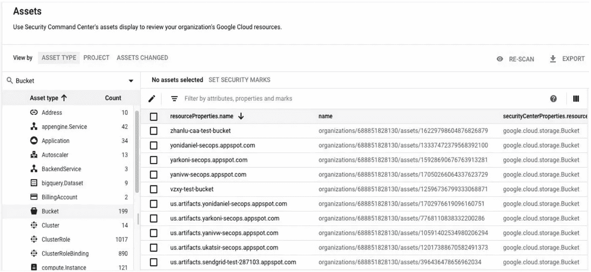
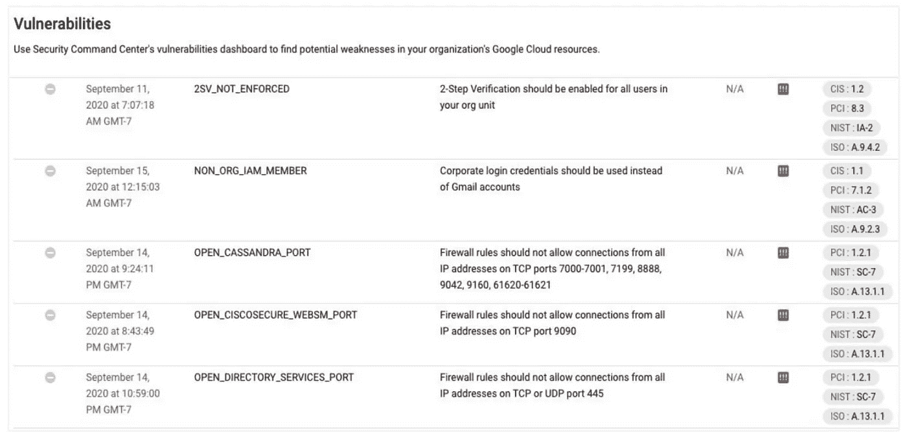
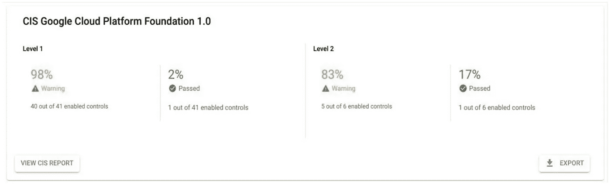

# gCloud Genie 简化了安全性

> 原文：<https://medium.com/google-cloud/gcloud-genie-simplifies-security-378ef3ba2fad?source=collection_archive---------3----------------------->

推荐:请看这里的介绍:[有转折的科技博客！](/@tanmayj/tech-blogs-with-a-twist-5a940413e42d)

一个阴沉阴沉的早晨，一辆光滑的黑色雪佛兰郊区 SUV 停在了 Cygnos 帝国银行的门前。挂在车头的一根小杆子上的国旗骄傲地飘扬着，表明这辆车载着一名政府官员。

安吉拉·拉米雷斯，副总裁兼国家储备银行审计委员会主席离职。身高 5 英尺 7 英寸，但很有军人风范。她穿着一套正式的黑色西装，她的头发现在呈现出轻微的灰色，梳得很紧，扎成马尾辫。她手里拿着一个文件夹，快步走向电梯，当银行的保安人员为她开门时，她向他们简单地点了点头。

安吉拉·拉米雷斯在银行界赢得了“地狱天使”的绰号。作为审计银行网络安全和合规的团队负责人，她只需扫一眼就能让大多数首席信息安全官感到不安！如果她认为基础设施或运营的任何部分不够安全，她有权关闭它们！她说了算，责任由她承担！

安吉拉知道自己的名声。军人的态度不是巧合。在她心中，安吉拉是一个真正的爱国者。多年前，她曾在军事情报部门保护美国公民免受恐怖袭击，从那时起，她提前退休，担任了这个平民角色。在她看来，她仍在履行保护公民财富免受网络攻击和盗窃的国家职责。

在她内心的某个角落，她希望自己在这个行业里能得到更多的尊重，少一些恐惧。她希望西索斯把她看作是一个共同负责保护国家财富的朋友，而不是一个恶棍。在大多数情况下，这从未发生过，因为大多数从未达到她对安全的期望。

今天，她在这里会见了塞格诺斯帝国银行的 CISO 山姆·兰彻，以及他的企业建筑师扎克·肯尼迪。CNB 通过积极采用云技术稳步转变其 IT 环境。虽然 Angela 并不反对银行业采用云的想法，但她仍然必须确保没有跨越任何界限。她被带进顶楼的会议室，可以 360 度俯瞰整个城市。

点头，微笑和握手，他们都坐下来。她注意到房间里有一种平静的气氛，而不是紧张的气氛。“有意思……”她想。

在她不知道的情况下，在扎克的笔记本电脑上，在一个最小化的窗口中，“gCloud Genie”已经准备好让这位女士大吃一惊了！

“那么……”她开始了。“我听说您在采用公共云实现业务转型方面做了很多出色的工作！这很好，但我希望你能保护我们公民的数据安全！”

“当然”CISO 山姆说

“好的，太好了！我想从四个角度了解一下安全性，我先解释一下。

*   可见性—您如何深入了解您的云中发生了什么？
*   漏洞监控——您如何确保某人不会让门开着，不管是意外还是其他原因？
*   威胁检测:如何保护自己免受威胁？
*   符合性:你如何证明符合适用的标准？"

“当然，Angela，首先让我向您保证，我们有解决您所有问题的系统。我将让我的企业架构师 Zach 带您了解一下，”Sam 说

“你好，安吉拉，我是扎克，我是 CIB 的 EA。如你所知，我们与谷歌云合作，帮助我们实现转型。我们选择 GCP 作为我们的战略转型合作伙伴的原因之一是因为安全性是谷歌非常内在和核心的。

“我们使用名为“[安全指挥中心](https://cloud.google.com/security-command-center)”的工具，作为我们的集中式安全和合规性监控和报告机制。它与您刚刚概述的四个观点完全一致！

“请允许我逐一解释和演示”，扎克说。

安吉拉不知道，gCloud Genie 已经准备好了。他在扎克的屏幕上弹出了一个仪表盘。

“如果你能看到这里，这是库存屏幕。如您所见，SCC 捕获了我们组织下的每个 GCP 资产的详细清单。我们可以发现整个组织的资产清单。我们可以查看历史发现扫描，以识别新的、修改的或删除的资产。为了接收关于资源和策略变化的实时通知，我们可以创建并订阅一个 [feed](https://cloud.google.com/asset-inventory/docs/monitoring-asset-changes)

安吉拉举起了她的手。

她见过许多这样的工具。在许多情况下，它们是从外部固定在解决方案上的，很容易破损和出现漏洞。总的来说，她并不热衷于这种模式，渴望有人能提出一个更稳健的解决方案。

安吉拉问:“让我猜猜——外部闩锁安全？在 GCP 创建凭证并授予所有相关 API 的权限？API 然后将数据提供给第三方服务？您如何处理第三方集成中断的情况？

令她惊讶的是，扎克笑得很开心！“安吉拉，你刚才问的每一个问题的答案都是大大的不！

谷歌从后端集成 SCC 和 GCP，而不是通过客户的环境。它不仅可以广泛访问平台数据源以识别微调检测，而且它与 GCP 控制平面的集成意味着攻击无法轻松逃避检测。因为它是 GCP 为 GCP 建造的，它能提供真正深刻的见解。"

安吉拉笔直地坐着！她现在真的感兴趣了！

“多告诉我一点！”她说。

“哦，有这么多要谈的”，扎克说。“在这里，让我谈谈漏洞检测”他说，向 gCloud Genie 眨眨眼，后者立即弹出了漏洞仪表板。

我们有一项“安全健康分析”服务，可以发现并报告导致漏洞的错误配置。也是一个“网络安全扫描器”,用于发现常见的网络应用程序漏洞。我们可以采取行动，利用谷歌提供的便捷指南修复这些漏洞。此外，SCC 还与谷歌产品组合中的其他安全解决方案深度集成，如“[编年史](https://chronicle.security/)、[异常检测](https://cloud.google.com/blog/products/data-analytics/anomaly-detection-using-streaming-analytics-and-ai)、[二进制授权](https://cloud.google.com/binary-authorization)、[云 DLP](https://cloud.google.com/dlp) 、[谷歌云盔甲](https://cloud.google.com/armor)、[凡赛堤](https://forsetisecurity.org/)和[虚拟机管理器](https://cloud.google.com/compute/docs/vm-manager)

“告诉我，探测时间是什么样子的？我假设遥测数据必须被传输到某个地方，搅拌，然后根据分析，漏洞或威胁会通知你？时间线是什么样的？

“嗯，快到实时了！这是几秒钟的事！记住，这是深深融入 GCP 的。超级快！此外，我们不必将遥测数据发送到另一个 SaaS 服务，从而节省了我们的出口成本，并降低了遥测数据向外流出的风险！”

现在轮到安吉拉开心地笑了！她控制不住自己！

“继续…”

“当然可以！”扎克说。

“在这里，我将向您简要介绍威胁检测功能。我们有事件威胁检测和容器威胁检测。事件威胁检测通过扫描整个 GCP 环境中的日志文件来检测威胁。容器威胁检测有助于检测对您的容器环境的威胁”。

“好的，”安吉拉说。

“我有一个问题。我假设你的云控制台中会有某个地方可以打开这个东西。那么，如果您的云控制台凭据遭到破坏，会发生什么情况呢？如果有人获得了控制台本身，那么一切都结束了，不是吗？”

“还是那句话，不行！”扎克回答道！

“SCC 的控制平面与云的控制平面是分开的。如果我必须订阅/取消订阅 SCC 服务，我必须联系谷歌，这是设计好的。这也是为什么只能为整个组织启用 SCC 的原因。组织经常在 UAT/开发环境的安全性上妥协，我们都知道这是威胁进入的地方，然后渗透到生产环境中。有了 SCC，这些都没有了！它适用于整个组织。强制地。句号！”

“哇！”安吉拉现在在扎克和萨姆都喜气洋洋！她已经很久没有这样印象深刻了！

“开始合规报告”，Zach 继续说道…

多亏了 gCloud Genie，合规仪表盘出现了。

“Cygnos Imperial Bank 关于 CIS、PCI DSS、NIST 800–53 和 ISO/IEC 27001 等主要行业基准的合规状况的自动化仪表板。向下钻取以检查违规，违规按严重性分类。您可以按照建议采取行动来修复违规情况。

“那么，你认为呢，安吉拉？你认为 CIB 足够安全吗？”山姆·兰彻以 CISO 的身份问道

“哦，当然！”安吉拉滔滔不绝。

“我承认我已经有一段时间没有如此印象深刻了。当我走进去的时候，我很担心，因为你们是这个国家采用云技术的先锋，我渴望你们能保证安全。但是你看起来很棒！

明天我会派我的团队和你坐在一起，深入研究，用证据来验证一切，但我看不到任何问题！

我祝你在未来的努力中一切顺利。"

她和他们两人握了手，然后离开了会议室，很久以来她都没有这么开心过。与她的大多数会议不同，她没有离开房间，留下一个惊恐、畏缩、崩溃的 CISO。萨姆·兰彻和扎克与她握手时，显得轻松、自信和自在。

她在他们的眼中看到了尊敬，而不是恐惧。

她走到外面。早晨的阴霾已经散去，正午的阳光灿烂。

回到会议室，gCloud Genie 笑着对扎克表示感谢，并关闭了他的笔记本电脑。

(本文记录了 SCC premium 截至 2022 年 10 月 21 日的正式发布特性，并未对未来功能/架构做出任何表述)