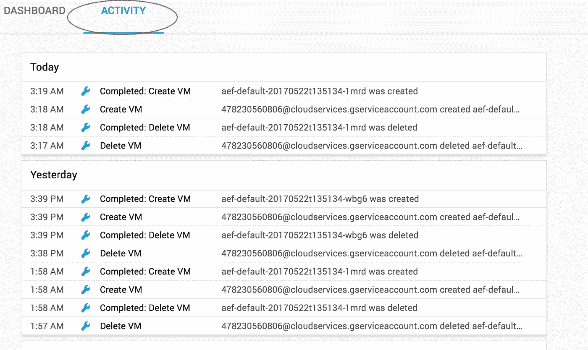

# GCP 审计日志

> 原文：<https://medium.com/google-cloud/gcp-audit-logs-9dffe2f6ed75?source=collection_archive---------1----------------------->

审计日志很无聊。至少我们希望它们很无聊。如果您的审计日志令人兴奋，那么您可能度过了糟糕的一天。但是某种类型的审计日志通常是一个好主意，我们中的许多人忘记设置它并定期验证我们是否理解数据。这篇文章介绍了如何设置和使用 GCP 的审计日志功能。运营和站点可靠性不是我的专业领域。此外，我不是安全专家或合规律师。请把这篇博客文章看作是你在为可怕的互联网准备项目时应该做的关于记录和监控的许多事情之一。

# 术语

在开始操作之前，我想稍微改进一下我的术语。有很多东西叫做审计日志。在这篇文章中，我主要关注两类日志:管理活动日志和数据访问日志。管理活动日志记录了管理员对您的项目的操作。这些可能包括构建新的实例、改变项目元数据、启用 API 或部署应用程序。拥有良好的管理审计日志可以让您追溯出一个给定的变更是如何进行的，以及通常是谁进行的。数据访问日志是您所期望的，它们记录了用户访问数据的时间。Google 云平台有云存储、Cloud Dataproc、Deployment Manager、Cloud SQL、Compute Engine 和[其他几个产品](https://cloud.google.com/logging/docs/audit/#services)的数据访问日志。

大多数人都有一些管理活动记录设置。与所有日志一样，管理活动日志的用处取决于您记录的内容。我希望没有人还在这么做，但是十年前，多人使用一个共享的管理员帐户是很常见的做法。我曾在这样的系统上工作过，当配置在生产中被更改时，我们无法跟踪负责人，因为所有的日志都显示为 root。

出于几个原因，数据访问日志不太常用。首先，我们存储的许多数据我们希望人们能够访问，我们不需要知道是谁。图像、web 资产、公共数据集和脚本都属于这一类。其次，数据访问日志可能非常冗长。如果你的唯一目标是找出某人何时访问“my-super-secret-file.txt”，那么知道有人列出了你备份桶中的内容就是噪音。虽然嘈杂的日志让一些人感到更安全，但我发现它们让我的工作变得更难。

# 管理活动日志

在 GCP 上，默认情况下会记录大多数管理活动。[这里的](https://cloud.google.com/logging/docs/audit/#services)列出了所有拥有管理活动日志的产品，以及日志支持处于哪个发布阶段。

您可以在几个地方查看最近的管理操作。第一个是在 GCP 控制台主页的“活动”选项卡上。此视图允许您查看组织中多个项目的管理操作。您可以根据日志或服务的类型(GKE、App Engine、BigTable)以及您感兴趣的事件类型进行过滤。如果有用的话，您还可以按参与者过滤日志。



您还可以在 [Stackdriver Logging](https://console.cloud.google.com/logs/) 中查看日志，这里有额外的查询和过滤功能。Stackdriver 日志记录还允许您通过创建指标在日志上设置警报。今年早些时候，我在 T4 写了一篇关于此事的博文。还有一个 Cloud Minute 视频，演示了创建基于日志的警报的步骤。

# 数据访问日志

默认情况下，GCP 上的数据访问日志是不启用的(BigQuery 是一个例外)。如果要设置数据访问日志，必须明确打开它们。所有关于启用数据访问日志的文档在这里都是[这里是](https://cloud.google.com/logging/docs/audit/configure-data-access)，但是这篇文章将带你了解一些基础知识。

数据访问日志被配置为项目或组织的 IAM 策略的一部分。您也不能在用户界面中打开或关闭它们；您必须使用“gcloud”命令行工具来修改 IAM 策略。最后，在编辑 IAM 策略时要小心。如果 IAM 策略配置不正确，则可能会删除对项目或组织的所有访问权限。我的一个同事偶然发现了这一点，导致她的项目无法使用。

我发现用云壳来做这样的改变是最容易的。你可以使用你的机器，但云壳安装了最新版本的 gcloud 和我最喜欢的文本编辑器。

第一步是取消现有的 IAM 策略。您可以使用以下命令来完成此操作:

```
gcloud projects get-iam-policy [PROJECT_ID] > policy.yaml
```

现在您需要编辑该文件，并在文件的顶部添加数据访问日志配置。要启用所有数据访问日志，请将以下内容添加到文件的顶部。

```
auditConfigs:
- auditLogConfigs:
  - logType: ADMIN_READ
  - logType: DATA_WRITE
  - logType: DATA_READ
  service: allServices
```

如果您有一个公共可读的云存储桶，那么只为写入启用数据访问日志可能是有意义的。这将让您看到存储桶更新的时间，但会消除数百万用户的垃圾日志。在这种情况下，您应该将以下内容添加到策略文件中:

```
auditConfigs:
- auditLogConfigs:
  - logType: DATA_WRITE
  service: [storage.googleapis.com](http://storage.googleapis.com/)
```

一旦有了策略文件，就可以使用`gcloud projects set-iam-policy [PROJECT_ID] ./policy.yaml`来应用它。这将应用您的新策略，并为您的项目打开审核日志记录。

# 了解更多信息

审计日志是一个复杂的话题。关于如何“恰当地”做这件事，有许多观点。适用于一个项目的不一定适用于另一个项目。要了解更多关于 GCP 提供的审计日志支持，请查看 GCP 网站上的[审计日志页面](https://cloud.google.com/logging/docs/audit/)。

12/27/17

*原载于 2017 年 12 月 27 日*[*【www.thagomizer.com*](http://www.thagomizer.com/blog/2017/12/27/gcp-audit-logs.html)*。*