# GCP 大湖游戏攻略

> 原文：<https://medium.com/google-cloud/gcp-biglake-introduction-570fb88be132?source=collection_archive---------0----------------------->


BigLake 是 Google 给一个底层数据访问引擎起的名字，该引擎用于访问以 BigQuery 或结构化格式存储在 Google Cloud Storage (GCS)上的数据。其概念是数据所有者将他们的数据存储在数据仓库(例如 BigQuery)或数据湖(例如 GCS)中。由于数据存储在不同的位置，这些数据的访问模式和属性也不同。例如，人们可以对存储在数据仓库中的数据做一些事情，而不能对存储在数据湖中的数据做一些事情。BigLake 提供了一个平台，通过提供单个接口和语义来访问数据，而不管数据物理上位于何处或使用什么格式来存储数据，从而实现统一性和通用性。

谷歌在 2022 年 4 月发布了 BigLake 功能的初始版本。您应该不断地检查文档，看看添加或更改了什么。

以下是我对大湖的看法。它从存储在 BigQuery 和 GCS 中的数据开始。在 GCS 中，数据应该采用结构化格式，如 CSV、JSON、Parquet、ORC 和 Avro。

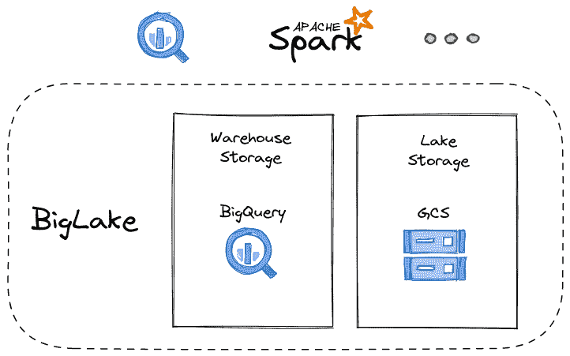

接下来，我们可以定义到底层数据的映射，以通过 BigLake 公开它。访问映射将通过 BigQuery 进行。让我们解开这个概念。假设您有属于 BigQuery 的表。在这种情况下，不需要做什么，因为您已经可以立即访问表中的数据。现在想象另一种情况，在 GCS 中将数据存储为对象。我们现在要做的是创建一个看起来像 BigQuery 的表，但是将该表的数据源指向底层的 GCS 存储。一旦完成，我们就能够从这个 BigQuery 表中查询或检索数据，BigLake 负责检索和提供数据。在这里暂停一下，我们现在看到我们可以使用 BigQuery 接口访问数据，而不再需要立即知道数据实际驻留在哪里。对于我们这些消费者来说，数据是在原生 BigQuery 表中还是作为对象存储在云存储中是隐藏的。

Apache Spark 等各种数据处理系统都有针对 BigQuery 的[连接器。这意味着我们可以将 BigLake 前端数据呈现给任何可以从 BigQuery 接口消费的东西。](https://cloud.google.com/dataproc/docs/tutorials/bigquery-connector-spark-example)

如果你精通 BigQuery，你现在可能正在挠头。您可能会说“BigQuery 不是已经以[外部表](https://cloud.google.com/bigquery/docs/external-tables)的形式拥有这个概念了吗？”你是绝对正确的。外部表的想法伴随 BigQuery 已经有一段时间了。就像 BigLake 一样，外部表为存储在 BigQuery 之外的底层数据提供了 BigQuery 接口，包括 GC、Drive、Google Sheets 等等。BigLake *目前*提供的是一个替代接口，旨在提供一个统一的数据仓库/数据湖接口。在最初的一组 BigLake 函数中，我们得到了 BigQuery 外部表不可能得到的直接好处…我们有机会在行和列级别执行更细粒度的安全性。为了让这个概念变得清晰，我们现在可以将结构化数据存储在 GCS 中，这样对特定行或列的访问就可以被限制在授权的请求上。这个功能以前只适用于以本机格式存储的数据和由 BigQuery 专门管理的存储。

与外部表的另一个区别是，要查询映射到外部源的 BigQuery 表，提交查询的身份通常需要对底层数据源具有读取权限。例如，映射到 GCS 对象的外部表将要求执行查询的身份需要表权限**和**对应的 GCS 对象权限。通过使用 BigLake，我们授权 BigLake 拥有 GCS 对象权限，然后运行查询的身份就可以根据 BigQuery 权限被排他地允许或拒绝。

现在让我们浏览一下 BigLake 的一些用法，看看这个故事的实际应用。

1.  创建一个 GCP 项目，并记下其项目编号。我们将使用它作为 GCS 存储桶的唯一 id。
2.  启用以下 GCP API(如果尚未启用)

*   BigQuery 连接 API

3.创建一个名为`[PROJECT_NUMBER]-biglake`的 GCS bucket，并在`us-east1`中创建。

4.创建包含 CSV 数据的本地文件。在这个例子中，我们称我们的文件为`data.csv`，它包含:

```
country,product,price
US,phone,100
JP,tablet,300
UK,laptop,200
```

将此文件上传到 GCS 存储桶:

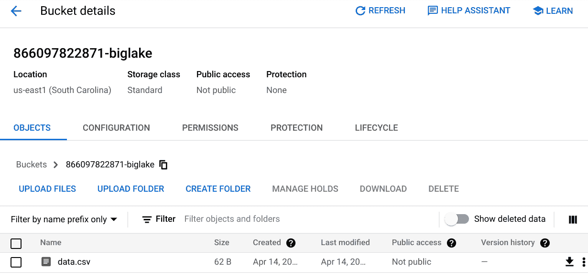

5.在 GCP 控制台中打开 BigQuery 工作台

6.点击`+ ADD DATA`，然后点击`External data source`

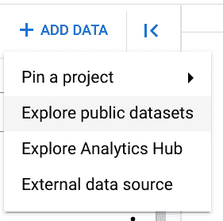

这将在右侧弹出一个面板。

7.填写外部数据源面板

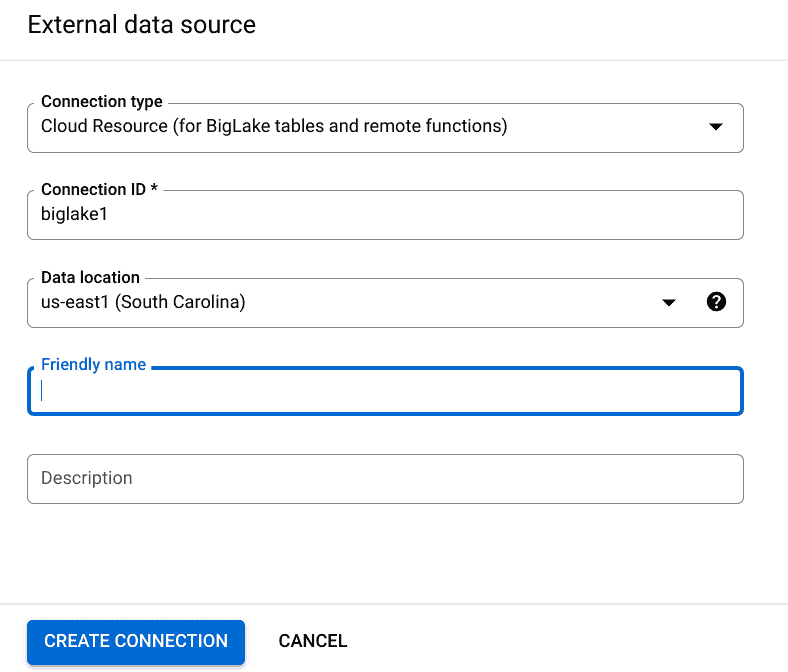

8.打开新添加的外部连接的连接详细信息

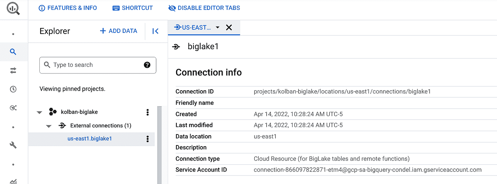

记下生成的服务帐户(服务帐户 ID)。

9.授予服务帐户读取 GCS 存储桶的权限。通过授予它`Storage Object Viewer`角色。


10.创建大查询数据集:

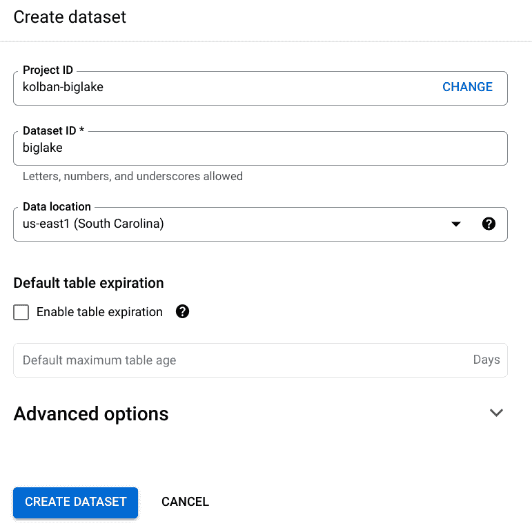

11.在新数据集中创建一个 BigLake 表:

我们选择数据集，然后从其菜单中选择`Create table`:

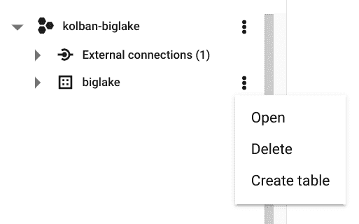

在出现的面板中，我们选择:

*   数据的来源应该是谷歌云存储
*   应该从中检索数据的 GCS 对象
*   文件格式为 CSV
*   我们希望创建的 BigQuery 表的名称。在这个例子中，我们称之为`biglake`
*   用于创建基于 BigLake 的表并使用连接 id 的复选框。这就是**核心**概念。

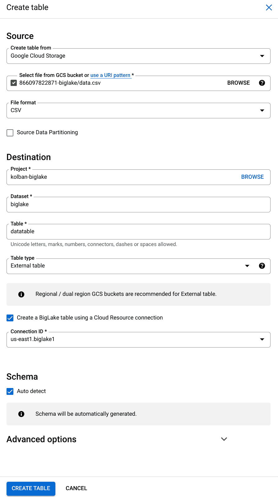

创建表后，我们可以看到它的定义。注意，它被标记为`BigLake`。

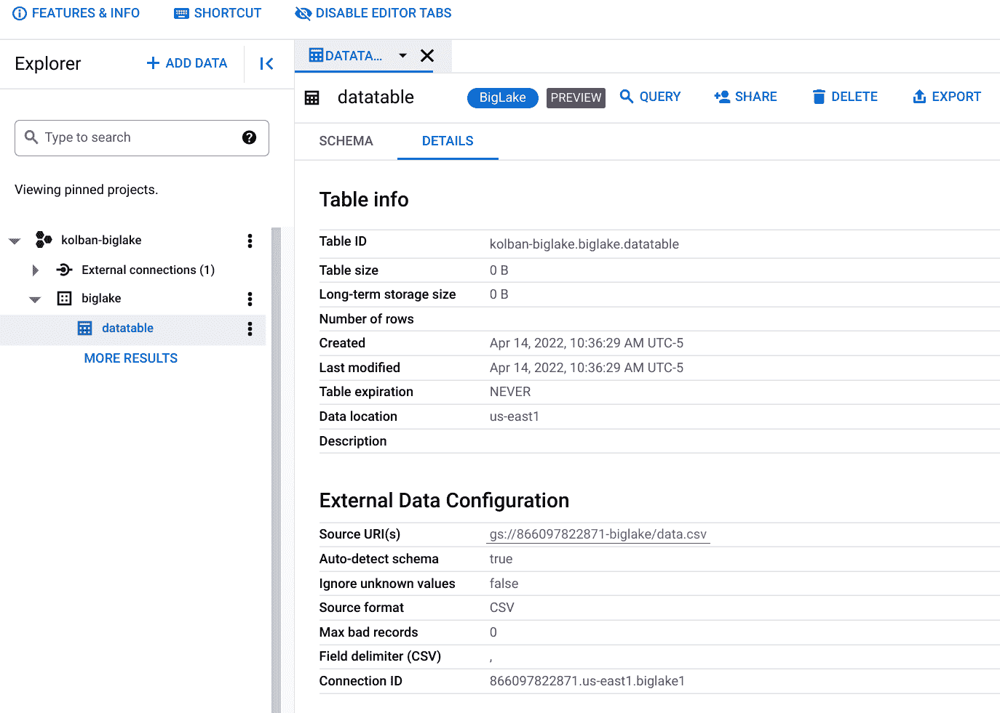

12.运行简单的查询

如果我们现在从 BigQuery 工作台中运行一个查询，我们会看到有数据返回。如果我们要更改 GCS 中的 CSV 文件，我们会发现后续的查询会返回最新的数据。

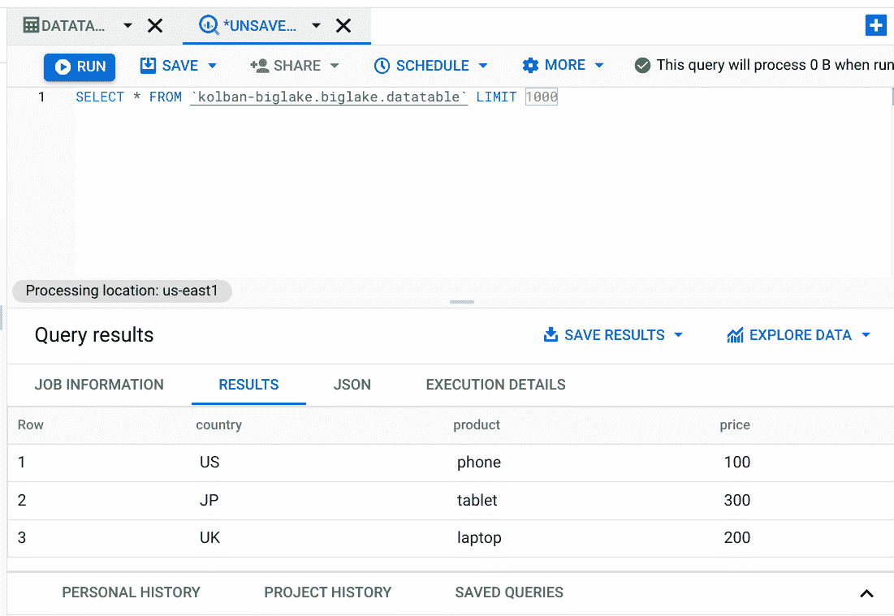

13.应用行级安全策略。

我们想测试行级安全性。为此，我们运行以下 SQL 语句:

```
CREATE OR REPLACE ROW ACCESS POLICY mypolicy ON biglake.datatable
GRANT TO (“user:[YOUR IDENTITY]”)
FILTER USING (country = “US”);
```

你必须在`GRANT TO`部分改变你自己的身份。

14.重新运行数据访问

这一次，我们看到我们只能看到我们有权看到的行。这表明行级安全性现在已经生效。

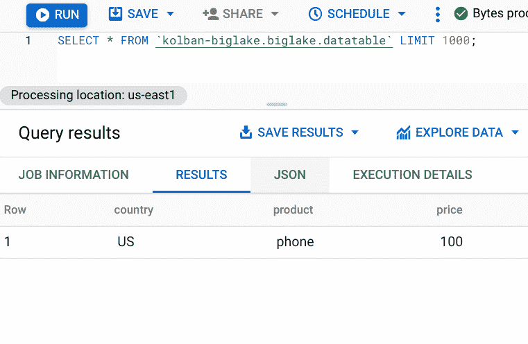

对于 BigQuery 外部表，这不是我们可以使用的选项；我们只能用大湖技术来实现。

如果我们要在 GCS 中的 CSV 文件中添加一个新行，允许我们查询它，那么它确实会被返回:

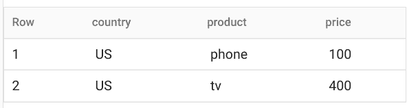

到目前为止，我们已经展示了通过 BigQuery 查询来访问 BigLake 表，但是我们也可以通过 Spark 等其他技术来访问 BigLake 表。例如，下面是一个 Spark 片段，它查询一个 BigLake 表:

```
from pyspark.sql import SparkSession
spark = SparkSession.builder \
 .appName(‘BigLake Query’) \
 .config(‘spark.jars’, ‘gs://spark-lib/bigquery/spark-bigquery-with-dependencies_2.12–0.24.2.jar’) \
 .getOrCreate()
df = spark.read \
 .format(‘bigquery’) \
 .load(‘biglake.datatable’)
df.show()
```

最后……一段视频带我们浏览了本文中讨论的一些项目。

# 参考

*   [使用 BigLake 统一跨云的数据湖和数据仓库|谷歌云博客](https://cloud.google.com/blog/products/data-analytics/unifying-data-lakes-and-data-warehouses-across-clouds-with-biglake)—2022–04
*   [big lake 表介绍| BigQuery | Google Cloud](https://cloud.google.com/bigquery/docs/biglake-intro)
*   [外部表| BigQuery |谷歌云](https://cloud.google.com/bigquery/docs/external-tables)
*   搅拌机图片: [shontoloyo](https://www.blendswap.com/profile/152246)