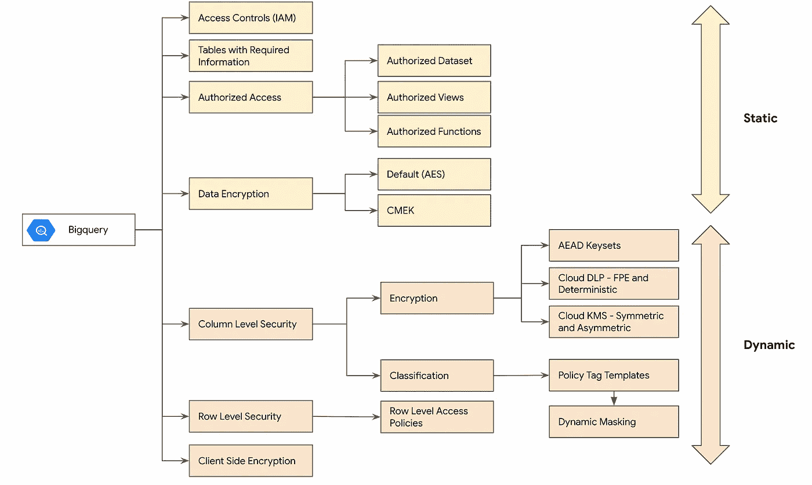
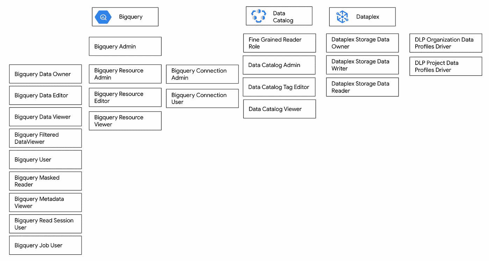
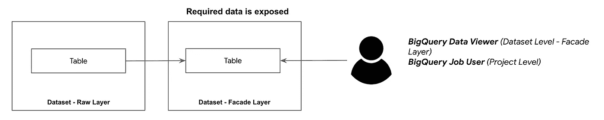
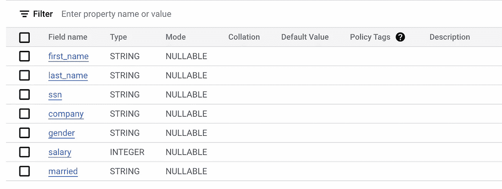
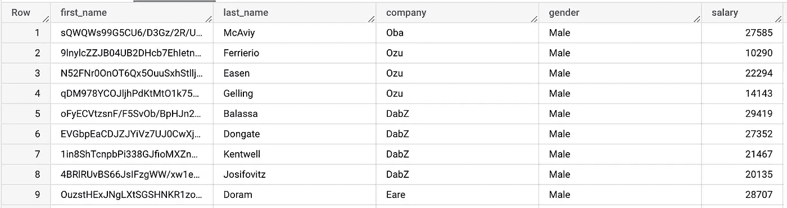
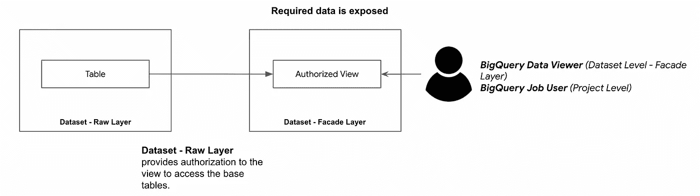
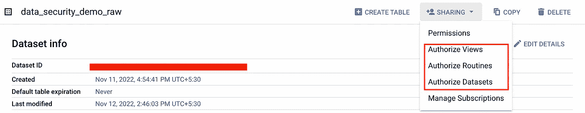
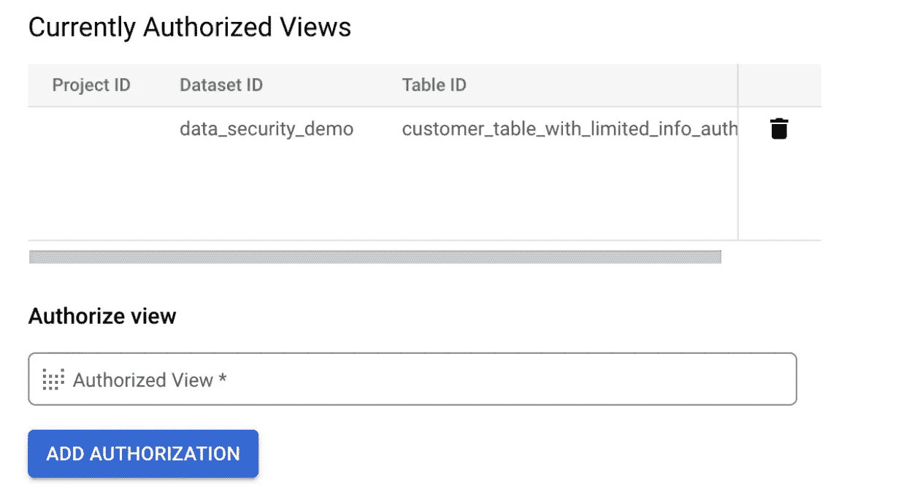
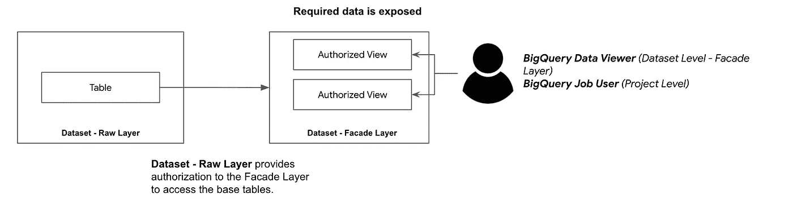

# GCP — BigQuery —静态数据安全性(第 1 部分)

> 原文：<https://medium.com/google-cloud/gcp-bigquery-data-security-at-rest-part-1-2a6fe1394c41?source=collection_archive---------3----------------------->

> 经常可以看到，由于安全控制的放松，组织由于数据丢失或数据被盗或数据泄露而受到很大的惩罚。这种泄漏不仅会影响组织的财务，还会使客户的数据面临被滥用的风险。
> 
> 这篇博客是“Bigquery —静态数据安全”5 部分系列文章的一部分。这篇博客是这个系列的第一部分。
> 点击此处查看[系列菜单](/google-cloud/gcp-bigquery-data-security-at-rest-series-menu-1e59e1793deb)

随着云技术的出现，数据安全性是决定采用云技术的首要驱动因素。

虽然安全性是一个非常广泛的话题，包括硬件安全、网络安全、软件补丁、访问控制、静态数据和传输中的数据，但本博客将重点关注可用于保护大查询中**静态数据的安全实现。**

## 概观

下图显示了一组选项，这些选项可以根据需要单独使用，也可以一起使用。根据每种安全控制提供的安全性的性质，我将这些安全控制分为静态和动态。

高级安全控制

> 客户端加密将不作为本系列的一部分，因为它本身是一个广泛的主题。

## 访问控制(IAM)

IAM 可以被认为是提供受控资源访问的第一个入口点。
了解可以与 Bigquery 交互的不同角色非常重要。
下面是[角色列表](https://cloud.google.com/iam/docs/understanding-roles)(不详尽)，这些角色拥有与大查询交互的权限。

具有 Bigquery 权限的角色

有一些角色具有类似于**数据目录**、 **DLP** 和**数据复用**的服务，这些服务可以提供对大查询数据的**直接访问**。
除了这些角色之外，还有**安全管理员和审核者、**推荐者和**大查询迁移角色**，这些角色拥有大查询权限的足迹。

> 大的查询角色可以在不同的粒度上被授权，例如:项目、数据集、表级别。请按照最低特权原则彻底检查。
> 
> 评估为服务客户适当提供任何管理员角色的需求。
> 
> 了解每个角色中授予的权限，并遵循最小特权原则提供访问权限
> 
> 不要向主体授予单独的权限，如果需要，创建一个自定义角色并分配给组。
> 
> **重要说明** — **服务代理角色**确实提供了对大型查询的访问，但不应授予委托人，它们是用于服务用途的。他们拥有强大的权限，可以随时更改。

## 信息有限的表/视图

确保有限暴露的最简单的方法之一是创建具有有限信息的第二层表格。

外观层-包含有限信息的表

在这种类型的设置中，来自原始层的敏感列不会暴露给用户。
用户只能访问所需的**派生表**，其中包含用例所需的有限信息。

假设有一个原始表——customers _ raw，包含以下信息

客户原始表的架构

让我们创建另一个只显示有限信息的表，如下所示

客户信息有限的表格

上表中有使用 **SHA1** 函数散列的**名字**列。
栏目 **SSN** 和**已婚**未曝光消费。

> **优点
> 1。**这种模式有其优势，因为父表信息或与谱系的任何关系都不会显示出来，因为这是一个完全不同的物化表，有自己的存储。
> 2。当数据消费的用例非常清楚时，这种模式就可以工作
> 3。对于重复的查询模式，命中派生表的查询可以被缓存和提供，此外，它可以有自己的分区和聚类方案
> 
> **注意事项**
> 1。如果事先不知道这些模式，那么这可能很容易导致大量零碎信息的产生。
> 2。这需要设置存储过程或预定查询来定期刷新
> 3。创建的派生表需要自己的存储

## 授权数据集/视图

> 为什么授权视图？对于普通视图，权限也需要在基表中提供，因为视图反过来查询基表。

授权视图可以认为是**视图**具有**显式授权**访问基表数据。

授权视图

父数据集-共享选项

父数据集授权子视图

**授权数据集**是一个场景，其中一组视图聚集在一个数据集中，整个数据集由父数据集授权。

授权数据集

授权数据集被授权用于将来创建的新视图。

> **优点
> 1。**不需要在基表
> 2 上提供显式访问。因为视图本质上是逻辑的，所以不需要提供任何额外的存储。
> 
> **注意事项
> 1。**授权视图是对每个查询执行的视图，并且依赖于基表进行任何分区或集群设置
> 2。该视图当前在数据集级别授权，而不是在单个表或视图级别授权。

## 数据加密

默认情况下，Bigquery 中的所有数据都使用 [AES 加密](https://en.wikipedia.org/wiki/Advanced_Encryption_Standard)(高级加密标准)进行静态加密。

作为附加的安全机制，Bigquery 支持整个数据集的 CMEK(客户管理的加密密钥)。加密密钥由云 KMS 管理。

> 对于由 CMEK 加密的数据集/表，bigquery 服务帐户需要云 KMS 密钥的附加角色-加密器/解密器
> 
> **优点**
> 1。通过加密提供额外的安全层
> 2。适合安全合规性要求
> 
> **注意事项**1。从更新密钥到它们的最新版本，需要手动处理密钥轮换。
> 2。如果不使用不同的加密选项
> 3 重新创建表格，则无法在默认和 CMEK 之间切换。批处理查询需要提及 destination_kms_key 选项，查询才能正常工作。
> 4。提到的带有默认客户密钥加密的数据集不能有没有客户密钥加密的表。

我们将在系列的第 2 部分[中介绍动态安全控制。](/google-cloud/gcp-bigquery-data-security-at-rest-part-2-f4e3c741c162)

如有任何疑问，请通过 https://www.linkedin.com/in/murli-krishnan-a1319842/[与我联系。](https://www.linkedin.com/in/murli-krishnan-a1319842/)

快乐学习。

## 参考

[设计和部署数据安全策略](https://services.google.com/fh/files/misc/designing_and_deploying_data_security_strategy.pdf)
[AEAD —关联数据的认证加密](https://cloud.google.com/bigquery/docs/reference/standard-sql/aead-encryption-concepts)
[AEAD 的使用案例](https://developers.google.com/tink/bind-ciphertext)
[IAM 角色和权限](https://cloud.google.com/iam/docs/understanding-roles)