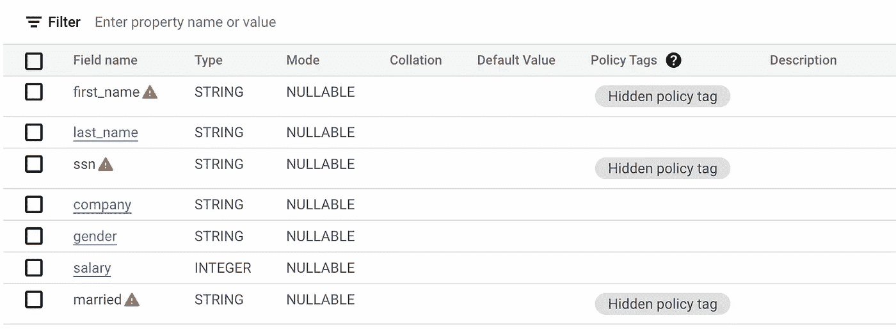
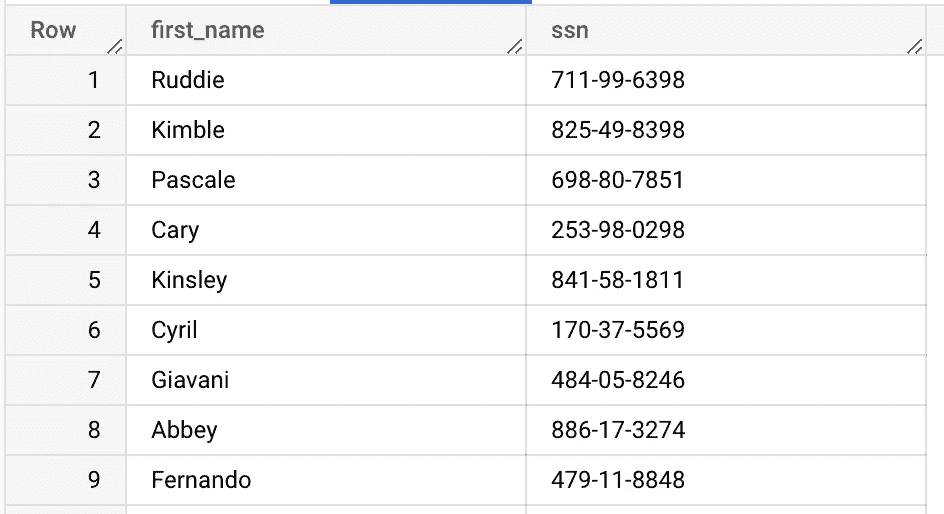

# GCP —大查询—静态数据安全(第二部分)

> 原文：<https://medium.com/google-cloud/gcp-bigquery-data-security-at-rest-part-2-f4e3c741c162?source=collection_archive---------4----------------------->

> 到目前为止，在博客的第 1 部分中，我们主要关注静态安全控制，如 IAM 访问控制、Bigquery 数据集/表加密、外观层和授权视图。在这篇博客中，我们将继续讨论安全控制的动态本质。
> 
> 这篇博客是“Bigquery —静态数据安全”5 部分系列文章的一部分。
> 点击此处查看[博客系列](/google-cloud/gcp-bigquery-data-security-at-rest-part-1-2a6fe1394c41)第一部分
> 点击此处查看[系列菜单](/google-cloud/gcp-bigquery-data-security-at-rest-series-menu-1e59e1793deb)


Bigquery 安全控件。

## **列级安全**

> 为什么列级安全性很重要？
> 
> 根据国家和行业的不同，组织需要遵循不同的法规要求，以确保数据合规性和安全性标准，如 [GDPR](https://gdpr-info.eu/) 、 [HIPAA](https://www.cdc.gov/phlp/publications/topic/hipaa.html) 、 [COPPA](https://www.ftc.gov/legal-library/browse/rules/childrens-online-privacy-protection-rule-coppa) 等。
> 在大多数组织中，有不同的角色访问数据并具有不同的安全许可。
> 并不是所有的组都有类似的权限，例如:支持人员可能没有敏感列的访问权限，但需要访问表数据以提供支持。
> 数据分析师可能不需要访问 PII 数据，但可能需要分析和细分数据之间的相互关系。
> 组织的监管报告将需要访问 PII 数据。

由于安全需求的这种动态特性，Bigquery 提供了多种方法来实现这些需求。

让我们从策略标记模板开始。

## 列级安全性—策略标记模板

使用策略标记模板实施列级保护的典型流程如下


列级安全性—策略标记

通常作为任何组织中**数据治理**的一部分，**数据管家**负责管理数据生命周期，定义数据的业务规则、数据质量规则，以及定义数据的政策和标准。

基于结果，**数据管家**定义了**策略标签的分类(数据类，如 PII、财务数据..)**

一个这样定义的分类的例子如下


数据目录中定义的策略标记分类

顶级数据类别为**严重度-高**和**严重度-中**，它们定义了数据元素的关键程度。

下一个级别定义了属性列表，这些属性被分类为**严重性高**如**名字**和**社会保障号**或**严重性中等**如**已婚**属性。

> **策略标签**本质上可以是分层的，并且自下而上地检查角色，并且实施分层中的第一个匹配。


基于直接访问和层次结构的访问解析

现在，表列上的策略标记被分配为


实施了策略标记的表

现在，先前对该表具有访问权限的用户试图查询该表时，会遇到如下错误


缺少细粒度的读者权限。



指示策略标记强制列的表

用户仍然可以查询不受策略标记保护的列。


其他不受策略标记保护的列数据。

让我们尝试为主体提供具有**细粒度读者**角色的**高严重性**级别的访问。

现在，用户能够访问**名字**和 **ssn** 属性(自底向上遍历和层次结构中的第一个匹配)。



名字和 SSN 保护列是可访问的(虚构数据)

> 策略标记模板的创建可通过使用 terraform 模板进行管理
> 策略标记也可从 dataplex 控制台进行分配(数据目录是 dataplex 产品的一部分)
> 
> **优点
> 1。**由策略标签引入的基于角色的访问机制避免了表内容和过程的重复，从而根据角色向用户提供所需的数据。
> 2**2。**细粒度读者角色允许对表的列级进行细粒度访问。
> 3。策略标签的管理与用于管理的数据目录很好地集成在一起。
> 4。在带有策略标记的基表上创建的任何视图也会在视图列上继承标记。
> 
> **注意事项
> 1。应该对分类法和策略标签的制定进行明确的考虑，以避免频繁的更改。
> 2。应该在较低的环境中进行适当的访问测试。
> 3。每列只能分配一个策略标记
> 4。从查询结果创建另一个表不会传播相同的策略实施，除了 bigquery 中的复制作业。
> 5。要确定使用策略标记保护的表列列表，需要编写利用 bigquery apis 列出列和相关策略标记的程序。
> 6。策略标记模板可以有 5 个层次**

**策略标签**支持**动态数据屏蔽**作为策略标签上的**数据屏蔽规则**。

**动态屏蔽规则**通过策略标签上的数据策略支持 [3 种规则](https://cloud.google.com/bigquery/docs/column-data-masking-intro#masking_options)(默认、无效、散列)
[优先级](https://cloud.google.com/bigquery/docs/column-data-masking-intro#data_masking_rule_hierarchy)为散列、默认和无效规则。

如果任何策略标签与屏蔽规则相关联，那么它遵循下面的步骤
1。如果用户解析到策略层次结构上的**屏蔽数据读取器**，则用户可以查询带有屏蔽数据
2 的列。如果用户解析到策略层次上的**细粒度阅读器**，那么用户可以查询实际数据
3。如果用户同时拥有**细粒度阅读器**和**屏蔽数据阅读器**，那么从下到上的层次结构中，第一个匹配将被执行。
4。如果没有解析任何角色，则拒绝主体的操作

> 理解下面提到的注意事项，以确定 bigquery 特性与动态数据屏蔽的兼容性。

让我们看一个例子，其中为**严重性-中等**策略标记分配了一个数据策略，该数据策略具有**默认屏蔽规则**和访问权限，并提供给主体。


现在我们已经知道已婚列被标记为**已婚**策略标记(严重度为中的孩子)


指示策略标记强制列的表

因此，现在当用户试图访问已婚列时，用户能够访问已婚列，但是值默认为空字符串。


已婚列结果

> **优点
> 1。**散列规则允许对通常用于通过连接关联相似数据的数据进行一致散列(需要注意强力攻击)
> 2。动态数据屏蔽允许以更简单的方式管理对数据的访问
> 
> **注意事项**1。检查[策略标签强制与不同 bigquery 特性的兼容性](https://cloud.google.com/bigquery/docs/column-data-masking-intro#compatibility)
> 2。检查带有屏蔽规则的策略标记模板的[限制和约束](https://cloud.google.com/bigquery/docs/column-data-masking-intro#restrictions_and_limitations)。

## 移动策略标签

需要理解的一个最重要的特性是，可以使用下面的补丁方法在相同的分类中跨层次移动策略标记，而无需更改任何策略分配。

```
curl -X PATCH -H "Content-Type: application/json" 
-H "Authorization: Bearer $(gcloud auth print-access-token)" 
-d @request.json 
--verbose 
https://datacatalog.googleapis.com/v1beta1/projects/<project>/locations/us/taxonomies/2823830268236482597/policyTags/4631524100804902143

@request.json
{
"displayName" : "social-security-number",
"parentPolicyTag": "projects/<project>/locations/us/taxonomies/2823830268236482597/policyTags/1563760639735907832"
}
```

实现的最佳实践是将**属性分组**作为顶层层次结构，然后是**单个属性标签。**

需要分配给多个组的任何通用默认数据策略，在层次结构的较高级别分配它，以便它由层次结构中下面的所有策略标记继承。


将默认权限分配给多个组。

> 应该在所需的策略标记和屏蔽规则上而不是在整个项目上提供细粒度的读者角色和屏蔽的读者角色

> 我们将在[系列的第 3 部分](/google-cloud/gcp-bigquery-data-security-at-rest-part-3-915ce0cff883)中继续动态安全控制的加密部分

如有任何疑问，请通过[https://www.linkedin.com/in/murli-krishnan-a1319842/](https://www.linkedin.com/in/murli-krishnan-a1319842/)与我联系。

快乐学习。

## 参考

[列级安全](https://cloud.google.com/bigquery/docs/column-level-security-intro)
[列级安全限制](https://cloud.google.com/bigquery/docs/column-data-masking-intro#restrictions_and_limitations)
[列级安全—大查询特性兼容性](https://cloud.google.com/bigquery/docs/column-data-masking-intro#compatibility)