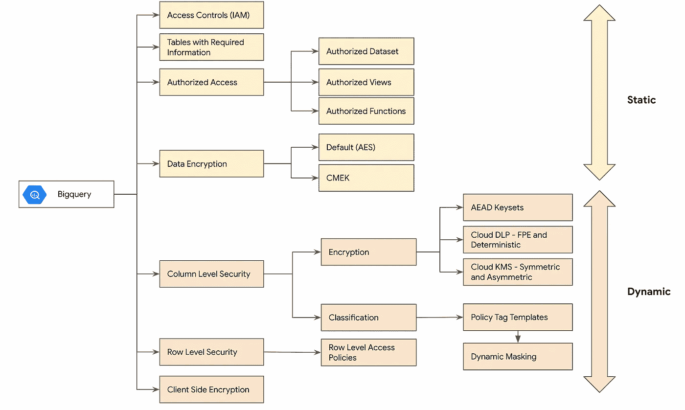
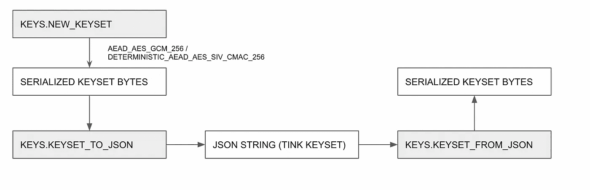

# GCP —大查询—静态数据安全(第 3 部分)

> 原文：<https://medium.com/google-cloud/gcp-bigquery-data-security-at-rest-part-3-915ce0cff883?source=collection_archive---------2----------------------->

> 到目前为止，在博客的第 2 部分中，我们已经详细讨论了列级访问控制和列的动态屏蔽。在这篇博客中，重点将是列数据的加密。
> 
> 这篇博客是“Bigquery —静态数据安全”5 部分系列文章的一部分。
> 点击此处查看[系列](/google-cloud/gcp-bigquery-data-security-at-rest-part-2-f4e3c741c162)第二部
> 点击此处查看[系列菜单](/google-cloud/gcp-bigquery-data-security-at-rest-series-menu-1e59e1793deb)



Bigquery 安全控件。

## 列级加密

列级加密的基本原理是数据用数据加密密钥(DEK)加密，密钥用密钥加密密钥(KEK)进一步加密，并在云 KMS 中维护。

现在，为了让用户访问纯文本，用户需要对表列加上云 KMS 密钥(KEK)进行访问，该密钥用于加密数据加密密钥(DEK)。

**术语**
**DEK** —数据加密密钥—用于加密数据的密钥，该密钥由谷歌
**KEK** 生成—密钥加密密钥—用于包装或加密 DEK 的密钥，在云 KMS 中维护


[https://cloud . Google . com/kms/docs/envelope-encryption # how _ to _ encrypt _ data _ using _ envelope _ encryption](https://cloud.google.com/kms/docs/envelope-encryption#how_to_encrypt_data_using_envelope_encryption)

> 与 CMEK 不同，在 CMEK 中，Bigquery 服务帐户只需要访问 CMEK 密钥来加密和解密数据集/表。
> 为了使列级加密工作，用户需要访问 KMS 密钥(KEK)

**AEAD** — **带关联数据的认证加密。**
这种**加密**背后的想法是通过用提供的**关联数据**验证签名来确保**加密的数据不被篡改。**

关联数据可以是在加密过程中提供的简单字节，类似于需要在解密过程中提供的密码。


AEAD 加密过程。

AEAD 支持不同类型的模式([密钥类型](https://developers.google.com/tink/aead#choosing_a_key_type))，用于使用 [AES(高级加密标准)](https://en.wikipedia.org/wiki/Advanced_Encryption_Standard)算法加密数据

> 在幕后，Bigquery 列级加密使用 Tink 加密库进行加密和解密

Tink 加密库利用了称为原语、密钥类型、密钥集和密钥集句柄的概念。

**原语—** [原语](https://developers.google.com/tink/primitives-by-language)简单来说可以认为是一个执行加密和解密的接口。原语定义要使用的密钥类型和加密算法。
例如:AEAD，AEAD 确定性，MAC..

**键类型—** [键类型](https://developers.google.com/tink/supported-key-types)定义实现。每个原语都有一组受支持的密钥类型可供选择，例如:AEAD 原语— AES GCM 密钥类型。

**密钥集—** 密钥集可视为组合在一起的一组密钥，其中一个密钥是用于加密的主要密钥，其余密钥用于解密

**按键手柄** —按键手柄有助于以安全的方式提供按键接口。

让我们看看 Tink 生成的纯文本密钥集是什么样子的
**值**是用于加密数据的实际密钥类型材料。

```
{
  "primaryKeyId": 1920493436,
  "key": [
    {
      "keyData": {
        "typeUrl": "type.googleapis.com/google.crypto.tink.AesGcmKey",
        "value": "<redacted>",
        "keyMaterialType": "SYMMETRIC"
      },
      "status": "ENABLED",
      "keyId": 1920493436,
      "outputPrefixType": "TINK"
    }
  ]
}
```

> 密钥集不应该以明文生成，而应该使用 KMS 系统(如云 KMS)进行加密

现在，让我们尝试使用 Bigquery 来实现上述概念，简单地创建一个带有 keytype 的 tink 键集



键集函数

让我们尝试用 AEAD_AES_GCM_256 keytype 创建一个键集。

```
 SELECT KEYS.NEW_KEYSET('AEAD_AES_GCM_256');
--COWSm/UNEmQKWAowdHlwZS5nb29nbGVhcGlzLm<redacted>
```

NEW_KEYSET 返回 tink 键集的序列化字节表示。

让我们试着将序列化的字节解码成更容易识别的格式，如下所示

```
SELECT KEYS.KEYSET_TO_JSON(
FROM_BASE64("COWSm/UNEmQKWAowdHlwZS5nb29nbGVhcGlzLm<readacted>"));
/*
{
   "key":[
      {
         "keyData":{
            "keyMaterialType":"SYMMETRIC",
            "typeUrl":"type.googleapis.com/google.crypto.tink.AesGcmKey",
            "value":"<redacted>"
         },
         "keyId":3735472485,
         "outputPrefixType":"TINK",
         "status":"ENABLED"
      }
   ],
   "primaryKeyId":3735472485
}
*/ 
```

类似地，钥匙。KEYSET_FROM_JSON 可以用来提供 KEYSET 的 JSON 表示，并获得序列化的字节。
对于使用 Bigquery 加密/解密函数进行加密和解密的所有意图和目的，我们将需要序列化的字节。

让我们看一个用上述密钥集进行**加密**和**解密**的例子。

```
--Encryption Process
SELECT AEAD.ENCRYPT(
FROM_BASE64("COWSm/UNEmQKWAowdHlwZS5nb29nbGVhcGlzLm<redacted>"), 
"Albert Einstein", 
"Scientist") AS encrypted_bytes

--Ad6myWWr9tJJhEG9DKRXuR15FVQO3h4tFi3O/4odapCqY3JyVJSmUCBo7LJ4hPwM

--Decryption Process
SELECT AEAD.DECRYPT_STRING(
FROM_BASE64("COWSm/UNEmQKWAowdHlwZS5nb29nbGVhcGlzLm<redacted>"), 
FROM_BASE64("Ad6myWWr9tJJhEG9DKRXuR15FVQO3h4tFi3O/4odapCqY3JyVJSmUCBo7LJ4hPwM"),
"Scientist") as decrypted_string;
--Albert Einstein
```

“**科学家**”是相关的关键字，用于认证加密数据，并证明加密数据未被篡改。

生成的密钥集可以使用密钥与新密钥一起旋转。密钥集 _ 旋转

```
SELECT KEYS.ROTATE_KEYSET(FROM_BASE64("COWSm/UNEmQKWAowdHlwZS5nb29nbGVhcGlzL<redacted>), "AEAD_AES_GCM_256");
--CMKtlcAKEmQKWAowdHlwZS5nb29nbGVhcGlzLmNvbS9nb29nbGUuY3J5cHRvLnRpbmsuQWVzR2NtS2V5EiIaIDXINLdEdJU/rsQp5ovIBv/k/5Al7/ <redacted>

SELECT KEYS.KEYSET_TO_JSON(FROM_BASE64("CMKtlcAKEmQKWAowdHlwZS5nb29nbGVhcGlzLmNvbS9nb29nbGUuY3J5cHRvLnRpbmsuQWVzR2NtS2V5EiIaIDXINLdEdJU/rsQp5ovIBv/k/5Al7/<redacted"));
```

```
{
  "key": [
    {
      "keyData": {
        "keyMaterialType": "SYMMETRIC",
        "typeUrl": "type.googleapis.com/google.crypto.tink.AesGcmKey",
        "value": "<redacted>"
      },
      "keyId": 3735472485,
      "outputPrefixType": "TINK",
      "status": "ENABLED"
    },
    {
      "keyData": {
        "keyMaterialType": "SYMMETRIC",
        "typeUrl": "type.googleapis.com/google.crypto.tink.AesGcmKey",
        "value": "<redacted>"
      },
      "keyId": 2818922178,
      "outputPrefixType": "TINK",
      "status": "ENABLED"
    }
  ],
  "primaryKeyId": 2818922178
}
```

> 使用这种加密/解密的最大好处是它的本机 tink 库用法。上面的 JSON 密钥集信息可以用来解密原生 tink 库中的加密字符串。

```
import tink
from tink import aead, cleartext_keyset_handle
import base64

# The TINK KEY SET file is the above plain text key set ouput
TINK_KEYSET_FILE = "bq_keyset.json"

aead.register()

text = open(TINK_KEYSET_FILE, "rt").read()
keyset_handle = cleartext_keyset_handle.read(tink.JsonKeysetReader(text))

cipher = keyset_handle.primitive(aead.Aead)

# Encrypted output from the aead.encrypt function.
output = cipher.decrypt(base64.b64decode("Ad6myWWr9tJJhEG9DKRXuR15FVQO3h4tFi3O/4odapCqY3JyVJSmUCBo7LJ4hPwM".encode("utf-8")), b"Scientist")

print(output.decode("utf-8"))
# Albert Einstein.
```

> 使用 bq 加密函数编码的数据可以使用支持语言的 tink 库解密。这为该方法提供了更大的灵活性。
> 
> 现在 **NEW_KEYSET** 函数提供了序列化格式的密钥集，可以对其进行反序列化以获得纯文本密钥材料，因此这应该仅用于测试目的。
> 
> 我们将通过**包装的键集和键集 _ 链**概念来理解**云 KMS 如何增强该过程**

以下命令创建由指定的云 KMS 密钥加密的密钥集

```
SELECT KEYS.NEW_WRAPPED_KEYSET("gcp-kms://projects/<redacted>/locations/us/keyRings/tink_us_keyring/cryptoKeys/tink_key", "AEAD_AES_GCM_256");
--CiQA3GVtLInRIEJQ5oUHo4v0hICcEeL+vdH0WFXSWWIL+<redacted>
```

现在我们将创建一个密钥集链，它有助于动态解密加密的密钥。我们将以类似的方式加密一个简单的文本。
加密密钥的值需要作为查询参数或 select 的一部分传递，如下所示

```
DECLARE KEY BYTES;
SET KEY = (SELECT FROM_BASE64("CiQA3GVtLEAKCJE3Kmny5Cvg163nrtU0xLa2rvLCqA4DO0wrhqsS<redacted>"));
SELECT AEAD.ENCRYPT
(KEYS.KEYSET_CHAIN("gcp-kms://projects/<redacted>/locations/us/keyRings/tink_us_keyring/cryptoKeys/tink_key", 
KEY),
"Albert Einstein",
"Scientist"
)

--ARmnidmkrodK2qVQZ0POOCU65Ci9R7jMAHyXTNUpzsum2NjoyGtC25sfLezclc7p
```

类似地，解密函数的工作方式如下

```
DECLARE KEY BYTES;
SET KEY = (SELECT FROM_BASE64("CiQA3GVtLEAKCJE3Kmny5Cvg163nrtU0xLa2rvLCqA4DO0wrhqsS<redacted>"));
SELECT AEAD.DECRYPT_STRING
(KEYS.KEYSET_CHAIN("gcp-kms://projects/<redacted>/locations/us/keyRings/tink_us_keyring/cryptoKeys/tink_key", 
KEY),
FROM_BASE64("ARmnidmkrodK2qVQZ0POOCU65Ci9R7jMAHyXTNUpzsum2NjoyGtC25sfLezclc7p"),
"Scientist"
)

--Albert Einstein
```

包装的密钥集可以分发，并且只能由对用作 KEK 的云 KMS 密钥拥有权限的用户解密

让我们尝试解密加密的密钥，并查看密钥的内容

```
echo "CiQA3GVtLEAKCJE3Kmny5Cvg163nrtU0xLa2rvLCqA4DO0wrhqs<redacted>" | base64 -d > wrapped_key

gcloud kms decrypt --key tink_key \
--keyring tink_us_keyring \
--location us \
--ciphertext-file wrapped_key \
--plaintext-file unwrapped_key

cat unwrapped_key | base64
--CILf5s8IEmQKWAowdHlwZS5nb29nbGVhcGlzLmNvbS9nb29nbGUuY3J5cHR<redacted>
```

现在密钥被解密了，让我们看看密钥集的 JSON 格式

```
select KEYS.KEYSET_TO_JSON(FROM_BASE64("CILf5s8IEmQKWAowdHlwZS5nb29nbGVhcGlzLmNvbS9nb29nbGUuY3J5cHR<redacted>"));
```

```
{
  "key": [
    {
      "keyData": {
        "keyMaterialType": "SYMMETRIC",
        "typeUrl": "type.googleapis.com/google.crypto.tink.AesGcmKey",
        "value": "<redacted>"
      },
      "keyId": 430410201,
      "outputPrefixType": "TINK",
      "status": "ENABLED"
    },
    {
      "keyData": {
        "keyMaterialType": "SYMMETRIC",
        "typeUrl": "type.googleapis.com/google.crypto.tink.AesGcmKey",
        "value": "<redacted>"
      },
      "keyId": 2314841986,
      "outputPrefixType": "TINK",
      "status": "ENABLED"
    }
  ],
  "primaryKeyId": 2314841986
}
```

> 对云 KMS 密钥的访问只需要提供给需要访问的进程或组。

与 KEYSET_ROTATE 类似，ROTATE_WRAPPED_KEYSET 用于旋转包装的键。

生成的包装密钥集也可以作为使用 tink 库的 python 程序的一部分。

> 下面的程序只是一个示例程序，展示了 tink 客户端程序和 BQ 加密函数之间的可互换性。请不要使用下面的，因为它包含明文句柄，只能用于测试目的。
> 
> 更喜欢使用 gcp kms 的[加密密钥集句柄](https://developers.google.com/tink/generate-encrypted-keyset)

```
import tink
from tink import aead, cleartext_keyset_handle
from tink.integration import gcpkms
import base64
import io
from google.cloud import kms_v1

aead.register()

PROJECT = "<>"
LOCATION = "us"
KEY_RING = "tink_us_keyring"

# Decrypting the Encrypted KEK from BQ Wrapped Keyset
text = "CiQA3GVtLEAKCJE3Kmny5Cvg163nrtU0xLa2rvLCqA4DO0wrhqs<redacted>"
client = kms_v1.KeyManagementServiceClient()
key_name = client.crypto_key_path(project=PROJECT, location=LOCATION, key_ring=KEY_RING, crypto_key="tink_key")
decrypt_response =  client.decrypt(request={'name': key_name, 'ciphertext': text })
cipher = decrypt_response.plaintext

# Creating handle for reading the binary decrypted keyset
###### Only for demo purposes not for actual use
keyset_handle = cleartext_keyset_handle.read(tink.BinaryKeysetReader(cipher))
cipher = keyset_handle.primitive(aead.Aead)
data = "AYn5r4LTlCK/dUgUGljXK29zl9cAATdCF4R1qrkFPKwxXYt5cBvO69EOftwK7ODp"
output = cipher.decrypt(base64.b64decode(data.encode("utf-8")), b"Scientist")
print(output.decode("utf-8"))
# Albert Einstein
```

> 我们将在系列的[第 4 部分继续介绍动态安全控制的加密部分(DLP，KMS)。](/google-cloud/gcp-bigquery-data-security-at-rest-part-4-c6f4db9a0f13)

如有任何疑问，请通过 https://www.linkedin.com/in/murli-krishnan-a1319842/与我联系。

快乐学习。

## 参考

[Tink 密码库](https://developers.google.com/tink/)
[AEAD 密码简介](https://www.youtube.com/watch?v=od44W45sCQ4)
[信封加密](https://cloud.google.com/kms/docs/envelope-encryption)
[GCM(伽罗瓦计数器模式)](https://en.wikipedia.org/wiki/Galois/Counter_Mode)
[加解密功能](https://cloud.google.com/bigquery/docs/reference/standard-sql/aead_encryption_functions)