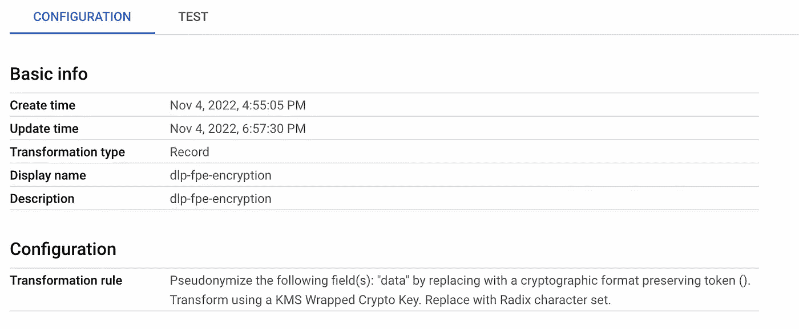

# GCP —大查询—静态数据安全(第 4 部分)

> 原文：<https://medium.com/google-cloud/gcp-bigquery-data-security-at-rest-part-4-c6f4db9a0f13?source=collection_archive---------5----------------------->

> 到目前为止，在博客的第 3 部分中，我们讨论了作为 GCP 一部分的 aead 加密功能。
> 
> 我们将进一步讨论如何使用 DLP 和云 KMS 对列数据进行加密，以及如何设计一个通用的加密/解密工具。这个博客的重点是展示 Bigquery 与其他 GCP 服务更广泛、更丰富的集成。
> 
> 这篇博客是“Bigquery —静态数据安全”5 部分系列文章的一部分。
> 点击此处查看[系列第四部](/google-cloud/gcp-bigquery-data-security-at-rest-part-3-915ce0cff883)
> 点击此处查看[系列菜单](/google-cloud/gcp-bigquery-data-security-at-rest-series-menu-1e59e1793deb)


Bigquery 安全控件。

## 使用云 KMS 和 DLP 进行加密

在本主题中，我们将讨论如何创建一个可重用的实用程序，它不仅可以执行来自 Bigquery 的加密/解密请求，还可以执行来自任何其他客户端(REST、python)的加密/解密请求。

## 使用 Bigquery 实现云 KMS

在博客的第 3 部分，我们看到了大量关于如何利用由 tink 库和云 KMS 支持的 AEAD 加密来加密/解密数据的内容。

在本节中，我们将看到另一种具有集中式云功能的方法，它可以用作利用远程功能的加密/解密工具。


用于加密/解密的云 KMS

首先，我们将创建一个云 KMS 密钥和云函数，可以使用该密钥执行加密/解密。

为了让 Bigquery 远程函数工作，有效负载需要满足下面的[标准](https://cloud.google.com/bigquery/docs/reference/standard-sql/remote-functions#input_format)。


Bigquery 远程函数(请求)

使用来自云 KMS 的对称密钥执行加密/解密的云函数如下


使用云 KMS 加密


使用云 KMS 解密

应向云功能服务帐户提供访问云 KMS 密钥和执行操作所需的角色

一旦该函数启动并运行，就可以创建一个 BigQuery 连接和远程函数，如下所示

需要创建一个提供连接服务帐户的 Bigquery 连接，需要向该帐户提供 CloudFunctionInvoker 角色。

```
bq mk --connection --display_name='encrypt_decrypt' \
--connection_type=CLOUD_RESOURCE \
--project_id=<> \
--location=us-central1 \
encrypt_decrypt_connection
```

大查询远程功能可以设置如下

```
CREATE FUNCTION `<>.<>`.symmetric_encrypt(data string) RETURNS string
REMOTE WITH CONNECTION `<>.us-central1.encrypt_decrypt_connection`
OPTIONS (endpoint = 'https://us-central1-<>.cloudfunctions.net/encrypt_decrypt_function',
  user_defined_context= [("mode","encrypt"), ("key_type","symmetric")]);

CREATE FUNCTION `<>.<>`.symmetric_decrypt(data string) RETURNS string
REMOTE WITH CONNECTION `<>.us-central1.encrypt_decrypt_connection`
OPTIONS (endpoint = 'https://us-central1-<>.cloudfunctions.net/encrypt_decrypt_function',
  user_defined_context= [("mode","decrypt"), ("key_type","symmetric")]);
```

> “用户定义的上下文”用于指示请求是**加密**还是**解密。** 这可以认为是将参数传递给一个函数，并根据参数采取行动。

设置完成后，可以通过远程函数调用 bigquery 加密/解密。

```
select name, 
`<>`.<>.symmetric_encrypt(name) as symmetric_encrypted,
from
(select name from `<>.dataset_us_central1.basic_df_users` limit 5);
```


来自 Bigquery 的加密调用

解密函数可以以类似的方式调用。

```
select 
`<>`.<>.symmetric_decrypt(symmetric_encrypted) as symmetric_decrypted,
from 
`<>.encrypted_table`;
```


解密数据输出。

云功能也可以独立调用。


云函数测试


加密响应

> **注意事项
> 1。**云 KMS 提供了执行对称和非对称加密的能力，但是如果要求确定性加密，则应使用 aead 或 dlp。
> 2。云 KMS 库目前不提供批处理请求，因此应该检查批量加密场景的性能影响。

## 使用云 DLP 加密

使用云 DLP 的加密遵循与上述云 KMS 完全相同的设置。


用于加密/解密的云 DLP

在此设置中，云 DLP 识别模板是使用格式保留加密创建的。



取消模板标识

其余的设置与云 KMS 类似，唯一的区别是云函数调用 DLP API 进行加密/解密

> **注意事项
> 1。**调用 DLP APIs 需要成本，设置
> 2 时应考虑这一点。应根据请求数量和配额限制来监控加密/解密的性能。
> 3。DLP 允许对请求进行批处理，在实施过程中应该注意这一点。

> 我们将继续本系列的[第 5 部分的最后一部分——行级安全性。](/google-cloud/gcp-bigquery-data-security-at-rest-part-5-965caba934ea)

如有任何疑问，请通过 https://www.linkedin.com/in/murli-krishnan-a1319842/[与我联系。](https://www.linkedin.com/in/murli-krishnan-a1319842/)

快乐学习。

## **参考文献**

[云功能配额/限额](https://cloud.google.com/functions/quotas)
[云功能定价](https://cloud.google.com/functions/pricing)
[云远程功能](https://cloud.google.com/bigquery/docs/reference/standard-sql/remote-functions)
[云 DLP 定价](https://cloud.google.com/dlp/pricing)
[云 KMS 定价](https://cloud.google.com/kms/pricing)