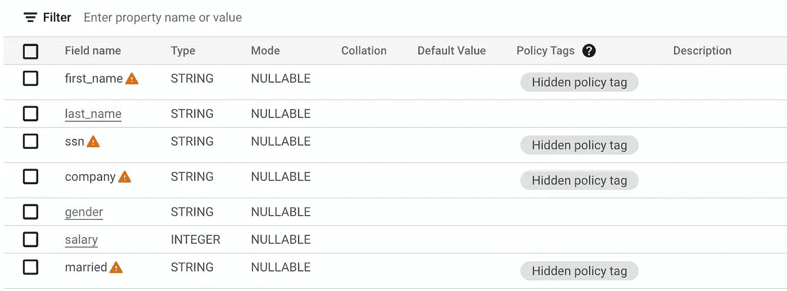
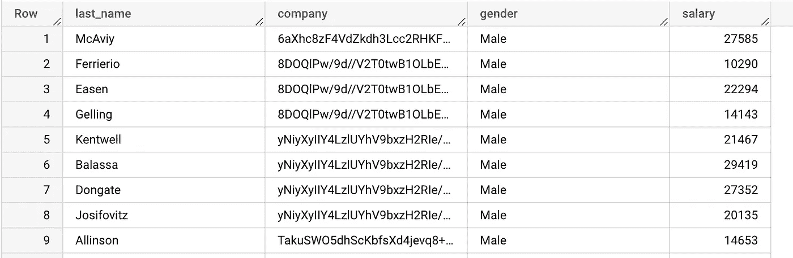
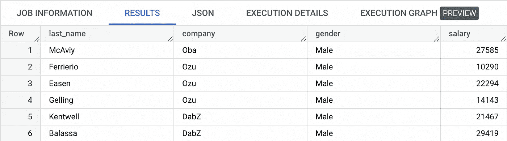
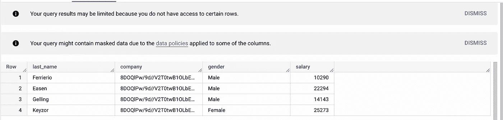
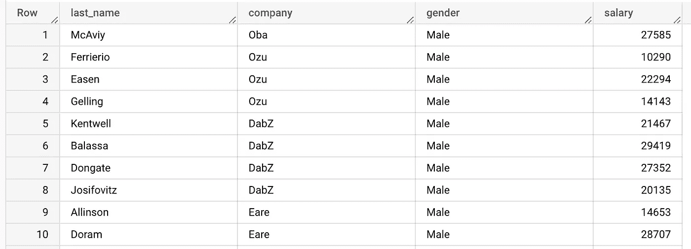

# GCP — BigQuery —静态数据安全(第 5 部分)

> 原文：<https://medium.com/google-cloud/gcp-bigquery-data-security-at-rest-part-5-965caba934ea?source=collection_archive---------8----------------------->

> 这是博客的最后一部分，在这里我们将讨论行级访问策略，根据策略，该策略将被查询的行的访问限制为主体
> 
> 这篇博客是“Bigquery —静态数据安全”5 部分系列文章的一部分。
> 点击此处查看[系列第四部](/google-cloud/gcp-bigquery-data-security-at-rest-part-4-c6f4db9a0f13)
> 点击此处查看[系列菜单](/google-cloud/gcp-bigquery-data-security-at-rest-series-menu-1e59e1793deb)


Bigquery 安全控件。

## 行级访问策略

行级访问策略扩展了 Bigquery 的功能，允许基于过滤标准进行安全控制。该控件可以与 Bigquery 列安全控件和应用的 IAM 策略一起使用。

让我们考虑我们在上一篇博客中用来解释带有策略标记的列级安全性的同一个表。



客户表

我们在 **company** 上添加了另一个列策略标签，允许委托人查看 company 中被屏蔽的值

目前，用户只能查询以下各列并检查数据



对主体屏蔽数据



实际数据

我们将创建行访问策略，仅允许委托人查看来自“ **Ozu** ”公司的数据。

```
CREATE ROW ACCESS POLICY ozu_filter
ON `<redacted>.data_security_demo_raw.customers_raw`
GRANT TO ('user:training-user-1@<redacted>')
FILTER USING (company = 'Ozu');
```



已应用行级筛选器

上面的结果显示了对列应用的行访问策略，随后是对 company 应用的列级哈希安全性。

> 目的是展示行级访问策略和列级策略可以一起应用。

让我们看一个不同的案例来理解**有效政策**的应用。

让我们创建另一个行过滤器，允许访问性别为“男性”的记录

```
CREATE OR REPLACE ROW ACCESS POLICY gender_filter
ON `<redacted>.customers_raw`
GRANT TO ('user:training-user-1@<redacted>')
FILTER USING (gender = 'Male');
```

此外，让我们暂时删除 company 上的哈希规则来检查结果。



查询结果

这让我可以根据第一行过滤器查看不属于 Ozu 的公司。

> 重要说明 1 —这里没有任何破坏，想法是行过滤器遵循来自两个过滤器的允许结果的联合并提供结果。
> 因此，如果您想要限制多个条件，请使用“与”条件将它们组合成单行策略的一部分。
> 
> 重要说明 2 —任何具有行访问策略的表都会自动拒绝其他所有表的访问。因此，有必要使用 explicit =True 过滤器来允许其他人不受限制地访问。这也适用于对整个表执行任何 DML 操作。
> 
> 重要说明 3 — JSON 列不支持行访问策略
> 
> 重要说明 4 — BI 引擎加速不适用于具有多行访问策略的表

希望本系列有助于深入了解静态 Bigquery 安全机制。

如有任何疑问，请通过 https://www.linkedin.com/in/murli-krishnan-a1319842/与我联系。

快乐学习。

## 参考

[行级访问和授权视图的比较](https://cloud.google.com/bigquery/docs/row-level-security-intro#comparison_of_authorized_views_row-level_security_and_separate_tables) [性能影响](https://cloud.google.com/bigquery/docs/row-level-security-intro#performance_limitations)
[使用具有 BQ 特性的行级访问策略](https://cloud.google.com/bigquery/docs/using-row-level-security-with-features)
[行级安全性最佳实践](https://cloud.google.com/bigquery/docs/best-practices-row-level-security)