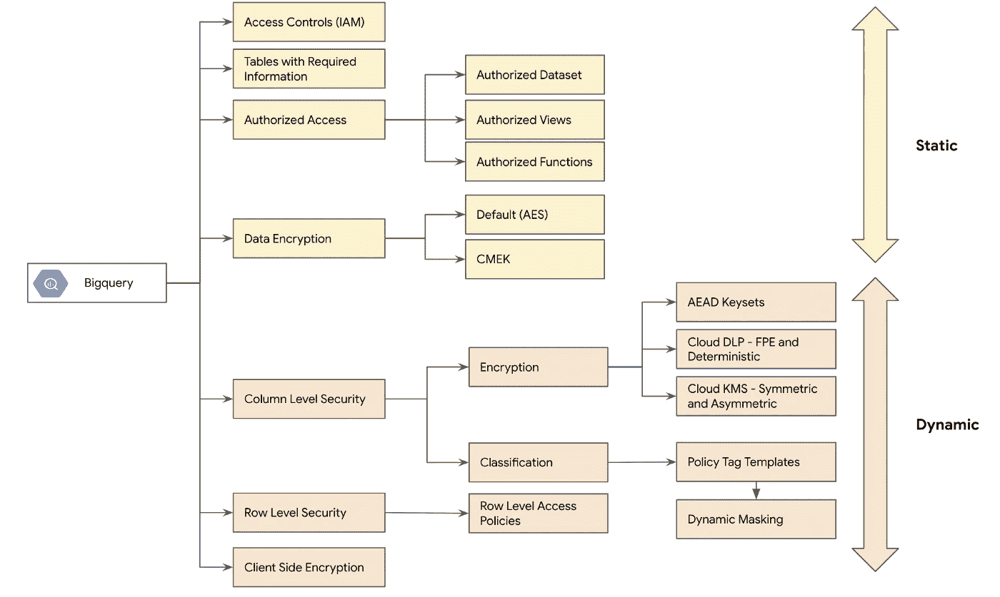

# GCP — BigQuery —静态数据安全—系列菜单

> 原文：<https://medium.com/google-cloud/gcp-bigquery-data-security-at-rest-series-menu-1e59e1793deb?source=collection_archive---------7----------------------->

> 这个系列将由 5 部分组成，讨论静态 Bigquery 的不同安全控制。

Bigquery 的安全控制

下面提供了所有 5 篇文章的链接以供参考

> [GCP — BigQuery —静态数据安全(**第 1 部分** ) —简介、IAM 访问控制、外观层、授权数据集/视图和 BigQuery 加密](/google-cloud/gcp-bigquery-data-security-at-rest-part-1-2a6fe1394c41)
> 
> [GCP — BigQuery —静态数据安全(**第 2 部分** ) —使用策略标记模板的列级安全和数据屏蔽。](/google-cloud/gcp-bigquery-data-security-at-rest-part-2-f4e3c741c162)
> 
> [GCP — BigQuery —静态数据安全(**第 3 部分** ) —使用 AEAD 和 Tink 库的列级加密](/google-cloud/gcp-bigquery-data-security-at-rest-part-3-915ce0cff883)
> 
> [GCP — BigQuery —静态数据安全性(**第 4 部分** ) —采用云 KMS 和云 DLP 的列级安全性](/google-cloud/gcp-bigquery-data-security-at-rest-part-4-c6f4db9a0f13)
> 
> [GCP — BigQuery —静态数据安全(**第 5 部分** ) —行级访问策略](/google-cloud/gcp-bigquery-data-security-at-rest-part-5-965caba934ea)

祝您学习愉快，并希望这些内容能让您更好地了解 Bigquery 的数据安全机制

如有任何疑问，请通过 https://www.linkedin.com/in/murli-krishnan-a1319842/与我联系。