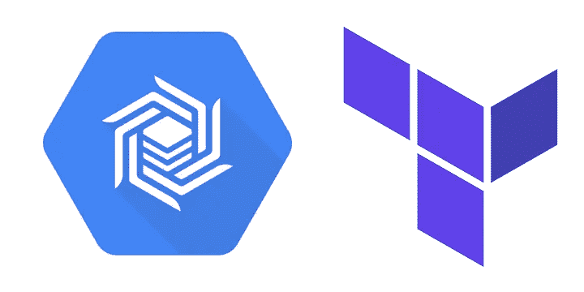

# 通过 Terraform 的 Google Cloud BigTable

> 原文：<https://medium.com/google-cloud/gcp-bigtable-via-terraform-ad92b519479?source=collection_archive---------0----------------------->

如何通过 terraform 创建 BigTable 表，并使用 Golang 连接到它

terraform 大桌子标志

在开始之前，请注意，需要在 GCP 设置 [Terraform creds 才能执行任何基础设施操作。](/google-cloud/terraform-credentials-setup-in-gcp-c81c8ebaff5d)

我们的目标可以分为 3 步:

1.  使用默认配置测试创建和销毁，以确保我们的提供程序设置正确