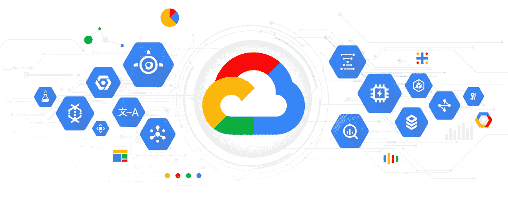

# GCP CA 服务:如何开始的实用演示！

> 原文：<https://medium.com/google-cloud/gcp-ca-service-how-to-get-started-6eba056c9e12?source=collection_archive---------0----------------------->

管理私有 CA 基础架构可能会很困难，通常由十年前的服务器或虚拟机组成，这些服务器或虚拟机被小心地放置在具有非常严格的网络策略的区域，在某些情况下，用户界面体验还停留在 21 世纪初。

在本帖中，我们通过使用基础设施作为代码来部署演示，以实用的方式介绍了 GCP 的新 CA 服务。

# 背景

GCP 最近发布了新的 CA 服务(在这里阅读全部内容:[https://cloud . Google . com/blog/products/identity-security/Google-cloud-certificate-authority-Service-is-now-ga](https://cloud.google.com/blog/products/identity-security/google-cloud-certificate-authority-service-is-now-ga))，在这里您可以部署私有 CA 的架构，为您的私有服务提供私有证书。

这绝对是一个奇妙的服务，因为它简化了通常需要的基础设施，允许您告别丑陋的服务器及其维护，同时向 API 驱动的证书请求、CRL 和证书管理问好！

这与对 Terraform、JetStack Cert-Manager 和 Hashicorp Vault 的支持相结合，提供了一种现代的、无服务器的方式来提供私有 CA 架构。(阅读:不再有 windows 2008 R2 服务器坐在那里积灰，被隔离在一个周界中，安全团队祈祷在他们缓慢而小心地修补时不要妥协)

那么，我们如何开始使用 Terraform 呢？

# 先决条件

*   需要一些基础的 Terraform 知识！
*   继续专门为此建立一个 GCP 项目。
*   权限:为了平稳运行演示环境，请确保您已经获得:
*   项目 IAM 管理，以便您可以应用 IAM 策略；KMS 管理，以便您可以创建和销毁密钥环和密钥 CAS 服务操作符，以便您可以在 CA 服务中构建您需要的东西。请记住，对于生产环境，您可能希望遵循最低权限的方法，并对这些权限进行更细粒度的控制。
*   我的示例代码使用了变量，所以请使用我的 repo 中提供的示例 variables.tf 文件。

# 设计

在本演示中，我们将使用 CA 服务来提供根 CA 和从属 CA。根据您所在的行业，您可能不得不采用混合方法，在这种方法中，您的根 CA 保留在本地，但这没关系，因为 CA 服务支持它！

CA 服务提供了完全由服务管理的密钥选项，但在本演示中，我们更倾向于客户管理的密钥，其材料由 KMS 通过 HSM 密钥保护选项(FIPS 140–3)进行保护，从未如此简单..)

最后，需要注意的是，CA 服务依赖于 KMS 和 GCS。KMS 存储关键材料，GCS 管理 CRL。GCS 可以由服务管理，也可以由客户管理，但出于本演示的目的，我们将采用服务管理。

# 第一步:拿钥匙

首先，我们将创建一个密钥环，创建一个密钥，并确保其 hsm 受到保护。

这有几个作用。

1.  首先，它使用名称和地区创建一个密匙环。请记住，密钥是地区性的！(第 2-5 行)
2.  在密钥环中创建一个密钥，给它一个名称(第 8、9 行)并设置为非对称(第 10 行)。在那里，它设置了我们需要的所有东西，例如密钥的算法`rsa_sign_pss_3072_sha256`,并在那里使用 HSM 级密钥保护来保护密钥材料(FIPS 140–3..搞定了。).因为这是一个演示，我们也禁用了防止破坏键值。
3.  最后，我们为 terraform 创建了一个`data`块，以便以后引用。

现在，我们要在这里施展一些魔法。因为我们在这里使用客户管理的密钥，所以我们必须确保 CA 服务使用的服务帐户能够针对该密钥执行所需的操作。

简单地说，这做了两件事:

1.  将 cloudkms.signerverifier 角色添加到 CAS 服务帐户
2.  将“查看者”基本角色添加到 CAS 服务帐户

现在我们和 KMS 结束了！

# 第二步:建一个游泳池

下一步是构建 CA 池，然后将东西(CA 的！)投入其中。ca 池是一个简洁的概念——它们提供了在池中的子 CA 之间分发请求的能力，以获得每秒更好的查询，还提供了一种简洁的方法来废弃和替换池中的子 CA，而不必让您的证书使用者重新编码任何东西！

很好很容易！我们已经在这里创建了两个池，一个用于根 ca，一个用于 subca！将根 CA 池和子 CA 池分开很重要。这个想法是，同一个池中的所有 ca 是完全可以互换的；要获得池的好处，您需要让服务在池中为您选择实际的颁发 CA。

因此，如果你的根和下属都在同一个池中，这意味着你的一堆叶证书将由根颁发，这很可能不是你想要的！

我们给它一个名称，在一个区域中弹出它(使用与您的 kms 钥匙圈相同的一个，这就是为什么我们使用相同的变量)并提供一个层。

现在有两层:

*   DevOps
*   企业。

关键区别在于跟踪。企业提供 CRL 和撤销能力。DevOps 没有。然而，DevOps 提供了更高的每秒查询值(25，vs . 7 ),因此可以发布更多的短期证书。由于安全性始终是 GCP 的一个优势，较便宜的 DevOps 层仍然允许使用 HSM，但警告必须是服务管理的密钥。

希望这能很好地描述何时使用哪一层，但是要经常查看[文档](https://cloud.google.com/certificate-authority-service/docs/tiers)

# 第三步:进入游泳池

现在我们有了钥匙，我们有了游泳池..是时候去游泳了。

首先，让我们创建根 CA！

所以我们在这里做了一些事情

1.  创建根 CA 并将其分配给我们之前创建的池
2.  配置成为 CA 所需的基本 x.509 值
3.  定义基本密钥和扩展密钥的用法(例如，我能签署证书吗，我能提供 CRL 吗，以及它能提供哪种证书)
4.  定义证书本身的值(通常的事情！)
5.  指定要使用的密钥版本。这是一个有点疯狂的开始，但我知道它很快就会被修复。目前在 terraform 中，没有办法获得 CAS 构建服务所需的关键版本名(如路径中所示)。因此，您需要调用 keyversion 的 id，然后使用 trimprefix 删除它返回的 API 值的 URL 部分。

就这样。现在我们有一个根 CA，准备好了！为了构建一个 CA，我们基本上复制并粘贴代码(或者如果我们没有使用示例..构建一个 TF 模块并引用它)

又是同样的事情！

# 接下来是什么？

概括地说，从不到 150 行的 Terraform 中，我们构建了:

*   由根 CA 和子 CA 组成的专用 CA 拓扑，两者都位于一个池中，使用客户管理的加密密钥
*   一种客户管理的加密密钥，其密钥材料受 HSM 保护
*   按照当前推荐的 doco，使其工作所需的所有 IAM 权限。

现在剩下的就是完成 CA 的典型功能，我不会在这里介绍(但是如果以后有需求的话可能会介绍)。这包括:

*   通过向根请求证书来激活子 CA。根签名，然后你把它上传回 CA。
*   将证书本身提供给最终用户。这是一个与上面非常相似的步骤。

# 结论

希望这篇文章展示了通过使用 GCP CA 服务，以现代方式部署一个安全的、可伸缩的私有 CA 架构是多么容易。

如果你正在实现基础设施现代化的进程中，你也应该考虑如何在各个层面实现安全保障的现代化。这包括私有 CA 体系结构，该体系结构需要进行扩展，以满足其旨在保护的扩展基础架构不断增长的需求。

# 参考

回购:

 [## jat GEP/Examples/Dev/Services/CAS Demo/Pure cloud at main dgu lli/jat GEP

### 构建一个项目，然后在 GCP 构建 gce 实例。通过在…上创建帐户，为 dgulli/JATGEP 开发做出贡献

github.com](https://github.com/dgulli/JATGEP/tree/main/Examples/Dev/Services/CAS%20Demo/Pure%20cloud) 

文献:[https://cloud.google.com/certificate-authority-service](https://cloud.google.com/certificate-authority-service)