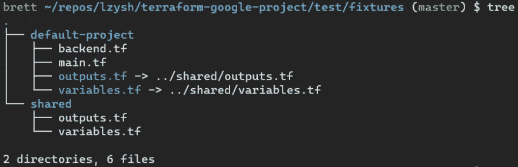

# GCP CIS 基准 Terraform 模块测试与 Chef Inspec、Kitchen-terra form & GitHub Actions—第 2 部分

> 原文：<https://medium.com/google-cloud/gcp-cis-benchmark-terraform-module-testing-with-chef-inspec-kitchen-terraform-github-actions-1540dd7afb36?source=collection_archive---------1----------------------->

在上一篇[文章](https://dev.to/brettcurtis/gcp-cis-benchmark-terraform-module-testing-with-chef-inspec-kitchen-terraform-github-actions-4gpl)中，我们讨论了“本地”开发。本着[持续整合](https://martinfowler.com/articles/continuousIntegration.html)的精神，我们希望能够让团队成员整合他们的工作。如果您还记得，我们在运行 [inspec-gcp-cis-benchmark](https://github.com/GoogleCloudPlatform/inspec-gcp-cis-benchmark) 概要文件时遇到的违规，我们有一些工作要做！我们将使用 [Kitchen-Terraform](https://github.com/newcontext-oss/kitchen-terraform) 来完成这项工作，并在 [GitHub Actions](https://github.com/learn/devops) 中运行工作流。在这篇文章中，我们将讨论厨房平台。

# 项目设置

使用厨房平台时，目录结构是必不可少的。我目前的结构是这样的:

# 固定装置

你需要有一个`[fixtures](https://github.com/lzysh/terraform-google-project/tree/master/test/fixtures)`目录。

这个目录是你的 Terraform 根模块所在的地方，或者用厨房-Terraform 语言来说，就是“测试设备”它将调用子模块，即我们正在开发的模块。该语言与[模块文档](https://www.terraform.io/docs/configuration/modules.html)一致，因此在我们的例子中，子模块位于[库](https://github.com/lzysh/terraform-google-project)的根中，并且它是我们通过 GitHub 发布以供重用的模块。在这个例子中，我们只有[一个根模块](https://github.com/lzysh/terraform-google-project/tree/master/test/fixtures/default-project)或者测试夹具。如果我们不能在一个设备中涵盖多个测试场景，那么可能会有更多的测试场景。如果需要的话，我还有一个共享目录，用于存放大量测试设备的公共代码。

# 综合

`[integration](https://github.com/lzysh/terraform-google-project/tree/master/test/integration)`目录将保存您的[概要文件](https://docs.chef.io/inspec/profiles/)以及您想要针对测试夹具运行的 [Chef Inspec DSL 控件](https://docs.chef.io/inspec/dsl_inspec/)。

在这篇文章中，我们将只关注`[cis_benchmark.rb](https://github.com/lzysh/terraform-google-project/blob/master/test/integration/default-project/controls/cis_benchmark.rb)`和`[inspec.yml](https://github.com/lzysh/terraform-google-project/blob/master/test/integration/default-project/inspec.yml)`文件。由于谷歌通过编写我们正在测试的特定基准的控件为我们做了所有繁重的工作， [3.1 联网](https://github.com/GoogleCloudPlatform/inspec-gcp-cis-benchmark/blob/master/controls/3.01-networking.rb)和 [4.4 虚拟机](https://github.com/GoogleCloudPlatform/inspec-gcp-cis-benchmark/blob/master/controls/4.04-vms.rb)，我们可以非常快速地添加它们。首先，添加您所依赖的存储库:

*注意:输入* `*gcp_project_id*` *是 inspec-gcp-cis-benchmark 概要文件所期望的，以便知道运行测试的项目。Kitchen-Terraform 可以做属性和 Terraform 输出映射。当我们查看* `*kitchen.yml*` *文件时，我会谈到为什么这很重要。*

然后为了调用一个特定的控件，我们把它添加到`[cis_benchmark.rb](https://github.com/lzysh/terraform-google-project/blob/master/test/integration/default-project/controls/cis_benchmark.rb)`中，就像这样:

# kitchen.yml

我们需要做的最后一件事是告诉 Kitchen-Terraform 做什么！我们通过创建一个`[kitchen.yml](https://github.com/lzysh/terraform-google-project/blob/master/.kitchen.yml)`文件来做到这一点:

如果你想了解更多，你可以阅读关于[厨房的文档。然而，我确实想谈几件事。](https://docs.chef.io/workstation/config_yml_kitchen/)

第三行和第四行是从厨房-Terraform 内部传递`-var="foo=bar"`到 Terraform 的一种方式。在这个例子中，我将账单 ID 作为 GitHub 中的[秘密。当我们在 GitHub Actions 中设置工作流时，我们可以对此进行更多的讨论。](https://docs.github.com/en/actions/configuring-and-managing-workflows/creating-and-storing-encrypted-secrets)

另一件事是第二十四行和第二十五行。这与我前面谈到的属性和 Terraform 输出映射有关。我花了一点时间[学习大声](https://github.com/GoogleCloudPlatform/inspec-gcp-cis-benchmark/issues/44)来解决这个问题，但是在一些帮助下，我能够做到。长话短说，这就是我如何将我的 Terraform 输出`project_id`映射到运行 inspec-gcp-cis-benchmark 概要文件所需的属性。

# 运行厨房-Terraform

现在我们可以运行 kitchen [converge](https://docs.chef.io/workstation/ctl_kitchen/#kitchen-converge) 看看我们有什么:

这将为你做各种各样的工作。它将验证 Terraform 客户端版本，[初始化](https://www.terraform.io/docs/commands/init.html)terra form 工作目录，并创建和切换到[工作区](https://www.terraform.io/docs/commands/workspace/index.html):

它还将[验证](https://www.terraform.io/docs/commands/validate.html)terra form 配置文件，并最终运行 Terraform [应用](https://www.terraform.io/docs/commands/apply.html):

接下来，我们可以使用 kitchen [verify](https://docs.chef.io/workstation/ctl_kitchen/#kitchen-verify) 运行测试，并查看结果:

最后，我们可以使用厨房[摧毁](https://docs.chef.io/workstation/ctl_kitchen/#kitchen-destroy)来摧毁基础设施。您也可以通过运行 kitchen [test](https://docs.chef.io/workstation/ctl_kitchen/#kitchen-test) 在一个命令中完成以上所有操作。

在下一篇文章中，我将讨论通过 [GitHub Actions](https://github.com/lzysh/terraform-google-project/runs/1059655434?check_suite_focus=true#step:4:1) 运行测试工作流！