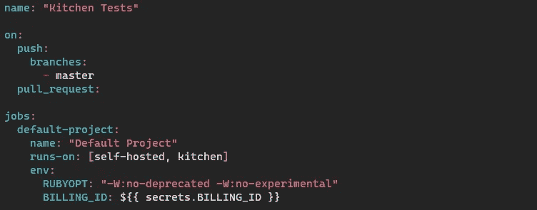

# GCP CIS 基准 Terraform 模块测试与 Chef Inspec、Kitchen-Terraform & GitHub 行动—第 3 部分

> 原文：<https://medium.com/google-cloud/gcp-cis-benchmark-terraform-module-testing-with-chef-inspec-kitchen-terraform-github-actions-3bffe7d54a43?source=collection_archive---------0----------------------->

在上一个[帖子](/google-cloud/gcp-cis-benchmark-terraform-module-testing-with-chef-inspec-kitchen-terraform-github-actions-1540dd7afb36)中，我们在本地运行[厨房平台](https://github.com/newcontext-oss/kitchen-terraform)，现在我们想从 [GitHub Actions](https://github.com/features/actions) 运行它。

首先，我们可以在一个高层次上谈论正在使用的 GitHub 流。我可能会写一个不同的帖子，提供更多细节，因为我发现有核心运营背景的人没有使用过 GitHub，或者不理解开发人员做一些事情的“为什么”。

*   创建一个[问题](https://github.com/lzysh/terraform-google-project/issues/1)
*   创建一个要处理的分支(*注意:分支在成功合并到主线后被删除。此外，本着持续交付的精神，这些都不是长期存在的分支，应该经常集成)*
*   创建一个[拉请求](https://github.com/lzysh/terraform-google-project/pull/2) ( *注意:一旦拉请求被创建，它将(基于我们的动作配置)运行* [*GitHub 动作*](https://github.com/lzysh/terraform-google-project/runs/1121079032#step:4:212) *)*
*   成功运行 GitHub 操作后，将某人添加到进行审核
*   在代码评审之后，挤压并合并你的[提交](https://github.com/lzysh/terraform-google-project/commit/ce6eb7b48f2df32d50930ce363a5fed84ffd9f8e)

要设置 GitHub 动作，我们需要做的第一件事是创建一个[自托管运行器](https://docs.github.com/en/actions/hosting-your-own-runners/about-self-hosted-runners)。对于这个例子，我最终使用了 Google 云平台中的一个小型计算实例。如果需要，您可以选择任何您想要的云提供商，甚至是数据中心中的一台机器。它只需要安装一些工具，就可以完成您要求操作运行的任何事情。在我们的情况下，所有的位运行厨房-Terraform。

添加一个 GitHub 自托管 runner 必须是有史以来最容易访问的 CI/CD 工具“基于代理”安装，所以我不认为我们需要在这里进入细节。我确实尝试过为厨房平台[创建自己的](https://github.com/lzysh/github-kitchen-terraform-action)[打包 Docker 容器动作](https://docs.github.com/en/actions/creating-actions/creating-a-docker-container-action)，但我不会说我喜欢它每次运行时构建图像的方式。

一旦你的跑步者开始跑步，你需要告诉 GitHub 你想做什么以及在哪里做。我们使用一个[工作流文件](https://github.com/lzysh/terraform-google-project/blob/master/.github/workflows/main.yml)来完成这项工作。工作流文件是用 YAML 语言编写的，位于您的 GitHub 资源库的`.github/workflows`目录中。你可以看一下 [GitHub Actions 备忘单](https://resources.github.com/whitepapers/GitHub-Actions-Cheat-sheet)，它描述了一个工作流文件的内容。我们的工作很简单，一项工作分三步走。首先，我们告诉 GitHub 动作的名称以及何时运行它。在我们的例子中，正如我前面提到的，提交主请求和拉请求。接下来，在哪里运行操作:

`runs-on`有独立的滑道标签:

正如上一篇文章中提到的，我们将 BILLING_ID 作为 GitHub 的[秘密](https://docs.github.com/en/actions/reference/encrypted-secrets)传递给 terraform。您可以设置机密和组织级别或存储库级别。

接下来，我们定义要使用的默认 shell 和要运行的步骤:

第一步是使用 [GitHub 检出动作](https://github.com/marketplace/actions/checkout)来检出运行器上的存储库。第二个是使用 [Google 云平台设置 gcloud 环境动作](https://github.com/marketplace/actions/setup-gcloud-environment)来配置我们的 Google 凭证。该操作还允许我们通过设置`export_default_credentials: true`来设置[谷歌应用默认凭证(ADC)](https://cloud.google.com/docs/authentication/production) 。这很巧妙，因为 Terraform 可以在默认情况下使用这些，而无需进行任何设置！最后，我们结束了最后一步，它在我们的自托管运行程序上运行`bundle exec kitchen test`:

我们做到了！你有一个很好的小 Terraform 模块，你可以以一种可支持的方式继续改进，就像我在另一篇[帖子](/@blzysh/infrastructure-as-code-iac-2a2fb85dee24)中引用的，关于使用我们在软件世界中学到的一些好的实践，比如:

> *使用源代码控制，坚持 DRY 原则，模块化，可维护性，并使用自动化测试和部署。*

在下一篇文章中，我们可以讨论将多个 Terraform 模块与运行在所有创建的 Google 云平台资源上的 [inspec-gcp-cis-benchmark](https://github.com/GoogleCloudPlatform/inspec-gcp-cis-benchmark) 配置文件放在一起。