# GCP 云编辑器——节省开发时间

> 原文：<https://medium.com/google-cloud/gcp-cloud-composer-save-development-time-3738e0391808?source=collection_archive---------1----------------------->

*一般来说，在 Google cloud composer(Managed air flow)上工作的新开发人员遵循的一种常见方法是使用* ***迭代试凑法*** *进行开发，直到* ***DAG 导入错误*** *消失。*

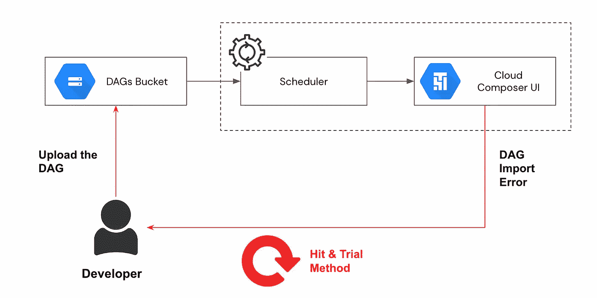

以下是由于不正确的库导入导致的 DAG 导入错误的示例

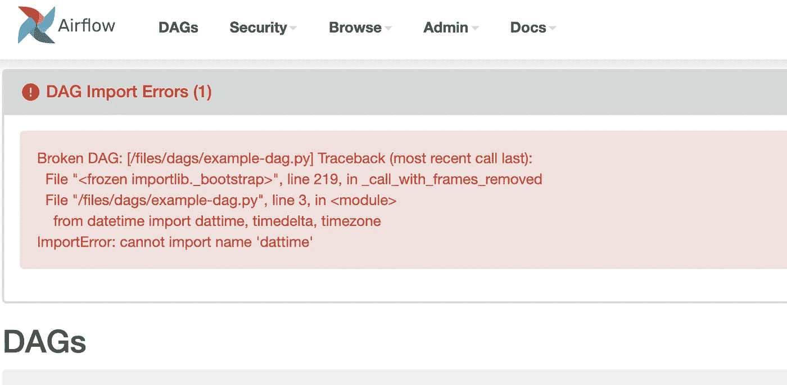

> 为什么这不是一个好方法？
> 1。它可以很容易地创建一个**无休止的循环，直到 DAG 开始工作
> 2。开发时间**的**量大幅度增加
> 3。这个过程**适得其反****

通常在具有较低规格的 c 组件环境和许多开发用户中，调度程序需要花费更长的时间来解析 DAG，这又增加了周转时间

## 利用独立气流

当您从 pip 发行版安装 airflow 作为示例时，它会设置一个本地 airflow 目录和一个轻量级服务器以供使用

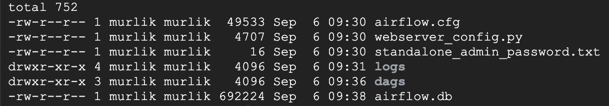

**气流配置文件**具有气流的配置属性。下面是 **dags_folder** 的本地 unix 路径配置

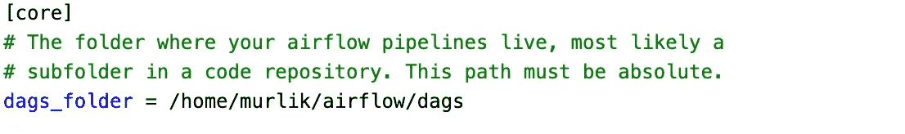

要启动**独立服务器**，只需运行命令下的**，这将启动在**端口 8080** 上运行的本地气流服务器。**

```
airflow standalone
```

默认用户将是 **admin** ，密码将出现在**standalone _ admin _ password . txt**中，如上图截图

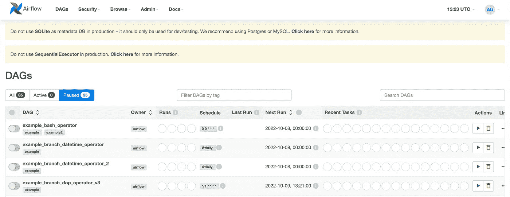

气流独立用户界面

简单地创建所需的 **DAGs** 并将其放入 **dags_folder** 中，如上所述

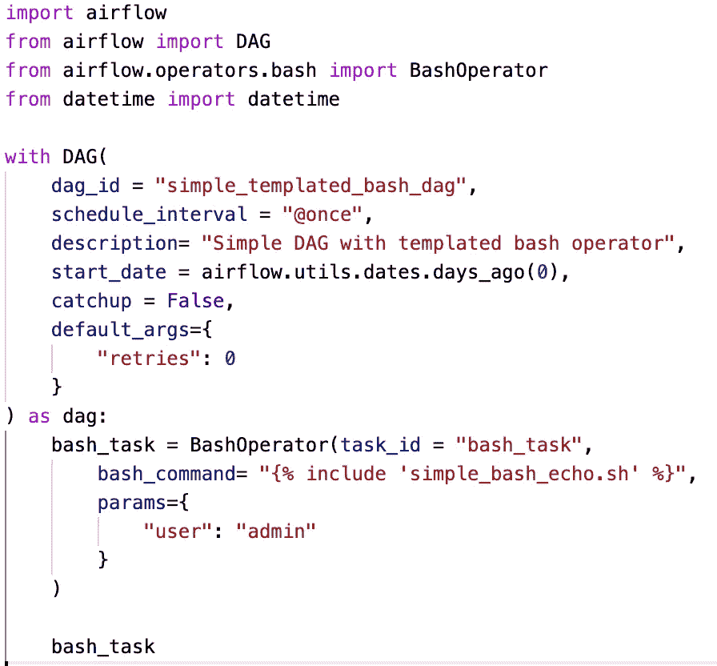

简单 DAG 示例— Bash 操作符模板— simple_dag.py

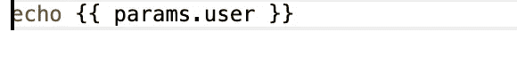

Bash 模板文件

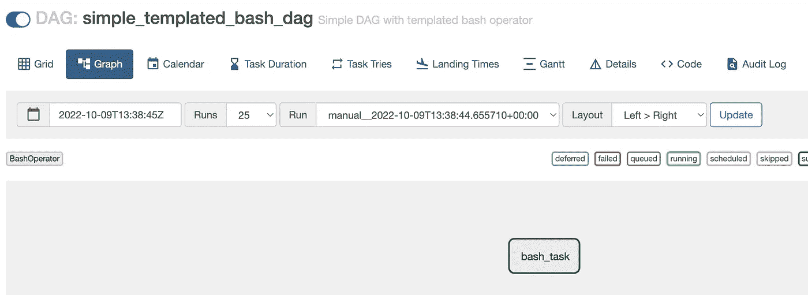

在局部气流上执行

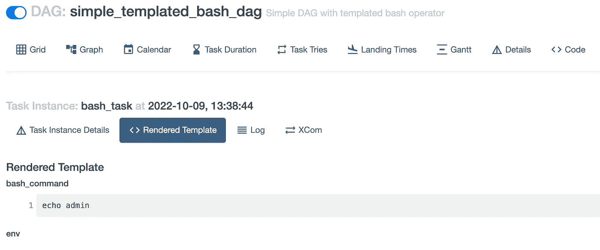

任务的呈现模板

这可能是一种更快的方法，可以让事情向前发展，加快试凑法的速度。

由于 airflow 独立版是轻量级的，由一个用户使用，DAG 解析时间相对较快。

> 在 DAG 被上传到 composer bucket 之前，是否可以做更多类似于编译 java 代码并获得编译时错误的事情？

## 将 DAG 作为 Python 文件运行

将 DAG 文件作为 python 可执行文件运行

```
python simple_dag.py
```

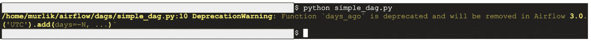

语法或声明中的任何错误都会立即被发现。

对于 Composer 环境，DAG 文件可以添加到除/**DAGs/**like/**data/**之外的不同文件夹，并且可以运行以下命令来捕获语法错误

```
gcloud composer environments run <environment> dags list -- -subdir <home/airflow/gcs/data/>
```

## 列出 Dag 的导入错误

为了在不将 Dag 上传到 Dag 文件夹的情况下快速测试 Dag，可以运行以下命令来捕获任何语法问题

```
airflow dags list-import-errors -- -subdir <folder other than DAGs folder>
```

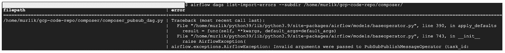

列表-导入-错误输出

上述命令也可以在 composer 环境中以类似的语法执行

reference—[https://cloud . Google . com/SDK/g cloud/reference/composer/environments/run](https://cloud.google.com/sdk/gcloud/reference/composer/environments/run)

## 测试 DAG 运行

运行以下命令有助于验证提供的文件夹中的 DAG 并执行提到的 DAG。

```
airflow dags test simple_templated_bash_dag_1 2022–10–09 -- -subdir /home/murlik/gcp-code-repo/composer
```

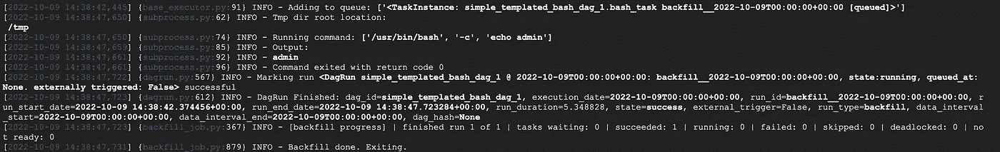

DAG 的执行日志

## 测试特定任务实例

运行 **airflow task test** 命令还可以提供一种快速测试任务实例执行的方法，而无需在 composer 环境中触发

```
airflow tasks test simple_templated_bash_dag bash_task 2022–10–09
```

上述命令也可以传递 **—细分器**参数


气流任务实例的快速测试

该命令也可以在 composer 中执行，如下所示

```
gcloud composer environments run <environment name> tasks test -- <parameters>
```

使用上述技术，可以节省宝贵的时间，加快开发过程。

请注意，Airflow 1 和 air flow 2 之间的命令存在一些差异，请查看文档以了解与版本相关的命令语法(下面参考资料中的链接)

一定要试一下

**参考资料**:[https://cloud . Google . com/SDK/g cloud/reference/composer/environments/run](https://cloud.google.com/sdk/gcloud/reference/composer/environments/run)
[https://air flow . Apache . org/docs/Apache-air flow/stable/CLI-and-env-variables-ref . html](https://airflow.apache.org/docs/apache-airflow/stable/cli-and-env-variables-ref.html)
[https://air flow . Apache . org/docs/Apache-air flow/stable/start . html](https://airflow.apache.org/docs/apache-airflow/stable/start.html)

链接手柄—[https://www.linkedin.com/in/murli-krishnan-a1319842/](https://www.linkedin.com/in/murli-krishnan-a1319842/)